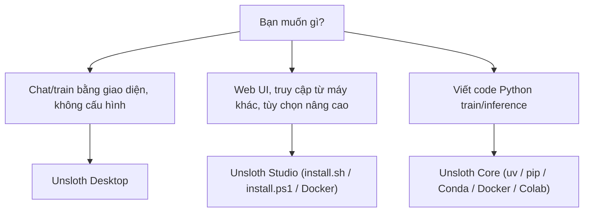

# Cài đặt & phần cứng

## Ba cách dùng Unsloth, ba bộ yêu cầu

Unsloth có ba "sản phẩm" dùng chung một lõi, nhưng cài đặt và yêu cầu hệ thống khác nhau (xem thêm [Tổng quan](/tong-quan)):

| Sản phẩm | Là gì | Cách cài | Ghi chú yêu cầu |
|---|---|---|---|
| **Unsloth Desktop** | App native (ứng dụng cài như phần mềm thường) cho macOS, Windows, Linux | Tải file cài `.dmg` / `.exe` / `.deb` | Trang nguồn không liệt kê yêu cầu riêng; tải model rồi chat ngay, "no setup required" |
| **Unsloth Studio** | Web UI (giao diện chạy trong trình duyệt), mặc định ở cổng 8888 | Script `install.sh` / `install.ps1` | Có bảng yêu cầu theo OS: Python 3.11 đến dưới 3.14, NVIDIA driver để train trên Windows/Linux… |
| **Unsloth Core** | Thư viện Python gốc, dùng bằng code (notebook, script) | `pip` / `uv` / Conda / Docker | Linux và Windows; GPU NVIDIA từ 2018+, CUDA Capability tối thiểu 7.0; AMD/Intel theo hướng dẫn riêng |

Bản Desktop được docs gọi là cách dễ nhất để có Studio. Studio cài thủ công cho phép chỉnh tùy chọn nâng cao; Core dành cho người muốn viết code train.



**Nguồn:** https://unsloth.ai/docs/get-started/install, https://unsloth.ai/docs/get-started/fine-tuning-for-beginners/unsloth-requirements, https://unsloth.ai/docs/new/studio/install

## Bảng tóm tắt theo nền tảng

"—" = trang nguồn không nói rõ.

| Nền tảng | OS / phiên bản | GPU / driver | Python | Chạy (chat/inference)? | Train? | Sản phẩm hỗ trợ | Cách cài khuyến nghị |
|---|---|---|---|---|---|---|---|
| **Windows + NVIDIA** | Windows 10 hoặc 11 (64-bit) | GPU NVIDIA đã cài driver; CUDA Toolkit được script cài Studio tự cài khớp driver | 3.11 đến dưới 3.14 (Studio); ví dụ Conda của Core dùng 3.12 | Có | Có | Desktop, Studio, Core (Core qua Conda, Docker hoặc WSL) | Desktop (`.exe`), hoặc Studio: `irm https://unsloth.ai/install.ps1 \| iex` |
| **macOS** | macOS 12 Monterey trở lên (Intel hoặc Apple Silicon) | — (dùng MLX) | 3.11 đến dưới 3.14 | Có (MLX và GGUF) | Có theo trang Requirements (MLX) — xem cảnh báo mâu thuẫn bên dưới | Desktop, Studio; Core: "in the works" | Desktop (`.dmg`), hoặc Studio: `install.sh` |
| **Linux / WSL** | Ubuntu 20.04+ hoặc distro tương tự (64-bit) | GPU NVIDIA đã cài driver; CUDA toolkit 12.4+ (12.8+ cho Blackwell); Core: CUDA Capability ≥ 7.0 | 3.11 đến dưới 3.14 (Studio); ví dụ uv của Core dùng 3.13 | Có | Có | Desktop (Linux: `.deb`/AppImage), Studio, Core | Desktop, hoặc Studio: `install.sh`; Core: `uv pip install unsloth --torch-backend=auto` |
| **AMD** | Windows và Linux | Radeon RDNA 3/3.5/4 (RX 6000–9000), MI300X; ROCm 6.0+ (cài thủ công); Docker: driver `amdgpu`, image build với ROCm 7.2 | 3.11–3.13 (3.10 được với cài thủ công); Windows dùng 3.12 nếu cài extra `rocm72-torch291` | Có (Studio trong Docker `unsloth-rocm` có chat) | Có | Desktop (Windows, Linux), Studio, Core, Docker `unsloth/unsloth-rocm` | Desktop; thủ công: `install.sh` / `install.ps1`; Core: `uv pip install unsloth[amd]` |
| **Intel** | Linux (khuyến nghị Ubuntu 22.04+) hoặc Windows 11 (khuyến nghị) | Data Center GPU Max, Arc, Intel Ultra AIPC; driver Intel Graphics mới nhất; Windows cần oneAPI Base Toolkit 2025.2.1 | 3.10+ | — | Có | Core (build từ source); Studio training có liệt kê Intel | Core: `pip install .[intel-gpu-torch290]` |
| **CPU-only** | Như Linux (bỏ NVIDIA driver) và macOS | Không cần GPU | Như Linux/macOS | Có — Chat với model GGUF | Không được nêu (chỉ Chat + Data Recipes) | Studio | Studio: `install.sh` |

::: tip Kiến thức nền
GGUF, MLX, quantization là gì? Xem [Độ chính xác & lượng tử hóa](/kien-thuc-nen/do-chinh-xac-va-luong-tu-hoa).
:::

::: warning Cần kiểm tra lại — Mac có train được không?
Các trang nguồn nói khác nhau:
- `unsloth-requirements` phần đầu: "Mac: Training, MLX and GGUF inference are ALL supported".
- Cùng trang đó, phần **Unsloth Core Requirements**: "Apple/Silicon/MLX is in the works", và OS của Core chỉ ghi Linux, Windows.
- `new/studio/install` đầu trang: "Mac: Like CPU - Chat + Data Recipes works for now. **MLX** training now works!"; phần System Requirements của cùng trang lại ghi Mac hỗ trợ "Chat and training and all features".
- Docker (trang Studio): "We're working on Mac compatibility".

**[Nhận định]** Có vẻ train trên Mac hiện đi qua Desktop/Studio (MLX), còn thư viện Core bằng code chưa hỗ trợ Mac. Nên thử thực tế trước khi lên kế hoạch.
:::

::: warning Cần kiểm tra lại — Studio train trên AMD/Intel
`unsloth-requirements` ghi "Unsloth Studio Training currently works on NVIDIA, AMD, MLX, Intel devices", nhưng ngay sau đó lại nói "You can still use the original Unsloth Core to train on AMD and Intel devices". Bảng yêu cầu Studio cho Windows và Linux chỉ ghi "NVIDIA GPU with drivers installed", không có dòng nào cho AMD/Intel.
:::

**Nguồn:** https://unsloth.ai/docs/get-started/fine-tuning-for-beginners/unsloth-requirements, https://unsloth.ai/docs/new/studio/install, https://unsloth.ai/docs/get-started/install/amd, https://unsloth.ai/docs/get-started/install/intel, https://unsloth.ai/docs/get-started/install/docker, https://unsloth.ai/docs

## Yêu cầu VRAM cho fine-tuning

VRAM (bộ nhớ card đồ họa) tối thiểu theo số tham số model và phương pháp. QLoRA (LoRA trên model nén 4-bit) dùng 4-bit, LoRA dùng 16-bit. Docs nhấn mạnh đây là **mức tối thiểu tuyệt đối**; tùy model có thể cần nhiều hơn. Nguồn không ghi rõ độ dài context hay batch size dùng để đo.

| Số tham số model | QLoRA (4-bit) VRAM | LoRA (16-bit) VRAM |
|---|---|---|
| 3B | 3.5 GB | 8 GB |
| 7B | 5 GB | 19 GB |
| 8B | 6 GB | 22 GB |
| 9B | 6.5 GB | 24 GB |
| 11B | 7.5 GB | 29 GB |
| 14B | 8.5 GB | 33 GB |
| 27B | 22 GB | 64 GB |
| 32B | 26 GB | 76 GB |
| 40B | 30 GB | 96 GB |
| 70B | 41 GB | 164 GB |
| 81B | 48 GB | 192 GB |
| 90B | 53 GB | 212 GB |
| 405B | 237 GB | 950 GB |

Ví dụ: model 8B với QLoRA cần tối thiểu 6 GB, còn LoRA 16-bit cần 22 GB, tức gấp khoảng 3,7 lần.

::: tip Mẹo tránh OOM
OOM (out of memory, hết bộ nhớ) thường do batch size quá cao. Docs khuyên đặt 1, 2 hoặc 3 để giảm VRAM.
:::

::: tip Kiến thức nền
Muốn hiểu "8B" nghĩa là gì và cách ước tính VRAM? Xem [Tham số & bộ nhớ](/kien-thuc-nen/tham-so-va-bo-nho). LoRA/QLoRA: xem [LoRA & QLoRA](/kien-thuc-nen/lora-va-qlora). Batch size: xem [Quá trình huấn luyện](/kien-thuc-nen/qua-trinh-huan-luyen).
:::

**[Nhận định]** Bảng có bước nhảy lạ: 14B QLoRA 8.5 GB nhưng 27B lên 22 GB (gần gấp 2,6), trong khi số tham số chỉ gấp 1,9. Nên coi số liệu các model lớn là tham khảo.

**Nguồn:** https://unsloth.ai/docs/get-started/fine-tuning-for-beginners/unsloth-requirements

## Windows

### Yêu cầu (Studio, để train)

- Windows 10 hoặc 11 (64-bit), GPU NVIDIA đã cài driver.
- App Installer (có sẵn `winget`), Git (`winget install --id Git.Git -e --source winget`).
- Python 3.11 đến dưới 3.14, làm việc trong môi trường ảo (virtual environment) như uv, venv hoặc conda/mamba.
- Studio chạy thẳng trên Windows, **không cần WSL** (Windows Subsystem for Linux, lớp chạy Linux trong Windows). Script cài tự cài Git, CMake (qua `winget`), và CUDA Toolkit khớp với driver; C++ compiler là Visual Studio Build Tools 2022.

### Desktop

1. Tải bản Windows: https://unsloth.ai/download/windows
2. Mở file `.exe`, làm theo hướng dẫn, mở app và chờ cài xong.
3. Chọn model + mức quantization trong **Select model** hoặc **Model hub**, tải về rồi chat.

### Studio (cài thủ công)

```bash
irm https://unsloth.ai/install.ps1 | iex
```

Cùng lệnh này dùng để cập nhật. Mỗi lần chạy:

```bash
unsloth studio -H 0.0.0.0 -p 8888
```

Sau khi cài, mở `http://127.0.0.1:8888`, lần đầu sẽ được yêu cầu tạo mật khẩu.

### Core — cách 1: Conda

Cài Miniconda trong PowerShell:

```ps
Invoke-WebRequest -Uri "https://repo.anaconda.com/miniconda/Miniconda3-latest-Windows-x86_64.exe" -OutFile ".\miniconda.exe"
Start-Process -FilePath ".\miniconda.exe" -ArgumentList "/S" -Wait
del .\miniconda.exe
```

Mở **Anaconda Powershell Prompt**, tạo môi trường:

```bash
conda create --name unsloth_env python==3.12 -y
conda activate unsloth_env
```

Chạy `nvidia-smi` để xác nhận có GPU và xem "CUDA Version" ở góc phải trên. Sau đó cài PyTorch, đổi `130` theo phiên bản CUDA của bạn (phiên bản phải tồn tại trên pytorch.org):

```bash
pip3 install torch torchvision torchaudio --index-url https://download.pytorch.org/whl/cu130
```

Kiểm tra PyTorch (xem mục "Kiểm tra sau khi cài" cuối trang), **chỉ khi PyTorch chạy được** mới cài Unsloth:

```bash
pip install unsloth
```

Nếu đã có PyTorch, docs nói `pip install unsloth` có thể là đủ.

### Core — cách 2: Docker

Xem mục [Docker](#docker). Docs gọi Docker là cách dễ nhất cho người dùng Windows vì không phải xử lý dependency.

### Core — cách 3: WSL

```bash
wsl.exe --install Ubuntu-24.04
wsl.exe -d Ubuntu-24.04
```

Nếu đã có WSL, chỉ cần gõ:

```bash
wsl
```

Cài Python, PyTorch, Unsloth và Jupyter:

```bash
sudo apt update
sudo apt install python3 python3-full python3-pip python3-venv -y
```

```bash
pip install torch torchvision --force-reinstall --index-url https://download.pytorch.org/whl/cu130
```

```bash
pip install unsloth jupyter
```

```bash
jupyter notebook
```

::: warning Cạm bẫy trên Windows
- Nếu `nvidia-smi` không chạy, phải cài lại NVIDIA driver.
- Nếu PyTorch không chạy được với CUDA, docs nói có thể phải cài lại CUDA driver — đừng cài Unsloth trước khi PyTorch chạy.
- **vLLM không hỗ trợ Windows trực tiếp**, chỉ qua WSL hoặc Linux. Cần vLLM khi dùng GRPO (một kiểu reinforcement learning).
- Trên WSL, NVIDIA driver cài **trên Windows** (không phải trong WSL); CUDA toolkit cài **trong** distro WSL.
- Khi gặp lỗi quyền với pip trong WSL, docs gợi ý thêm cờ break-system-packages. Văn bản nguồn in cờ này với dấu gạch sai (`–break-system-packages`, `–-break-system-packages`). **[Nhận định]** Cờ pip đúng là hai dấu gạch ngang ASCII.
- Docker trên Windows không tự nhận GPU: phiên bản `nvcc --version` trong container nên khớp CUDA mà `nvidia-smi` hiển thị trên máy host; xem hướng dẫn GPU của Docker Desktop.
:::

::: details Khắc phục sự cố nâng cao (Core trên Windows)
Theo docs:
1. Cài `torch` và `triton`, ví dụ `pip install torch torchvision torchaudio triton`.
2. Chạy `nvcc` để xác nhận CUDA; nếu lỗi, cài `cudatoolkit` hoặc CUDA driver.
3. GPU Intel: làm theo phần Windows của hướng dẫn Intel (mục [Intel](#intel)).
4. Cài `xformers` thủ công, kiểm tra bằng `python -m xformers.info`; GPU Ampere có thể dùng `flash-attn`.
5. Đảm bảo các phiên bản Python, CUDA, CUDNN, `torch`, `triton`, `xformers` tương thích nhau (PyTorch Compatibility Matrix).
6. Cài `bitsandbytes` và kiểm tra bằng `python -m bitsandbytes`.
:::

### Gỡ cài đặt

- Desktop: Settings → Apps → Installed apps → Unsloth → Uninstall. Model đã tải và file của bạn không bị xóa.
- Studio:

```ps1
irm https://raw.githubusercontent.com/unslothai/unsloth/main/scripts/uninstall.ps1 | iex 
```

::: danger Xóa sạch dữ liệu
`Remove-Item -Recurse -Force "$HOME\.unsloth"` xóa toàn bộ lịch sử, chat, checkpoint model và file export, không thể khôi phục. Model Hugging Face cache (`%USERPROFILE%\.cache\huggingface\hub\`) không bị ảnh hưởng.
:::

**Nguồn:** https://unsloth.ai/docs/get-started/install/windows-installation, https://unsloth.ai/docs/get-started/fine-tuning-for-beginners/unsloth-requirements, https://unsloth.ai/docs/new/studio/install

## macOS

### Yêu cầu

- macOS 12 Monterey trở lên, chip Intel hoặc Apple Silicon.
- Homebrew, rồi `brew install git`, `brew install cmake`, `brew install openssl`.
- Python 3.11 đến dưới 3.14, trong môi trường uv, venv hoặc conda/mamba.

### Desktop

1. Tải: https://unsloth.ai/download/mac
2. Mở file `.dmg`, kéo Unsloth vào **Applications**, mở app và chờ cài xong.
3. Chọn model + quantization phù hợp máy trong **Select model** hoặc **Model hub**, tải về rồi chat.

Desktop trên Mac chạy và train được model MLX hoặc GGUF theo trang cài đặt Mac.

### Studio (cài thủ công)

Lệnh dưới chỉ cài Studio, không cài Desktop hay Core:

```bash
curl -fsSL https://unsloth.ai/install.sh | sh
```

Cùng lệnh dùng để cập nhật. Mỗi lần chạy:

```bash
unsloth studio -H 0.0.0.0 -p 8888
```

::: warning Lưu ý Mac
- Unsloth Core (thư viện Python) chưa hỗ trợ Mac: "Apple/Silicon/MLX is in the works" (xem cảnh báo mâu thuẫn ở mục "Bảng tóm tắt theo nền tảng").
- Docker image chưa tương thích Mac ("We're working on Mac compatibility").
:::

### Gỡ cài đặt

- Desktop: Finder → Applications → chuột phải Unsloth → Move to Trash.
- Studio:

```shellscript
curl -fsSL https://raw.githubusercontent.com/unslothai/unsloth/main/scripts/uninstall.sh | sh
```

**Nguồn:** https://unsloth.ai/docs/get-started/install/mac, https://unsloth.ai/docs/get-started/fine-tuning-for-beginners/unsloth-requirements, https://unsloth.ai/docs/new/studio/install

## Linux & WSL

### Yêu cầu

- Ubuntu 20.04+ hoặc distro tương tự (64-bit).
- GPU NVIDIA đã cài driver; CUDA toolkit 12.4+ được khuyến nghị, 12.8+ cho Blackwell (dòng GPU mới của NVIDIA, ví dụ RTX 50).
- Git: `sudo apt install git`; CMake có sẵn hoặc `sudo apt install cmake`; C++ compiler: `build-essential`. CUDA Toolkit với Studio là tùy chọn (`nvcc` được tự phát hiện).
- Python 3.11 đến dưới 3.14, trong uv, venv hoặc conda/mamba.
- Với Core: GPU NVIDIA từ 2018 trở đi, CUDA Capability (chỉ số thế hệ kiến trúc GPU của NVIDIA) tối thiểu 7.0 — ví dụ V100, T4, Titan V, RTX 20 & 50, A100, H100, L40. GTX 1070, 1080 chạy được nhưng chậm. Thiết bị cần hỗ trợ `xformers`, `torch`, `BitsandBytes` và `triton`.

### Desktop

1. Tải: https://unsloth.ai/download/linux
2. Mở file `.deb`, chọn Install, mở app và chờ cài xong.

### Studio (cài thủ công)

```bash
curl -fsSL https://unsloth.ai/install.sh | sh
```

```bash
unsloth studio -H 0.0.0.0 -p 8888
```

Studio từ repo chính (bản developer) hoặc bản nightly:

```bash
git clone https://github.com/unslothai/unsloth
cd unsloth
./install.sh --local
unsloth studio -H 0.0.0.0 -p 8888
```

```bash
git clone https://github.com/unslothai/unsloth
cd unsloth
git checkout nightly
./install.sh --local
unsloth studio -H 0.0.0.0 -p 8888
```

### Core với uv

```bash
curl -LsSf https://astral.sh/uv/install.sh | sh
uv venv unsloth_env --python 3.13
source unsloth_env/bin/activate
uv pip install unsloth --torch-backend=auto
```

Chi tiết thêm ở mục "pip & uv" bên dưới.

::: warning Cạm bẫy Linux/WSL
- WSL: NVIDIA driver cài **trên Windows**, CUDA toolkit cài **bên trong** distro WSL.
- `nvidia-smi not found` → cài NVIDIA driver. `nvcc not found` → `sudo apt install nvidia-cuda-toolkit` hoặc thêm `/usr/local/cuda/bin` vào PATH.
- Lỗi phiên bản Python → `sudo apt install python3.12 python3.12-venv` (cần 3.11 đến dưới 3.14).
- `llama-server build failed`: không gây dừng, Unsloth vẫn chạy nhưng **mất inference GGUF**. Cài `cmake` và chạy lại setup.
- Build failed: xóa `~/.unsloth/llama.cpp` rồi chạy lại setup.
:::

### Gỡ cài đặt

- Desktop `.deb`: `sudo apt remove unsloth`; AppImage: xóa file `.AppImage`.
- Studio: script `uninstall.sh` như ở mục macOS.

**Nguồn:** https://unsloth.ai/docs/get-started/install/linux, https://unsloth.ai/docs/get-started/fine-tuning-for-beginners/unsloth-requirements, https://unsloth.ai/docs/new/studio/install

## AMD

### Yêu cầu

- GPU: Radeon RDNA 3/3.5/4 (RX 6000–9000 series) trên Windows và Linux, và GPU data center như MI300X (192GB).
- ROCm (nền tảng tính toán GPU của AMD, tương đương CUDA) 6.0 trở lên khi tự cài PyTorch. Xem phiên bản bằng `amd-smi version`.
- Python: 3.11–3.13 dùng được mọi nơi, 3.10 được với cài thủ công.
- Docs quảng cáo fine-tune nhanh tới 2x, ít hơn khoảng 70% bộ nhớ trên phần cứng AMD.

### Cài nhanh

Cách dễ nhất là tải [Desktop app](https://unsloth.ai/download/windows). Cài thủ công Studio:

Linux:

```bash
curl -fsSL https://unsloth.ai/install.sh | sh
```

Windows (PowerShell):

```powershell
irm https://unsloth.ai/install.ps1 | iex
```

### Core thủ công

1) Môi trường ảo (tùy chọn):

```bash
# Linux — swap 3.13 for whichever 3.10-3.13 you have
apt update && apt install python3.13-venv -y
python3.13 -m venv unsloth_env
source unsloth_env/bin/activate
pip install uv
```

```shellscript
py -3.13 -m venv unsloth_env
unsloth_env\Scripts\Activate.ps1
pip install uv
```

2) PyTorch cho ROCm (bỏ qua nếu cài Unsloth kèm extra AMD như `unsloth[rocm72-torch291]`, vì extra đã kèm PyTorch khớp). Linux, đổi `rocm7.1` theo phiên bản ROCm của bạn:

```bash
uv pip install "torch>=2.4,<2.11.0" "torchvision<0.26.0" "torchaudio<2.11.0" \
    --index-url https://download.pytorch.org/whl/rocm7.1 --upgrade --force-reinstall
```

ROCm 7.2 (wheel torch 2.11):

```bash
uv pip install "torch>=2.11.0,<2.12.0" torchvision torchaudio \
    --index-url https://download.pytorch.org/whl/rocm7.2 --upgrade --force-reinstall
```

Tag index có sẵn: `rocm6.0`, `rocm6.1`, `rocm6.2`, `rocm6.3`, `rocm6.4`, `rocm7.0`, `rocm7.1`, `rocm7.2`. ROCm 6.5–6.9 dùng `rocm6.4`; ROCm 7.3+ dùng `rocm7.2`.

::: details Lệnh tự dò phiên bản ROCm và cài PyTorch
```bash
ROCM_TAG="$({ command -v amd-smi >/dev/null 2>&1 && amd-smi version 2>/dev/null | awk -F'ROCm version: ' 'NF>1{split($2,a,"."); print "rocm"a[1]"."a[2]; ok=1; exit} END{exit !ok}'; } || { [ -r /opt/rocm/.info/version ] && awk -F. '{print "rocm"$1"."$2; exit}' /opt/rocm/.info/version; } || { command -v hipconfig >/dev/null 2>&1 && hipconfig --version 2>/dev/null | awk -F': *' '/HIP version/{split($2,a,"."); print "rocm"a[1]"."a[2]; ok=1; exit} END{exit !ok}'; } || { command -v dpkg-query >/dev/null 2>&1 && ver="$(dpkg-query -W -f="${Version}\n" rocm-core 2>/dev/null)" && [ -n "$ver" ] && awk -F'[.-]' '{print "rocm"$1"."$2; exit}' <<<"$ver"; } || { command -v rpm >/dev/null 2>&1 && ver="$(rpm -q --qf '%{VERSION}\n' rocm-core 2>/dev/null)" && [ -n "$ver" ] && awk -F'[.-]' '{print "rocm"$1"."$2; exit}' <<<"$ver"; })"; [ -n "$ROCM_TAG" ] && uv pip install "torch>=2.4,<2.11.0" "torchvision<0.26.0" "torchaudio<2.11.0" --index-url "https://download.pytorch.org/whl/$ROCM_TAG" --upgrade --force-reinstall
```
:::

3) Cài Unsloth với extra AMD:

```bash
uv pip install unsloth[amd]
```

4) **Bắt buộc với AMD**: cài bitsandbytes (thư viện nén 4-bit/8-bit) bản pre-release. Phải dùng `pip`, không dùng `uv` (uv từ chối wheel này do lệch phiên bản trong tên file):

```bash
# x86_64 systems:
pip install --force-reinstall --no-cache-dir --no-deps \
    "https://github.com/bitsandbytes-foundation/bitsandbytes/releases/download/continuous-release_main/bitsandbytes-1.33.7.preview-py3-none-manylinux_2_24_x86_64.whl"

# aarch64 systems: replace x86_64 with aarch64 in the URL above

# Fallback if the URL is unreachable:
# pip install --force-reinstall --no-cache-dir --no-deps "bitsandbytes>=0.49.1"
```

5) Biến môi trường trước khi train:

```bash
export HSA_OVERRIDE_GFX_VERSION=9.4.2  # Required for AMD MI300X
export HF_HUB_DISABLE_XET=1            # Fixes HuggingFace download issues on AMD
```

::: warning Cạm bẫy AMD
- bitsandbytes bản ≤ 0.49.2 có **lỗi NaN khi decode 4-bit trên mọi GPU AMD** — phải dùng bản pre-release ở trên.
- `HSA_OVERRIDE_GFX_VERSION=9.4.2` bảo ROCm coi GPU là gfx942 (MI300X); thiếu nó một số kernel có thể không biên dịch/chạy được.
- Flash Attention 2 không có trên AMD; Unsloth tự chuyển sang Xformers, cảnh báo có thể bỏ qua.
- Trên Windows, dùng Python 3.12 nếu cài extra `unsloth[rocm72-torch291]`.
:::

::: warning Cần kiểm tra lại — ROCm 7.2+
Trang AMD vừa nói ROCm 7.2 dùng index `rocm7.2` (torch 2.11) và "ROCm 7.3+ uses rocm7.2", vừa có ghi chú dưới lệnh tự dò: "If your ROCm version is 7.2 or higher, replace `$ROCM_TAG` ... with `rocm7.1`, no PyTorch wheels exist yet for 7.2+". Ngoài ra, lệnh dự phòng `bitsandbytes>=0.49.1` có thể cài đúng bản 0.49.1–0.49.2 mà chính trang này nói bị lỗi NaN.
:::

AMD còn có notebook one-click với GPU MI300X 192GB VRAM miễn phí qua AMD Dev Cloud (không cần đăng ký hay thẻ).

**Nguồn:** https://unsloth.ai/docs/get-started/install/amd, https://unsloth.ai/docs/get-started/install/docker

## Intel

### Yêu cầu

- GPU Intel: Data Center GPU Max Series, Arc Series, hoặc Intel Ultra AIPC.
- OS: Linux (khuyến nghị Ubuntu 22.04+) hoặc Windows 11 (khuyến nghị).
- Chỉ Windows: Intel oneAPI Base Toolkit 2025.2.1 (chọn đúng bản 2025.2.1).
- Driver Intel Graphics mới nhất được khuyến nghị; Python 3.10+.

### Cài Unsloth với hỗ trợ Intel (Core)

```bash
conda create -n unsloth-xpu python==3.10
conda activate unsloth-xpu
```

```bash
git clone https://github.com/unslothai/unsloth.git
cd unsloth
pip install .[intel-gpu-torch290]
```

Chỉ Linux: có thể cài thêm vLLM cho inference và RL theo hướng dẫn Intel XPU của vLLM.

### Cấu hình runtime chỉ cho Windows

Trong Command Prompt quyền Administrator, bật long path (chỉ cần một lần mỗi máy):

```bash
powershell -Command "Set-ItemProperty -Path "HKLM:\\SYSTEM\\CurrentControlSet\\Control\\FileSystem" -Name "LongPathsEnabled" -Value 1
```

Tải và giải nén `level-zero-win-sdk-1.20.2.zip` từ GitHub (oneapi-src/level-zero, release v1.20.2), rồi trong Command Prompt, ở môi trường conda `unsloth-xpu`:

```bash
call "C:\Program Files (x86)\Intel\oneAPI\setvars.bat" -
set ZE_PATH=path\to\the\unzipped\level-zero-win-sdk-1.20.2
```

::: warning Cạm bẫy Intel
- Intel Ultra AIPC trên Windows: bộ nhớ GPU dùng chung cho iGPU mặc định khoảng **57%** RAM hệ thống. Model lớn (ví dụ Qwen3-32B), context dài, batch lớn hoặc LoRA rank lớn có thể cần tăng tỷ lệ này qua registry: khóa `SystemPartitionCommitLimitPercentage` tại `Computer\HKEY_LOCAL_MACHINE\SYSTEM\CurrentControlSet\Control\GraphicsDrivers\MemoryManager`.
- OOM: giảm `per_device_train_batch_size`, dùng model nhỏ hơn, giảm `max_seq_length`, giảm LoRA rank (`r=8` thay vì 16/32), với GRPO giảm `num_generations`.
- Ví dụ conda dùng Python 3.10, thấp hơn mức 3.11 mà Studio yêu cầu — hướng dẫn Intel là cho Core, không phải Studio.
- **[Nhận định]** Lệnh `powershell -Command "Set-ItemProperty ...` trong nguồn có dấu ngoặc kép lồng nhau và thiếu ngoặc đóng cuối; nếu lỗi, cần kiểm tra lại cú pháp.
:::

**Nguồn:** https://unsloth.ai/docs/get-started/install/intel, https://unsloth.ai/docs/get-started/install/windows-installation

## CPU-only

- Studio hỗ trợ máy không có GPU cho **Chat với model GGUF** và **Data Recipes** (tạo dataset từ tài liệu); **Export** "coming very soon".
- Yêu cầu giống Linux (trừ NVIDIA driver) và macOS.
- Cài như Studio trên Linux/macOS (`install.sh`).

::: info Không train trên CPU
Nguồn chỉ nêu Chat + Data Recipes cho CPU, không nhắc tới training. Danh sách training chỉ gồm NVIDIA, AMD, Intel và Mac.
:::

Tùy chọn cài liên quan: bỏ qua PyTorch (chế độ chỉ GGUF) bằng biến `UNSLOTH_NO_TORCH`; giới hạn số luồng CPU trên máy nhiều nhân bằng `UNSLOTH_CPU_THREADS` (ví dụ `UNSLOTH_CPU_THREADS=8 unsloth studio -p 8888`). **[Nhận định]** Nguồn không nói chế độ GGUF-only dành riêng cho CPU.

```bash
curl -fsSL https://unsloth.ai/install.sh | UNSLOTH_NO_TORCH=1 sh
```

```powershell
$env:UNSLOTH_NO_TORCH=1; irm https://unsloth.ai/install.ps1 | iex
```

**Nguồn:** https://unsloth.ai/docs/get-started/fine-tuning-for-beginners/unsloth-requirements, https://unsloth.ai/docs/new/studio/install

## Docker

Image chính thức: `unsloth/unsloth` (NVIDIA) và `unsloth/unsloth-rocm` (AMD). Container (môi trường đóng gói sẵn mọi dependency) đã có Unsloth Studio (cổng 8000) và JupyterLab (cổng 8888). Từ tháng 9/2026 image đã cập nhật Studio và AMD. Với Blackwell/RTX 50 dùng cùng image `unsloth/unsloth`.

### NVIDIA — Linux/macOS terminal

Yêu cầu: NVIDIA driver **570.26 trở lên**. Chạy từ thư mục dự án (thư mục đó thành `/workspace/host`):

```bash
docker run -d --name unsloth --gpus all --ipc=host \
  --ulimit memlock=-1 --ulimit stack=67108864 \
  -p 8000:8000 -p 8888:8888 \
  -e JUPYTER_PASSWORD="mypassword" \
  -v "$PWD":/workspace/host \
  -v "$HOME/.cache/huggingface":/workspace/.cache/huggingface \
  -v unsloth-studio:/opt/unsloth-studio \
  unsloth/unsloth
```

### NVIDIA — PowerShell

```powershell
docker run -d --name unsloth --gpus all --ipc=host `
  --ulimit memlock=-1 --ulimit stack=67108864 `
  -p 8000:8000 -p 8888:8888 `
  -e JUPYTER_PASSWORD="mypassword" `
  -v "${PWD}:/workspace/host" `
  -v "${HOME}/.cache/huggingface:/workspace/.cache/huggingface" `
  -v "unsloth-studio:/opt/unsloth-studio" `
  unsloth/unsloth
```

### Chuẩn bị

Cài Docker (Linux):

```bash
curl -fsSL https://get.docker.com -o get-docker.sh && sh get-docker.sh
```

NVIDIA Container Toolkit (Linux):

```bash
curl -fsSL https://raw.githubusercontent.com/unslothai/unsloth/main/docker/install_nvidia_toolkit.sh -o install_nvidia_toolkit.sh && sudo -E bash install_nvidia_toolkit.sh
```

Windows: cài Docker Desktop + NVIDIA driver mới nhất, chạy `wsl --update`, bật **Use the WSL 2 based engine** trong Docker Desktop. **Không cần** cài NVIDIA Container Toolkit riêng.

### AMD — Linux

Yêu cầu: driver `amdgpu` hoạt động; image build với ROCm 7.2, hỗ trợ RDNA1 trở lên và CDNA. Không cần container toolkit.

```bash
GPU_FLAGS="--device /dev/kfd"
[ -e /dev/dri ] && GPU_FLAGS="$GPU_FLAGS --device /dev/dri"
for g in video render; do
  gid=$(getent group "$g" | cut -d: -f3)
  [ -n "$gid" ] && GPU_FLAGS="$GPU_FLAGS --group-add $gid"
done
docker run -d --name unsloth \
  $GPU_FLAGS \
  --ipc=host \
  --ulimit memlock=-1 --ulimit stack=67108864 \
  -p 8000:8000 -p 8888:8888 \
  -e JUPYTER_PASSWORD="mypassword" \
  -v "$PWD":/workspace/host \
  -v "$HOME/.cache/huggingface":/workspace/.cache/huggingface \
  -v unsloth-studio:/opt/unsloth-studio \
  unsloth/unsloth-rocm
```

::: details AMD — trong WSL2 và PowerShell
WSL2 không có `/dev/kfd` nên GPU được truyền qua `/dev/dxg`. Chạy bên trong distro WSL2 (ví dụ `wsl -d Ubuntu`); yêu cầu driver AMD cho Windows có hỗ trợ WSL2.

```bash
docker run -d --name unsloth --device /dev/dxg --ipc=host \
  --ulimit memlock=-1 --ulimit stack=67108864 \
  -e HSA_ENABLE_DXG_DETECTION=1 \
  -e LD_LIBRARY_PATH=/usr/lib/wsl/lib:/opt/rocm/lib \
  -p 8000:8000 -p 8888:8888 \
  -e JUPYTER_PASSWORD="mypassword" \
  -v /usr/lib/wsl/lib:/usr/lib/wsl/lib:ro \
  -v "$PWD":/workspace/host \
  -v "$HOME/.cache/huggingface":/workspace/.cache/huggingface \
  -v unsloth-studio:/opt/unsloth-studio \
  unsloth/unsloth-rocm
```

PowerShell (cần Docker Desktop dùng WSL 2 engine):

```powershell
docker run -d --name unsloth --device /dev/dxg --ipc=host `
  --ulimit memlock=-1 --ulimit stack=67108864 `
  -e HSA_ENABLE_DXG_DETECTION=1 `
  -e LD_LIBRARY_PATH=/usr/lib/wsl/lib:/opt/rocm/lib `
  -p 8000:8000 -p 8888:8888 `
  -e JUPYTER_PASSWORD="mypassword" `
  -v "/usr/lib/wsl/lib:/usr/lib/wsl/lib:ro" `
  -v "${PWD}:/workspace/host" `
  -v "${HOME}/.cache/huggingface:/workspace/.cache/huggingface" `
  -v "unsloth-studio:/opt/unsloth-studio" `
  unsloth/unsloth-rocm
```
:::

### Sau khi chạy container

- Xem mật khẩu: `docker logs -f unsloth`, tìm dòng **Unsloth container ready**.
- Studio: `http://localhost:8000`, đăng nhập user `unsloth`. JupyterLab: `http://localhost:8888` với `JUPYTER_PASSWORD`.
- Quên mật khẩu Studio: `docker exec unsloth unsloth studio reset-password --username unsloth`.
- Cập nhật: `docker pull unsloth/unsloth` (hoặc `unsloth/unsloth-rocm`), `docker rm -f unsloth`, rồi chạy lại lệnh Quickstart với cùng cờ `-v`. Model, file và dữ liệu Studio được giữ.

::: warning Cạm bẫy Docker
- Studio và JupyterLab **dùng chung GPU**; model đã load trong Studio giữ VRAM cho tới khi unload. Unload trước khi train trong notebook.
- Lưu kết quả dưới `/workspace/host`; thứ gì ghi ngoài volume sẽ mất khi xóa container.
- Dùng **named volume** cho `/opt/unsloth-studio`, không dùng thư mục host: Studio cần symlink, host Windows/macOS có thể không cho, làm container dừng khi khởi động.
- Studio tự tắt sau 3600 giây (`UNSLOTH_STUDIO_BOOTSTRAP_TIMEOUT`) nếu chưa đổi mật khẩu tự sinh; chạy `docker restart unsloth` rồi đổi mật khẩu.
- Cổng bị chiếm: đổi phía host, ví dụ `-p 8001:8000`.
- Container chạy bằng root; cần file thuộc user host thì dùng `unsloth/unsloth:core` với `--user`.
- Cổng publish lắng nghe mọi interface, Studio/JupyterLab dùng HTTP thường. Trên cloud, bind `127.0.0.1` hoặc `-e UNSLOTH_STUDIO_SECURE=1`; truy cập từ xa qua `ssh -L 8000:localhost:8000 -L 8888:localhost:8888 user@your-server`.
:::

::: warning Cần kiểm tra lại — lệnh Docker khác nhau giữa các trang
- Trang Windows (Method #2) cài NVIDIA Container Toolkit bằng `apt-get` với phiên bản cố định `1.17.8-1`, trong khi trang Docker nói Windows **không cần** cài toolkit riêng.
- Trang Windows và trang Studio dùng lệnh cũ (`-p 8888:8888 -p 2222:22`, mount `$(pwd)/work:/workspace/work`); trang Studio truy cập Studio ở cổng 8000. Trang Docker (mới nhất, tháng 9/2026) dùng mount `/workspace/host` và SSH chỉ bật khi đặt `SSH_KEY`. Ưu tiên lệnh ở trang Docker.
- Trang AMD cài thủ công ghi hỗ trợ RDNA 3/3.5/4, còn image Docker `unsloth-rocm` ghi "RDNA1 and newer, plus CDNA".
:::

**Nguồn:** https://unsloth.ai/docs/get-started/install/docker, https://unsloth.ai/docs/get-started/install/windows-installation, https://unsloth.ai/docs/new/studio/install, https://unsloth.ai/docs/get-started/fine-tuning-for-beginners/unsloth-requirements

## pip & uv: cài Unsloth Core bằng code

uv là trình quản lý gói Python nhanh, thay pip. Cài uv:

```shellscript
curl -LsSf https://astral.sh/uv/install.sh | sh
```

```powershell
irm https://astral.sh/uv/install.ps1 | iex
```

Cài Core bằng uv (docs khuyến nghị):

```bash
uv venv unsloth_env --python 3.13
source unsloth_env/bin/activate
uv pip install unsloth --torch-backend=auto
```

Hoặc chỉ pip:

```bash
pip install unsloth
```

Kèm vLLM (engine inference hiệu năng cao):

```bash
uv pip install unsloth vllm --torch-backend=auto
```

Bản mới nhất từ nhánh main:

```bash
uv pip install unsloth --torch-backend=auto
pip uninstall unsloth unsloth_zoo -y && pip install --no-deps git+https://github.com/unslothai/unsloth_zoo.git && pip install --no-deps git+https://github.com/unslothai/unsloth.git
```

Cô lập bằng venv để không làm hỏng gói hệ thống:

```bash
apt install python3.10-venv python3.11-venv python3.12-venv python3.13-venv -y
python -m venv unsloth_env
source unsloth_env/bin/activate
pip install --upgrade pip && pip install uv
uv pip install unsloth --torch-backend=auto
```

Trong Jupyter/Colab, thêm tiền tố `!` trước lệnh. Nếu đã có torch/transformers khác phiên bản, `pip install unsloth` tự cài bản mới nhất của các thư viện đó.

Còn lỗi dependency: ép cài lại:

```bash
pip install --upgrade --force-reinstall --no-cache-dir --no-deps unsloth
pip install --upgrade --force-reinstall --no-cache-dir --no-deps unsloth_zoo
```

::: details Cài pip nâng cao theo torch/CUDA (không dùng nếu có Conda)
Lệnh thay đổi theo phiên bản torch và CUDA. Ví dụ torch 2.4 + CUDA 12.1:

```bash
pip install --upgrade pip
pip install "unsloth[cu121-torch240] @ git+https://github.com/unslothai/unsloth.git"
```

torch 2.5 + CUDA 12.4:

```bash
pip install --upgrade pip
pip install "unsloth[cu124-torch250] @ git+https://github.com/unslothai/unsloth.git"
```

GPU Ampere (A100, H100, RTX3090) trở lên dùng biến thể `-ampere`. Lệnh in ra câu pip tối ưu cho máy:

```bash
wget -qO- https://raw.githubusercontent.com/unslothai/unsloth/main/unsloth/_auto_install.py | python -
```
:::

::: warning Cần kiểm tra lại — danh sách CUDA/torch
Đoạn văn "Advanced Pip Installation" chỉ nêu CUDA `cu118`, `cu121`, `cu124` và torch tới 2.4/2.5, nhưng script dò tự động trên cùng trang chấp nhận CUDA 11.8, 12.1, 12.4, 12.6, 12.8, 13.0 và torch tới 2.9.x. Script cũng tắt biến thể `-ampere` ("is_ampere is broken due to flash-attn"), khác với lời khuyên dùng `-ampere` cho GPU Ampere. **[Nhận định]** Phần văn bản có vẻ đã cũ.
:::

::: warning Cần kiểm tra lại — phiên bản Python
- Studio: 3.11 đến dưới 3.14 (trang Requirements và Studio install). Trang Requirements cũng ghi training cần "Python 3.11–3.13".
- Core qua venv: lệnh cài cả `python3.10-venv`. Intel: Python 3.10+ (ví dụ conda 3.10). AMD: 3.10 được với cài thủ công.
- Không rõ Core chính thức có còn hỗ trợ 3.10 không.
:::

**Nguồn:** https://unsloth.ai/docs/get-started/install/pip-install, https://unsloth.ai/docs/get-started/fine-tuning-for-beginners/unsloth-requirements

## Google Colab

- Colab cho GPU T4 miễn phí. Trong notebook, bấm nút Play từng cell theo thứ tự, không bỏ cell; hoặc **Runtime → Run all** để chạy hết. Cell đầu tiên cài Unsloth từ GitHub và các gói phụ thuộc.
- Có notebook Colab miễn phí cho **Unsloth Studio**: https://colab.research.google.com/github/unslothai/unsloth/blob/main/studio/Unsloth_Studio_Colab.ipynb — train và chạy hầu hết model tới **22B tham số** trên T4; model lớn hơn thì đổi GPU lớn hơn. Bấm "Run all", cuộn tới **Start Unsloth Studio** → **Open Unsloth Studio**.

::: warning Lưu ý Colab
- Link mở Studio có thể báo lỗi nếu tắt cookie, dùng adblocker hoặc dùng Mozilla; vẫn có thể cuộn xuống dưới nút để thấy UI.
- Colab có thể tắt phiên GPU nếu phát hiện bạn không hoạt động trên trang.
:::

::: details Ví dụ code Colab (fine-tune gpt-oss-20b)
```python
from unsloth import FastLanguageModel, FastModel
import torch
from trl import SFTTrainer, SFTConfig
from datasets import load_dataset
max_seq_length = 2048 # Supports RoPE Scaling internally, so choose any!
# Get LAION dataset
url = "https://huggingface.co/datasets/laion/OIG/resolve/main/unified_chip2.jsonl"
dataset = load_dataset("json", data_files = {"train" : url}, split = "train")

# 4bit pre quantized models we support for 4x faster downloading + no OOMs.
fourbit_models = [
    "unsloth/gpt-oss-20b-unsloth-bnb-4bit", #or choose any model

] # More models at https://huggingface.co/unsloth

model, tokenizer = FastModel.from_pretrained(
    model_name = "unsloth/gpt-oss-20b",
    max_seq_length = 2048, # Choose any for long context!
    load_in_4bit = True,  # 4-bit quantization. False = 16-bit LoRA.
    load_in_8bit = False, # 8-bit quantization
    load_in_16bit = False, # [NEW!] 16-bit LoRA
    full_finetuning = False, # Use for full fine-tuning.
    # token = "hf_...", # use one if using gated models
)

# Do model patching and add fast LoRA weights
model = FastLanguageModel.get_peft_model(
    model,
    r = 16,
    target_modules = ["q_proj", "k_proj", "v_proj", "o_proj",
                      "gate_proj", "up_proj", "down_proj",],
    lora_alpha = 16,
    lora_dropout = 0, # Supports any, but = 0 is optimized
    bias = "none",    # Supports any, but = "none" is optimized
    # [NEW] "unsloth" uses 30% less VRAM, fits 2x larger batch sizes!
    use_gradient_checkpointing = "unsloth", # True or "unsloth" for very long context
    random_state = 3407,
    max_seq_length = max_seq_length,
    use_rslora = False,  # We support rank stabilized LoRA
    loftq_config = None, # And LoftQ
)

trainer = SFTTrainer(
    model = model,
    train_dataset = dataset,
    tokenizer = tokenizer,
    args = SFTConfig(
        max_seq_length = max_seq_length,
        per_device_train_batch_size = 2,
        gradient_accumulation_steps = 4,
        warmup_steps = 10,
        max_steps = 60,
        logging_steps = 1,
        output_dir = "outputs",
        optim = "adamw_8bit",
        seed = 3407,
    ),
)
trainer.train()

# Go to https://docs.unsloth.ai for advanced tips like
# (1) Saving to GGUF / merging to 16bit for vLLM
# (2) Continued training from a saved LoRA adapter
# (3) Adding an evaluation loop / OOMs
# (4) Customized chat templates
```
:::

Giải thích từng tham số trong code trên: xem [Fine-tuning](/fine-tuning).

**Nguồn:** https://unsloth.ai/docs/get-started/install/google-colab, https://unsloth.ai/docs/new/studio/install

## Cập nhật

### Desktop

Tự kiểm tra cập nhật khi khởi động; kiểm tra tay ở **Settings → General → Check for updates**.
- macOS, Windows: chọn **Update now**, app tự cài và mở lại.
- Linux AppImage: cập nhật trong app được.
- Linux `.deb`: tải gói mới từ trang download Linux và cài đè; không tự cập nhật.

Desktop cập nhật độc lập với Studio và Core cài thủ công.

### Studio

Chạy lại chính lệnh cài:

```bash
curl -fsSL https://unsloth.ai/install.sh | sh
```

```bash
irm https://unsloth.ai/install.ps1 | iex
```

Bản developer (cài từ repo) thì `git pull` rồi chạy lại `./install.sh --local`.

### Core

```bash
pip install --upgrade unsloth unsloth_zoo
```

Cập nhật mà không cập nhật dependency:

```bash
pip install --upgrade --force-reinstall --no-cache-dir --no-deps unsloth
pip install --upgrade --force-reinstall --no-cache-dir --no-deps unsloth_zoo
```

Quay về phiên bản cũ (thay `2025.1.5` bằng release trên GitHub):

```bash
pip install --force-reinstall --no-cache-dir --no-deps unsloth==2025.1.5
```

### Docker

Xem phần "Sau khi chạy container" ở mục [Docker](#docker).

**Nguồn:** https://unsloth.ai/docs/get-started/install/updating, https://unsloth.ai/docs/new/studio/install, https://unsloth.ai/docs/get-started/install/docker

## Kiểm tra sau khi cài

**Studio:** mở `http://127.0.0.1:8888` (Docker: `http://localhost:8000`). Lần đầu sẽ chuyển tới trang tạo mật khẩu (`/change-password`), sau đó vào trang Chat.

**GPU NVIDIA:** chạy `nvidia-smi`; nếu không có lệnh hoặc không hiện bảng, cài lại NVIDIA driver. Trong Docker: `docker exec unsloth nvidia-smi`. AMD trong Docker: `docker exec unsloth rocm-smi` (lỗi quyền trên `/dev/kfd` nghĩa là thiếu các id `--group-add`).

**PyTorch + CUDA (Core):** chạy trong `python`, kết quả phải là `True` và một ma trận toàn số 10:

```python
import torch
print(torch.cuda.is_available())
A = torch.ones((10, 10), device = "cuda")
B = torch.ones((10, 10), device = "cuda")
A @ B
```

**Intel XPU:**

```python
import torch
print(f"PyTorch version: {torch.__version__}")
print(f"XPU available: {torch.xpu.is_available()}")
print(f"XPU device count: {torch.xpu.device_count()}")
print(f"XPU device name: {torch.xpu.get_device_name(0)}")
```

**Thư viện phụ:** `python -m xformers.info`, `python -m bitsandbytes`, `nvcc --version`.

::: details Script train thử Unsloth (từ trang Windows)
```python
from unsloth import FastLanguageModel, FastModel
import torch
from trl import SFTTrainer, SFTConfig
from datasets import load_dataset
max_seq_length = 512
url = "https://huggingface.co/datasets/laion/OIG/resolve/main/unified_chip2.jsonl"
dataset = load_dataset("json", data_files = {"train" : url}, split = "train")

model, tokenizer = FastLanguageModel.from_pretrained(
    model_name = "unsloth/gemma-3-270m-it",
    max_seq_length = max_seq_length, # Choose any for long context!
    load_in_4bit = True,  # 4-bit quantization. False = 16-bit LoRA.
    load_in_8bit = False, # 8-bit quantization
    load_in_16bit = False, # 16-bit LoRA
    full_finetuning = False, # Use for full fine-tuning.
    trust_remote_code = False, # Enable to support new models
    # token = "hf_...", # use one if using gated models
)

# Do model patching and add fast LoRA weights
model = FastLanguageModel.get_peft_model(
    model,
    r = 16,
    target_modules = ["q_proj", "k_proj", "v_proj", "o_proj",
                      "gate_proj", "up_proj", "down_proj",],
    lora_alpha = 16,
    lora_dropout = 0, # Supports any, but = 0 is optimized
    bias = "none",    # Supports any, but = "none" is optimized
    # [NEW] "unsloth" uses 30% less VRAM, fits 2x larger batch sizes!
    use_gradient_checkpointing = "unsloth", # True or "unsloth" for very long context
    random_state = 3407,
    max_seq_length = max_seq_length,
    use_rslora = False,  # We support rank stabilized LoRA
    loftq_config = None, # And LoftQ
)

trainer = SFTTrainer(
    model = model,
    train_dataset = dataset,
    tokenizer = tokenizer,
    args = SFTConfig(
        max_seq_length = max_seq_length,
        per_device_train_batch_size = 2,
        gradient_accumulation_steps = 4,
        warmup_steps = 10,
        max_steps = 60,
        logging_steps = 1,
        output_dir = "outputs",
        optim = "adamw_8bit",
        seed = 3407,
        dataset_num_proc = 1,
    ),
)
trainer.train()
```

Khi chạy đúng, log in banner `🦥 Unsloth: Will patch your computer to enable 2x faster free finetuning.` kèm thông tin GPU, phiên bản Torch/CUDA/Triton, rồi bắt đầu train. Ví dụ trong docs: RTX 3060 12 GB, Torch 2.10.0+cu130, Platform: Windows.
:::

::: warning Bảo mật khi mở Studio ra ngoài
Mặc định `unsloth studio` chỉ bind `127.0.0.1`. Các trang cài đặt dùng `-H 0.0.0.0` (mở port raw cho cả mạng) — docs khuyên chỉ dùng trên mạng tin cậy, ưu tiên `unsloth studio --secure` (HTTPS qua Cloudflare tunnel). Tool phía server (web search, chạy code Python/terminal) bật mặc định; khi mở ra ngoài nên thêm `--disable-tools`.
:::

**Nguồn:** https://unsloth.ai/docs/new/studio/install, https://unsloth.ai/docs/get-started/install/windows-installation, https://unsloth.ai/docs/get-started/install/intel, https://unsloth.ai/docs/get-started/install/docker
