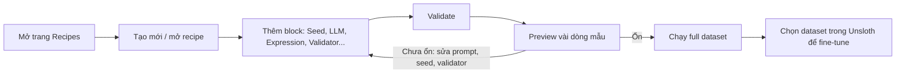

# Dữ liệu

## Dataset cho fine-tuning là gì

Với LLM, dataset là tập dữ liệu dùng để train model. Để dùng được, văn bản phải ở định dạng mà tokenizer (bộ tách văn bản thành token) đọc được. Docs nhấn mạnh hai phần quan trọng nhất khi tạo dataset: **chat template** (khuôn định dạng hội thoại) và **tokenization**.

::: tip Kiến thức nền
Chưa rõ token, tokenizer là gì? Xem [Token và context](/kien-thuc-nen/token-va-context).
:::

Trước khi định dạng dữ liệu, docs khuyên xác định 3 điều:

| Câu hỏi | Ví dụ theo docs |
| --- | --- |
| **Mục đích** của dataset | Hội thoại (Q&A, học ngôn ngữ mới, chăm sóc khách hàng); tác vụ có cấu trúc (phân loại, tóm tắt, sinh nội dung); dữ liệu chuyên ngành (y tế, tài chính, kỹ thuật) |
| **Kiểu đầu ra** mong muốn | JSON, HTML, văn bản hay code; tiếng Tây Ban Nha, Anh hay Đức... |
| **Nguồn dữ liệu** | File CSV, PDF, website; Hugging Face và Wikipedia (Wikipedia đặc biệt hữu ích khi dạy model một ngôn ngữ); hoặc dữ liệu tổng hợp |

Thường dataset gồm 2 cột: câu hỏi và câu trả lời. Chất lượng và số lượng dữ liệu quyết định phần lớn kết quả fine-tune. Docs lưu ý: chỉ "đổ" tài liệu thô vào thì hiệu quả không cao bằng dataset được tuyển chọn dạng cặp hỏi–đáp; ngoại lệ là fine-tune cho code, khi đổ toàn bộ code vào vẫn có thể cải thiện đáng kể. Docs cũng gợi ý trộn dataset của bạn với một dataset tổng quát trên Hugging Face (ví dụ ShareGPT) để model đa dạng hơn.

**Nguồn:** https://unsloth.ai/docs/get-started/fine-tuning-llms-guide/datasets-guide, https://unsloth.ai/docs/get-started/fine-tuning-llms-guide

## Các định dạng dữ liệu

| Định dạng | Mô tả | Kiểu train |
| --- | --- | --- |
| Raw Corpus | Văn bản thô từ website, sách, bài báo | Continued Pretraining (CPT — huấn luyện tiếp trên văn bản thô) |
| Instruct | Chỉ dẫn cho model + ví dụ đầu ra mong muốn | SFT (Supervised Fine-Tuning — tinh chỉnh có giám sát) |
| Conversation | Hội thoại nhiều lượt giữa user và trợ lý AI | SFT |
| RLHF | Hội thoại mà câu trả lời của trợ lý được chấm hạng bởi script, model khác hoặc người | RL (Reinforcement Learning — học tăng cường) |

Mỗi loại lại có nhiều biến thể định dạng khác nhau. Các ví dụ dưới chép nguyên văn từ docs.

### Raw text (cho continued pretraining)

Không cần cấu trúc, giữ mạch văn tự nhiên để model học từ văn bản liên tục:

```json
  "text": "Pasta carbonara is a traditional Roman pasta dish. The sauce is made by mixing raw eggs with grated Pecorino Romano cheese and black pepper. The hot pasta is then tossed with crispy guanciale (cured pork cheek) and the egg mixture, creating a creamy sauce from the residual heat. Despite popular belief, authentic carbonara never contains cream or garlic. The dish likely originated in Rome in the mid-20th century, though its exact origins are debated..."
```

### Instruction (Alpaca)

Dùng khi muốn model trả lời một lượt theo chỉ dẫn cụ thể:

```json
"Instruction": "Task we want the model to perform."

"Input": "Optional, but useful, it will essentially be the user's query."

"Output": "The expected result of the task and the output of the model."
```

Alpaca dataset gốc có 52.000 cặp chỉ dẫn/đầu ra do GPT-4 sinh ra, gồm 3 cột `instruction`, `input`, `output`; mỗi dòng được ghép thành một prompt lớn để train (supervised instruction finetuning). Bản GPT-4: https://huggingface.co/datasets/vicgalle/alpaca-gpt4. Phần lớn notebook của Unsloth dùng Alpaca dataset.

### Conversation — ShareGPT

Hội thoại nhiều lượt, khóa `"from"`/`"value"`, luân phiên giữa `human` và `gpt`:

```json
{
  "conversations": [
    {
      "from": "human",
      "value": "Can you help me make pasta carbonara?"
    },
    {
      "from": "gpt",
      "value": "Would you like the traditional Roman recipe, or a simpler version?"
    },
    {
      "from": "human",
      "value": "The traditional version please"
    },
    {
      "from": "gpt",
      "value": "The authentic Roman carbonara uses just a few ingredients: pasta, guanciale, eggs, Pecorino Romano, and black pepper. Would you like the detailed recipe?"
    }
  ]
}
```

### Conversation — ChatML (OpenAI)

Định dạng mặc định của Hugging Face và, theo docs, có lẽ phổ biến nhất; khóa `"role"`/`"content"`, luân phiên `user` và `assistant`:

```
{
  "messages": [
    {
      "role": "user",
      "content": "What is 1+1?"
    },
    {
      "role": "assistant",
      "content": "It's 2!"
    },
  ]
}
```

### Vision (ảnh + chữ)

Giống cặp hỏi–đáp nhưng thêm ảnh trong phần input. Mọi tác vụ vision phải có dạng:

```python
[
{ "role": "user",
  "content": [{"type": "text",  "text": instruction}, {"type": "image", "image": image} ]
},
{ "role": "assistant",
  "content": [{"type": "text",  "text": answer} ]
},
]
```

Ví dụ trong docs dùng bản rút gọn của ROCO radiography dataset (1978 dòng, cột `image`, `image_id`, `caption`, `cui`), chuyển mỗi mẫu sang dạng `messages` bằng hàm `convert_to_conversation`. Xem thêm mục Vision ở trang [Fine-tuning](/fine-tuning).

### Dữ liệu dạng bảng nhiều cột (CSV/Excel)

Trợ lý kiểu ChatGPT chỉ nhận **một** prompt, nên dataset nhiều cột (ví dụ Titanic: tuổi, hạng vé, giá vé...) phải được gộp thành một prompt. Unsloth có hàm `to_sharegpt` làm việc này:

- Tên cột đặt trong ngoặc nhọn `{}` (đúng tên cột trong file CSV/Excel).
- Đoạn tùy chọn đặt trong `[[]]`: nếu cột trống, cả đoạn bị bỏ qua (hữu ích khi thiếu dữ liệu).
- Cột đích/đầu ra khai báo ở `output_column_name` (với Alpaca là `output`).

Ví dụ: với dòng thiếu giá vé, thay vì "Their fare is EMPTY", đoạn đó bị lược bỏ hoàn toàn. Tham số `conversation_extension` chọn ngẫu nhiên N dòng một lượt và ghép thành một hội thoại nhiều lượt (ví dụ đặt 3 → gộp 3 dòng); đặt lớn thì train chậm hơn nhưng chatbot có thể tốt hơn. Sau đó luôn gọi `standardize_sharegpt`. Notebook CSV/Excel: https://colab.research.google.com/drive/1VYkncZMfGFkeCEgN2IzbZIKEDkyQuJAS?usp=sharing

### Dataset cho model reasoning

- Model **đã** có reasoning (ví dụ DeepSeek-R1-Distill-Llama-8B): vẫn dùng cặp câu hỏi–trả lời, nhưng câu trả lời phải chứa quá trình suy luận (chain-of-thought) và các bước dẫn tới đáp án.
- Model **chưa** có reasoning mà muốn dạy nó suy luận: dùng dataset thường, câu trả lời không kèm suy luận, và train bằng RL/GRPO — xem [Reinforcement Learning](/reinforcement-learning).

**Nguồn:** https://unsloth.ai/docs/get-started/fine-tuning-llms-guide/datasets-guide, https://unsloth.ai/docs/get-started/fine-tuning-llms-guide/tutorial-how-to-finetune-llama-3-and-use-in-ollama, https://unsloth.ai/docs/basics/vision-fine-tuning, https://unsloth.ai/docs/basics/chat-templates

## Bao nhiêu dữ liệu là đủ

| Mốc | Theo docs |
| --- | --- |
| Tối thiểu | Ít nhất **100 dòng** để có kết quả hợp lý |
| Tốt nhất | Trên **1.000 dòng**; khi đó càng nhiều dữ liệu thường càng tốt |
| Dataset quá nhỏ | Bổ sung dữ liệu tổng hợp hoặc trộn thêm dataset từ Hugging Face |
| Sinh dữ liệu tổng hợp bằng LLM | Cần sẵn ít nhất **10 ví dụ** để model học cấu trúc |

Lượng dữ liệu cũng ảnh hưởng tới việc chọn model: trên 1.000 dòng thường nên fine-tune base model; 300–1.000 dòng chất lượng cao thì base hay instruct đều được; dưới 300 dòng thì instruct model thường tốt hơn (chi tiết ở trang [Fine-tuning](/fine-tuning)).

Docs nhấn mạnh hiệu quả phụ thuộc rất lớn vào **chất lượng** dữ liệu, nên phải làm sạch và chuẩn bị kỹ.

**Nhiều dataset:** chuẩn hóa định dạng rồi gộp thành một dataset, hoặc dùng [notebook Multiple Datasets](https://colab.research.google.com/drive/1njCCbE1YVal9xC83hjdo2hiGItpY_D6t?usp=sharing).

**Fine-tune một model nhiều lần?** Làm được, nhưng docs khuyên gộp mọi dataset và train một lần, vì train chồng lên model đã fine-tune có thể làm thay đổi chất lượng và kiến thức đã học ở lần trước.

**Nguồn:** https://unsloth.ai/docs/get-started/fine-tuning-llms-guide/datasets-guide, https://unsloth.ai/docs/get-started/fine-tuning-llms-guide/what-model-should-i-use

## Chat template

Chat template là khuôn quy định cách một hội thoại (các lượt user/assistant, system prompt, token kết thúc) được ghép thành chuỗi văn bản trước khi đưa vào tokenizer. Mỗi model có template riêng; dữ liệu phải được định dạng đúng template của model thì fine-tune mới hiệu quả.

::: tip Kiến thức nền
Chat template, system prompt, tool calling là gì? Xem [Suy luận và sampling](/kien-thuc-nen/suy-luan-va-sampling).
:::

**Vì sao dùng template của Unsloth thay vì `apply_chat_template` gốc của tokenizer?** Theo docs, thuộc tính `chat_template` do nhà phát hành model upload đôi khi có lỗi và lâu mới được sửa; Unsloth kiểm tra và sửa lỗi template cho mọi model khi upload bản lượng tử hóa lên repo của mình, đồng thời `get_chat_template` có thêm tính năng xử lý dữ liệu. Nếu template chưa được hỗ trợ: gửi feature request trên GitHub, tạm thời dùng `apply_chat_template` của tokenizer. Danh sách mọi template Unsloth dùng: [chat_templates.py](https://github.com/unslothai/unsloth/blob/main/unsloth/chat_templates.py).

### Áp chat template với Unsloth (4 bước)

1. Xem các template được hỗ trợ:

```
from unsloth.chat_templates import CHAT_TEMPLATES
print(list(CHAT_TEMPLATES.keys()))
```

Ví dụ kết quả:

```
['unsloth', 'zephyr', 'chatml', 'mistral', 'llama', 'vicuna', 'vicuna_old', 'vicuna old', 'alpaca', 'gemma', 'gemma_chatml', 'gemma2', 'gemma2_chatml', 'llama-3', 'llama3', 'phi-3', 'phi-35', 'phi-3.5', 'llama-3.1', 'llama-31', 'llama-3.2', 'llama-3.3', 'llama-32', 'llama-33', 'qwen-2.5', 'qwen-25', 'qwen25', 'qwen2.5', 'phi-4', 'gemma-3', 'gemma3']
```

2. Gắn template phù hợp vào tokenizer bằng `get_chat_template`:

```
from unsloth.chat_templates import get_chat_template

tokenizer = get_chat_template(
    tokenizer,
    chat_template = "gemma-3", # change this to the right chat_template name
)
```

3. Định nghĩa hàm định dạng (áp template cho từng mẫu):

```
def formatting_prompts_func(examples):
   convos = examples["conversations"]
   texts = [tokenizer.apply_chat_template(convo, tokenize = False, add_generation_prompt = False) for convo in convos]
   return { "text" : texts, }
```

4. Nạp dataset và áp hàm định dạng:

```
# Import and load dataset
from datasets import load_dataset
dataset = load_dataset("repo_name/dataset_name", split = "train")

# Apply the formatting function to your dataset using the map method
dataset = dataset.map(formatting_prompts_func, batched = True,)
```

Nếu dataset ở dạng ShareGPT (`"from"`/`"value"`) mà model cần ChatML (`"role"`/`"content"`), chuyển đổi trước bằng `standardize_sharegpt`:

```
# Import dataset
from datasets import load_dataset
dataset = load_dataset("mlabonne/FineTome-100k", split = "train")

# Convert your dataset to the "role"/"content" format if necessary
from unsloth.chat_templates import standardize_sharegpt
dataset = standardize_sharegpt(dataset)

# Apply the formatting function to your dataset using the map method
dataset = dataset.map(formatting_prompts_func, batched = True,)
```

Chỉ dùng `standardize_sharegpt` khi dataset là ShareGPT còn model cần ChatML.

### Ánh xạ khóa ShareGPT trực tiếp (`mapping`)

Thay vì chuyển đổi, có thể dùng tham số `mapping` của `get_chat_template` để ánh xạ `from`/`value`/`human`/`gpt`. `map_eos_token` ánh xạ `<|im_end|>` thành EOS (token kết thúc chuỗi) mà không cần train:

```python
from unsloth.chat_templates import get_chat_template

tokenizer = get_chat_template(
    tokenizer,
    chat_template = "chatml", # Supports zephyr, chatml, mistral, llama, alpaca, vicuna, vicuna_old, unsloth
    mapping = {"role" : "from", "content" : "value", "user" : "human", "assistant" : "gpt"}, # ShareGPT style
    map_eos_token = True, # Maps <|im_end|> to </s> instead
)

def formatting_prompts_func(examples):
    convos = examples["conversations"]
    texts = [tokenizer.apply_chat_template(convo, tokenize = False, add_generation_prompt = False) for convo in convos]
    return { "text" : texts, }
pass

from datasets import load_dataset
dataset = load_dataset("philschmid/guanaco-sharegpt-style", split = "train")
dataset = dataset.map(formatting_prompts_func, batched = True,)
```

Có thể tự viết template riêng bằng cách truyền tuple `(custom_template, eos_token)`, trong đó `eos_token` phải được dùng bên trong template. Với template tùy biến kiểu notebook Ollama, bắt buộc có trường `{INPUT}` cho chỉ dẫn và `{OUTPUT}` cho đầu ra; `{SYSTEM}` là tùy chọn.

### Thêm token mới

Hàm `add_new_tokens` thêm token đặc biệt (ví dụ `<CHARACTER_1>`, `<THINKING>`, `<SCRATCH_PAD>`). **Phải gọi trước** `FastLanguageModel.get_peft_model`:

```python
model, tokenizer = FastLanguageModel.from_pretrained(...)
from unsloth import add_new_tokens
add_new_tokens(model, tokenizer, new_tokens = ["<CHARACTER_1>", "<THINKING>", "<SCRATCH_PAD>"])
model = FastLanguageModel.get_peft_model(...)
```

### Chỉ train trên câu trả lời

Sau khi đã áp template, có thể che phần user và chỉ tính loss trên phần assistant bằng `train_on_responses_only`; hàm này cần chuỗi đánh dấu đầu lượt user/assistant **đúng theo template** của model (ví dụ Llama 3 dùng `<|start_header_id|>user<|end_header_id|>`, Gemma dùng `<start_of_turn>user`). Code đầy đủ ở trang [Fine-tuning](/fine-tuning).

**Nguồn:** https://unsloth.ai/docs/basics/chat-templates, https://unsloth.ai/docs/get-started/fine-tuning-llms-guide/datasets-guide, https://unsloth.ai/docs/get-started/fine-tuning-llms-guide/lora-hyperparameters-guide, https://unsloth.ai/docs/get-started/fine-tuning-llms-guide/tutorial-how-to-finetune-llama-3-and-use-in-ollama

## Nạp dữ liệu trong Unsloth Studio

Studio (giao diện web chạy local) có bước Dataset với hai tab:

- **HuggingFace Hub**: tìm trực tiếp trên Hub, hiện ngày cập nhật gần nhất.
- **Local**: kéo-thả hoặc upload file có cấu trúc hoặc không cấu trúc: `PDF`, `DOCX`, `JSONL`, `JSON`, `CSV`, `Parquet`.

Chọn cách Studio hiểu dữ liệu:

| Format | Khi nào dùng |
| --- | --- |
| `auto` | Để Unsloth tự nhận diện |
| `alpaca` | Có cột `instruction` / `input` / `output` |
| `chatml` | Mảng `messages` kiểu OpenAI |
| `sharegpt` | Hội thoại kiểu ShareGPT |

Tùy chọn khác: **Subset** (tự lấy từ dataset card), **Train split / Eval split** (chọn eval split thì có biểu đồ Eval Loss), **Dataset slice** (giới hạn khoảng dòng để thử nhanh). Nếu Studio không tự ánh xạ được cột, hộp **Dataset Preview** mở ra để bạn gán từng cột vào `instruction`, `input`, `output`, `image`...

**Nguồn:** https://unsloth.ai/docs/new/studio/start

## Data Recipes trong Studio

Data Recipes biến tài liệu (PDF, CSV...) thành dataset dùng được / dataset tổng hợp, thông qua workflow dạng đồ thị node (graph-node) chỉnh sửa trực quan. Chạy trên nền NVIDIA NeMo [Data Designer](https://github.com/NVIDIA-NeMo/DataDesigner). Recipe lưu cục bộ trong trình duyệt, có thể export/import để chia sẻ.

### Các bước



1. Mở trang recipes.
2. Tạo recipe mới hoặc mở recipe có sẵn. Ba lựa chọn: **Start Empty** (tự dựng nhanh), **Start from Learning Recipe** (học từ ví dụ mẫu — nhanh nhất cho người mới), **mở recipe đã lưu**.
3. Thêm block để định nghĩa workflow (chọn từ block sheet, cấu hình trong dialog, nối trên canvas).
4. Bấm **Validate** để bắt lỗi cấu hình sớm.
5. Chạy **preview** để xem nhanh các dòng mẫu và phân tích.
6. Chạy **full dataset build** khi recipe đã ổn.
7. Theo dõi tiến độ và kết quả trên graph hoặc ở view **Executions**.
8. Chọn dataset kết quả trong Unsloth và fine-tune.

Preview dùng để lặp nhanh; full run tạo một dataset lưu cục bộ, xuất hiện trong bộ chọn dataset local của Studio; có thể publish lên repo Hugging Face.

### Các loại block

| Block | Vai trò |
| --- | --- |
| **Seed** | Dữ liệu đầu vào: từ Hugging Face, file có cấu trúc local, hoặc tài liệu không cấu trúc được chia (chunk) thành các dòng |
| **LLM + Models** | Provider, cấu hình model, các block sinh bằng LLM, tool profile dùng chung |
| **Expression** | Biến đổi dựa trên Jinja2, không cần gọi LLM |
| **Validators** | Lọc code sinh ra bị lỗi bằng linter có sẵn cho Python, SQL, JavaScript/TypeScript |
| **Samplers** | Cột xác định (deterministic) như category, subcategory |
| **Tool Profiles** | Cấp quyền dùng tool qua MCP cho một hoặc nhiều block LLM (ví dụ tra tài liệu code qua `Context7`) |

Cấu hình model chia hai lớp: **Model provider** (endpoint + xác thực) và **Model Config** (tên model + tham số inference). Hoạt động với provider hosted, endpoint tự host, `vLLM`, `llama.cpp` hoặc bất kỳ API tương thích OpenAI chạy ngoài Unsloth. Một recipe có thể dùng nhiều model cho các bước khác nhau.

Bốn loại block LLM:

| Block | Đầu ra | Phù hợp cho |
| --- | --- | --- |
| LLM Text | Văn bản tự do | Chỉ dẫn, giải thích, hội thoại, mô tả |
| LLM Structured | JSON | Đầu ra cần trường cố định, cấu trúc dự đoán được |
| LLM Code | Code | Sinh Python, SQL, TypeScript... |
| LLM Judge | Điểm đánh giá | Chấm đầu ra theo một hoặc nhiều tiêu chí tự định nghĩa |

### Tham chiếu giữa các block

Hầu hết block sinh dữ liệu trở thành **tham chiếu** cho block sau: tạo giá trị một lần, dùng lại trong prompt, expression, structured output và bước validate. Ví dụ: block category tên `domain`; cột của seed data (cột dataset HF, CSV) dùng thẳng trong prompt; trường của LLM Structured dùng cho prompt sau; block expression ghép các giá trị trước đó mà không cần gọi model. Cú pháp Jinja docs đưa ra:

```
{{ domain }}
{{customer.first_name}}
{{customer.first_name}} {{customer.last_name}}
...
```

**Nguồn:** https://unsloth.ai/docs/new/studio/data-recipe, https://unsloth.ai/docs/new/studio/start, https://unsloth.ai/docs/get-started/fine-tuning-llms-guide/datasets-guide

## Dữ liệu tổng hợp (synthetic data)

Dữ liệu tổng hợp là dữ liệu do một LLM sinh ra. Docs nêu 3 mục tiêu:

- Tạo dữ liệu hoàn toàn mới — từ đầu hoặc từ dataset sẵn có.
- Đa dạng hóa dataset để model không overfit và quá hẹp.
- Tăng cường dữ liệu có sẵn, ví dụ tự động cấu trúc lại dataset theo đúng định dạng đã chọn.

**Các cách làm theo docs:**

| Cách | Ghi chú |
| --- | --- |
| **Data Recipes** trong Unsloth Studio | Upload dữ liệu có hoặc không cấu trúc, tự chuyển thành dataset dùng được / tổng hợp (mục trên) |
| **Notebook Synthetic Dataset** | Tự parse tài liệu (PDF, video...), sinh cặp QA và tự làm sạch bằng model local như Llama 3.2: [notebook](https://colab.research.google.com/github/unslothai/notebooks/blob/main/nb/Meta_Synthetic_Data_Llama3_2_\(3B\).ipynb) |
| **LLM local hoặc ChatGPT** | Ví dụ Llama 3.3 (70B) hay GPT 4.5; model lớn hơn cho chất lượng cao hơn. Có thể chạy qua vLLM, Ollama, llama.cpp nhưng phải tự thu thập đầu ra và prompt thêm |

Prompt mẫu trong docs:

- Sinh thêm hội thoại từ dataset có sẵn: "Using the dataset example I provided, follow the structure and generate conversations based on the examples."
- Chưa có dataset:

```
Create 10 examples of product reviews for Coca-Coca classified as either positive, negative, or neutral.
```

- Dataset chưa được định dạng:

```
Structure my dataset so it is in a QA ChatML format for fine-tuning. Then generate 5 synthetic data examples with the same topic and format.
```

Sau khi sinh: kiểm tra chất lượng, loại bỏ hoặc sửa câu trả lời lạc đề/kém; cân bằng dữ liệu để tránh overfit; có thể đưa dataset đã làm sạch trở lại LLM để sinh tiếp với hướng dẫn tốt hơn.

**[Nhận định]** Khi dùng dịch vụ thương mại (ví dụ ChatGPT) để sinh dữ liệu train, nên kiểm tra điều khoản sử dụng của nhà cung cấp; docs không đề cập điểm này.

**Nguồn:** https://unsloth.ai/docs/get-started/fine-tuning-llms-guide/datasets-guide, https://unsloth.ai/docs/get-started/fine-tuning-llms-guide, https://unsloth.ai/docs/new/studio/data-recipe

## Checklist chuẩn bị dữ liệu

1. Đã xác định **mục đích**, **kiểu đầu ra** và **nguồn dữ liệu**.
2. Chọn đúng định dạng theo kiểu train: raw text (CPT), Alpaca/instruction (SFT một lượt), ShareGPT/ChatML (SFT hội thoại), có ảnh (vision).
3. Đủ số lượng: tối thiểu 100 dòng, tốt nhất trên 1.000 dòng; ít dữ liệu thì cân nhắc instruct model.
4. Ưu tiên dữ liệu tuyển chọn dạng hỏi–đáp thay vì đổ tài liệu thô (trừ trường hợp code).
5. Đã làm sạch: bỏ mẫu lạc đề, kém chất lượng; cân bằng giữa các nhóm.
6. Dữ liệu bảng nhiều cột đã gộp thành một prompt (`to_sharegpt`, đoạn tùy chọn trong `[[]]`).
7. Đã áp **đúng chat template** của model (`get_chat_template`); dùng `standardize_sharegpt` nếu dataset ShareGPT mà model cần ChatML.
8. Token mới (nếu có) được thêm bằng `add_new_tokens` **trước** `get_peft_model`.
9. Đã tách tập eval (ví dụ khoảng 20% dữ liệu) để theo dõi eval loss.
10. Nhiều dataset: chuẩn hóa định dạng và gộp, train một lần thay vì fine-tune chồng nhiều lần.
11. Dữ liệu vision: ảnh cùng kích thước, khoảng 300–1000px.
12. Dữ liệu tổng hợp đã được kiểm tra chất lượng thủ công; có sẵn ít nhất 10 ví dụ mẫu trước khi nhờ LLM sinh thêm.
13. Trong Studio: chọn đúng format (`auto`/`alpaca`/`chatml`/`sharegpt`), kiểm tra Column Mapping, chọn Eval split.

::: warning Cạm bẫy
- Dùng `chat_template` gốc của model có thể dính lỗi template; docs khuyên dùng bản đã sửa của Unsloth.
- **[Nhận định]** Template lúc train và lúc inference phải khớp; train một định dạng rồi chat bằng định dạng khác sẽ cho kết quả kém (suy ra từ việc docs nhấn mạnh chat template và việc Unsloth tự nhúng template đã dùng khi train vào `Modelfile` khi export sang Ollama).
- `conversation_extension` đặt quá lớn làm train chậm.
- Với multi-image vision, `ds.map(...)` có thể vướng quy tắc chuẩn hóa/Arrow khắt khe; docs khuyên dùng list comprehension.
:::

**Nguồn:** https://unsloth.ai/docs/get-started/fine-tuning-llms-guide/datasets-guide, https://unsloth.ai/docs/get-started/fine-tuning-llms-guide, https://unsloth.ai/docs/basics/chat-templates, https://unsloth.ai/docs/basics/vision-fine-tuning, https://unsloth.ai/docs/get-started/fine-tuning-llms-guide/tutorial-how-to-finetune-llama-3-and-use-in-ollama, https://unsloth.ai/docs/new/studio/start
