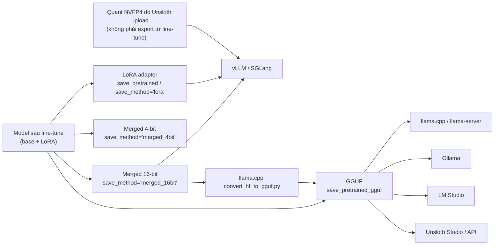

# Export & deploy

Sau khi fine-tune (tinh chỉnh) xong, bạn có một checkpoint (bản lưu model trong lúc train) gồm model gốc + LoRA adapter (phần trọng số nhỏ học thêm). Trang này chỉ ghi **Unsloth hỗ trợ xuất ra định dạng gì, bằng lệnh nào, chạy trên engine (phần mềm chạy model) nào**.

::: tip Kiến thức nền
Trang này không giải thích FP16/BF16, FP8, FP4/NVFP4, GGUF quant (Q4_K_M, Q8_0…) hay Dynamic quants là gì. Xem [Độ chính xác & lượng tử hóa](/kien-thuc-nen/do-chinh-xac-va-luong-tu-hoa). LoRA adapter và merge: xem [LoRA & QLoRA](/kien-thuc-nen/lora-va-qlora). Chat template: xem [Suy luận & sampling](/kien-thuc-nen/suy-luan-va-sampling).
:::

## Tổng quan luồng export



[Nhận định] Sơ đồ gom từ nhiều trang docs. Nhánh NVFP4 được vẽ tách riêng vì nguồn chỉ hướng dẫn **chạy** các quant NVFP4 mà Unsloth đã upload sẵn, không có hướng dẫn tự xuất NVFP4 từ model fine-tune của bạn.

**Nguồn:** https://unsloth.ai/docs/basics/inference-and-deployment, https://unsloth.ai/docs/basics/inference-and-deployment/vllm-guide, https://unsloth.ai/docs/basics/inference-and-deployment/saving-to-gguf, https://unsloth.ai/docs/basics/nvfp4

## Bảng định dạng export

| Định dạng | Dùng cho engine nào | Cách xuất | Ghi chú |
| --- | --- | --- | --- |
| LoRA adapter | vLLM (docs có trang LoRA Hot Swapping), Unsloth | Studio: **LoRA Only**. Core: `model.save_pretrained(...)` + `tokenizer.save_pretrained(...)`, hoặc `save_pretrained_merged(..., save_method = "lora")`, `push_to_hub_merged(..., save_method = "lora")` | Chỉ chứa trọng số adapter (~100MB theo trang Ollama), cần model gốc khi chạy |
| Merged 16-bit (safetensors) | vLLM, SGLang, transformers; là đầu vào để tự convert GGUF | Studio: **Merged Model**. Core: `save_pretrained_merged(..., save_method = "merged_16bit")`, `push_to_hub_merged(..., save_method = "merged_16bit")` | LoRA đã gộp vào trọng số gốc |
| Merged 4-bit | Hugging Face (inference online), DPO training | Core: `save_method = "merged_4bit"`, sau đó `merged_4bit_forced` nếu chắc chắn | Docs **không khuyến khích** trừ khi biết rõ mục đích |
| GGUF | llama.cpp, llama-server, Ollama, LM Studio, Unsloth Studio | Studio: **GGUF / llama.cpp**. Core: `save_pretrained_gguf(...)`, `push_to_hub_gguf(...)`; hoặc thủ công qua `convert_hf_to_gguf.py` | Chọn `quantization_method` (xem mục GGUF) |
| NVFP4 (Unsloth Dynamic NVFP4) | vLLM, SGLang trên GPU Blackwell | Không thấy hàm export NVFP4 trong nguồn — cần kiểm tra lại | Nguồn chỉ có quant NVFP4 do Unsloth upload sẵn |
| FP8 | vLLM, SGLang (theo trang FP8 RL) | Không có trang export FP8 riêng — xem mục FP8 | Unsloth có upload sẵn bản FP8 Dynamic / FP8 Block |

::: info safetensors vs .bin trong Colab
Theo trang Troubleshooting, trong Colab Unsloth lưu `.bin` (nhanh hơn ~4 lần). Muốn ép lưu `.safetensors`, đặt `safe_serialization = None`: `model.save_pretrained(..., safe_serialization = None)` hoặc `model.push_to_hub(..., safe_serialization = None)`.
:::

**Nguồn:** https://unsloth.ai/docs/new/studio/export, https://unsloth.ai/docs/basics/inference-and-deployment/vllm-guide, https://unsloth.ai/docs/basics/inference-and-deployment/saving-to-gguf, https://unsloth.ai/docs/basics/inference-and-deployment/saving-to-ollama, https://unsloth.ai/docs/basics/nvfp4, https://unsloth.ai/docs/get-started/reinforcement-learning-rl-guide/fp8-reinforcement-learning, https://unsloth.ai/docs/basics/inference-and-deployment/troubleshooting-inference

## Export trong Unsloth Studio

Unsloth Studio (giao diện web/desktop của Unsloth) cho phép export checkpoint đã train hoặc convert một model bất kỳ sang GGUF, Safetensors hoặc LoRA.

1. **Select Training Run** — chọn lượt train (mỗi run là một phiên train, có thể có nhiều checkpoint).
2. **Select Checkpoint** — chọn checkpoint cần xuất. Checkpoint cuối thường là model hoàn chỉnh, nhưng xuất checkpoint nào cũng được.
3. **Export Methods** — chọn một trong ba:

   | Kiểu export | Kết quả |
   | --- | --- |
   | Merged Model | Model **16-bit**, LoRA adapter đã gộp vào trọng số gốc |
   | LoRA Only | **Chỉ trọng số adapter**, cần model gốc khi chạy |
   | GGUF / llama.cpp | Chuyển sang **GGUF** để chạy trong Unsloth / llama.cpp / Ollama / LM Studio |

4. **Nơi lưu**:
   - **Export / Save Locally** — tải file về máy.
   - **Push to Hub** — đẩy lên Hugging Face Hub. Cần Hugging Face write token; nếu đã đăng nhập Hugging Face CLI thì có thể để trống.

**Nguồn:** https://unsloth.ai/docs/new/studio/export

## GGUF

GGUF là định dạng file của llama.cpp; Ollama, LM Studio và Unsloth Studio đều đọc được.

### Lưu GGUF bằng Core API

Lưu cục bộ:

```python
model.save_pretrained_gguf("directory", tokenizer, quantization_method = "q4_k_m")
model.save_pretrained_gguf("directory", tokenizer, quantization_method = "q8_0")
model.save_pretrained_gguf("directory", tokenizer, quantization_method = "f16")
```

Đẩy lên Hugging Face Hub:

```python
model.push_to_hub_gguf("hf_username/directory", tokenizer, quantization_method = "q4_k_m")
model.push_to_hub_gguf("hf_username/directory", tokenizer, quantization_method = "q8_0")
```

### Các `quantization_method` được hỗ trợ

Danh sách nguyên văn trong docs:

```python
# https://github.com/ggml-org/llama.cpp/blob/master/examples/quantize/quantize.cpp#L19
ALLOWED_QUANTS = \
{
    "not_quantized"  : "Recommended. Fast conversion. Slow inference, big files.",
    "fast_quantized" : "Recommended. Fast conversion. OK inference, OK file size.",
    "quantized"      : "Recommended. Slow conversion. Fast inference, small files.",
    "f32"     : "Not recommended. Retains 100% accuracy, but super slow and memory hungry.",
    "f16"     : "Fastest conversion + retains 100% accuracy. Slow and memory hungry.",
    "q8_0"    : "Fast conversion. High resource use, but generally acceptable.",
    "q4_k_m"  : "Recommended. Uses Q6_K for half of the attention.wv and feed_forward.w2 tensors, else Q4_K",
    "q5_k_m"  : "Recommended. Uses Q6_K for half of the attention.wv and feed_forward.w2 tensors, else Q5_K",
    "q2_k"    : "Uses Q4_K for the attention.wv and feed_forward.w2 tensors, Q2_K for the other tensors.",
    "q3_k_l"  : "Uses Q5_K for the attention.wv, attention.wo, and feed_forward.w2 tensors, else Q3_K",
    "q3_k_m"  : "Uses Q4_K for the attention.wv, attention.wo, and feed_forward.w2 tensors, else Q3_K",
    "q3_k_s"  : "Uses Q3_K for all tensors",
    "q4_0"    : "Original quant method, 4-bit.",
    "q4_1"    : "Higher accuracy than q4_0 but not as high as q5_0. However has quicker inference than q5 models.",
    "q4_k_s"  : "Uses Q4_K for all tensors",
    "q4_k"    : "alias for q4_k_m",
    "q5_k"    : "alias for q5_k_m",
    "q5_0"    : "Higher accuracy, higher resource usage and slower inference.",
    "q5_1"    : "Even higher accuracy, resource usage and slower inference.",
    "q5_k_s"  : "Uses Q5_K for all tensors",
    "q6_k"    : "Uses Q8_K for all tensors",
    "iq2_xxs" : "2.06 bpw quantization",
    "iq2_xs"  : "2.31 bpw quantization",
    "iq3_xxs" : "3.06 bpw quantization",
    "q3_k_xs" : "3-bit extra small quantization",
}
```

Gợi ý chọn nhanh theo trang LM Studio: `q4_k_m` thường là mặc định khi chạy local; `q8_0` gần như giữ nguyên chất lượng; `f16` lớn và chậm nhất nhưng không lượng tử hóa. Trang Ollama nhắc: export `Q8_0` nhanh; nếu bật nhiều dòng quant cùng lúc sẽ phải chờ rất lâu (quá trình convert mất 5–10 phút).

### Lưu GGUF thủ công

Bước 1 — lưu merged 16-bit:

```python
model.save_pretrained_merged("merged_model", tokenizer, save_method = "merged_16bit",)
```

Bước 2 — build llama.cpp từ source:

```bash
apt-get update
apt-get install pciutils build-essential cmake curl libcurl4-openssl-dev -y
git clone https://github.com/ggml-org/llama.cpp
cmake llama.cpp -B llama.cpp/build \
    -DBUILD_SHARED_LIBS=OFF -DGGML_CUDA=ON -DLLAMA_CURL=ON
cmake --build llama.cpp/build --config Release -j --clean-first --target llama-cli llama-mtmd-cli llama-server llama-gguf-split
cp llama.cpp/build/bin/llama-* llama.cpp
```

Bước 3 — convert sang F16 (hoặc BF16 / Q8_0):

```bash
python llama.cpp/convert_hf_to_gguf.py merged_model \
    --outfile model-F16.gguf --outtype f16 \
    --split-max-size 50G
```

```bash
# For BF16:
python llama.cpp/convert_hf_to_gguf.py merged_model \
    --outfile model-BF16.gguf --outtype bf16 \
    --split-max-size 50G
    
# For Q8_0:
python llama.cpp/convert_hf_to_gguf.py merged_model \
    --outfile model-Q8_0.gguf --outtype q8_0 \
    --split-max-size 50G
```

**Nguồn:** https://unsloth.ai/docs/basics/inference-and-deployment/saving-to-gguf, https://unsloth.ai/docs/basics/inference-and-deployment/lm-studio, https://unsloth.ai/docs/basics/inference-and-deployment/saving-to-ollama

## Unsloth Dynamic 3.0 GGUFs

Đây là các file GGUF **do Unsloth tự lượng tử hóa và upload** lên Hugging Face (tiền tố `UD-`, ví dụ `UD-Q4_K_XL`, `UD-Q2_K_XL`), không phải tùy chọn `quantization_method` khi bạn tự save. Unsloth làm gì theo docs:

- **Dynamic v2.0**: không lượng tử hóa đồng đều mà chọn kiểu quant riêng cho từng layer, mỗi model một cấu hình riêng (Gemma 3 khác Llama 4). Dùng bộ calibration (dữ liệu hiệu chuẩn) hơn 1.5M token, chọn lọc thủ công để tối ưu hội thoại. Áp dụng cho cả model MoE và non-MoE. Có thêm Q4_NL, Q5.1, Q5.0, Q4.1, Q4.0 cho Apple Silicon/ARM.
- **Dynamic v3.0**: bộ imatrix calibration chất lượng cao hơn, nhắm tới agentic coding, chat, đa ngôn ngữ; cải thiện chọn layer. Không train trên bộ calibration, không dùng QAT/QAD — chỉ post-training quantization (lượng tử hóa sau huấn luyện). Với model lớn, Unsloth vẫn dùng UD-2 cũ.
- Chạy được trên llama.cpp, Unsloth Studio / Unsloth Desktop và "hầu hết inference engine".

Số liệu benchmark (luôn đọc kèm điều kiện):

| Tuyên bố | Điều kiện đo theo docs |
| --- | --- |
| Dynamic v3.0 tốt hơn **trên 10% top-1 accuracy ở cùng kích thước** so với mọi provider khác | Model Qwen3.8-27B, so sánh KLD top-1 |
| `UD-Q2_K_XL` chính xác hơn ~8% top-1 so với bản tốt nhất kế tiếp, nặng 9.83GB | Qwen3.8-27B |
| `UD-IQ1_S` 6.2GB giữ ~72% top-1, nhỏ hơn 89% | Qwen3.8-27B, không kèm MTP |
| Divergence-300 @32 rơi từ ~25% (UD-Q2_K_XL) xuống dưới 8–10% (UD-IQ2_S) | 300 prompt không nằm trong calibration, greedy decode 32 token so với BF16 |
| Q2_K_XL giảm KLD ~7.5% | Gemma 3 27B, Dynamic v2.0 so với baseline imatrix, test trên Wikipedia |
| Dynamic 4-bit nhỏ hơn 2GB và +1% accuracy so với bản QAT của Google | Gemma 3 27B, MMLU 5-shot: Q4_K_XL 71.47 (15.64GB) vs Google QAT 70.64 (17.2GB) |
| Dynamic 3-bit DeepSeek V3.1 đạt 75.6% | Aider Polyglot |

::: warning Không dùng 1-bit cho agentic
Docs khuyến cáo quant dưới `UD-Q2_K_XL` (1-bit) không nên dùng cho tool calling/agent: dễ lặp vô hạn (dùng `presence_penalty = 1.5` trở lên), trả lời rỗng nếu tắt thinking, gọi tool sai. Chỉ dùng cho câu hỏi kiến thức ngắn; tốt nhất vẫn là `UD-Q2_K_XL`.
:::

**Nguồn:** https://unsloth.ai/docs/basics/dynamic-3.0-ggufs

## NVFP4 (Unsloth Dynamic NVFP4)

Unsloth Dynamic NVFP4 là định dạng quant 4-bit chạy trên **GPU NVIDIA Blackwell** (RTX 5050–5090, RTX 50X, DGX Spark, B200, B300, RTX PRO 6000). GPU cũ hơn: docs khuyên dùng GGUF.

Unsloth làm gì: giữ các layer quan trọng ở FP8 (W8A8) hoặc BF16, phần còn lại W4A4 (không phải W4A16) để tận dụng FP4 tensor core; kèm FP8 KV cache calibration cho context dài gấp 2; MTP tensors (phục vụ speculative decoding) có sẵn trong quant.

Yêu cầu VRAM (VRAM = bộ nhớ card đồ họa) theo bảng docs:

| Model | VRAM cần | Tăng tốc (docs) |
| --- | ---: | --- |
| Gemma 4 E2B | 7 GB | 1.12× so với BF16 |
| Gemma 4 E4B | 9 GB | 1.22× so với BF16 |
| Gemma 4 12B Unified | 11 GB | 1.26× so với BF16 |
| Gemma 4 26B A4B | 26 GB | 1.41× so với BF16 |
| Gemma 4 31B | 32 GB | 1.45× so với BF16 |
| Qwen3.6 27B | 24 GB | 2.5× so với NVFP4 khác |
| Qwen3.6 35B A3B | 32 GB | 1.56× so với NVFP4 khác |
| Qwen3.6 35B A3B Fast | 32 GB | 1.79× so với NVFP4 khác |

Điều kiện đo: 1x B200, 128 concurrency (128 request đồng thời). Độ chính xác (MMLU-Pro / GPQA / AIME 2025) của Qwen3.6-27B: Unsloth 86.25 / 86.34 / 93.12 so với BF16 85.96 / 88.13 / 93.33.

### Chạy bằng vLLM

Cài vLLM trong venv riêng:

```bash
uv venv unsloth-nvfp4-env --python 3.13
source unsloth-nvfp4-env/bin/activate
uv pip install "vllm>=0.25.0" "flashinfer-python>=0.6.13" "nvidia-cutlass-dsl>=4.5.2" \
    --torch-backend=auto
```

```shell
vllm serve unsloth/Qwen3.6-35B-A3B-NVFP4-Fast
```

Bật MTP / speculative decoding (decode nhanh hơn, throughput giảm chút):

```bash
vllm serve unsloth/Qwen3.6-35B-A3B-NVFP4-Fast
    --speculative-config '{"method": "mtp", "num_speculative_tokens": 2}'
```

DGX Spark phải dùng backend `flashinfer_b12x`:

```shellscript
export CUTE_DSL_ARCH=sm_121a
vllm serve unsloth/Qwen3.6-35B-A3B-NVFP4-Fast --moe-backend flashinfer_b12x
```

### Chạy bằng SGLang

```bash
python -m sglang.launch_server --model-path unsloth/Qwen3.6-27B-NVFP4 --speculative-algorithm NEXTN \
     --speculative-num-steps 3 --speculative-eagle-topk 1 --speculative-num-draft-tokens 4
```

::: warning Đừng tự chọn MoE backend
Trên GPU thường, **không** set MoE backend — để vLLM tự chọn. Kernel Marlin không hỗ trợ tốt W4A4, chậm hơn ~2.5 lần. Nếu gặp lỗi Torchcodec: cài `ffmpeg` (`sudo apt-get install -y ffmpeg`) rồi chạy lại vLLM.
:::

::: info Export NVFP4 từ model tự fine-tune
Trang NVFP4 chỉ hướng dẫn chạy các quant do Unsloth upload (collection `unsloth/nvfp4` trên Hugging Face). Không thấy hàm/tùy chọn xuất NVFP4 cho model bạn tự fine-tune — cần kiểm tra lại.
:::

**Nguồn:** https://unsloth.ai/docs/basics/nvfp4

## FP8

::: info Docs không có trang export FP8 riêng
Trong các nguồn đã đọc, không có trang hướng dẫn "xuất model fine-tune sang FP8". FP8 xuất hiện ở trang **FP8 Reinforcement Learning** — tức là FP8 dùng khi **train** (RL/GRPO), không phải một bước export.
:::

Những gì trang FP8 RL nói:

- Bật FP8 khi load model bằng `load_in_fp8 = True` trong `FastLanguageModel.from_pretrained`. Unsloth tự map sang bản Float8 nếu có, hoặc convert on-the-fly.
- Chạy trên GPU NVIDIA ra đời sau RTX 4090 (RTX 40, RTX 50, L4, H100, H200, B200…). T4 miễn phí của Colab **không** hỗ trợ FP8.
- Unsloth có upload sẵn model **FP8 Dynamic** và **FP8 Block** trên Hugging Face, dùng được cho FP8 training hoặc serve bằng vLLM/SGLang. FP8 Dynamic train nhanh hơn và tốn ít VRAM hơn FP8 Block, đổi lại giảm nhẹ độ chính xác.

```python
from unsloth import FastLanguageModel
fp8_model = FastLanguageModel.from_pretrained(
    "unsloth/Llama-3.3-70B-Instruct", # Can be any model name!
    load_in_fp8 = True, # Can be "block" for block FP8, True for row FP8, False
)
```

Chi tiết FP8 RL xem [Reinforcement Learning](/reinforcement-learning).

**Nguồn:** https://unsloth.ai/docs/get-started/reinforcement-learning-rl-guide/fp8-reinforcement-learning

## Deploy: Ollama

Unsloth hỗ trợ export sang Ollama qua GGUF và **tự tạo `Modelfile`** (file cấu hình Ollama cần, chứa chat template dùng lúc fine-tune). Quy trình theo docs:

1. Cài Ollama (trong notebook Colab).
2. Export model sang GGUF (bật `True` cho **một** dòng quant, thường là dòng đầu `Q8_0`).
3. Chạy Ollama nền. Ngoài Colab chỉ cần chạy `ollama serve` trong terminal.
4. Dùng `Modelfile` Unsloth sinh ra để tạo model Ollama, rồi gọi inference.

::: info Code của trang Ollama bị thiếu
Trong bản nguồn đã lọc, các khối code của trang Ollama nằm trong ảnh nên không chép được; lệnh duy nhất có dạng văn bản là `ollama serve`. Chi tiết xem tutorial "Finetune Llama-3 and Use In Ollama" — cần kiểm tra lại.
:::

**Nguồn:** https://unsloth.ai/docs/basics/inference-and-deployment/saving-to-ollama

## Deploy: llama-server (OpenAI endpoint)

`llama-server` của llama.cpp phục vụ file GGUF qua endpoint tương thích OpenAI. Build llama.cpp như ở mục GGUF (đổi `-DGGML_CUDA=ON` thành `-DGGML_CUDA=OFF` nếu chỉ chạy CPU hoặc Mac/Metal). Chạy server:

```bash
./llama.cpp/llama-server \
    --model Devstral-Small-2-24B-Instruct-2512-GGUF/Devstral-Small-2-24B-Instruct-2512-UD-Q4_K_XL.gguf \
    --mmproj Devstral-Small-2-24B-Instruct-2512-GGUF/mmproj-F16.gguf \
    --alias "unsloth/Devstral-Small-2-24B-Instruct-2512" \
    --threads -1 \
    --n-gpu-layers 999 \
    --prio 3 \
    --min-p 0.01 \
    --ctx-size 16384 \
    --port 8001 \
    --jinja
```

Gọi từ Python (sau `pip install openai`):

```python
from openai import OpenAI
import json
openai_client = OpenAI(
    base_url = "http://127.0.0.1:8001/v1",
    api_key = "sk-no-key-required",
)
completion = openai_client.chat.completions.create(
    model = "unsloth/Devstral-Small-2-24B-Instruct-2512",
    messages = [{"role": "user", "content": "What is 2+2?"},],
)
print(completion.choices[0].message.content)
```

::: warning `--jinja` chèn thêm system message
Với `--jinja`, nếu model hỗ trợ tools, llama-server tự nối thêm câu "Respond in JSON format, either with tool_call … or with response …" vào system message — có thể làm hỏng model fine-tune. Tắt bằng `--no-jinja` thì mất hỗ trợ `tools`. Docs khuyên thêm prompt tool calling riêng cho mọi fine-tune.
:::

**Nguồn:** https://unsloth.ai/docs/basics/inference-and-deployment/llama-server-and-openai-endpoint

## Deploy: vLLM

Cài (GPU NVIDIA):

```bash
pip install --upgrade pip
pip install uv
uv pip install -U vllm --torch-backend=auto
```

GPU AMD: dùng Docker image nightly `rocm/vllm-dev:nightly`.

Lưu model cho vLLM (merged 16-bit):

```python
model.save_pretrained_merged("finetuned_model", tokenizer, save_method = "merged_16bit")
## OR to upload to HuggingFace:
model.push_to_hub_merged("hf/model", tokenizer, save_method = "merged_16bit", token = "")
```

Serve ở terminal khác:

```bash
vllm serve finetuned_model
```

Nếu không chạy, dùng đường dẫn đầy đủ:

```bash
vllm serve /mnt/disks/daniel/finetuned_model
```

**Nguồn:** https://unsloth.ai/docs/basics/inference-and-deployment/vllm-guide

## Deploy: LM Studio

LM Studio chạy file GGUF. Ba bước: export GGUF từ Unsloth → import vào LM Studio → load để chat hoặc bật API tương thích OpenAI.

Import file GGUF bằng CLI `lms`:

```bash
lms import /path/to/model.gguf
```

Hoặc tải từ Hugging Face nếu đã `push_to_hub_gguf`:

```bash
# Download from HF by repo name
lms get hf_username/my_model_gguf

# Pick a quantization with @
lms get hf_username/my_model_gguf@Q4_K_M
```

Load model và bật server (mặc định thường là `http://localhost:1234/v1`):

```bash
lms load <model-identifier> --gpu=auto --context-length=8192
```

```bash
lms server start --port 1234
```

```bash
curl http://localhost:1234/v1/models
```

Mẹo debug template: `lms log stream` hiện prompt thô LM Studio gửi vào model.

**Nguồn:** https://unsloth.ai/docs/basics/inference-and-deployment/lm-studio

## Truy cập qua LAN và remote (Cloudflare)

Unsloth Studio có sẵn hai chế độ cho phép thiết bị khác dùng model đang chạy trên máy bạn.

### LAN (mạng nội bộ)

Thiết bị cùng Wi-Fi/mạng dây truy cập qua địa chỉ dạng `http://192.168.1.42:8888`. Không cần internet, dữ liệu không rời mạng nội bộ.

- Lúc khởi động: thêm `-H 0.0.0.0`.

```bash
unsloth studio -H 0.0.0.0 -p 8888
```

- Khi đang chạy: **Settings → API → Remote & LAN** → thẻ **LAN access** → **Start**. Trạng thái **Online** nghĩa là địa chỉ đã phản hồi. Có toggle **Start automatically** để tự bật mỗi lần khởi động.

### Remote qua Cloudflare tunnel

Unsloth tạo link HTTPS kiểu `https://<random>.trycloudflare.com`, không cần tài khoản Cloudflare, domain hay mở port router.

```bash
unsloth studio --secure -p 8888
```

`--secure` giữ Unsloth bind ở `127.0.0.1` và chỉ publish qua tunnel; nếu tunnel lỗi, Unsloth **thoát** chứ không fallback sang port thô. Khi đang chạy: **Settings → API → Remote access** → **Start**, rồi copy **Remote URL** hoặc quét QR.

Đặt mật khẩu cho launch headless (không có terminal):

```bash
UNSLOTH_STUDIO_PASSWORD='your-strong-password' unsloth studio --secure
```

### Mỗi kiểu launch mở ra tới đâu

| Lệnh | Port thô | URL Cloudflare công khai |
| --- | --- | --- |
| `unsloth studio` | chỉ máy này | không |
| `unsloth studio -H 0.0.0.0` | cả mạng nội bộ | không |
| `unsloth studio -H 0.0.0.0 --cloudflare` | cả mạng nội bộ | **có** (kém riêng tư nhất) |
| `unsloth studio --secure` | chỉ máy này | **có**, là lối vào duy nhất |

::: warning Bảo mật khi mở Unsloth ra mạng
- **LAN là HTTP thường, không mã hóa** — ai cùng phân đoạn mạng đều đọc được. Trên mạng không do bạn kiểm soát, dùng `--secure` (HTTPS).
- **Tool phía server chạy dưới quyền user của bạn**: web search, Python, terminal bật mặc định trong Studio, nên ai có API key và truy cập được server là chạy được code trên máy. Thêm `--disable-tools` khi mở ra mạng và giữ kín API key.
- Ai có **URL + mật khẩu** là đăng nhập được (user `unsloth`). URL tunnel đổi mỗi lần start, hãy coi URL là bí mật.
- `-H 0.0.0.0` vẫn để port thô mở; chỉ `--secure` đóng nó.
- Lần đầu publish công khai mà admin vẫn dùng mật khẩu tự sinh, Unsloth bắt đổi mật khẩu trước. Tránh `--password VALUE` trên dòng lệnh vì lộ trong `ps` và shell history.
- Khi tunnel bật, các MCP server stdio cục bộ bị tắt (trừ khi đặt `UNSLOTH_STUDIO_ALLOW_STDIO_MCP=1`).
:::

**Nguồn:** https://unsloth.ai/docs/basics/lan, https://unsloth.ai/docs/basics/how-to-serve-local-llms-anywhere-secure-remote-access-with-cloudflare-and-unsloth

## Troubleshooting phổ biến

| Triệu chứng | Nguyên nhân / cách xử lý theo docs |
| --- | --- |
| Chạy trong Unsloth tốt, sang Ollama/vLLM/llama.cpp thì ra rác, lặp vô hạn | Phổ biến nhất: **chat template sai** — phải dùng đúng template lúc train. Kiểm tra `eos token`; kiểm tra engine có thêm/thiếu token "start of sequence". Dùng conversational notebook của Unsloth để ép template |
| LM Studio ra rác/lặp | Template không khớp: **My Models** → bánh răng → **Prompt Template** đặt đúng template đã train |
| Save GGUF hoặc vLLM 16-bit bị crash (OOM) | Giảm `maximum_memory_usage` (mặc định `0.75`) xuống ví dụ `0.5` |
| LM Studio không thấy model | Dùng `lms import`, hoặc đặt file đúng cấu trúc `~/.lmstudio/models/publisher/model/model-file.gguf` |
| LM Studio OOM / chậm | Quant nhỏ hơn (`Q4_K_M`), giảm context, chỉnh GPU offload |
| `Unsloth Studio is already running on port 8888` | Chạy `unsloth studio stop` hoặc đổi `--port` |
| Thiết bị khác không vào được địa chỉ LAN | Phải cùng mạng; kiểm tra Guest Wi-Fi, AP isolation, VPN, firewall của máy |
| `--secure` thoát ngay | Tunnel lỗi; sửa kết nối mạng trước (đừng vội dùng `--no-secure` vì nó mở port thô) |
| `cloudflared is unavailable` | Kiểm tra truy cập ra `github.com` hoặc tự cài `cloudflared` vào `PATH` |

**Nguồn:** https://unsloth.ai/docs/basics/inference-and-deployment/troubleshooting-inference, https://unsloth.ai/docs/basics/inference-and-deployment/saving-to-gguf, https://unsloth.ai/docs/basics/inference-and-deployment/lm-studio, https://unsloth.ai/docs/basics/lan, https://unsloth.ai/docs/basics/how-to-serve-local-llms-anywhere-secure-remote-access-with-cloudflare-and-unsloth
