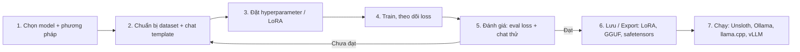

# Fine-tuning

## Fine-tuning là gì, khi nào nên dùng

Fine-tuning (tinh chỉnh; docs gọi chung là fine-tuning / training / post-training) là huấn luyện tiếp một model đã được pre-train (huấn luyện trước) trên dữ liệu chuyên biệt của bạn, ví dụ Llama-3.1-8B. Docs nêu 3 mục tiêu:

- **Cập nhật kiến thức**: đưa thông tin chuyên ngành mà model gốc chưa có.
- **Tùy biến hành vi**: chỉnh giọng điệu, tính cách, phong cách trả lời (ví dụ theo giọng thương hiệu).
- **Tối ưu cho tác vụ**: tăng độ chính xác trên tác vụ cụ thể.

Phương pháp post-training chuẩn là SFT (Supervised Fine-Tuning — tinh chỉnh có giám sát bằng cặp đầu vào/đầu ra mẫu). Các phương pháp khác: preference optimization (DPO, ORPO), distillation (chưng cất) và RL (Reinforcement Learning — học tăng cường, ví dụ GRPO, GSPO) — xem [Reinforcement Learning](/reinforcement-learning).

Ví dụ ứng dụng docs đưa ra: phân tích cảm xúc tin tài chính (tiêu đề tác động tích cực hay tiêu cực tới công ty), chatbot chăm sóc khách hàng học từ hội thoại cũ, trợ lý pháp lý (phân tích hợp đồng, án lệ, tuân thủ).

**Fine-tuning hay RAG?** RAG (Retrieval-Augmented Generation — truy xuất tài liệu rồi đưa vào prompt) mạnh ở dữ liệu cập nhật liên tục; fine-tuning đưa kiến thức và hành vi vào thẳng trọng số model. Quan điểm của docs:

| Câu hỏi | Trả lời theo docs |
| --- | --- |
| Fine-tuning có thêm kiến thức mới không? | Có. Nếu dataset chứa thông tin mới, model học được. |
| RAG luôn tốt hơn fine-tuning? | Không nhất thiết. Model tinh chỉnh đúng cách thường ngang hoặc hơn RAG ở tác vụ chuyên biệt; các nhận định "RAG luôn tốt hơn" thường đến từ cấu hình LoRA sai hoặc train chưa đủ. |
| Fine-tuning có đắt không? | Không nhất thiết. Full fine-tuning và pretraining tốn kém nhưng thường không cần; LoRA/QLoRA chạy được trên notebook Colab/Kaggle miễn phí hoặc máy cá nhân. |
| Nên chọn một trong hai? | Docs khuyên **kết hợp** cả hai: fine-tuning cho chuyên môn và định dạng, RAG cho dữ liệu thay đổi nhanh; model tinh chỉnh còn là "phương án dự phòng" khi retrieval trả sai. |

Ưu điểm khác docs liệt kê: không phụ thuộc hệ thống truy xuất lúc inference, trả lời nhanh hơn vì bỏ bước retrieval, kiểm soát chặt giọng điệu. Docs cũng tuyên bố "fine-tuning can replicate all of RAG's capabilities, but not vice versa".

**[Nhận định]** Câu "fine-tuning làm được mọi thứ RAG làm" là quan điểm của Unsloth; với dữ liệu thay đổi hằng ngày, cần retrain liên tục nên RAG vẫn là lựa chọn thực tế hơn — chính docs cũng khuyên kết hợp. Xem thêm [Ứng dụng RAG](/ung-dung-rag).

::: tip Kiến thức nền
Chưa rõ loss, learning rate, epoch, batch, overfitting là gì? Xem [Quá trình huấn luyện](/kien-thuc-nen/qua-trinh-huan-luyen).
:::

**Nguồn:** https://unsloth.ai/docs/get-started/fine-tuning-for-beginners/faq-+-is-fine-tuning-right-for-me, https://unsloth.ai/docs/get-started/fine-tuning-llms-guide, https://unsloth.ai/docs/get-started/fine-tuning-for-beginners

## LoRA vs QLoRA vs full fine-tuning

LoRA (Low-Rank Adaptation) giữ nguyên trọng số model gốc và chỉ train các ma trận adapter (bộ chuyển đổi) mỏng gắn thêm — docs nói chỉ tối ưu khoảng 1% trọng số. QLoRA là LoRA trên model gốc đã được lượng tử hóa xuống 4-bit. Full fine-tuning (FFT) cập nhật toàn bộ trọng số.

::: tip Kiến thức nền
Chưa rõ LoRA rank/alpha, QLoRA, gradient checkpointing là gì? Xem [LoRA và QLoRA](/kien-thuc-nen/lora-va-qlora). Về 4-bit/16-bit: [Độ chính xác & lượng tử hóa](/kien-thuc-nen/do-chinh-xac-va-luong-tu-hoa).
:::

| Tiêu chí | QLoRA (4-bit) | LoRA (16-bit) | Full fine-tuning |
| --- | --- | --- | --- |
| Model gốc | Lượng tử hóa 4-bit + LoRA adapter | Độ chính xác đầy đủ (16-bit) + LoRA adapter | Train toàn bộ trọng số |
| VRAM (bộ nhớ card đồ họa) | Thấp nhất — mức giảm so với LoRA docs ghi nhiều cách (xem hộp cảnh báo bên dưới) | Trung bình — docs ghi gấp 4× QLoRA | Cao nhất |
| Tốc độ | Chậm hơn LoRA một chút | Nhanh hơn QLoRA một chút | Docs chỉ ghi "compute-heavy", cần nhiều tài nguyên hơn hẳn |
| Chất lượng | Kém LoRA một chút — mức chênh docs ghi khác nhau (xem hộp cảnh báo bên dưới) | Chính xác hơn QLoRA một chút | Docs: LoRA làm đúng có thể ngang FFT |
| Ví dụ theo docs | Llama 70B vừa dưới 48GB VRAM với QLoRA trong Unsloth | — | — |
| Cờ trong code | `load_in_4bit = True` | `load_in_4bit = False` hoặc `load_in_16bit = True` | `full_finetuning = True` |
| Docs khuyên | **Bắt đầu từ đây** | Khi môi trường 16-bit và cần độ chính xác tối đa | Thường không cần; thử LoRA/QLoRA trước |

Ngoài ra còn 8-bit (`load_in_8bit = True`). Mỗi lần chỉ được bật **một** phương pháp là `True`.

::: warning Docs chưa thống nhất: QLoRA tiết kiệm bao nhiêu VRAM và mất bao nhiêu độ chính xác
**Mức tiết kiệm VRAM của QLoRA (4-bit) so với LoRA 16-bit:**
- "4× less" VRAM; LoRA "4× more than QLoRA" — [LoRA Hyperparameters Guide](https://unsloth.ai/docs/get-started/fine-tuning-llms-guide/lora-hyperparameters-guide)
- "reducing VRAM usage by over 75%" — [LoRA Hyperparameters Guide](https://unsloth.ai/docs/get-started/fine-tuning-llms-guide/lora-hyperparameters-guide)
- "quantizes to 4-bit to save 75% memory"; `load_in_4bit = True` "reducing memory use 4×" — [Fine-tuning LLMs Guide](https://unsloth.ai/docs/get-started/fine-tuning-llms-guide)
- "reduces memory usage by 4x, allowing us to actually do finetuning in a free 16GB memory GPU" — [Tutorial Llama-3 + Ollama](https://unsloth.ai/docs/get-started/fine-tuning-llms-guide/tutorial-how-to-finetune-llama-3-and-use-in-ollama)

**Độ chính xác mất đi khi dùng 4-bit:**
- "1-2% accuracy degradation" (với `load_in_4bit = True`) — [Tutorial Llama-3 + Ollama](https://unsloth.ai/docs/get-started/fine-tuning-llms-guide/tutorial-how-to-finetune-llama-3-and-use-in-ollama)
- "Slightly slower and marginally less accurate" — [LoRA Hyperparameters Guide](https://unsloth.ai/docs/get-started/fine-tuning-llms-guide/lora-hyperparameters-guide)
- Với Unsloth dynamic 4-bit, phần mất mát "is now negligible" — [FAQ + Is Fine-tuning Right For Me?](https://unsloth.ai/docs/get-started/fine-tuning-for-beginners/faq-+-is-fine-tuning-right-for-me)
- Với Unsloth dynamic 4-bit, phần mất mát "is now largely recovered" — [Fine-tuning LLMs Guide](https://unsloth.ai/docs/get-started/fine-tuning-llms-guide)
:::

Docs có hai lời khuyên đáng nhớ:

- Train và serve (phục vụ inference) cùng độ chính xác: muốn chạy 4-bit thì train 4-bit, và ngược lại.
- Đừng nhảy thẳng vào FFT. Nếu LoRA/QLoRA không chạy được, gần như chắc chắn FFT cũng không, và FFT không "tự sửa" được lỗi đó.

**Nguồn:** https://unsloth.ai/docs/get-started/fine-tuning-llms-guide, https://unsloth.ai/docs/get-started/fine-tuning-llms-guide/lora-hyperparameters-guide, https://unsloth.ai/docs/get-started/fine-tuning-for-beginners/faq-+-is-fine-tuning-right-for-me, https://unsloth.ai/docs/new/studio/start

## Quy trình data → train → đánh giá → export



Unsloth có hai cách làm: **Studio** (giao diện web chạy local, không cần code) và **Core** (thư viện Python, dùng qua notebook hoặc script).

| Bước | Studio (UI) | Core (code) |
| --- | --- | --- |
| 1. Model + phương pháp | Chọn Model Type (Text / Vision / Audio / Embeddings), chọn QLoRA / LoRA / Full Fine-tuning; gõ tên model Hugging Face hoặc chọn model local. Studio tự điền hyperparameter mặc định. Model GGUF không train được (chỉ để inference). Model gated (Llama, Gemma) cần dán Hugging Face token. | `FastLanguageModel.from_pretrained(...)` với `max_seq_length`, `dtype`, `load_in_4bit` |
| 2. Dataset | Tab HuggingFace Hub hoặc Local (upload `PDF`, `DOCX`, `JSONL`, `JSON`, `CSV`, `Parquet`); chọn format `auto` / `alpaca` / `chatml` / `sharegpt`; chọn Train split / Eval split; Column Mapping nếu không tự nhận cột | `load_dataset(...)`, `get_chat_template`, `standardize_sharegpt`, `dataset.map(...)` — chi tiết ở trang [Dữ liệu](/du-lieu) |
| 3. Hyperparameter | Các nhóm tham số thu gọn được; lưu/tải cấu hình dạng YAML | `FastLanguageModel.get_peft_model(...)` + tham số của trainer |
| 4. Train | Nút **Start Training**; theo dõi Loss, LR, Grad Norm, GPU (utilization, nhiệt độ, VRAM, công suất); biểu đồ Training Loss / Learning Rate / Gradient Norm / Eval Loss; **Stop & Save** lưu checkpoint trước khi dừng | `SFTTrainer(...)` rồi `trainer.train()` |
| 5. Đánh giá | Biểu đồ Eval Loss (chỉ hiện khi đã chọn eval split); chat thử model trong Studio Chat | `eval_dataset`, `eval_strategy`, `EarlyStoppingCallback`; `FastLanguageModel.for_inference(model)` rồi chat thử |
| 6. Export | Trang **Export**: GGUF, Safetensors hoặc LoRA, dùng cho Unsloth, llama.cpp, Ollama, vLLM... | Lưu LoRA adapter (~100MB) hoặc push lên Hugging Face; export GGUF cho Ollama — xem [Export & Deploy](/export-deploy) |

### Code Core tiêu biểu

Trong các trang nguồn, code Core xuất hiện theo từng mảnh; bản đầy đủ chạy được nằm trong các notebook (xem mục Notebooks bên dưới). Các mảnh dưới đây chép nguyên văn.

**Nạp model + gắn LoRA.** Trong các trang nguồn, khối code duy nhất có đủ cả `from_pretrained` và `get_peft_model` là ví dụ ở trang QAT, nên được giữ nguyên văn. Dòng `qat_scheme` chỉ dùng khi làm QAT (xem mục QAT phía dưới); fine-tune LoRA thường thì không có dòng này.

```python
from unsloth import FastLanguageModel
model, tokenizer = FastLanguageModel.from_pretrained(
    model_name = "unsloth/Qwen3-4B-Instruct-2507",
    max_seq_length = 2048,
    load_in_16bit = True,
)
model = FastLanguageModel.get_peft_model(
    model,
    r = 16,
    target_modules = ["q_proj", "k_proj", "v_proj", "o_proj",
                      "gate_proj", "up_proj", "down_proj",],
    lora_alpha = 32,
    
    # We support fp8-int4, fp8-fp8, int8-int4, int4
    qat_scheme = "int4",
)
```

Các tùy chọn nạp model mà tutorial giải thích từng dòng:

```python
max_seq_length = 2048
```

```python
dtype = None
```

```python
load_in_4bit = True
```

Các tham số của `get_peft_model` theo hướng dẫn hyperparameter (trong nguồn mỗi dòng là một snippet riêng):

```python
r = 16, # Choose any number > 0 ! Suggested 8, 16, 32, 64, 128
```

```python
target_modules = ["q_proj", "k_proj", "v_proj", "o_proj",
                  "gate_proj", "up_proj", "down_proj",],
```

```python
lora_alpha = 16,
```

```python
lora_dropout = 0, # Supports any, but = 0 is optimized
```

```python
bias = "none",    # Supports any, but = "none" is optimized
```

```python
use_gradient_checkpointing = "unsloth", # True or "unsloth" for very long context
```

```python
random_state = 3407,
```

**Trainer** (`SFTTrainer` của thư viện TRL; mẫu từ trang checkpoint, `....` là phần docs lược bỏ):

```python
trainer = SFTTrainer(
    ....
    args = TrainingArguments(
        ....
        output_dir = "outputs",
        save_strategy = "steps",
        save_steps = 50,
    ),
)
```

Các tham số train mặc định trong tutorial:

```python
per_device_train_batch_size = 2,
```

```python
gradient_accumulation_steps = 4,
```

```python
max_steps = 60, # num_train_epochs = 1,
```

```python
learning_rate = 2e-4,
```

::: warning Docs chưa thống nhất: các giá trị mẫu ở trên
- `gradient_accumulation_steps`: 4 — [Tutorial](https://unsloth.ai/docs/get-started/fine-tuning-llms-guide/tutorial-how-to-finetune-llama-3-and-use-in-ollama), [Fine-tuning LLMs Guide](https://unsloth.ai/docs/get-started/fine-tuning-llms-guide); 8 — [Hyperparameters guide](https://unsloth.ai/docs/get-started/fine-tuning-llms-guide/lora-hyperparameters-guide), [Studio](https://unsloth.ai/docs/new/studio/start).
- `per_device_train_batch_size`: 2 — [Tutorial](https://unsloth.ai/docs/get-started/fine-tuning-llms-guide/tutorial-how-to-finetune-llama-3-and-use-in-ollama), [Hyperparameters guide](https://unsloth.ai/docs/get-started/fine-tuning-llms-guide/lora-hyperparameters-guide); 4 — [Studio](https://unsloth.ai/docs/new/studio/start).
- `lora_alpha`: 16 — [Tutorial](https://unsloth.ai/docs/get-started/fine-tuning-llms-guide/tutorial-how-to-finetune-llama-3-and-use-in-ollama), [Hyperparameters guide](https://unsloth.ai/docs/get-started/fine-tuning-llms-guide/lora-hyperparameters-guide); 32 — [Studio](https://unsloth.ai/docs/new/studio/start), ví dụ [QAT](https://unsloth.ai/docs/blog/quantization-aware-training-qat) ở trên.
- `lora_dropout`: 0 — [Tutorial](https://unsloth.ai/docs/get-started/fine-tuning-llms-guide/tutorial-how-to-finetune-llama-3-and-use-in-ollama), [Hyperparameters guide](https://unsloth.ai/docs/get-started/fine-tuning-llms-guide/lora-hyperparameters-guide); 0.05 — [Studio](https://unsloth.ai/docs/new/studio/start).
- Số epoch: `max_steps = 60` / `num_train_epochs = 1` — [Tutorial](https://unsloth.ai/docs/get-started/fine-tuning-llms-guide/tutorial-how-to-finetune-llama-3-and-use-in-ollama); 3 — [Studio](https://unsloth.ai/docs/new/studio/start); 1–3 — [Hyperparameters guide](https://unsloth.ai/docs/get-started/fine-tuning-llms-guide/lora-hyperparameters-guide).

Bảng đầy đủ ở mục "So sánh mặc định: Studio vs Core" bên dưới.
:::

**Chỉ train trên câu trả lời** (train on completions — che phần input của user, chỉ tính loss trên phần assistant). Docs dẫn bài báo QLoRA rằng cách này tăng độ chính xác, nhất là với hội thoại nhiều lượt. Với Llama 3, 3.1, 3.2, 3.3 và 4:

```python
from unsloth.chat_templates import train_on_responses_only
trainer = train_on_responses_only(
    trainer,
    instruction_part = "<|start_header_id|>user<|end_header_id|>\n\n",
    response_part = "<|start_header_id|>assistant<|end_header_id|>\n\n",
)
```

Với Gemma 2, 3, 3n:

```python
from unsloth.chat_templates import train_on_responses_only
trainer = train_on_responses_only(
    trainer,
    instruction_part = "<start_of_turn>user\n",
    response_part = "<start_of_turn>model\n",
)
```

Sau khi train: gọi `FastLanguageModel.for_inference(model)` (docs nói inference native nhanh gấp 2×); muốn câu trả lời dài hơn thì tăng `max_new_tokens = 128` lên 256 hoặc 1024. Model lưu dưới dạng LoRA adapter khoảng 100MB, hoặc push lên Hugging Face (cần [token](https://huggingface.co/settings/tokens)). Khi export GGUF trong notebook Ollama, chỉ đổi `False` thành `True` ở **một** dòng (thường là `Q8_0`), không bật tất cả, nếu không sẽ phải chờ rất lâu; quá trình export mất 5–10 phút. Unsloth tự tạo `Modelfile` cho Ollama.

**Nguồn:** https://unsloth.ai/docs/get-started/fine-tuning-llms-guide, https://unsloth.ai/docs/get-started/fine-tuning-llms-guide/tutorial-how-to-finetune-llama-3-and-use-in-ollama, https://unsloth.ai/docs/get-started/fine-tuning-llms-guide/lora-hyperparameters-guide, https://unsloth.ai/docs/basics/finetuning-from-last-checkpoint, https://unsloth.ai/docs/blog/quantization-aware-training-qat, https://unsloth.ai/docs/new/studio/start

## Hyperparameter khuyến nghị

Docs khuyên **giữ mặc định của Unsloth** trừ khi cần train lâu hơn hoặc batch lớn hơn. Nhưng "mặc định" ở Studio, ở tutorial/notebook và ở hướng dẫn hyperparameter **không trùng nhau** ở nhiều tham số — xem bảng so sánh ngay sau bảng này. Cột "Đặt sai thì sao" diễn giải từ chính docs. Tham số có dấu ⚠ là tham số docs ghi nhiều giá trị khác nhau (chi tiết trong hộp "Docs chưa thống nhất" bên dưới).

::: tip Kiến thức nền
`q_proj` … `down_proj` là các lớp nào trong model: xem [Kiến trúc Transformer](/kien-thuc-nen/kien-truc-transformer). `max_seq_length` và context: xem [Token & context](/kien-thuc-nen/token-va-context). Model MoE (vd `30B-A3B`): xem [Dense & MoE](/kien-thuc-nen/dense-va-moe).
:::

| Tham số | Giá trị khuyến nghị (docs) | Ý nghĩa ngắn | Đặt sai thì sao |
| --- | --- | --- | --- |
| `learning_rate` | `2e-4` cho LoRA/QLoRA; `5e-6` cho RL (DPO, GRPO...); FFT dùng thấp hơn. Khoảng thường gặp `2e-4` → `5e-6`. Tutorial gợi ý thử `2e-4`, `1e-4`, `5e-5`, `2e-5` | Mức điều chỉnh trọng số mỗi bước | Quá cao: train bất ổn, dễ overfit trong run ngắn. Quá thấp: cần nhiều epoch hơn, có thể overfit hoặc không học được |
| Epochs (`num_train_epochs`) ⚠ | Hướng dẫn hyperparameter: 1–3. Tutorial: `max_steps = 60` để chạy thử, chạy thật `num_train_epochs = 1`. Studio mặc định 3 | Số lần model đi qua toàn bộ dataset | Hơn 3 epoch với dataset instruction: lợi ích giảm, dễ học thuộc. Quá ít: train chưa đủ |
| `r` (LoRA rank) ⚠ | Bảng khuyến nghị: 8, 16, 32, 64, 128 — chọn 16 hoặc 32. Mục underfitting cùng trang: "usually is between 4 and 64". Studio: slider 4–128 | Số tham số train được trong adapter | Lớn: tốn bộ nhớ, chậm hơn, rank quá lớn có thể overfit. Nhỏ: có thể underfit |
| `lora_alpha` ⚠ | Bằng `r`, hoặc `r * 2`; giữ alpha/rank ≥ 1. Snippet mẫu dùng `16` (= r); Studio mặc định `32` | Hệ số scale độ mạnh của cập nhật LoRA | Lớn: học mạnh hơn nhưng dễ overfit |
| `lora_dropout` ⚠ | Code mẫu: 0 (được tối ưu), khoảng 0 – 0.1. Studio mặc định `0.05` | Regularization (điều chuẩn) — ngẫu nhiên tắt một phần activation | Docs: không hữu ích lắm với run ngắn; dùng giá trị khác 0 nếu nghi overfit |
| `weight_decay` | 0.01 (khuyến nghị) – 0.1; Studio mặc định 0.01 | Phạt trọng số lớn để giảm overfit | Docs cảnh báo không dùng giá trị quá lớn |
| Warmup ⚠ | Hướng dẫn hyperparameter: 5–10% tổng số bước. Studio mặc định Warmup Steps = 5 | Tăng dần learning rate lúc đầu | — (docs không nêu) |
| Scheduler | `linear` hoặc `cosine`; Studio mặc định `linear` | Điều chỉnh learning rate theo thời gian | — (docs không nêu) |
| `random_state` (seed) | Số nguyên bất kỳ, ví dụ `42`, `3407` | Cố định ngẫu nhiên để tái lập kết quả | Không cố định: khó so sánh các lần chạy |
| `target_modules` | Tất cả lớp linear chính: `q_proj, k_proj, v_proj, o_proj, gate_proj, up_proj, down_proj` | Các lớp được gắn LoRA (attention + MLP) | Bỏ bớt module: tiết kiệm bộ nhớ rất ít nhưng giảm chất lượng; docs "strongly advise against" |
| `bias` ⚠ | Code: `"none"`; lời giải thích trong tutorial lại ghi "Leave this as 0" | Có train bias hay không | Train bias: thêm tham số, gần như không lợi |
| `use_gradient_checkpointing` | `"unsloth"` | Tiết kiệm bộ nhớ khi train | `"unsloth"` giảm thêm 30% bộ nhớ và hỗ trợ context rất dài so với các lựa chọn `True`/`False` |
| `per_device_train_batch_size` ⚠ | Tutorial và hướng dẫn hyperparameter: 2. Studio mặc định 4 | Số mẫu mỗi lượt forward/backward trên 1 GPU — **yếu tố chính quyết định VRAM** | Quá lớn: OOM (hết bộ nhớ); tăng batch còn có thể chậm hơn do padding |
| `gradient_accumulation_steps` ⚠ | Hướng dẫn hyperparameter: 8. Tutorial và Fine-tuning LLMs Guide: 4. Studio mặc định 8 | Số micro-batch trước mỗi lần cập nhật — **yếu tố chính quyết định thời gian train** | Cao: mỗi epoch lâu hơn |
| Effective batch size ⚠ | Hướng dẫn hyperparameter: 4–16, khuyến nghị 16 (= 2 × 8). Mặc định tutorial cho ra 8 (= 2 × 4); mặc định Studio cho ra 32 (= 4 × 8) | `batch_size * gradient_accumulation_steps` | Nhỏ: nhiều nhiễu hơn; lớn: ổn định hơn |
| `use_rslora` ⚠ | `False` (tính năng nâng cao). Hai trang mô tả tác dụng khác nhau | Rank-Stabilized LoRA | Theo hướng dẫn hyperparameter: có thể ổn định hơn với rank cao |
| `loftq_config` | `None` | Khởi tạo LoRA từ singular vectors của trọng số gốc | Có thể tăng độ chính xác nhưng tăng vọt bộ nhớ lúc bắt đầu |
| `max_seq_length` | 2048 để thử nghiệm; Studio mặc định 2048 (tùy chọn 512 → 32768) | Độ dài context khi train | — |

Muốn effective batch = 32, các cấu hình `32×1`, `16×2`, `8×4`, `4×8`, `2×16`, `1×32` tương đương về cập nhật trọng số nhưng khác xa về VRAM. Docs khuyên: đặt `batch_size` nhỏ rồi tăng `gradient_accumulation_steps`. Unsloth đã sửa lỗi gradient accumulation nên hai cách này **tương đương hoàn toàn** trong Unsloth.

### So sánh mặc định: Studio vs Core

"Core tutorial" là tutorial Llama-3 + Ollama (giá trị trong notebook; batch, gradient accumulation, max_steps, learning rate trùng với phần Training của Fine-tuning LLMs Guide). "—" nghĩa là trang đó không nêu giá trị.

| Tham số | [Studio](https://unsloth.ai/docs/new/studio/start) | [Core tutorial](https://unsloth.ai/docs/get-started/fine-tuning-llms-guide/tutorial-how-to-finetune-llama-3-and-use-in-ollama) | [Hyperparameters guide](https://unsloth.ai/docs/get-started/fine-tuning-llms-guide/lora-hyperparameters-guide) |
| --- | --- | --- | --- |
| Batch size | 4 | `per_device_train_batch_size = 2` | 2 |
| Gradient accumulation | 8 | `gradient_accumulation_steps = 4` | 8 |
| Effective batch (tính ra) | 32 | 8 | 16 (khuyến nghị 4–16) |
| Epochs / steps | Epochs 3; Max Steps `0` (= dùng Epochs) | `max_steps = 60` để chạy thử; chạy thật `num_train_epochs = 1`; gợi ý 1–3 lượt | 1–3 epoch |
| Learning rate | `2e-4` | `2e-4` | `2e-4` (LoRA/QLoRA) |
| Context length | 2048 (512 → 32768) | `max_seq_length = 2048` | — |
| Rank `r` | 16 (slider 4–128) | `r = 16` | 16 hoặc 32 (khoảng 8–128; mục underfitting: 4–64) |
| `lora_alpha` | 32 | `lora_alpha = 16` | `r` hoặc `r * 2`; snippet `lora_alpha = 16` |
| `lora_dropout` | 0.05 | `lora_dropout = 0` | 0 (mặc định) – 0.1 |
| `bias` | — | `bias = "none"` (lời giải thích ghi "Leave this as 0") | `"none"` |
| Weight decay | 0.01 | — | 0.01 – 0.1 |
| Warmup | 5 steps | — | 5–10% tổng số bước |
| LR scheduler | linear | — | `linear` hoặc `cosine` |
| Optimizer | AdamW 8-bit | — | — |
| Gradient checkpointing | `unsloth` | `"unsloth"` | `"unsloth"` |
| Seed | 3407 | `random_state = 3407` | Số nguyên bất kỳ (ví dụ 42, 3407) |
| Target modules | Bật hết 7 module | Cả 7 module | Cả 7 module |
| LoRA variant | `LoRA` / `RS-LoRA` / `LoftQ` (mặc định LoRA) | `use_rslora = False`, `loftq_config = None` | `use_rslora = False`, `loftq_config = None` |
| Train on completions | false | — | Khuyên dùng (tăng độ chính xác, nhất là hội thoại nhiều lượt) |
| Packing | false | — | — |
| Save / Eval steps | 0 / 0 | — | — |

::: warning Docs chưa thống nhất: giá trị mặc định/khuyến nghị
Các trang docs không đưa cùng một bộ "mặc định". Trang này không chọn thay bạn:
- **Batch size:** 4 — [Studio](https://unsloth.ai/docs/new/studio/start); 2 — [Tutorial](https://unsloth.ai/docs/get-started/fine-tuning-llms-guide/tutorial-how-to-finetune-llama-3-and-use-in-ollama), [Hyperparameters guide](https://unsloth.ai/docs/get-started/fine-tuning-llms-guide/lora-hyperparameters-guide), [Fine-tuning LLMs Guide](https://unsloth.ai/docs/get-started/fine-tuning-llms-guide).
- **Gradient accumulation:** 8 — [Studio](https://unsloth.ai/docs/new/studio/start), [Hyperparameters guide](https://unsloth.ai/docs/get-started/fine-tuning-llms-guide/lora-hyperparameters-guide); 4 — [Tutorial](https://unsloth.ai/docs/get-started/fine-tuning-llms-guide/tutorial-how-to-finetune-llama-3-and-use-in-ollama), [Fine-tuning LLMs Guide](https://unsloth.ai/docs/get-started/fine-tuning-llms-guide).
- **Epochs:** 3 — [Studio](https://unsloth.ai/docs/new/studio/start); `max_steps = 60` (chạy thử) hoặc `num_train_epochs = 1` (chạy thật) — [Tutorial](https://unsloth.ai/docs/get-started/fine-tuning-llms-guide/tutorial-how-to-finetune-llama-3-and-use-in-ollama), [Fine-tuning LLMs Guide](https://unsloth.ai/docs/get-started/fine-tuning-llms-guide); 1–3 — [Hyperparameters guide](https://unsloth.ai/docs/get-started/fine-tuning-llms-guide/lora-hyperparameters-guide).
- **`lora_alpha`:** 32 — [Studio](https://unsloth.ai/docs/new/studio/start); 16 — [Tutorial](https://unsloth.ai/docs/get-started/fine-tuning-llms-guide/tutorial-how-to-finetune-llama-3-and-use-in-ollama) và snippet của [Hyperparameters guide](https://unsloth.ai/docs/get-started/fine-tuning-llms-guide/lora-hyperparameters-guide); "`r` hoặc `r * 2`" — bảng của [Hyperparameters guide](https://unsloth.ai/docs/get-started/fine-tuning-llms-guide/lora-hyperparameters-guide).
- **`lora_dropout`:** 0.05 — [Studio](https://unsloth.ai/docs/new/studio/start); 0 — [Tutorial](https://unsloth.ai/docs/get-started/fine-tuning-llms-guide/tutorial-how-to-finetune-llama-3-and-use-in-ollama), [Hyperparameters guide](https://unsloth.ai/docs/get-started/fine-tuning-llms-guide/lora-hyperparameters-guide) (khoảng 0–0.1).
- **Warmup:** 5 steps — [Studio](https://unsloth.ai/docs/new/studio/start); 5–10% tổng số bước — [Hyperparameters guide](https://unsloth.ai/docs/get-started/fine-tuning-llms-guide/lora-hyperparameters-guide).
- **Train on completions:** mặc định false — [Studio](https://unsloth.ai/docs/new/studio/start); khuyên dùng — [Hyperparameters guide](https://unsloth.ai/docs/get-started/fine-tuning-llms-guide/lora-hyperparameters-guide).
- **Khoảng rank:** 8, 16, 32, 64, 128 (chọn 16 hoặc 32) — bảng khuyến nghị của [Hyperparameters guide](https://unsloth.ai/docs/get-started/fine-tuning-llms-guide/lora-hyperparameters-guide); "usually is between 4 and 64" — mục Underfitting cùng trang [Hyperparameters guide](https://unsloth.ai/docs/get-started/fine-tuning-llms-guide/lora-hyperparameters-guide); slider 4–128 — [Studio](https://unsloth.ai/docs/new/studio/start).
- **`bias`:** code `bias = "none"` nhưng lời giải thích ghi "Leave this as 0" — [Tutorial](https://unsloth.ai/docs/get-started/fine-tuning-llms-guide/tutorial-how-to-finetune-llama-3-and-use-in-ollama); "Leave this as `"none"`" — [Hyperparameters guide](https://unsloth.ai/docs/get-started/fine-tuning-llms-guide/lora-hyperparameters-guide).
- **`use_rslora`:** "Advanced feature to set the `lora_alpha = 16` automatically" — [Tutorial](https://unsloth.ai/docs/get-started/fine-tuning-llms-guide/tutorial-how-to-finetune-llama-3-and-use-in-ollama); nếu `True` thì scaling thành `lora_alpha / sqrt(r)` thay vì `lora_alpha / r` — [Hyperparameters guide](https://unsloth.ai/docs/get-started/fine-tuning-llms-guide/lora-hyperparameters-guide).
:::

**Nguồn:** https://unsloth.ai/docs/get-started/fine-tuning-llms-guide/lora-hyperparameters-guide, https://unsloth.ai/docs/get-started/fine-tuning-llms-guide/tutorial-how-to-finetune-llama-3-and-use-in-ollama, https://unsloth.ai/docs/get-started/fine-tuning-llms-guide, https://unsloth.ai/docs/new/studio/start

## Chọn model để fine-tune

Các bước docs gợi ý:

1. **Chọn theo use-case**: train với ảnh thì dùng vision model (ví dụ Llama 3.2 Vision); dataset code thì dùng model chuyên code (ví dụ Qwen Coder 2.5). Kiểm tra license và yêu cầu hệ thống.
2. **Đánh giá tài nguyên**: dùng hướng dẫn VRAM của Unsloth để ước lượng; dataset quyết định loại model và thời gian train.
3. **Ưu tiên model mới nhất**: xem [Model catalog](/model-catalog).
4. **Chọn Instruct hay Base**:

| Lượng dữ liệu | Khuyến nghị |
| --- | --- |
| Trên 1.000 dòng | Thường nên fine-tune **base** model |
| 300–1.000 dòng chất lượng cao | Base hoặc instruct đều được |
| Dưới 300 dòng | **Instruct** model thường tốt hơn (giữ được khả năng làm theo chỉ dẫn sẵn có) |

Instruct model dùng chat template hội thoại (ChatML, ShareGPT) và cần ít dữ liệu hơn; base model hợp với template dạng instruction (Alpaca, Vicuna). Với người mới, docs khuyên bắt đầu từ **instruct model nhỏ** như Llama 3.1 (8B). Nếu được, fine-tune thử cả hai rồi so sánh.

::: warning Docs chưa thống nhất: chọn instruct hay base, và cần bao nhiêu dữ liệu
- "We recommend starting with **Instruct models**" (không kèm điều kiện về lượng dữ liệu) — [Fine-tuning LLMs Guide](https://unsloth.ai/docs/get-started/fine-tuning-llms-guide), [What Model Should I Use?](https://unsloth.ai/docs/get-started/fine-tuning-llms-guide/what-model-should-i-use)
- Trên 1.000 dòng: "generally best to fine-tune the base model"; 300–1.000 dòng: base hoặc instruct; dưới 300 dòng: instruct — [What Model Should I Use?](https://unsloth.ai/docs/get-started/fine-tuning-llms-guide/what-model-should-i-use)
- Tối thiểu "at least 100 rows"; tối ưu "over 1,000 rows" (không gắn với việc chọn base hay instruct) — [Datasets Guide](https://unsloth.ai/docs/get-started/fine-tuning-llms-guide/datasets-guide)
:::

::: tip Kiến thức nền
Base vs instruct là gì? Xem [Phân loại mô hình](/kien-thuc-nen/phan-loai-mo-hinh). Cách đọc "8B" và ước tính VRAM: [Tham số và bộ nhớ](/kien-thuc-nen/tham-so-va-bo-nho).
:::

**Đọc hậu tố tên model trên Hugging Face:**

| Hậu tố | Ý nghĩa |
| --- | --- |
| `unsloth-bnb-4bit` | Unsloth Dynamic 4-bit quant — tốn VRAM hơn BitsAndBytes 4-bit thường một chút nhưng chính xác hơn đáng kể |
| `bnb-4bit` (không có "unsloth") | BitsAndBytes 4-bit tiêu chuẩn |
| Không hậu tố | Bản gốc 16-bit hoặc 8-bit; bản Unsloth đôi khi có sửa lỗi chat template/tokenizer nên docs khuyên dùng bản của Unsloth |

Ví dụ tên model: `unsloth/llama-3.1-8b-unsloth-bnb-4bit`.

**Nguồn:** https://unsloth.ai/docs/get-started/fine-tuning-llms-guide/what-model-should-i-use, https://unsloth.ai/docs/get-started/fine-tuning-llms-guide

## Đánh giá và tránh overfitting

**Đọc training loss.** Loss không giảm thì cần chỉnh cấu hình. Loss quá thấp có thể là overfitting (học thuộc dữ liệu train), nhưng docs đưa các ngưỡng khác nhau:

::: warning Docs chưa thống nhất: ngưỡng loss
- "a loss around 0.5 to 1.0 is a good sign"; "If the loss goes to 0, that could mean overfitting" — [Fine-tuning LLMs Guide](https://unsloth.ai/docs/get-started/fine-tuning-llms-guide), [Tutorial Llama-3 + Ollama](https://unsloth.ai/docs/get-started/fine-tuning-llms-guide/tutorial-how-to-finetune-llama-3-and-use-in-ollama)
- "If your training loss drops below 0.2, your model is likely overfitting" — [LoRA Hyperparameters Guide](https://unsloth.ai/docs/get-started/fine-tuning-llms-guide/lora-hyperparameters-guide)

Hai trang đều nói ngưỡng phụ thuộc dataset/tác vụ và khuyên kiểm tra thêm bằng validation/eval loss.
:::

**Cách đánh giá docs gợi ý:**

- Chat trực tiếp với model xem có đạt ý không (đánh giá thủ công).
- Tách khoảng 20% dữ liệu train làm tập test. Nếu đã dùng hết dữ liệu để train thì chỉ còn cách đánh giá thủ công.
- Bật evaluation trong Unsloth; có thể chậm với dataset lớn → giảm kích thước tập eval hoặc giãn số bước giữa các lần eval.
- Công cụ eval tự động: dùng được nhưng có thể không khớp tiêu chí của bạn.
- Trong Studio: chọn **Eval split** để có biểu đồ **Eval Loss**.

::: warning Docs chưa thống nhất: tên tham số số bước giữa các lần eval
- `evaluation_steps = 100` — [Fine-tuning LLMs Guide](https://unsloth.ai/docs/get-started/fine-tuning-llms-guide)
- `eval_steps = 10` (cùng `eval_strategy = "steps"`, trong `SFTConfig`) — [Finetuning from Last Checkpoint](https://unsloth.ai/docs/basics/finetuning-from-last-checkpoint)
- "Eval Steps", mặc định `0` — [Studio](https://unsloth.ai/docs/new/studio/start)

Tên tham số nào đúng với phiên bản TRL/Transformers bạn đang dùng: cần kiểm tra lại.
:::

**Early stopping theo eval loss** (dừng khi `eval_loss` không giảm sau vài lần eval):

```python
from trl import SFTConfig, SFTTrainer
trainer = SFTTrainer(
    args = SFTConfig(
        fp16_full_eval = True,
        per_device_eval_batch_size = 2,
        eval_accumulation_steps = 4,
        output_dir = "training_checkpoints", # location of saved checkpoints for early stopping
        save_strategy = "steps",             # save model every N steps
        save_steps = 10,                     # how many steps until we save the model
        save_total_limit = 3,                # keep only 3 saved checkpoints to save disk space
        eval_strategy = "steps",             # evaluate every N steps
        eval_steps = 10,                     # how many steps until we do evaluation
        load_best_model_at_end = True,       # MUST USE for early stopping
        metric_for_best_model = "eval_loss", # metric we want to early stop on
        greater_is_better = False,           # the lower the eval loss, the better
    ),
    model = model,
    tokenizer = tokenizer,
    train_dataset = new_dataset["train"],
    eval_dataset = new_dataset["test"],
)
```

```python
from transformers import EarlyStoppingCallback
early_stopping_callback = EarlyStoppingCallback(
    early_stopping_patience = 3,     # How many steps we will wait if the eval loss doesn't decrease
                                     # For example the loss might increase, but decrease after 3 steps
    early_stopping_threshold = 0.0,  # Can set higher - sets how much loss should decrease by until
                                     # we consider early stopping. For eg 0.01 means if loss was
                                     # 0.02 then 0.01, we consider to early stop the run.
)
trainer.add_callback(early_stopping_callback)
```

**Chống overfitting (theo docs):**

- Chỉnh learning rate (LR cao dễ overfit trong run ngắn).
- Giảm epoch: dừng sau 1, 2 hoặc 3 epoch.
- Tăng `weight_decay` (bắt đầu từ `0.01` hoặc `0.1`); tăng `lora_dropout` (ví dụ `0.1`).
- Tăng batch size hoặc gradient accumulation.
- Mở rộng dataset bằng dataset mã nguồn mở chất lượng cao.
- Early stopping theo eval loss.
- LoRA alpha scaling: giảm alpha (ví dụ nhân 0.5) sau khi train/lúc inference để fine-tune "nhẹ" đi.
- Weight averaging: cộng trọng số model instruct gốc với bản fine-tune rồi chia 2 (tương đương giảm alpha một nửa).

**Chống underfitting (model quá chung chung):** chỉnh learning rate, tăng epoch (theo dõi validation loss), tăng rank và alpha, dùng dữ liệu sát tác vụ hơn, giảm batch size về 1.

**Kiểm tra LoRA đã thực sự cập nhật:** không dùng `np.allclose()` (có thể bỏ sót thay đổi nhỏ, nhất là ở ma trận LoRA A). Dùng checksum/hash (MD5), tổng hiệu tuyệt đối giữa các tensor, thống kê tensor, hoặc `np.array_equal()`.

**Nguồn:** https://unsloth.ai/docs/get-started/fine-tuning-llms-guide, https://unsloth.ai/docs/get-started/fine-tuning-llms-guide/lora-hyperparameters-guide, https://unsloth.ai/docs/basics/finetuning-from-last-checkpoint, https://unsloth.ai/docs/new/studio/start

## Hiệu năng và benchmark

**Điều kiện đo (bảng tốc độ):** GPU H100 và Blackwell; Alpaca dataset; batch size 2; gradient accumulation 4; rank = 32; QLoRA trên mọi lớp linear (q, k, v, o, gate, up, down). So sánh với Hugging Face + FA2 (Flash Attention 2) làm mốc 1×.

| Model | VRAM | Tốc độ Unsloth | Giảm VRAM | Context dài hơn | Hugging Face + FA2 |
| --- | --- | --- | --- | --- | --- |
| Llama 3.3 (70B) | 80GB | 2× | trên 75% | 13× | 1× |
| Llama 3.1 (8B) | 80GB | 2× | trên 70% | 12× | 1× |

**Context tối đa — Llama 3.1 (8B) Instruct:** QLoRA 4-bit trên mọi lớp linear, rank = 32, batch size 1, mọi chuỗi được pad tới độ dài tối đa để mô phỏng tải long-context. (Docs không ghi rõ loại GPU cho bảng này.)

| VRAM GPU | Context Unsloth | Hugging Face + FA2 |
| --- | --- | --- |
| 8 GB | 2,972 | OOM |
| 12 GB | 21,848 | 932 |
| 16 GB | 40,724 | 2,551 |
| 24 GB | 78,475 | 5,789 |
| 40 GB | 153,977 | 12,264 |
| 48 GB | 191,728 | 15,502 |
| 80 GB | 342,733 | 28,454 |

**Context tối đa — Llama 3.3 (70B) Instruct:** đo trên A100 80GB, cùng cấu hình (QLoRA 4-bit, rank 32, batch 1).

| VRAM GPU | Context Unsloth | Hugging Face + FA2 |
| --- | --- | --- |
| 48 GB | 12,106 | OOM |
| 80 GB | 89,389 | 6,916 |

Docs giải thích lượng VRAM tiết kiệm được đến từ thuật toán gradient checkpointing của Unsloth cộng thuật toán CCE của Apple.

::: warning Docs chưa thống nhất: con số VRAM, context và điều kiện đo
**Mức giảm VRAM của Unsloth:**
- "70% less memory" (không kèm điều kiện đo) — [Tutorial Llama-3 + Ollama](https://unsloth.ai/docs/get-started/fine-tuning-llms-guide/tutorial-how-to-finetune-llama-3-and-use-in-ollama)
- "trên 70%" (Llama 3.1 8B) và "trên 75%" (Llama 3.3 70B) — [Unsloth Benchmarks](https://unsloth.ai/docs/basics/unsloth-benchmarks)

**VRAM tối thiểu / GPU miễn phí:**
- Fine-tune hoặc RL "with just 3GB VRAM" (không ghi model, cấu hình) — [Fine-tuning LLMs Guide](https://unsloth.ai/docs/get-started/fine-tuning-llms-guide)
- Llama-3 8B 4-bit fine-tune được trên "a free 16GB memory GPU" — [Tutorial Llama-3 + Ollama](https://unsloth.ai/docs/get-started/fine-tuning-llms-guide/tutorial-how-to-finetune-llama-3-and-use-in-ollama)
- "Colab's free 15 GB VRAM tier" — [Unsloth Notebooks](https://unsloth.ai/docs/get-started/unsloth-notebooks)

**Context dài hơn bao nhiêu lần:**
- "Unsloth enables 4× longer context fine-tuning" — [Fine-tuning LLMs Guide](https://unsloth.ai/docs/get-started/fine-tuning-llms-guide); "4x longer context lengths than the best" — [Tutorial Llama-3 + Ollama](https://unsloth.ai/docs/get-started/fine-tuning-llms-guide/tutorial-how-to-finetune-llama-3-and-use-in-ollama)
- 12× (Llama 3.1 8B) và 13× (Llama 3.3 70B) — [Unsloth Benchmarks](https://unsloth.ai/docs/basics/unsloth-benchmarks)

**Điều kiện đo trong trang benchmark:** bảng tốc độ ghi "Tested on H100 and Blackwell GPUs" nhưng cột VRAM chỉ ghi 80GB và không tách theo GPU; bảng context Llama 3.1 (8B) không ghi GPU; bảng context Llama 3.3 (70B) ghi "80GB A100" — [Unsloth Benchmarks](https://unsloth.ai/docs/basics/unsloth-benchmarks). Cần kiểm tra lại trước khi dùng các số này để ước tính phần cứng.
:::

::: warning Đo tốc độ đúng cách
`torch.compile` thường mất khoảng 5 phút (hoặc lâu hơn) để khởi động và biên dịch, nên lúc đầu có vẻ chậm. Chỉ đo throughput **sau** khi đã nạp xong.
:::

**Nguồn:** https://unsloth.ai/docs/basics/unsloth-benchmarks, https://unsloth.ai/docs/get-started/fine-tuning-llms-guide/tutorial-how-to-finetune-llama-3-and-use-in-ollama, https://unsloth.ai/docs/get-started/fine-tuning-llms-guide, https://unsloth.ai/docs/get-started/unsloth-notebooks

## Mở rộng

### Multi-GPU

Unsloth hiện hỗ trợ multi-GPU qua Accelerate và DeepSpeed, nên dùng được FSDP và DDP (Distributed Data Parallel — mỗi GPU giữ một bản model, chia dữ liệu). Docs thừa nhận việc thiết lập còn thủ công và hứa "official multi-GPU support soon". Cách bật DDP:

1. Viết script train `train.py` (có thể lấy từ [training scripts](https://github.com/unslothai/notebooks/tree/main/python_scripts) chuyển từ notebook).
2. Chạy `accelerate launch train.py` hoặc `torchrun --nproc_per_node N_GPUS train.py` (`N_GPUS` là số GPU).

Nếu một GPU không đủ VRAM để nạp model (ví dụ Llama 70B), dùng `device_map = "balanced"` để chia model qua các GPU:

```python
from unsloth import FastLanguageModel
model, tokenizer = FastLanguageModel.from_pretrained(
    "unsloth/Llama-3.3-70B-Instruct",
    load_in_4bit = True,
    device_map = "balanced",
)
```

### Vision fine-tuning

Fine-tune VLM (vision-language model — model nhận ảnh + chữ) cho các tác vụ như phân tích X-quang, chuyển chữ viết tay sang LaTeX. Dùng `FastVisionModel`; có thể chọn chỉ train lớp vision, lớp ngôn ngữ, attention hoặc MLP (mặc định bật hết):

```python
model = FastVisionModel.get_peft_model(
    model,
    finetune_vision_layers     = True, # False if not finetuning vision layers
    finetune_language_layers   = True, # False if not finetuning language layers
    finetune_attention_modules = True, # False if not finetuning attention layers
    finetune_mlp_modules       = True, # False if not finetuning MLP layers

    r = 16,                           # The larger, the higher the accuracy, but might overfit
    lora_alpha = 16,                  # Recommended alpha == r at least
    lora_dropout = 0,
    bias = "none",
    random_state = 3407,
    use_rslora = False,               # We support rank stabilized LoRA
    loftq_config = None,               # And LoftQ
    target_modules = "all-linear",    # Optional now! Can specify a list if needed
    modules_to_save=[
        "lm_head",
        "embed_tokens",
    ],
)
```

Trainer dùng data collator riêng cho vision:

```python
from unsloth.trainer import UnslothVisionDataCollator
from trl import SFTTrainer, SFTConfig
trainer = SFTTrainer(
    model = model,
    tokenizer = tokenizer,
    data_collator = UnslothVisionDataCollator(model, tokenizer),
    train_dataset = dataset,
    args = SFTConfig(...),
)
```

Lưu ý từ docs: ảnh trong dataset nên cùng kích thước, khoảng 300–1000px để train không quá lâu; với multi-image, dùng list comprehension thay cho `ds.map(...)`; train-on-responses-only cho VLM bật qua tham số `train_on_responses_only`, `instruction_part`, `response_part` của `UnslothVisionDataCollator`. Định dạng dữ liệu vision xem trang [Dữ liệu](/du-lieu).

### Continued pretraining (CPT)

CPT (huấn luyện tiếp tục trên văn bản thô) giúp model học ngôn ngữ mới hoặc lĩnh vực ngoài phân phối (luật, y khoa...). Có [notebook text completion](https://colab.research.google.com/github/unslothai/notebooks/blob/main/nb/Mistral_\(7B\)-Text_Completion.ipynb) và [notebook CPT học ngôn ngữ khác](https://colab.research.google.com/github/unslothai/notebooks/blob/main/nb/Mistral_v0.3_\(7B\)-CPT.ipynb). Khi CPT có thể train cả `lm_head` và `embed_tokens` (trên Colab nếu hết bộ nhớ với Llama-3 8b thì chỉ thêm `lm_head`), với learning rate riêng nhỏ hơn 2–10 lần cho embedding:

```python
from unsloth import UnslothTrainer, UnslothTrainingArguments

trainer = UnslothTrainer(
    ....
    args = UnslothTrainingArguments(
        ....
        learning_rate = 5e-5,
        embedding_learning_rate = 5e-6, # 2-10x smaller than learning_rate
    ),
)
```

Có thể nạp lại LoRA adapter đã lưu để train tiếp (optimizer state sẽ bị reset) bằng cách truyền tên adapter vào `model_name` của `FastLanguageModel.from_pretrained`.

### Resume từ checkpoint

Thêm `save_strategy` và `save_steps` vào `TrainingArguments` (ví dụ lưu mỗi 50 bước vào thư mục `outputs`, xem khối `SFTTrainer` ở mục quy trình), rồi:

```python
trainer_stats = trainer.train(resume_from_checkpoint = True)
```

Trainer sẽ tiếp tục từ checkpoint gần nhất. Docs cũng có hướng dẫn tích hợp Weights & Biases (`report_to = "wandb"`) để lưu checkpoint dạng artifact rồi resume từ đó. Trong Studio, nút **Stop & Save** lưu checkpoint trước khi dừng.

### QAT (Quantization-Aware Training)

QAT (huấn luyện có mô phỏng lượng tử hóa) "fake quantize" trọng số trong lúc train để model quen với sai số 4-bit, thay vì lượng tử hóa sau train (PTQ). Làm cùng PyTorch/TorchAO. Theo docs: QAT khôi phục tới **70%** độ chính xác bị mất và cải thiện **1–3%** trên benchmark như GPQA, MMLU Pro; cụ thể Gemma3-4B trên GPQA khôi phục 66.9% (+1.0% độ chính xác thô), Gemma3-12B trên BBH khôi phục 45.5% (+2.1%). Không tốn thêm chi phí lúc inference.

- Bật qua tham số `qat_scheme` trong `get_peft_model` (xem khối code ở mục quy trình); hỗ trợ `fp8-int4`, `fp8-fp8`, `int8-int4`, `int4`.
- Sau train: `quantize_(model, QATConfig(step = "convert"))` rồi `model.save_pretrained_torchao(...)`.
- Cài đặt:

```bash
pip install --upgrade --no-cache-dir --force-reinstall unsloth unsloth_zoo
pip install torchao==0.14.0 fbgemm-gpu-genai==1.3.0
```

Thử với [notebook Qwen3 (4B) QAT](https://colab.research.google.com/github/unslothai/notebooks/blob/main/nb/Qwen3_\(4B\)_Instruct-QAT.ipynb).

**Nguồn:** https://unsloth.ai/docs/basics/multi-gpu-training-with-unsloth, https://unsloth.ai/docs/basics/vision-fine-tuning, https://unsloth.ai/docs/basics/continued-pretraining, https://unsloth.ai/docs/basics/finetuning-from-last-checkpoint, https://unsloth.ai/docs/blog/quantization-aware-training-qat

## Notebooks

Docs khuyên người mới bắt đầu bằng notebook dựng sẵn: mở notebook, bấm **Run all** (hoặc lưu về máy), thay dataset của bạn, train rồi deploy. Có thể đổi sang model bất kỳ trong notebook. Nếu chạy từng cell trên Colab, phải chạy theo thứ tự, không bỏ cell nào. Sau đó có thể chép notebook về chạy local (cần Linux, WSL hoặc Windows).

Một số notebook tiêu biểu (Colab):

| Mục đích | Notebook |
| --- | --- |
| SFT cơ bản, Alpaca | [Llama 3.1 (8B) Alpaca](https://colab.research.google.com/github/unslothai/notebooks/blob/main/nb/Llama3.1_\(8B\)-Alpaca.ipynb) |
| Hội thoại (conversational) | [Llama 3.2 (1B + 3B)](https://colab.research.google.com/github/unslothai/notebooks/blob/main/nb/Llama3.2_\(1B_and_3B\)-Conversational.ipynb) |
| Fine-tune rồi chạy trên Ollama | [Llama 3 (8B) Ollama](https://colab.research.google.com/github/unslothai/notebooks/blob/main/nb/Llama3_\(8B\)-Ollama.ipynb) |
| Vision | [Qwen3-VL (8B)](https://colab.research.google.com/github/unslothai/notebooks/blob/main/nb/Qwen3_VL_\(8B\)-Vision.ipynb), [Llama 3.2 Vision (11B)](https://colab.research.google.com/github/unslothai/notebooks/blob/main/nb/Llama3.2_\(11B\)-Vision.ipynb) |
| Continued pretraining | [Mistral v0.3 (7B) CPT](https://colab.research.google.com/github/unslothai/notebooks/blob/main/nb/Mistral_v0.3_\(7B\)-CPT.ipynb) |
| QAT | [Qwen3 (4B) QAT](https://colab.research.google.com/github/unslothai/notebooks/blob/main/nb/Qwen3_\(4B\)_Instruct-QAT.ipynb) |
| Sinh dữ liệu tổng hợp | [Synthetic Data Llama 3.2 (3B)](https://colab.research.google.com/github/unslothai/notebooks/blob/main/nb/Meta_Synthetic_Data_Llama3_2_\(3B\).ipynb) |

Model lớn (vượt 15 GB VRAM của Colab miễn phí theo trang Notebooks; tutorial Llama-3 lại ghi GPU miễn phí 16GB — xem hộp cảnh báo ở mục Hiệu năng và benchmark) cần gói Colab trả phí hoặc credits; docs nói với GPU 80 GB trên Colab có thể fine-tune model 120B. Danh sách đầy đủ, gồm cả Kaggle, GRPO, TTS, embedding: [trang Unsloth Notebooks](https://unsloth.ai/docs/get-started/unsloth-notebooks) và [repo GitHub](https://github.com/unslothai/notebooks/).

**Nguồn:** https://unsloth.ai/docs/get-started/unsloth-notebooks, https://unsloth.ai/docs/get-started/fine-tuning-llms-guide, https://unsloth.ai/docs/get-started/fine-tuning-llms-guide/tutorial-how-to-finetune-llama-3-and-use-in-ollama

## Cạm bẫy thường gặp

::: warning Cạm bẫy
- **Nhảy thẳng vào full fine-tuning.** Thử LoRA/QLoRA trước; LoRA thất bại thì FFT cũng không cứu được.
- **Train quá nhiều epoch.** Hơn 3 epoch dễ học thuộc. Loss về gần 0 (hoặc dưới 0.2) là dấu hiệu overfit — kiểm tra bằng tập validation.
- **Bỏ bớt `target_modules` để tiết kiệm bộ nhớ.** Tiết kiệm rất ít, mất chất lượng.
- **Tăng `per_device_train_batch_size` để "nhanh hơn".** Dễ OOM và có thể chậm hơn do padding; tăng `gradient_accumulation_steps` thay thế.
- **Lệch độ chính xác giữa train và serve.** Muốn chạy 4-bit thì train 4-bit.
- **Dùng model GGUF để train.** Trong Studio, GGUF bị loại khỏi danh sách train — chỉ dùng để inference.
- **Bật nhiều cờ độ chính xác cùng lúc** (`load_in_4bit`, `load_in_8bit`, `full_finetuning`...). Mỗi lần chỉ một cờ được `True`.
- **Export GGUF bật `True` ở mọi dòng** trong notebook Ollama — sẽ chờ rất lâu; chỉ bật một định dạng.
- **Đo tốc độ khi `torch.compile` chưa warm-up** (~5 phút).
- **Fine-tune chồng nhiều lần** lên một model: có thể làm hỏng những gì lần trước đã học; docs khuyên gộp dataset và train một lần.
- **Studio:** đặt Eval Steps mà không chọn eval split, hoặc ghép model text-only với dataset vision → Studio báo lỗi validation, nút Start Training bị khóa.
- **Model gated** (Llama, Gemma) cần Hugging Face token.
:::

**Nguồn:** https://unsloth.ai/docs/get-started/fine-tuning-llms-guide, https://unsloth.ai/docs/get-started/fine-tuning-llms-guide/lora-hyperparameters-guide, https://unsloth.ai/docs/get-started/fine-tuning-llms-guide/tutorial-how-to-finetune-llama-3-and-use-in-ollama, https://unsloth.ai/docs/basics/unsloth-benchmarks, https://unsloth.ai/docs/new/studio/start, https://unsloth.ai/docs/get-started/fine-tuning-llms-guide/datasets-guide
