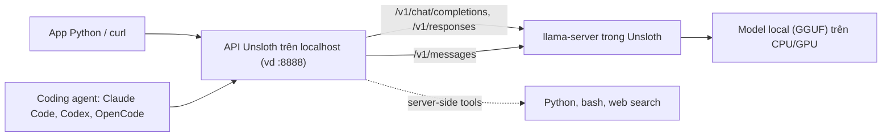

# Inference & API

Phần Inference & API gồm trang này và bảy trang con. Nếu mới bắt đầu, bạn đọc theo thứ tự từ trên xuống:

- **Inference & API** (trang này): inference trong Unsloth là gì, ba cách dùng model.
  1. [Chạy model local trong Studio Chat](/inference/studio-chat): tải model, tính năng Chat, tham số sampling.
  1. [API tương thích OpenAI và Anthropic](/inference/api): endpoint, API key, curl, Python SDK, mở cho máy khác.
  1. [Kết nối coding agent](/inference/coding-agent): `unsloth start` cho Claude Code, Codex, OpenCode; cấu hình thủ công.
  1. [Connections](/inference/connections): nối model server local (llama.cpp, vLLM, Ollama) vào Unsloth; cloud chỉ nói qua.
  1. [MCP](/inference/mcp): cho model gọi công cụ và dịch vụ bên ngoài.
  1. [Tool calling](/inference/tool-calling): Studio, API và vòng lặp tự viết.
  1. [Cạm bẫy thường gặp](/inference/cam-bay): dò lỗi theo triệu chứng.

## Inference trong Unsloth là gì

Inference (suy luận) trong Unsloth là quá trình sử dụng mô hình ngôn ngữ lớn (LLM) đã được huấn luyện hoặc tinh chỉnh (fine-tune) để tạo ra câu trả lời, dự đoán hoặc phản hồi từ một câu lệnh (prompt) đầu vào.

1. **Chat trực tiếp** trong giao diện Unsloth Studio hoặc Unsloth Desktop. Mọi thứ chạy offline 100% trên máy bạn. Studio chạy được trên macOS, Windows, Linux, WSL, kể cả chỉ có CPU. Bạn **không bắt buộc có GPU**.
2. **Gọi qua API**: Unsloth mở model đang nạp thành một endpoint (địa chỉ HTTP nhận request) có xác thực. Endpoint này dùng chung định dạng với OpenAI và Anthropic. Nhờ vậy app Python của bạn, hoặc coding agent (tác tử lập trình như Claude Code, Codex), gọi vào máy bạn thay vì gọi lên cloud.
3. **Connections**: Unsloth làm giao diện chung cho model server bạn tự chạy (llama.cpp, vLLM, Ollama). Nó cũng nối được model cloud (OpenAI, Anthropic, OpenRouter), nhưng tài liệu này chỉ nói qua.

Về bên trong, Studio được xây trên llama.cpp và Hugging Face. Model nạp trong Unsloth, kể cả GGUF, được phục vụ qua `llama-server`.

::: tip Kiến thức nền
Chưa rõ sampling (temperature/top-p/top-k/min-p), chat template, KV cache hay tool calling là gì? Xem [Suy luận & sampling](/kien-thuc-nen/suy-luan-va-sampling).
:::

**Nguồn:** https://unsloth.ai/docs/new/studio/chat, https://unsloth.ai/docs/basics/api
