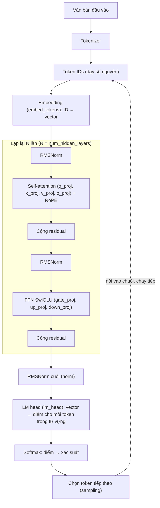

# Kiến trúc Transformer

Trang này đi theo một đoạn văn bản từ lúc vào tokenizer đến lúc LLM đưa ra token tiếp theo. Bạn nên đọc trang này trước khi làm một trong ba việc: chọn `target_modules` cho LoRA, đọc các cờ offload layer của llama.cpp, hoặc đọc trang [Dense & MoE](/kien-thuc-nen/dense-va-moe).

## Bức tranh tổng thể

**Khái niệm.** Một LLM nhận văn bản, biến nó thành số, cho số đi qua nhiều khối giống nhau, rồi đoán token tiếp theo. Hầu hết LLM mà Unsloth hỗ trợ (Llama, Qwen, Gemma, DeepSeek...) là Transformer **decoder-only**. Nghĩa là model chỉ dùng phần decoder và sinh từng token một.

Đường đi cụ thể như sau:

- Văn bản được cắt thành token, rồi mỗi token được đổi thành vector.
- Vector đi qua N **layer** (khối lặp lại) giống nhau.
- Cuối cùng, **LM head** (lớp đầu ra) tính xác suất cho token tiếp theo.

Sơ đồ dưới đây vẽ theo kiểu Llama. Kiểu này đặt RMSNorm trước mỗi khối con (pre-normalization), dùng SwiGLU trong FFN và dùng RoPE để mã hóa vị trí. **[Nguồn ngoài]** https://huggingface.co/docs/transformers/en/model_doc/llama , https://huggingface.co/docs/transformers/en/modular_transformers



**Ví dụ.** Cấu hình mặc định của `LlamaConfig` trong Transformers gần giống Llama-2-7B: `vocab_size = 32000`, `hidden_size = 4096`, `num_hidden_layers = 32`, `num_attention_heads = 32`, `intermediate_size = 11008`, `hidden_act = "silu"`, `rms_norm_eps = 1e-6`. **[Nguồn ngoài]** https://huggingface.co/docs/transformers/en/model_doc/llama

**Ảnh hưởng khi dùng Unsloth.** Tên các lớp trong sơ đồ (`q_proj`, `gate_proj`, `embed_tokens`, `lm_head`...) chính là những chuỗi bạn truyền vào `target_modules` khi gọi `get_peft_model`. Mục "Liên hệ LoRA target modules" ở cuối trang nói chi tiết.

**Gặp ở đâu trong Unsloth.** [/fine-tuning](/fine-tuning/), [LoRA Hyperparameters Guide](https://unsloth.ai/docs/get-started/fine-tuning-llms-guide/lora-hyperparameters-guide).

**Nguồn:** HF Transformers Llama model doc; HF Modular Transformers; HF LLM Course chương 1.6 (https://huggingface.co/learn/llm-course/chapter1/6).

## Embedding

**Khái niệm.** Embedding (nhúng) là bước đổi token ID thành vector để các layer phía sau tính toán được. Tokenizer chỉ cho ra số nguyên. Embedding là một bảng tra: mỗi token ID ứng với một hàng, mỗi hàng là một vector dài `hidden_size`.

Transformer gốc dùng embedding học được. Nó cũng dùng chung ma trận trọng số giữa embedding và lớp tuyến tính ngay trước softmax. **[Nguồn ngoài]** https://arxiv.org/abs/1706.03762

**Ví dụ.** **[Ước tính]** Với `vocab_size = 32000`, `hidden_size = 4096` (mặc định `LlamaConfig`), bảng embedding có `32000 × 4096 ≈ 131 triệu` tham số. Công thức là `số tham số embedding = vocab_size × hidden_size`, vì mỗi token có một vector `hidden_size` chiều (theo mô tả `vocab_size` và `hidden_size` của HF LlamaConfig).

**Ảnh hưởng khi dùng Unsloth.** LoRA thông thường không đụng vào embedding. Ngoại lệ là continued pretraining, tức dạy thêm cho model một ngôn ngữ hoặc một miền kiến thức mới. Trong trường hợp này, docs Unsloth hướng dẫn:

- Thêm `"lm_head"` và `"embed_tokens"` vào `target_modules`.
- Dùng learning rate riêng cho hai ma trận này, nhỏ hơn 2–10 lần (`embedding_learning_rate`).
- Nếu thêm cả hai gây OOM (hết bộ nhớ GPU) trên Colab với Llama-3 8B, chỉ thêm `lm_head`.

Xem [Continued Pretraining](https://unsloth.ai/docs/basics/continued-pretraining).

**Gặp ở đâu trong Unsloth.** [/fine-tuning](/fine-tuning/); khái niệm token: [Token & context](/kien-thuc-nen/token-va-context).

**Nguồn:** arXiv 1706.03762; HF LlamaConfig; Unsloth Continued Pretraining.

## Self-attention: Query, Key, Value

**Khái niệm.** Self-attention (tự chú ý) cho phép mỗi token "nhìn" các token khác trong chuỗi để lấy ngữ cảnh. Từ vector của mỗi token, mô hình tạo ba vector bằng ba phép chiếu tuyến tính:

- **Query (Q)**: "tôi đang tìm thông tin gì?"
- **Key (K)**: "tôi chứa loại thông tin gì?" (để các token khác so khớp)
- **Value (V)**: "nội dung tôi đưa ra nếu được chọn".

Công thức attention trong paper gốc (scaled dot-product attention):

```text
Attention(Q, K, V) = softmax(Q · Kᵀ / √d_k) · V
```

Đọc công thức theo từng bước:

1. Lấy tích vô hướng của Query với từng Key để ra điểm "liên quan".
2. Chia điểm cho `√d_k` (căn bậc hai số chiều của Key). Bước này giữ điểm không quá lớn, vì điểm lớn đẩy softmax vào vùng có gradient rất nhỏ.
3. Cho điểm qua softmax để thành trọng số có tổng bằng 1.
4. Lấy trung bình có trọng số các Value.

**[Nguồn ngoài]** https://arxiv.org/abs/1706.03762

Trong mô hình decoder-only, mỗi token chỉ được nhìn các token đứng trước nó. Cách này gọi là causal attention. **[Nguồn ngoài]** https://huggingface.co/learn/llm-course/chapter1/6

**Ví dụ.** Xét câu "Con mèo ngồi trên thảm vì **nó** mệt". Khi xử lý "nó", Query của "nó" khớp mạnh với Key của "con mèo". Vì vậy Value của "con mèo" đóng góp nhiều vào biểu diễn mới của "nó". **[Nhận định]** (ví dụ minh họa, không lấy từ nguồn).

**Ảnh hưởng khi dùng Unsloth.** Trong code HF, ba phép chiếu Q, K, V có tên `q_proj`, `k_proj`, `v_proj`. Phép chiếu gộp đầu ra có tên `o_proj`. Cả bốn nằm trong `self_attn` của mỗi layer. **[Nguồn ngoài]** https://huggingface.co/docs/transformers/en/modular_transformers. Docs Unsloth xếp bốn module này vào nhóm "Attention" của `target_modules`. Nếu bạn bỏ chúng khỏi `target_modules`, LoRA không chỉnh được cách mô hình chọn ngữ cảnh.

**Gặp ở đâu trong Unsloth.** [/fine-tuning](/fine-tuning/); [LoRA Hyperparameters Guide](https://unsloth.ai/docs/get-started/fine-tuning-llms-guide/lora-hyperparameters-guide).

**Nguồn:** arXiv 1706.03762; HF LLM Course 1.6; HF Modular Transformers; Unsloth LoRA Hyperparameters Guide.

## Multi-head attention

**Khái niệm.** Multi-head attention chạy nhiều phép attention nhỏ song song thay vì một phép lớn. Mỗi phép gọi là một "head" (đầu). Mỗi head có Q, K, V riêng với số chiều nhỏ hơn. Kết quả các head được nối lại rồi chiếu qua `o_proj`.

Lợi ích: mỗi head có thể học một kiểu quan hệ khác nhau, ví dụ ngữ pháp, tham chiếu, vị trí. Paper gốc giải thích rằng một head duy nhất phải lấy trung bình, nên khó chú ý cùng lúc đến nhiều loại thông tin. **[Nguồn ngoài]** https://arxiv.org/abs/1706.03762

**Ví dụ.** Transformer gốc dùng `h = 8` head, mỗi head `d_k = d_v = 512 / 8 = 64` chiều. **[Nguồn ngoài]** https://arxiv.org/abs/1706.03762. **[Ước tính]** Với `LlamaConfig` mặc định: `head_dim = hidden_size / num_attention_heads = 4096 / 32 = 128`. HF ghi `head_dim` mặc định bằng `hidden_size // num_attention_heads`.

**Ảnh hưởng khi dùng Unsloth.** Bạn không chỉnh được số head bằng tham số Unsloth nào. Số head do kiến trúc model quyết định. Số head ảnh hưởng tới kích thước KV cache (xem mục GQA bên dưới).

**Gặp ở đâu trong Unsloth.** Gián tiếp qua KV cache ở [/inference](/inference).

**Nguồn:** arXiv 1706.03762; HF LlamaConfig.

## Grouped-Query Attention (GQA)

**Khái niệm.** GQA là cách giảm bộ nhớ khi sinh văn bản bằng cách cho nhiều head Query dùng chung head Key/Value.

Vấn đề nó giải quyết: khi sinh văn bản, mô hình lưu lại K và V của các token đã xử lý để khỏi tính lại. Phần lưu này gọi là **KV cache** (bộ nhớ đệm Key/Value). KV cache lớn theo số head K/V, nên nhiều head thì tốn nhiều bộ nhớ và băng thông. **GQA** (Grouped-Query Attention) cho nhiều head Query dùng chung một cặp head K/V. Ba kiểu thường gặp:

- MHA (multi-head attention): số head K/V bằng số head Q.
- MQA (multi-query attention): chỉ 1 head K/V. Rất nhanh nhưng có thể giảm chất lượng.
- GQA: số head K/V nằm giữa, nhiều hơn 1 và ít hơn số head Q. Chất lượng gần MHA, tốc độ gần MQA.

**[Nguồn ngoài]** https://arxiv.org/abs/2305.13245 ; HF mô tả tham số `num_key_value_heads` như sau: bằng `num_attention_heads` thì là MHA, bằng 1 là MQA, còn lại là GQA (https://huggingface.co/docs/transformers/en/model_doc/llama).

**Ví dụ.** `MixtralConfig` mặc định có 32 head attention và 8 head K/V. `Qwen3MoeConfig` mặc định có 32 head attention và 4 head K/V. **[Nguồn ngoài]** https://huggingface.co/docs/transformers/en/model_doc/mixtral , https://huggingface.co/docs/transformers/en/model_doc/qwen3_moe. **[Ước tính]** Giữ nguyên `head_dim`, số layer và độ dài context, KV cache của cấu hình 8 head K/V bằng `8 / 32 = 1/4` so với MHA 32 head K/V. Lý do: cache chỉ lưu K và V của các head K/V.

**Ảnh hưởng khi dùng Unsloth.**
- Với GQA, đầu ra của `k_proj` và `v_proj` nhỏ hơn `q_proj`: `num_key_value_heads × head_dim` so với `num_attention_heads × head_dim` (theo code attention trong HF Modular Transformers). Vì vậy adapter LoRA trên `k_proj` và `v_proj` cũng nhỏ hơn. **[Nhận định]**
- Khi chạy suy luận, KV cache là phần bộ nhớ tăng theo độ dài context. Docs Unsloth dùng `--cache-type-k q8_0 --cache-type-v q8_0` để lượng tử hóa KV cache cho đỡ tốn VRAM. Docs cũng cảnh báo: nếu prompt đổi liên tục, KV cache mất hiệu lực và suy luận chậm hơn 90%. Ví dụ là header attribution của Claude Code. Xem [Claude Code](https://unsloth.ai/docs/basics/claude-code).

**Gặp ở đâu trong Unsloth.** [/inference](/inference); tính bộ nhớ: [Tham số & bộ nhớ](/kien-thuc-nen/tham-so-va-bo-nho).

**Nguồn:** arXiv 2305.13245; HF Llama/Mixtral/Qwen3MoE model doc; Unsloth Claude Code guide.

## Positional encoding và RoPE

**Khái niệm.** Positional encoding (mã hóa vị trí) cho model biết token nào đứng trước, token nào đứng sau. Attention tự nó không biết thứ tự token, vì Transformer không có vòng lặp hay tích chập. Vì vậy phải "bơm" thông tin vị trí vào. **[Nguồn ngoài]** https://arxiv.org/abs/1706.03762.

**RoPE** (Rotary Position Embedding, mã hóa vị trí bằng phép xoay) xoay vector Q và K một góc phụ thuộc vị trí. Nhờ vậy, tích Q·K chứa thông tin về khoảng cách tương đối giữa hai token. Mức phụ thuộc giữa hai token giảm dần khi chúng cách xa nhau. **[Nguồn ngoài]** https://arxiv.org/abs/2104.09864. Llama thay embedding vị trí tuyệt đối bằng RoPE để xử lý chuỗi dài tốt hơn. **[Nguồn ngoài]** https://huggingface.co/docs/transformers/en/model_doc/llama

**Ví dụ.** Trong Transformers, RoPE được cấu hình qua `rope_parameters`. Nhóm này gồm `rope_theta` và các tham số scaling tùy chọn để dùng với `max_position_embeddings` dài hơn. Qwen3-30B-A3B hỗ trợ context tới 131K nhờ YaRN, một cách scaling RoPE. **[Nguồn ngoài]** https://huggingface.co/docs/transformers/en/model_doc/qwen3_moe

**Ảnh hưởng khi dùng Unsloth.** RoPE không phải module LoRA. Các notebook fine-tune cũng không có tham số RoPE nào cho bạn chỉnh. Docs Unsloth nhắc RoPE ở hai chỗ:

- README ghi Unsloth có "RoPE & MLP Triton Kernels" mới, đi cùng padding-free + packing. Cả gói này cho tốc độ train nhanh gấp 3 lần và ít hơn 30% VRAM. Con số ghi cho cả gói tính năng, không riêng RoPE.
- Trang Dynamic 3.0 GGUFs ghi Llama 4 Scout đã đổi cấu hình RoPE scaling, và Unsloth đã giúp sửa llama.cpp cho khớp.

Khi config RoPE của file model sai, model vẫn chạy được nhưng chất lượng ở context dài giảm. **[Nhận định]**

**Gặp ở đâu trong Unsloth.** [Unsloth README](https://github.com/unslothai/unsloth); [Dynamic 3.0 GGUFs](https://unsloth.ai/docs/basics/dynamic-3.0-ggufs); context dài: [Token & context](/kien-thuc-nen/token-va-context).

**Nguồn:** arXiv 1706.03762; arXiv 2104.09864; HF Llama/Qwen3MoE model doc; Unsloth README; Unsloth Dynamic 3.0 GGUFs.

## Softmax

**Khái niệm.** Softmax biến một dãy điểm bất kỳ thành xác suất. Cụ thể, nó đổi một dãy số thực thành dãy số trong khoảng `[0, 1]` có tổng bằng 1, tức một phân phối xác suất:

```text
softmax(x_i) = exp(x_i) / Σ_j exp(x_j)
```

**[Nguồn ngoài]** https://docs.pytorch.org/docs/stable/generated/torch.nn.functional.softmax.html

Trong LLM, softmax xuất hiện ở ba chỗ:

- Trong attention: đổi điểm Q·K thành trọng số.
- Ở đầu ra: đổi logits của LM head thành xác suất cho mỗi token. HF gọi logits là "điểm cho mỗi token trong từ vựng trước SoftMax".
- Trong router của MoE.

**Ví dụ.** **[Ước tính]** Logits `[2, 1, 0]` qua softmax cho `exp(2)/(exp(2)+exp(1)+exp(0)) ≈ 7.39 / 11.11 ≈ 0.67`. Tính tương tự, hai giá trị còn lại là `≈ 0.24` và `≈ 0.09`.

**Ảnh hưởng khi dùng Unsloth.** Docs Unsloth khuyến nghị các tham số sampling như `temperature`, `top_p`, `top_k`, `min_p` cho từng model. Các tham số này đều can thiệp vào logits hoặc vào phân phối sau softmax. Chi tiết ở [Suy luận & sampling](/kien-thuc-nen/suy-luan-va-sampling).

**Gặp ở đâu trong Unsloth.** [/inference](/inference).

**Nguồn:** PyTorch `torch.nn.functional.softmax`; HF LlamaForCausalLM (mô tả `logits`).

## Feed-forward (FFN / MLP)

**Khái niệm.** FFN là phần xử lý riêng từng token, đứng sau attention. Attention trộn thông tin giữa các token, còn FFN biến đổi thông tin bên trong từng token.

FFN (còn gọi MLP, mạng truyền thẳng) áp dụng giống nhau cho mọi vị trí, theo ba bước:

1. Phóng vector lên kích thước lớn hơn (`intermediate_size`).
2. Cho qua hàm kích hoạt phi tuyến.
3. Thu vector về lại `hidden_size`.

Công thức trong paper gốc là `FFN(x) = max(0, x·W1 + b1)·W2 + b2`, với `d_model = 512` và lớp giữa `d_ff = 2048`. **[Nguồn ngoài]** https://arxiv.org/abs/1706.03762

**Ví dụ.** `LlamaConfig` mặc định có `hidden_size = 4096`, `intermediate_size = 11008`. **[Nguồn ngoài]** https://huggingface.co/docs/transformers/en/model_doc/llama. Docs Unsloth lấy ví dụ một lớp MLP điển hình `m ≈ 4096, n ≈ 12k`. Full fine-tune lớp này cần ≈ 48M tham số, còn LoRA rank 64 chỉ cần ≈ 1M (≈ 2%). Xem [Faster MoE](https://unsloth.ai/docs/basics/faster-moe).

**Ảnh hưởng khi dùng Unsloth.** Ba module `gate_proj`, `up_proj`, `down_proj` là nhóm "MLP" của `target_modules`. Trong model MoE, FFN được thay bằng nhiều expert; xem [Dense & MoE](/kien-thuc-nen/dense-va-moe).

**Gặp ở đâu trong Unsloth.** [/fine-tuning](/fine-tuning/).

**Nguồn:** arXiv 1706.03762; HF LlamaConfig; Unsloth Faster MoE.

## Hàm kích hoạt: ReLU, GELU, SwiGLU

**Khái niệm.** Hàm kích hoạt (activation function) là phần phi tuyến trong FFN. Thiếu nó, chồng nhiều lớp tuyến tính cũng chỉ tương đương một lớp tuyến tính. Ba hàm bạn sẽ gặp:

- **ReLU**: `ReLU(x) = max(0, x)`. Hàm giữ số dương và cắt số âm về 0. Transformer gốc dùng ReLU. **[Nguồn ngoài]** https://arxiv.org/abs/1706.03762
- **GELU**: `GELU(x) = x · Φ(x)`, với Φ là hàm phân phối tích lũy của phân phối chuẩn. GELU "cân" đầu vào theo độ lớn, thay vì chặn theo dấu như ReLU. PyTorch có bản xấp xỉ `approximate='tanh'`: `0.5 · x · (1 + tanh(√(2/π) · (x + 0.044715 · x³)))`. **[Nguồn ngoài]** https://arxiv.org/abs/1606.08415 , https://docs.pytorch.org/docs/stable/generated/torch.nn.GELU.html
- **SwiGLU**: một biến thể GLU (gated linear unit, đơn vị tuyến tính có cổng). Từ cùng một đầu vào, hai phép chiếu chạy song song. Một nhánh đi qua hàm Swish để làm "cổng". Cổng này nhân từng phần tử với nhánh còn lại, rồi kết quả được chiếu về:

```text
FFN_SwiGLU(x) = (Swish₁(x·W) ⊗ x·V) · W₂
```

SwiGLU có **ba** ma trận trọng số thay vì hai. Để giữ số tham số và lượng tính toán tương đương FFN thường, paper giảm `d_ff` còn 2/3. Trong thí nghiệm của paper, các biến thể GLU cho chất lượng tốt hơn ReLU và GELU. **[Nguồn ngoài]** https://arxiv.org/abs/2002.05202

**Ví dụ.** Llama thay ReLU bằng SwiGLU. `LlamaConfig`, `MixtralConfig`, `Qwen3MoeConfig` đều có `hidden_act = "silu"` mặc định. **[Nguồn ngoài]** https://huggingface.co/docs/transformers/en/model_doc/llama. SiLU chính là Swish với β = 1 (Swish₁ trong công thức trên). **[Nhận định]**

**Ảnh hưởng khi dùng Unsloth.** Ba ma trận của SwiGLU ứng với ba module `gate_proj`, `up_proj`, `down_proj` (xem mục cuối trang). Hàm kích hoạt cố định theo model; Unsloth không có tham số nào để đổi nó.

**Gặp ở đâu trong Unsloth.** [/fine-tuning](/fine-tuning/).

**Nguồn:** arXiv 1706.03762; arXiv 1606.08415; arXiv 2002.05202; PyTorch `torch.nn.GELU`; HF Llama model doc.

## Normalization: LayerNorm và RMSNorm

**Khái niệm.** Normalization (chuẩn hóa) đưa các giá trị trong vector về một thang đo ổn định trước khi vào attention hoặc FFN. Nhờ vậy model train được qua nhiều layer mà giá trị không bùng nổ hay tắt dần. Hai kiểu chính:

- **LayerNorm**: trừ trung bình, chia độ lệch chuẩn, rồi nhân γ và cộng β (hai tham số học được). Thống kê tính trên chính vector đó, không phụ thuộc batch.

  ```text
  y = (x − mean(x)) / √(var(x) + ε) × γ + β
  ```

  **[Nguồn ngoài]** https://arxiv.org/abs/1607.06450 , https://docs.pytorch.org/docs/stable/generated/torch.nn.LayerNorm.html
- **RMSNorm**: bỏ bước trừ trung bình (re-centering). Nó chỉ chia cho căn trung bình bình phương (RMS) rồi nhân γ.

  ```text
  y = x / RMS(x) × γ,   RMS(x) = √(ε + mean(x²))
  ```

  Paper RMSNorm báo chất lượng tương đương LayerNorm, nhưng thời gian chạy giảm 7%–64% tùy model. **[Nguồn ngoài]** https://arxiv.org/abs/1910.07467 , https://docs.pytorch.org/docs/stable/generated/torch.nn.RMSNorm.html

Trong hai công thức, `ε` (epsilon) là số rất nhỏ cộng vào mẫu số để tránh chia cho 0.

**Ví dụ.** Llama dùng pre-normalization, tức chuẩn hóa *trước* mỗi khối con, để train ổn định hơn. Giá trị mặc định là `rms_norm_eps = 1e-6`. Mixtral mặc định `rms_norm_eps = 1e-5`. **[Nguồn ngoài]** https://huggingface.co/docs/transformers/en/model_doc/llama , https://huggingface.co/docs/transformers/en/model_doc/mixtral

**Ảnh hưởng khi dùng Unsloth.** Các lớp norm không nằm trong danh sách `target_modules` mà docs Unsloth khuyến nghị. Docs cũng không đưa tham số nào về norm cho bạn chỉnh.

**Gặp ở đâu trong Unsloth.** Chỉ xuất hiện trong mô tả kiến trúc. Ví dụ, trang [Kimi K3](https://unsloth.ai/docs/models/kimi-k3) ghi vision tower dùng RMSNorm.

**Nguồn:** arXiv 1607.06450; arXiv 1910.07467; PyTorch `torch.nn.LayerNorm`, `torch.nn.RMSNorm`; HF Llama/Mixtral model doc.

## Residual connection

**Khái niệm.** Residual connection (kết nối tắt) cộng đầu vào của một khối vào đầu ra của nó: `đầu ra = x + Khối(x)`. Nhờ vậy, khối chỉ cần học "phần chênh lệch" so với đầu vào, và mạng rất sâu vẫn tối ưu được. Ý tưởng này đến từ ResNet. **[Nguồn ngoài]** https://arxiv.org/abs/1512.03385.

Vị trí đặt norm khác nhau giữa các model:

- Transformer gốc đặt norm sau: `LayerNorm(x + Sublayer(x))`. **[Nguồn ngoài]** https://arxiv.org/abs/1706.03762.
- Llama và các model kiểu Llama đặt norm trước: `x + Sublayer(Norm(x))`. Trong code HF, layer lưu `residual = hidden_states`, chạy norm rồi attention, sau đó tính `hidden_states = residual + hidden_states`. Phần MLP lặp lại tương tự. **[Nguồn ngoài]** https://huggingface.co/docs/transformers/en/modular_transformers

**Ví dụ.** Mỗi layer có 2 lần cộng residual: sau attention và sau FFN. **[Ước tính]** Model 32 layer có 64 lần cộng residual.

**Ảnh hưởng khi dùng Unsloth.** Không có tham số nào để chỉnh. Nhờ residual, adapter LoRA được khởi tạo sao cho lúc đầu gần như không thay đổi đầu ra của mô hình gốc. **[Nhận định]**

**Gặp ở đâu trong Unsloth.** Docs Unsloth không nhắc trực tiếp.

**Nguồn:** arXiv 1512.03385; arXiv 1706.03762; HF Modular Transformers.

## Layer (block) và số layer

**Khái niệm.** Layer là khối lặp lại tạo nên thân của LLM. Một **layer** (còn gọi decoder layer hoặc block) gồm các bước: norm → self-attention → cộng residual → norm → FFN → cộng residual. LLM xếp chồng N layer giống hệt nhau về cấu trúc, chỉ khác trọng số. N được lưu trong config với tên `num_hidden_layers`. Sau layer cuối có thêm một norm (`norm`), rồi đến LM head. **[Nguồn ngoài]** https://huggingface.co/docs/transformers/en/modular_transformers

**Ví dụ.** `LlamaConfig` mặc định có 32 layer. Qwen3-30B-A3B có 48 layer. **[Nguồn ngoài]** https://huggingface.co/docs/transformers/en/model_doc/llama , https://huggingface.co/docs/transformers/en/model_doc/qwen3_moe

**Ảnh hưởng khi dùng Unsloth.**
- LoRA gắn adapter vào **mọi** layer. Vì vậy mỗi module trong `target_modules` được nhân lên theo số layer. **[Nhận định]**
- Khi chạy GGUF bằng llama.cpp theo docs Unsloth, `--n-gpu-layers` quy định số layer đưa lên GPU. Docs dùng `99` để đưa hết lên GPU. Nếu GPU hết bộ nhớ thì giảm số này; nếu chỉ chạy CPU thì bỏ cờ đi.
- Tên tensor trong regex của `-ot` cũng đánh số theo layer. Ví dụ, docs gpt-oss có regex chỉ offload expert từ layer thứ 6 trở đi. Xem [gpt-oss](https://unsloth.ai/docs/models/gpt-oss-how-to-run-and-fine-tune).

**Gặp ở đâu trong Unsloth.** [/inference](/inference); offload expert: [Dense & MoE](/kien-thuc-nen/dense-va-moe).

**Nguồn:** HF Modular Transformers; HF Llama/Qwen3MoE model doc; Unsloth gpt-oss guide.

## Decoder-only

**Khái niệm.** Decoder-only là kiểu model chỉ giữ phần sinh văn bản của Transformer gốc. Transformer gốc có hai phần: encoder hiểu đầu vào và nhìn hai chiều, decoder sinh đầu ra. Model **decoder-only** bỏ encoder. Attention của nó chỉ nhìn các token phía trước. Model sinh văn bản theo kiểu tự hồi quy (auto-regressive): mỗi lần đoán một token tiếp theo, rồi nối token đó vào chuỗi.

Phần lớn LLM hiện đại là decoder-only; HF lấy ví dụ các dòng Llama, Gemma, DeepSeek-V3, SmolLM. Hai kiểu còn lại hợp với việc khác:

- Encoder-only (như BERT): mạnh ở phân loại, trích xuất.
- Encoder-decoder: hợp với dịch, tóm tắt.

**[Nguồn ngoài]** https://huggingface.co/learn/llm-course/chapter1/6 , https://huggingface.co/learn/llm-course/chapter1/4

**Ví dụ.** Mục tiêu train của decoder-only là causal language modeling: dự đoán từ tiếp theo sau khi đọc n từ trước đó. **[Nguồn ngoài]** https://huggingface.co/learn/llm-course/chapter1/4

**Ảnh hưởng khi dùng Unsloth.** Khi fine-tune SFT, loss được tính trên việc dự đoán token kế tiếp. Docs Unsloth khuyên chỉ train trên phần trả lời (training on completions only), tức che phần input khỏi loss. Docs dẫn QLoRA paper rằng cách này tăng độ chính xác. Xem [LoRA Hyperparameters Guide](https://unsloth.ai/docs/get-started/fine-tuning-llms-guide/lora-hyperparameters-guide). Phân loại model chi tiết: [Phân loại mô hình](/kien-thuc-nen/phan-loai-mo-hinh).

**Gặp ở đâu trong Unsloth.** [/fine-tuning](/fine-tuning/), [/model-catalog](/model-catalog).

**Nguồn:** HF LLM Course 1.4 và 1.6; Unsloth LoRA Hyperparameters Guide.

## Liên hệ LoRA target modules

**Khái niệm.** `target_modules` là danh sách tên các lớp tuyến tính (linear) sẽ được gắn adapter LoRA. Mục này nối các khối ở trên với những tên bạn sẽ gõ vào code.

Tên trong `target_modules` là tên module trong code model HF. Mỗi layer có `self_attn.q_proj`, `self_attn.k_proj`, `self_attn.v_proj`, `self_attn.o_proj` và `mlp.gate_proj`, `mlp.up_proj`, `mlp.down_proj`. **[Nguồn ngoài]** https://huggingface.co/docs/transformers/en/modular_transformers. HF cũng mô tả hai tham số bias. `attention_bias` là bias của "các lớp chiếu query, key, value và output" trong self-attention. `mlp_bias` là bias của "`up_proj`, `down_proj` và `gate_proj` trong các lớp MLP". **[Nguồn ngoài]** https://huggingface.co/docs/transformers/en/model_doc/llama

| Module | Thuộc khối | Làm gì |
|---|---|---|
| `q_proj` | Attention | Chiếu hidden state thành Query |
| `k_proj` | Attention | Chiếu thành Key; với GQA, đầu ra nhỏ hơn `q_proj` |
| `v_proj` | Attention | Chiếu thành Value; với GQA, đầu ra nhỏ hơn `q_proj` |
| `o_proj` | Attention | Gộp kết quả các head, chiếu về `hidden_size` |
| `gate_proj` | FFN (SwiGLU) | Nhánh "cổng" đi qua SiLU (ma trận W trong công thức SwiGLU) **[Nhận định]** |
| `up_proj` | FFN (SwiGLU) | Nhánh tuyến tính nhân với cổng (ma trận V) **[Nhận định]** |
| `down_proj` | FFN (SwiGLU) | Chiếu từ `intermediate_size` về `hidden_size` (ma trận W₂) **[Nhận định]** |
| `embed_tokens` | Embedding | Bảng token → vector (chỉ thêm khi continued pretraining) |
| `lm_head` | Đầu ra | Vector → logits cho từ vựng (chỉ thêm khi continued pretraining) |

Cách ghép `gate_proj`, `up_proj`, `down_proj` với W, V, W₂ là suy ra từ tên module và công thức SwiGLU ba ma trận. Trang docs HF đã đọc không ghi thẳng phép ghép này. Code MoE trong docs Unsloth cho thấy `gate` và `up` được tính song song từ cùng một đầu vào (tách đôi đầu ra của `gate_up_proj`). Điều này khớp với hai nhánh của SwiGLU.

**Ví dụ.** Cấu hình docs Unsloth khuyến nghị, gắn LoRA vào tất cả lớp linear chính:

```python
   target_modules = ["q_proj", "k_proj", "v_proj", "o_proj",
                     "gate_proj", "up_proj", "down_proj",],
```

**[Ước tính]** Một module có ma trận `(m, n)` thì có `r × (m + n)` tham số LoRA (công thức `r*(m+n)` trong docs [Faster MoE](https://unsloth.ai/docs/basics/faster-moe)). Với `LlamaConfig` mặc định và `r = 16`:

- `q_proj` (4096 → 4096): `16 × (4096 + 4096) = 131,072`
- `gate_proj` (4096 → 11008): `16 × (4096 + 11008) = 241,664`
- `down_proj` (11008 → 4096): cũng `241,664`

Mỗi layer có đủ 7 module, và tổng này nhân với 32 layer.

**Ảnh hưởng khi dùng Unsloth.**
- Docs Unsloth chia `target_modules` thành hai nhóm: Attention (`q_proj, k_proj, v_proj, o_proj`) và MLP (`gate_proj, up_proj, down_proj`). Docs khuyên gắn **cả hai**. Lý do: nghiên cứu cho thấy phải gắn LoRA vào mọi lớp chính thì chất lượng mới gần full fine-tuning. Bỏ bớt module chỉ tiết kiệm rất ít bộ nhớ mà mất chất lượng. Trong biểu đồ so sánh của docs, "QLoRA-All" (attention + FFN) tốt nhất. Nó hơn "QLoRA-FFN" (chỉ `gate_proj, up_proj, down_proj`) và "QLoRA-Attention" (chỉ `q_proj, k_proj, v_proj, o_proj`).
- Với model MoE, docs Unsloth dùng tên `gate_up_proj` (gate và up gộp chung) cùng `down_proj` cho các expert:

```python
    target_modules = [
        "q_proj", "k_proj", "v_proj", "o_proj",
        "gate_up_proj", "down_proj", # LoRA on MoE layers!
    ],
```

  Router của MoE không được fine-tune, vì Unsloth tắt việc này mặc định. Xem [Dense & MoE](/kien-thuc-nen/dense-va-moe).
- Continued pretraining: thêm `"lm_head", "embed_tokens"` như ở mục Embedding.
- Cách chọn `r`, `lora_alpha` và lý do LoRA tiết kiệm bộ nhớ: [LoRA & QLoRA](/kien-thuc-nen/lora-va-qlora).

**Gặp ở đâu trong Unsloth.** [/fine-tuning](/fine-tuning/hyperparameter) (bảng tham số `target_modules`), [/cai-dat](/cai-dat) (code mẫu), [LoRA Hyperparameters Guide](https://unsloth.ai/docs/get-started/fine-tuning-llms-guide/lora-hyperparameters-guide), [Faster MoE](https://unsloth.ai/docs/basics/faster-moe), [Continued Pretraining](https://unsloth.ai/docs/basics/continued-pretraining).

**Nguồn:** Unsloth LoRA Hyperparameters Guide; Unsloth Faster MoE; Unsloth Continued Pretraining; HF Modular Transformers; HF Llama model doc; arXiv 2002.05202.

## Gặp ở đâu trong Unsloth

| Khái niệm | Trang Unsloth trên website | Docs gốc |
|---|---|---|
| Embedding (`embed_tokens`), LM head (`lm_head`) | [/fine-tuning](/fine-tuning/) | [Continued Pretraining](https://unsloth.ai/docs/basics/continued-pretraining) |
| Self-attention, `q_proj`/`k_proj`/`v_proj`/`o_proj` | [/fine-tuning](/fine-tuning/), [/cai-dat](/cai-dat) | [LoRA Hyperparameters Guide](https://unsloth.ai/docs/get-started/fine-tuning-llms-guide/lora-hyperparameters-guide) |
| GQA, KV cache | [/inference](/inference) | [Claude Code](https://unsloth.ai/docs/basics/claude-code) |
| RoPE | [/inference](/inference) | [Dynamic 3.0 GGUFs](https://unsloth.ai/docs/basics/dynamic-3.0-ggufs) |
| Softmax, sampling | [/inference](/inference) | [Qwen3.5](https://unsloth.ai/docs/models/qwen3.5) |
| FFN/MLP, SwiGLU, `gate_proj`/`up_proj`/`down_proj` | [/fine-tuning](/fine-tuning/) | [LoRA Hyperparameters Guide](https://unsloth.ai/docs/get-started/fine-tuning-llms-guide/lora-hyperparameters-guide), [Faster MoE](https://unsloth.ai/docs/basics/faster-moe) |
| Layer, `--n-gpu-layers`, `-ot` | [/inference](/inference) | [gpt-oss](https://unsloth.ai/docs/models/gpt-oss-how-to-run-and-fine-tune) |
| Decoder-only, train trên completions | [/fine-tuning](/fine-tuning/), [/model-catalog](/model-catalog) | [LoRA Hyperparameters Guide](https://unsloth.ai/docs/get-started/fine-tuning-llms-guide/lora-hyperparameters-guide) |
