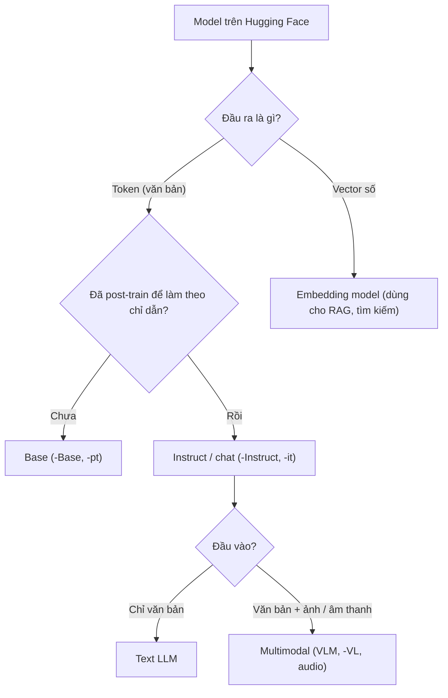

# Phân loại mô hình

Trang này giúp bạn nhìn tên một model trên Hugging Face và biết nó thuộc loại nào. Có bốn câu hỏi cần trả lời:

- Model lớn hay nhỏ?
- Đã được dạy làm theo chỉ dẫn hay chưa?
- Có nhận ảnh hoặc âm thanh không?
- Sinh ra văn bản hay trả về vector?

Nên đọc trang này trước khi chọn model trong [Model catalog](/model-catalog) hoặc bắt đầu [Fine-tuning](/fine-tuning).



## LLM và SLM

**Khái niệm.** "Lớn" hay "nhỏ" chỉ là cách gọi tương đối; không có ranh giới chính thức.

- **LLM** (Large Language Model, mô hình ngôn ngữ lớn) là tên gọi chung cho các transformer language model được huấn luyện trên lượng dữ liệu lớn, thường có rất nhiều tham số. Glossary của Hugging Face lấy ví dụ GPT-3 với 175 tỷ tham số, nhưng **không đặt ngưỡng**. **[Nguồn ngoài]** https://huggingface.co/docs/transformers/glossary
- **SLM** (Small Language Model, mô hình ngôn ngữ nhỏ) là cách gọi các model ít tham số hơn.

Các nguồn đã duyệt (docs Unsloth, HF LLM Course, Transformers glossary) **không có ngưỡng chính thức** về số tham số để tách LLM và SLM. Vì vậy trang này không tự đặt ngưỡng.

**Ví dụ.** Docs Unsloth dùng chữ "nhỏ" theo nghĩa tương đối, tùy ngữ cảnh:
- Fine-tuning guide khuyên người mới bắt đầu với "một instruct model nhỏ như Llama 3.1 (8B)".
- Họ Qwen3.5 có "Small series": 0.8B, 2B, 4B, 9B.
- Gemma 4 E4B được mô tả là "model nhỏ cho laptop".

**Ảnh hưởng khi dùng Unsloth.** Đừng dựa vào nhãn LLM hay SLM. Hãy nhìn số tham số (với MoE thì nhìn thêm số tham số kích hoạt), vì con số này quyết định bạn cần bao nhiêu VRAM. Docs chỉ tới bảng VRAM theo số tham số trong trang Unsloth Requirements. Xem thêm [Tham số & bộ nhớ](/kien-thuc-nen/tham-so-va-bo-nho) và [Dense & MoE](/kien-thuc-nen/dense-va-moe).

**Gặp ở đâu trong Unsloth.** [Model catalog](/model-catalog), [Cài đặt](/cai-dat), [Fine-tuning — Chọn model](/fine-tuning).

**Nguồn:** https://huggingface.co/docs/transformers/glossary, https://unsloth.ai/docs/get-started/fine-tuning-llms-guide, https://unsloth.ai/docs/models/qwen3.5, https://unsloth.ai/docs/models/gemma-4, https://unsloth.ai/docs/get-started/fine-tuning-llms-guide/what-model-should-i-use

## Base và instruct / chat

**Khái niệm.** Cùng một model thường có hai bản: bản base chỉ biết viết tiếp văn bản, và bản instruct đã được dạy thêm để trả lời theo yêu cầu.

- **Base model** (model nền) là bản chỉ mới pre-train. Nó học đoán token tiếp theo trên kho văn bản khổng lồ, nhưng chưa được dạy trả lời theo chỉ dẫn. Base model "viết tiếp" văn bản chứ không "trả lời" câu hỏi.
- **Instruct / chat model** là base model đã qua post-training (huấn luyện sau), ví dụ fine-tune trên dữ liệu hội thoại, để làm theo chỉ dẫn và chat. Theo docs Unsloth, instruct model dùng ngay được mà không cần fine-tune. Nó làm việc với chat template dạng hội thoại (ChatML, ShareGPT).

Docs Transformers mô tả cùng quy trình: pre-train trên kho văn bản lớn tạo ra "base" model, rồi fine-tune cho chat trên dữ liệu dạng chuỗi tin nhắn. **[Nguồn ngoài]** https://huggingface.co/docs/transformers/chat_templating

**Ví dụ.** Hai model card chính thức của Qwen:

| Model | Training Stage (theo model card) | Context |
|---|---|---|
| `Qwen/Qwen3-8B-Base` | Pretraining | 32.768 |
| `Qwen/Qwen3-8B` | Pretraining & Post-training | 32.768 gốc, 131.072 với YaRN |

Lưu ý: bản không có hậu tố (`Qwen3-8B`) mới là bản đã post-train. Model card của nó ghi bản này được xây từ `Qwen3-8B-Base`. **[Nguồn ngoài]** https://huggingface.co/Qwen/Qwen3-8B-Base, https://huggingface.co/Qwen/Qwen3-8B

**Ảnh hưởng khi dùng Unsloth.** Docs Unsloth đưa ra các lời khuyên sau:
- **Bắt đầu với instruct model.** Instruct model fine-tune trực tiếp bằng chat template hội thoại được, và cần ít dữ liệu hơn base model. Base model hợp với template kiểu instruction (Alpaca, Vicuna) và thường **không** hỗ trợ sẵn chat template hội thoại.
- **Chọn theo lượng dữ liệu:**

| Số dòng dữ liệu | Khuyến nghị của docs Unsloth |
|---|---|
| Trên 1.000 dòng | Thường nên fine-tune **base** |
| 300–1.000 dòng chất lượng cao | Base hoặc instruct đều được |
| Dưới 300 dòng | Thường chọn **instruct**, giữ được khả năng làm theo chỉ dẫn sẵn có |

- **Nếu được, thử cả hai.** Fine-tune cả base lẫn instruct rồi so sánh đầu ra.
- **Continued pretraining** (dạy ngôn ngữ hoặc lĩnh vực mới bằng văn bản thô) được docs mô tả trên base model, như Llama-3 8B, Mistral 7B.

::: warning Docs chưa thống nhất
Hai chỗ trong docs Unsloth nghiêng về hai hướng khác nhau:
- "We recommend starting with **Instruct models**... require less data" — https://unsloth.ai/docs/get-started/fine-tuning-llms-guide và https://unsloth.ai/docs/get-started/fine-tuning-llms-guide/what-model-should-i-use
- "1,000+ Rows of Data: ... generally best to fine-tune the base model" — https://unsloth.ai/docs/get-started/fine-tuning-llms-guide/what-model-should-i-use

Hai câu không hẳn mâu thuẫn: một câu nói về điểm bắt đầu, câu kia dựa vào lượng dữ liệu. Nhưng docs không nói nên ưu tiên câu nào khi bạn là người mới **và** có trên 1.000 dòng.
:::

**Gặp ở đâu trong Unsloth.** [Fine-tuning — Chọn model để fine-tune](/fine-tuning), [Dữ liệu — Chat template](/du-lieu), [Model catalog](/model-catalog). Chi tiết về pre-train và post-train: [Quá trình huấn luyện](/kien-thuc-nen/qua-trinh-huan-luyen).

**Nguồn:** https://unsloth.ai/docs/get-started/fine-tuning-llms-guide/what-model-should-i-use, https://unsloth.ai/docs/get-started/fine-tuning-llms-guide, https://unsloth.ai/docs/basics/continued-pretraining, https://huggingface.co/docs/transformers/chat_templating, https://huggingface.co/Qwen/Qwen3-8B-Base, https://huggingface.co/Qwen/Qwen3-8B

## Text và multimodal

**Khái niệm.** Model text chỉ nhận và sinh văn bản. Model multimodal (đa phương thức) nhận thêm loại đầu vào khác như ảnh hoặc âm thanh **[Nguồn ngoài]** https://huggingface.co/docs/transformers/glossary.

- **VLM** (Vision Language Model, mô hình ngôn ngữ thị giác) là loại nhận ảnh + chữ và sinh ra chữ.
- Transformer thị giác cắt ảnh thành các mảnh (patch) rồi đưa vào model như một chuỗi. Vì vậy ảnh cũng chiếm token trong context **[Nguồn ngoài]** https://huggingface.co/docs/transformers/glossary. Xem [Token & context](/kien-thuc-nen/token-va-context).

**Ví dụ.**
- **Vision:** Qwen3-VL xử lý được ảnh, video, OCR, và có cả bản instruct lẫn bản thinking. Model card Gemma 3 ghi họ model này nhận văn bản + ảnh và sinh văn bản. Mỗi ảnh được chuẩn hóa về 896 × 896 và mã hóa thành 256 token **[Nguồn ngoài]** https://huggingface.co/google/gemma-3-4b-it.
- **Audio đầu vào:** Gemma 4 E2B, E4B và 12B nhận văn bản, ảnh và âm thanh. Bản 26B-A4B và 31B chỉ nhận văn bản + ảnh. Âm thanh dài tối đa 30 giây. E2B được gợi ý cho ASR (nhận dạng giọng nói) và dịch giọng nói.
- **Audio đầu ra (TTS) và STT:** Unsloth hỗ trợ fine-tune hai nhóm model giọng nói:
  - TTS (text-to-speech, chuyển chữ thành giọng nói): Orpheus-TTS (3B), Sesame-CSM (1B), Spark-TTS (0.5B), Llasa-TTS (1B), Oute-TTS (1B);
  - STT (speech-to-text, chuyển giọng nói thành chữ): Whisper Large V3.

  Theo docs, Orpheus là model giọng nói dựa trên Llama. Nó sinh thẳng **audio token**, rồi giải mã các token này thành sóng âm.

**Ảnh hưởng khi dùng Unsloth.**
- **Lớp dùng để nạp:** model vision dùng `FastVisionModel` và `UnslothVisionDataCollator` thay cho `FastLanguageModel`. Bạn có thể chọn chỉ fine-tune phần vision hoặc chỉ phần ngôn ngữ (`finetune_vision_layers`, `finetune_language_layers`); mặc định bật cả hai.
- **Dataset vision:** mỗi tin nhắn chứa cả `{"type": "text", ...}` và `{"type": "image", ...}`. Docs khuyên dùng ảnh cùng kích thước, trong khoảng 300–1000px, để train không quá lâu và không quá tốn tài nguyên.
- **Chọn model theo dữ liệu:** docs "What model should I use" ghi: train trên ảnh thì chọn vision model (ví dụ Llama 3.2 Vision); dataset code thì chọn model chuyên code (ví dụ Qwen Coder 2.5).

**Gặp ở đâu trong Unsloth.** [Fine-tuning — Vision fine-tuning](/fine-tuning), [Dữ liệu — Vision](/du-lieu), [Model catalog — Qwen3-VL, Gemma 4](/model-catalog).

**Nguồn:** https://huggingface.co/docs/transformers/glossary, https://unsloth.ai/docs/basics/vision-fine-tuning, https://unsloth.ai/docs/models/tutorials/qwen3-how-to-run-and-fine-tune/qwen3-vl-how-to-run-and-fine-tune, https://unsloth.ai/docs/models/gemma-4, https://unsloth.ai/docs/basics/text-to-speech-tts-fine-tuning, https://unsloth.ai/docs/get-started/fine-tuning-llms-guide/what-model-should-i-use, https://huggingface.co/google/gemma-3-4b-it

## Embedding model khác LLM sinh văn bản thế nào

**Khái niệm.** LLM sinh văn bản trả về chữ. Embedding model trả về một dãy số thể hiện nghĩa của đoạn văn. Cụ thể:

- **LLM sinh văn bản** thường là decoder model (còn gọi là autoregressive). Nó đọc từ trái sang phải và đoán token tiếp theo. Đầu ra là **token**, lặp lại cho tới khi đủ câu trả lời. Ví dụ: họ Llama, Gemma, DeepSeek-V3. **[Nguồn ngoài]** https://huggingface.co/learn/llm-course/chapter1/6
- **Encoder model** (còn gọi là autoencoding) nhìn toàn bộ câu cùng lúc, rồi biến đầu vào thành một biểu diễn số cô đọng gọi là **embedding**. Loại này thường được pre-train bằng masked language modeling: che một số token rồi đoán lại. Ví dụ: BERT, ModernBERT. **[Nguồn ngoài]** https://huggingface.co/docs/transformers/glossary, https://huggingface.co/learn/llm-course/chapter1/6
- **Embedding model** trả về một **vector** (dãy số) đại diện cho nghĩa của cả câu hoặc đoạn văn. Hai đoạn gần nghĩa có vector gần nhau. Nhờ vậy embedding model được dùng để tìm kiếm ngữ nghĩa, RAG, phân cụm.

Điểm phân biệt cốt lõi là **đầu ra** (vector hay token), không phải kiến trúc. Nhiều embedding model là encoder-only, nhưng không phải tất cả. Ví dụ Qwen3-Embedding được xây từ model nền dense của họ Qwen3, và lấy vector từ trạng thái ẩn của **token cuối** (last token pooling). **[Nguồn ngoài]** https://huggingface.co/Qwen/Qwen3-Embedding-0.6B

**Ví dụ.** Qwen3-Embedding-0.6B có 0.6B tham số, context 32K, vector tối đa 1024 chiều (người dùng chọn được từ 32 đến 1024) **[Nguồn ngoài]** https://huggingface.co/Qwen/Qwen3-Embedding-0.6B.

Docs Unsloth đưa một ví dụ về việc "giống nhau" tùy vào bài toán. Hai tiêu đề "Google launches Pixel 10" và "Qwen releases Qwen3" có thể được coi là giống nhau nếu bạn chỉ phân loại theo chủ đề "Tech". Nhưng nếu làm tìm kiếm ngữ nghĩa, hai tiêu đề này không giống nhau. Fine-tune embedding giúp model học đúng kiểu "giống nhau" mà bài toán của bạn cần.

**Ảnh hưởng khi dùng Unsloth.**
- **Lớp dùng để nạp:** embedding dùng lớp `FastSentenceTransformer` (dựa trên SentenceTransformers), không dùng `FastLanguageModel`. Khi load để chạy, **bắt buộc** truyền `for_inference=True`:

```python
model = FastSentenceTransformer.from_pretrained(
    "sentence-transformers/all-MiniLM-L6-v2",
    for_inference=True,
)
```

- **Model được hỗ trợ tốt nhất:** các `SentenceTransformer` encoder-only có file `modules.json`. Model không có file này chỉ được hỗ trợ hạn chế, vì Unsloth tự gán pooling mặc định. Nếu bạn dùng head hoặc pooling tùy biến, cần kiểm tra lại vector đầu ra.
- **Dùng lại kết quả:** model đã train dùng được với transformers, LangChain, sentence-transformers, TEI, vLLM, llama.cpp, pgvector, FAISS và các framework RAG.
- Không thể dùng embedding model để chat, và cũng không nên dùng LLM chat để sinh vector cho RAG khi đã có embedding model chuyên dụng. **[Nhận định]**

**Gặp ở đâu trong Unsloth.** [Ứng dụng RAG — Fine-tune embedding tiếng Việt](/ung-dung-rag), docs gốc https://unsloth.ai/docs/basics/embedding-finetuning.

**Nguồn:** https://huggingface.co/learn/llm-course/chapter1/6, https://huggingface.co/docs/transformers/glossary, https://huggingface.co/Qwen/Qwen3-Embedding-0.6B, https://unsloth.ai/docs/basics/embedding-finetuning

## Cách đọc hậu tố tên model

**Khái niệm.** Tên một model trên Hugging Face cho bạn biết ai đăng nó, nó thuộc họ nào, lớn cỡ nào và ở dạng nào.

**Ai đăng model: hãng phát hành hay Unsloth?** Trong các ví dụ ở trang này, tên repo có dạng "tài khoản/tên model". Phần trước dấu `/` là tài khoản đã đăng repo đó lên Hugging Face:

- `Qwen/Qwen3-8B-Base`, `google/gemma-3-4b-it`: repo do chính hãng làm ra model đăng (Qwen, Google). Model card chính thức nằm ở đây.
- `unsloth/gemma-3-4b-it-GGUF`, `unsloth/llama-3.1-8b-unsloth-bnb-4bit`, `unsloth/gemma-3-270m-it`: bản do Unsloth upload. Bảng bên dưới cho thấy các bản này có thể ở dạng GGUF, dạng 4-bit, hoặc là bản gốc 16-bit, 8-bit. Bản gốc do Unsloth upload đôi khi có sửa chat template hoặc tokenizer.

**[Nhận định]** Vì vậy cùng một model (ví dụ Gemma 3 4B instruct) có thể xuất hiện dưới cả tài khoản của hãng lẫn tài khoản `unsloth/`. Model vẫn là của hãng phát hành; bản `unsloth/` là bản đăng lại đã đổi định dạng hoặc đã sửa lỗi. Unsloth nạp model theo tên trên Hugging Face, nên code và catalog của Unsloth thường trỏ tới các repo `unsloth/`.

**Phần tên sau dấu `/`** thường ghép từ: họ model + phiên bản + kích thước + hậu tố. Hậu tố cho biết giai đoạn huấn luyện, khả năng hoặc định dạng. **Không có chuẩn chung giữa các hãng.** Ví dụ, cùng là bản đã post-train, nhưng Qwen3 không có hậu tố (`Qwen3-8B`), Gemma dùng `-it`, còn Qwen2.5-VL dùng `-Instruct`. Luôn đọc model card để chắc chắn.

**Ví dụ.** Bảng dưới chỉ ghi các hậu tố có nguồn:

| Hậu tố | Ý nghĩa | Ví dụ | Nguồn |
|---|---|---|---|
| `-Base` | Chỉ mới pre-train | `Qwen/Qwen3-8B-Base` ("Training Stage: Pretraining") | [Nguồn ngoài] model card Qwen |
| `-pt` / `-it` | Model card Gemma 3 ghi có hai loại trọng số: pre-trained và instruction-tuned; **[Nhận định]** `pt` ứng với pre-trained, `it` ứng với instruction-tuned | `google/gemma-3-4b-pt`, `google/gemma-3-4b-it` | [Nguồn ngoài] model card Gemma 3 |
| `-Instruct` | Bản instruct | `Qwen2.5-VL-7B-Instruct`, `Ministral-3-8B-Instruct-2512` | Catalog Unsloth |
| `-Thinking` / `-Reasoning` | Bản suy luận; Qwen3-VL có bản Instruct và Thinking với tham số khuyến nghị khác nhau | `Qwen3-VL-8B-Thinking`, `Ministral-3-8B-Reasoning-2512` | Docs Qwen3-VL, catalog Unsloth |
| `-VL` | Model vision (Qwen3-VL: vision, video, OCR) | `Qwen3-VL-8B-Instruct` | Docs Qwen3-VL |
| `-Embedding` | Text embedding model | `Qwen/Qwen3-Embedding-0.6B` | [Nguồn ngoài] model card Qwen |
| `-A3B`, `-A4B`… | Số tham số kích hoạt của model MoE (Gemma 4 26B-A4B: 4B active) | `gemma-4-26B-A4B-it` | Docs Gemma 4; xem [Dense & MoE](/kien-thuc-nen/dense-va-moe) |
| `-GGUF` | Bản GGUF để chạy bằng llama.cpp, Unsloth Studio/Desktop | `unsloth/gemma-3-4b-it-GGUF` | Catalog Unsloth |
| `-unsloth-bnb-4bit` | Unsloth Dynamic 4-bit quant: tốn VRAM hơn một chút so với BitsAndBytes 4-bit thường nhưng chính xác hơn đáng kể | `unsloth/llama-3.1-8b-unsloth-bnb-4bit` | Fine-tuning guide Unsloth |
| `-bnb-4bit` (không có "unsloth") | BitsAndBytes 4-bit tiêu chuẩn | `unsloth/gemma-2-9b-it-bnb-4bit` | Fine-tuning guide Unsloth |
| Không có hậu tố định dạng | Bản gốc 16-bit hoặc 8-bit; bản upload của Unsloth đôi khi có sửa chat template, tokenizer | `unsloth/gemma-3-270m-it` | Fine-tuning guide Unsloth |

**Ảnh hưởng khi dùng Unsloth.**
- **Chọn đúng định dạng cho việc cần làm.** Catalog Unsloth ghi: dùng **GGUF** để chạy trong Unsloth Desktop, llama.cpp; dùng **Instruct (4-bit)** safetensors để chạy hoặc fine-tune qua Unsloth. Đừng đưa repo `-GGUF` vào `FastLanguageModel` để fine-tune. **[Nhận định]** suy ra từ cách catalog tách hai cột này.
- **Đổi model.** Bạn chỉ cần đổi `model_name` cho khớp tên repo trên Hugging Face, ví dụ `unsloth/llama-3.1-8b-unsloth-bnb-4bit`.
- **Tiền tố chưa rõ nghĩa.** Docs Unsloth dùng `E2B`/`E4B` của Gemma 4 (kèm ghi chú "Dense + PLE") nhưng không giải thích chữ "E" nghĩa là gì. Điều này **cần kiểm tra lại** trong model card chính thức của Google.

**Gặp ở đâu trong Unsloth.** [Model catalog — Cách đọc bảng](/model-catalog), [Fine-tuning](/fine-tuning), [Export & deploy](/export-deploy). Chi tiết về 4-bit và GGUF: [Độ chính xác & lượng tử hóa](/kien-thuc-nen/do-chinh-xac-va-luong-tu-hoa).

**Nguồn:** https://unsloth.ai/docs/get-started/unsloth-model-catalog, https://unsloth.ai/docs/get-started/fine-tuning-llms-guide, https://unsloth.ai/docs/models/tutorials/qwen3-how-to-run-and-fine-tune/qwen3-vl-how-to-run-and-fine-tune, https://unsloth.ai/docs/models/gemma-4, https://huggingface.co/Qwen/Qwen3-8B-Base, https://huggingface.co/Qwen/Qwen3-8B, https://huggingface.co/google/gemma-3-4b-pt, https://huggingface.co/google/gemma-3-4b-it, https://huggingface.co/Qwen/Qwen3-Embedding-0.6B

## Gặp ở đâu trong Unsloth

Bảng này gom lại các khái niệm trên trang, kèm trang Unsloth trên website và docs gốc nơi khái niệm đó xuất hiện.

| Khái niệm | Trang Unsloth trên website | Docs gốc |
|---|---|---|
| LLM / SLM, kích thước model | [Model catalog](/model-catalog), [Cài đặt](/cai-dat) | https://unsloth.ai/docs/get-started/fine-tuning-llms-guide/what-model-should-i-use |
| Base và instruct | [Fine-tuning](/fine-tuning), [Dữ liệu](/du-lieu) | https://unsloth.ai/docs/get-started/fine-tuning-llms-guide/what-model-should-i-use |
| Multimodal: vision / VLM | [Fine-tuning](/fine-tuning), [Dữ liệu](/du-lieu) | https://unsloth.ai/docs/basics/vision-fine-tuning |
| Multimodal: audio, TTS/STT | [Model catalog](/model-catalog) | https://unsloth.ai/docs/basics/text-to-speech-tts-fine-tuning, https://unsloth.ai/docs/models/gemma-4 |
| Embedding model | [Ứng dụng RAG](/ung-dung-rag) | https://unsloth.ai/docs/basics/embedding-finetuning |
| Hậu tố tên model | [Model catalog](/model-catalog), [Export & deploy](/export-deploy) | https://unsloth.ai/docs/get-started/unsloth-model-catalog, https://unsloth.ai/docs/get-started/fine-tuning-llms-guide |
