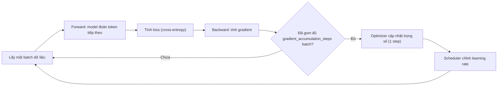
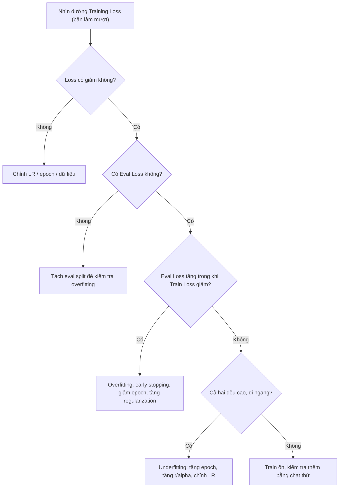

# Quá trình huấn luyện

Trang này giải thích những gì diễn ra khi bấm **Start Training** trong Unsloth Studio hoặc gọi `trainer.train()`: model học bằng cách nào, các tham số như `learning_rate`, `gradient_accumulation_steps`, `warmup_steps` điều khiển phần nào, và cách đọc biểu đồ loss. Nên đọc trước khi chỉnh hyperparameter trong [Fine-tuning](/fine-tuning).

## Vòng lặp huấn luyện một bước

**Khái niệm.** Mỗi bước huấn luyện gồm bốn việc lặp lại: (1) **forward pass** (lượt tính xuôi) — model đoán đầu ra; (2) tính **loss** (độ sai) so với đáp án; (3) **backward pass** (lượt tính ngược) — tính gradient cho từng tham số; (4) **optimizer** (bộ tối ưu) cập nhật tham số theo gradient, rồi xóa gradient cũ để bắt đầu bước mới. Các mục bên dưới giải thích từng khâu. **[Nguồn ngoài]** https://docs.pytorch.org/tutorials/beginner/basics/optimization_tutorial.html

Nhánh "đã gom đủ" là cách gradient accumulation hoạt động (xem mục "Epoch, step, batch size, gradient accumulation" bên dưới). Thứ tự "cập nhật trọng số rồi mới gọi scheduler" theo docs PyTorch. **[Nguồn ngoài]** https://docs.pytorch.org/docs/stable/optim.html

**Nguồn:** https://docs.pytorch.org/tutorials/beginner/basics/optimization_tutorial.html, https://docs.pytorch.org/docs/stable/optim.html

## Pretraining, fine-tuning và continued pretraining

**Khái niệm.**
- **Pretraining** (huấn luyện trước): train model từ đầu, trọng số khởi tạo ngẫu nhiên, dùng lượng dữ liệu khổng lồ, có thể kéo dài nhiều tuần. **[Nguồn ngoài]** https://huggingface.co/learn/llm-course/chapter1/4
- **Fine-tuning** (tinh chỉnh): train thêm một model *đã* pretrain, bằng dataset riêng cho tác vụ; cần ít dữ liệu, thời gian và chi phí hơn nhiều vì kiến thức sẵn có được "chuyển giao" (transfer learning). **[Nguồn ngoài]** https://huggingface.co/learn/llm-course/chapter1/4. Dạng phổ biến nhất là **SFT** (Supervised Fine-Tuning — tinh chỉnh có giám sát): train trên cặp đầu vào/đầu ra. **[Nguồn ngoài]** https://huggingface.co/docs/trl/sft_trainer
- **Continued pretraining** (CPT — pretrain tiếp): theo docs Unsloth, là cách "lái" model sang miền kiến thức mới hoặc ngôn ngữ mà model gốc học chưa tốt (luật, y khoa, một ngôn ngữ khác), thường bằng văn bản thô thay vì cặp hỏi–đáp.

**Ví dụ.** Llama-3 được pretrain trên khoảng 15 nghìn tỷ token (theo docs Unsloth). Fine-tune để model trả lời theo giọng thương hiệu chỉ cần một dataset hỏi–đáp nhỏ; dạy model một ngôn ngữ mới thì dùng notebook continued pretraining.

**Ảnh hưởng khi dùng Unsloth.**
- Docs Unsloth nói pretraining và full fine-tuning tốn tài nguyên hơn nhiều và thường không cần; nên thử LoRA/QLoRA trước (xem [LoRA và QLoRA](/kien-thuc-nen/lora-va-qlora)).
- Với CPT, docs thêm `lm_head` và `embed_tokens` vào `target_modules` và dùng learning rate riêng cho chúng nhỏ hơn 2–10 lần (`embedding_learning_rate = 5e-6` bên cạnh `learning_rate = 5e-5`). Colab có thể hết bộ nhớ với Llama-3 8B; khi đó docs khuyên chỉ thêm `lm_head`.

**Gặp ở đâu trong Unsloth.** [Fine-tuning](/fine-tuning) (mục Continued pretraining); docs gốc [Continued Pretraining](https://unsloth.ai/docs/basics/continued-pretraining), [Fine-tuning LLMs Guide](https://unsloth.ai/docs/get-started/fine-tuning-llms-guide).

**Nguồn:** https://unsloth.ai/docs/basics/continued-pretraining, https://unsloth.ai/docs/get-started/fine-tuning-llms-guide, https://unsloth.ai/docs/get-started/fine-tuning-for-beginners/faq-+-is-fine-tuning-right-for-me, https://huggingface.co/learn/llm-course/chapter1/4, https://huggingface.co/docs/trl/sft_trainer

## Loss và cross-entropy

**Khái niệm.** **Loss** (hàm mất mát) là một con số đo mức sai của model so với đáp án; huấn luyện là tìm cách làm con số này nhỏ đi. **[Nguồn ngoài]** https://docs.pytorch.org/tutorials/beginner/basics/optimization_tutorial.html

Với LLM, loss dùng trong SFT là **cross-entropy theo từng token**: ở mỗi vị trí, model đưa ra xác suất cho mọi token trong từ vựng; loss của vị trí đó là "âm log của xác suất model gán cho token đúng", rồi lấy trung bình trên các token được tính. Model càng tự tin vào token đúng thì loss càng gần 0; đoán sai với độ tự tin cao thì loss lớn. Token padding (và phần bị che) được bỏ qua bằng nhãn `-100`. **[Nguồn ngoài]** https://huggingface.co/docs/trl/sft_trainer, https://docs.pytorch.org/docs/stable/generated/torch.nn.CrossEntropyLoss.html

**Ví dụ.** **[Ước tính]** theo công thức `loss của một token = −ln(xác suất gán cho token đúng)`:
- Xác suất 0.9 → loss ≈ 0.105; xác suất 0.5 → ≈ 0.693; xác suất 0.1 → ≈ 2.303.
- Đảo lại: loss trung bình 1.0 ứng với xác suất "trung bình nhân" khoảng `e^−1 ≈ 0.37`; 0.5 → ≈ 0.61; 0.2 → ≈ 0.82. Nghĩa là loss 0.2 cho thấy model đoán lại dữ liệu train gần như thuộc lòng.

**Ảnh hưởng khi dùng Unsloth.**
- Con số "Loss" trên Studio (4 chữ số thập phân) và log `loss` khi chạy `trainer.train()` chính là training loss này.
- `train_on_responses_only` (hoặc "Train on Completions" trong Studio) che phần câu hỏi của người dùng, chỉ tính loss trên câu trả lời của assistant. Docs Unsloth dẫn QLoRA paper: cách này tăng độ chính xác, nhất là với hội thoại nhiều lượt. Vì mẫu số khác nhau, loss khi bật và khi tắt tùy chọn này không so trực tiếp được với nhau **[Nhận định]**.
- Ngưỡng loss "tốt" docs ghi không thống nhất — xem mục "Overfitting và underfitting" bên dưới.

**Gặp ở đâu trong Unsloth.** [Fine-tuning](/fine-tuning) (mục Đánh giá và tránh overfitting), [Dữ liệu](/du-lieu); docs gốc [LoRA Hyperparameters Guide](https://unsloth.ai/docs/get-started/fine-tuning-llms-guide/lora-hyperparameters-guide). Khái niệm token: [Token & context](/kien-thuc-nen/token-va-context).

**Nguồn:** https://huggingface.co/docs/trl/sft_trainer, https://docs.pytorch.org/docs/stable/generated/torch.nn.CrossEntropyLoss.html, https://docs.pytorch.org/tutorials/beginner/basics/optimization_tutorial.html, https://unsloth.ai/docs/get-started/fine-tuning-llms-guide/lora-hyperparameters-guide, https://unsloth.ai/docs/new/studio/start

## Gradient và backpropagation

**Khái niệm.** **Gradient** (đạo hàm của loss theo từng tham số) cho biết: nếu nhích tham số này lên một chút thì loss tăng hay giảm, và mạnh cỡ nào. **Backpropagation** (lan truyền ngược) là thuật toán tính gradient cho mọi tham số bằng cách đi ngược từ loss về đầu vào. Sau đó optimizer dịch mỗi tham số theo hướng làm loss giảm. **[Nguồn ngoài]** https://docs.pytorch.org/tutorials/beginner/blitz/autograd_tutorial.html

**Ví dụ.** Trong PyTorch: `loss.backward()` tính gradient và lưu vào `.grad` của từng tham số; `optimizer.step()` cập nhật tham số; `optimizer.zero_grad()` xóa gradient trước bước sau. **[Nguồn ngoài]** https://docs.pytorch.org/tutorials/beginner/basics/optimization_tutorial.html

**Ảnh hưởng khi dùng Unsloth.**
- Studio hiển thị **Grad Norm** (độ lớn tổng của gradient) cạnh Loss và LR, có biểu đồ riêng. TRL định nghĩa `grad_norm` là chuẩn L2 của gradient, đo trước khi cắt gradient (gradient clipping). **[Nguồn ngoài]** https://huggingface.co/docs/trl/sft_trainer
- Backward cần giữ lại các activation (giá trị trung gian) từ forward, nên tốn nhiều bộ nhớ. Unsloth giảm phần này bằng `use_gradient_checkpointing = "unsloth"` — xem [LoRA và QLoRA](/kien-thuc-nen/lora-va-qlora).
- Với LoRA, gradient và optimizer state chỉ cần lưu cho ma trận adapter, không phải cho toàn bộ trọng số gốc (theo trang [Faster MoE](https://unsloth.ai/docs/basics/faster-moe) của docs Unsloth).

**Gặp ở đâu trong Unsloth.** [Fine-tuning](/fine-tuning) (bảng các bước trong Studio: Loss, LR, Grad Norm); docs gốc [Get started with Unsloth Studio](https://unsloth.ai/docs/new/studio/start).

**Nguồn:** https://docs.pytorch.org/tutorials/beginner/blitz/autograd_tutorial.html, https://docs.pytorch.org/tutorials/beginner/basics/optimization_tutorial.html, https://huggingface.co/docs/trl/sft_trainer, https://unsloth.ai/docs/new/studio/start, https://unsloth.ai/docs/basics/faster-moe

## Optimizer: SGD, Adam, AdamW và 8-bit

**Khái niệm.**
- **SGD** (Stochastic Gradient Descent): cập nhật đơn giản nhất — lấy tham số trừ đi `learning_rate × gradient`, có thể thêm momentum (quán tính). Mặc định trong PyTorch: momentum 0, weight decay 0. **[Nguồn ngoài]** https://docs.pytorch.org/docs/stable/generated/torch.optim.SGD.html
- **Adam**: mỗi tham số có "learning rate thích nghi" riêng, dựa trên ước lượng trung bình trượt của gradient và của bình phương gradient (moment bậc 1 và bậc 2). Vì vậy Adam phải lưu thêm hai con số cho **mỗi** tham số được train — gọi là **optimizer state** (trạng thái bộ tối ưu). **[Nguồn ngoài]** https://arxiv.org/abs/1412.6980, https://arxiv.org/abs/2110.02861
- **AdamW**: Adam với **weight decay tách rời** (decoupled). Với SGD, L2 regularization và weight decay là một; với Adam thì không. AdamW áp weight decay trực tiếp lên trọng số thay vì trộn vào gradient, giúp model tổng quát hóa tốt hơn. PyTorch `AdamW` mặc định `weight_decay = 0.01`. **[Nguồn ngoài]** https://arxiv.org/abs/1711.05101, https://docs.pytorch.org/docs/stable/generated/torch.optim.AdamW.html
- **Optimizer 8-bit**: lưu optimizer state ở 8-bit thay vì 32-bit (lượng tử hóa theo khối), giữ hiệu năng gần như bản 32-bit với lượng bộ nhớ nhỏ hơn nhiều. **[Nguồn ngoài]** https://arxiv.org/abs/2110.02861

**Ví dụ.** **[Ước tính]** Adam/AdamW lưu 2 giá trị cho mỗi tham số train được. Giả sử adapter có 40 triệu tham số train được:
- State 32-bit: `40 triệu × 2 × 4 byte = 320 MB`.
- State 8-bit: `40 triệu × 2 × 1 byte = 80 MB`.
Với full fine-tuning model 8B, riêng state 32-bit đã là `8 tỷ × 2 × 4 byte = 64 GB` — một lý do LoRA tiết kiệm bộ nhớ (xem [Tham số & bộ nhớ](/kien-thuc-nen/tham-so-va-bo-nho)).

**Ảnh hưởng khi dùng Unsloth.**
- Studio mặc định Optimizer = **AdamW 8-bit**; code Core trong docs cài đặt đặt `optim = "adamw_8bit"`.
- Bộ tham số mặc định của `SFTConfig` (TRL) khi không có Unsloth là `optim = "adamw_torch_fused"`, `learning_rate = 2e-5`, `weight_decay = 0.0`. Tự viết `SFTConfig` mà không đặt các giá trị này thì kết quả sẽ khác notebook Unsloth. **[Nguồn ngoài]** https://huggingface.co/docs/trl/sft_trainer
- Khi load lại một LoRA adapter để train tiếp, docs Unsloth ghi optimizer state bị reset; muốn giữ optimizer state thì resume từ checkpoint (mục "Checkpoint" cuối trang).

**Gặp ở đâu trong Unsloth.** [Cài đặt](/cai-dat) (code mẫu `optim = "adamw_8bit"`), [Fine-tuning](/fine-tuning); docs gốc [Google Colab install](https://unsloth.ai/docs/get-started/install/google-colab), [Get started with Unsloth Studio](https://unsloth.ai/docs/new/studio/start).

**Nguồn:** https://arxiv.org/abs/1412.6980, https://arxiv.org/abs/1711.05101, https://arxiv.org/abs/2110.02861, https://docs.pytorch.org/docs/stable/generated/torch.optim.SGD.html, https://docs.pytorch.org/docs/stable/generated/torch.optim.AdamW.html, https://huggingface.co/docs/trl/sft_trainer, https://unsloth.ai/docs/new/studio/start, https://unsloth.ai/docs/get-started/install/google-colab, https://unsloth.ai/docs/basics/continued-pretraining

## Learning rate

**Khái niệm.** **Learning rate** (tốc độ học, LR) quyết định mỗi bước tham số được dịch đi bao xa theo hướng gradient. LR nhỏ học chậm; LR lớn có thể làm quá trình train hành xử khó lường. **[Nguồn ngoài]** https://docs.pytorch.org/tutorials/beginner/basics/optimization_tutorial.html

**Ví dụ.** `2e-4` = 0.0002. Docs Unsloth gợi ý thử lần lượt `2e-4`, `1e-4`, `5e-5`, `2e-5` nếu muốn train chậm mà chính xác hơn.

**Ảnh hưởng khi dùng Unsloth.**
- Khuyến nghị: **`2e-4`** làm điểm xuất phát cho LoRA/QLoRA; **`5e-6`** cho RL (DPO, GRPO...); full fine-tuning dùng LR thấp hơn. Khoảng thường gặp `2e-4` đến `5e-6`. Studio mặc định `2e-4`.
- LR quá cao: hội tụ nhanh lúc đầu nhưng dễ bất ổn, dễ overfit trong run ngắn. LR thấp: ổn định hơn nhưng cần nhiều epoch hơn; docs lưu ý LR thấp cũng có thể dẫn tới overfitting hoặc khiến model không học được.
- TRL ghi chú: train adapter thường dùng LR cao hơn (khoảng `1e-4`) vì chỉ học các tham số mới. **[Nguồn ngoài]** https://huggingface.co/docs/trl/sft_trainer

**Gặp ở đâu trong Unsloth.** [Fine-tuning](/fine-tuning) (bảng Hyperparameter khuyến nghị), [Reinforcement learning](/reinforcement-learning); docs gốc [LoRA Hyperparameters Guide](https://unsloth.ai/docs/get-started/fine-tuning-llms-guide/lora-hyperparameters-guide).

**Nguồn:** https://unsloth.ai/docs/get-started/fine-tuning-llms-guide/lora-hyperparameters-guide, https://unsloth.ai/docs/get-started/fine-tuning-llms-guide/tutorial-how-to-finetune-llama-3-and-use-in-ollama, https://unsloth.ai/docs/new/studio/start, https://docs.pytorch.org/tutorials/beginner/basics/optimization_tutorial.html, https://huggingface.co/docs/trl/sft_trainer

## LR scheduler và warmup

**Khái niệm.**
- **LR scheduler** (lịch learning rate) thay đổi LR theo tiến trình train thay vì giữ cố định. **[Nguồn ngoài]** https://docs.pytorch.org/docs/stable/optim.html
- **Warmup** (khởi động): trong vài bước đầu, LR tăng tuyến tính từ 0 lên giá trị đã đặt.
- **`linear`**: sau warmup, LR giảm đều (tuyến tính) về 0 ở bước cuối.
- **`cosine`**: sau warmup, LR giảm theo nửa đường cosin về 0 — giảm chậm lúc đầu, nhanh ở giữa, chậm lại ở cuối.
**[Nguồn ngoài]** https://huggingface.co/docs/transformers/main_classes/optimizer_schedules (mục `get_linear_schedule_with_warmup`, `get_cosine_schedule_with_warmup`)

**Ví dụ.** **[Ước tính]** Dataset 1.000 mẫu, effective batch 8, 3 epoch → khoảng `1000 / 8 × 3 = 375` step. Warmup 5–10% tổng số step là khoảng 19–38 step. Với `learning_rate = 2e-4` và `linear`: LR đi từ 0 lên `2e-4` trong phần warmup, rồi giảm đều về 0 ở step 375.

**Ảnh hưởng khi dùng Unsloth.**
- Docs Unsloth khuyên scheduler `linear` hoặc `cosine`; Studio mặc định `linear`. Mặc định của Transformers/TRL cũng là `linear`. **[Nguồn ngoài]** https://huggingface.co/docs/transformers/main_classes/optimizer_schedules
- Biểu đồ **Learning Rate** trong Studio vẽ đúng đường lịch LR này; nếu thấy LR không tăng lúc đầu hay không giảm về cuối thì kiểm tra lại warmup/scheduler **[Nhận định]**.
- Scheduler cần biết tổng số step để tính đường giảm, nên đổi `max_steps`/`num_train_epochs` cũng làm đổi hình dạng lịch LR **[Nhận định]** (TRL ghi tổng số step là bắt buộc để cấu hình LR scheduler khi dataset dạng streaming: https://huggingface.co/docs/trl/sft_trainer).

::: warning Docs chưa thống nhất
Warmup được ghi theo hai đơn vị khác nhau (số step cố định và % tổng số step):

| Tham số | Nguồn A | Nguồn B | Nguồn C |
| --- | --- | --- | --- |
| Warmup | 5–10% tổng số step — [LoRA Hyperparameters Guide](https://unsloth.ai/docs/get-started/fine-tuning-llms-guide/lora-hyperparameters-guide) | Warmup Steps = `5` — [Unsloth Studio](https://unsloth.ai/docs/new/studio/start) | `warmup_steps = 10` — code mẫu [Google Colab install](https://unsloth.ai/docs/get-started/install/google-colab), [Windows install](https://unsloth.ai/docs/get-started/install/windows-installation) |
:::

**Gặp ở đâu trong Unsloth.** [Fine-tuning](/fine-tuning) (bảng So sánh mặc định: Studio vs Core); docs gốc [LoRA Hyperparameters Guide](https://unsloth.ai/docs/get-started/fine-tuning-llms-guide/lora-hyperparameters-guide), [Get started with Unsloth Studio](https://unsloth.ai/docs/new/studio/start).

**Nguồn:** https://huggingface.co/docs/transformers/main_classes/optimizer_schedules, https://docs.pytorch.org/docs/stable/optim.html, https://huggingface.co/docs/trl/sft_trainer, https://unsloth.ai/docs/get-started/fine-tuning-llms-guide/lora-hyperparameters-guide, https://unsloth.ai/docs/new/studio/start, https://unsloth.ai/docs/get-started/install/google-colab, https://unsloth.ai/docs/get-started/install/windows-installation

## Epoch, step, batch size, gradient accumulation

**Khái niệm.**
- **Epoch**: một lượt model đi qua toàn bộ dataset.
- **Batch size** (`per_device_train_batch_size`): số mẫu xử lý trong một lượt forward/backward trên một GPU. **[Nguồn ngoài]** https://docs.pytorch.org/tutorials/beginner/basics/optimization_tutorial.html
- **Gradient accumulation** (`gradient_accumulation_steps`): chạy nhiều batch nhỏ (micro-batch), cộng dồn gradient, rồi mới cập nhật trọng số một lần. Cách này giả lập batch lớn mà không tốn thêm VRAM.
- **Step** (bước): một lần optimizer cập nhật trọng số. TRL ghi `global_step` là tổng số bước optimizer đã chạy. **[Nguồn ngoài]** https://huggingface.co/docs/trl/sft_trainer
- **Effective batch size** (batch hiệu dụng): số mẫu thật sự góp vào mỗi lần cập nhật, `effective batch = batch_size × gradient_accumulation_steps`.

**Ví dụ.**
- Tutorial Unsloth: `per_device_train_batch_size = 2`, `gradient_accumulation_steps = 4` → effective batch `2 × 4 = 8`.
- **[Ước tính]** Với effective batch 8, dataset 1.000 mẫu cần khoảng `1000 / 8 = 125` step cho một epoch. `max_steps = 60` trong tutorial chỉ cho model xem `60 × 8 = 480` mẫu — chưa hết nửa epoch; vì vậy docs gọi đó là chạy thử và khuyên đổi sang `num_train_epochs = 1` khi chạy thật.
- Muốn effective batch 32, docs liệt kê các cách tương đương: `32×1`, `16×2`, `8×4`, `4×8`, `2×16`, `1×32` — giống nhau về cập nhật trọng số nhưng khác xa về VRAM.

**Ảnh hưởng khi dùng Unsloth.**
- Batch size là **yếu tố chính quyết định VRAM**; gradient accumulation là **yếu tố chính quyết định thời gian train**. Để tránh OOM (hết bộ nhớ), docs khuyên đặt batch size nhỏ rồi tăng gradient accumulation.
- Effective batch lớn thường cho quá trình train mượt, ổn định hơn; nhỏ thì nhiều nhiễu hơn. Tăng batch size cũng có thể làm train chậm hơn do padding (phần đệm cho các chuỗi dài bằng nhau).
- Unsloth đã sửa lỗi gradient accumulation, nên trong Unsloth hai cách (batch lớn và accumulation nhiều) cho kết quả tương đương.
- Studio hiển thị **Epoch** dạng số lẻ (ví dụ `Epoch 1.23`) và thanh tiến độ theo step. **Max Steps** = `0` nghĩa là dùng số Epochs.
- Docs khuyên 1–3 epoch; quá 3 epoch với dataset instruction ít lợi thêm và tăng nguy cơ overfitting.

::: warning Docs chưa thống nhất

| Tham số | Nguồn A | Nguồn B | Nguồn C |
| --- | --- | --- | --- |
| Batch size | `4` — [Unsloth Studio](https://unsloth.ai/docs/new/studio/start) | `2` — [Tutorial Llama-3 + Ollama](https://unsloth.ai/docs/get-started/fine-tuning-llms-guide/tutorial-how-to-finetune-llama-3-and-use-in-ollama), [Fine-tuning LLMs Guide](https://unsloth.ai/docs/get-started/fine-tuning-llms-guide) | `2` — [LoRA Hyperparameters Guide](https://unsloth.ai/docs/get-started/fine-tuning-llms-guide/lora-hyperparameters-guide) |
| Gradient accumulation | `8` — [Unsloth Studio](https://unsloth.ai/docs/new/studio/start) | `4` — [Tutorial Llama-3 + Ollama](https://unsloth.ai/docs/get-started/fine-tuning-llms-guide/tutorial-how-to-finetune-llama-3-and-use-in-ollama), [Fine-tuning LLMs Guide](https://unsloth.ai/docs/get-started/fine-tuning-llms-guide) | `8` — [LoRA Hyperparameters Guide](https://unsloth.ai/docs/get-started/fine-tuning-llms-guide/lora-hyperparameters-guide) |
| Effective batch (tính ra) | `4 × 8 = 32` | `2 × 4 = 8` | `2 × 8 = 16` (khuyến nghị 4–16) |
| Epochs / steps | Epochs `3`, Max Steps `0` — [Unsloth Studio](https://unsloth.ai/docs/new/studio/start) | `max_steps = 60` (chạy thử), `num_train_epochs = 1` (chạy thật) — [Tutorial Llama-3 + Ollama](https://unsloth.ai/docs/get-started/fine-tuning-llms-guide/tutorial-how-to-finetune-llama-3-and-use-in-ollama), [Fine-tuning LLMs Guide](https://unsloth.ai/docs/get-started/fine-tuning-llms-guide) | 1–3 epoch — [LoRA Hyperparameters Guide](https://unsloth.ai/docs/get-started/fine-tuning-llms-guide/lora-hyperparameters-guide) |

Effective batch của Studio (32) nằm ngoài khoảng 4–16 mà LoRA Hyperparameters Guide khuyến nghị.
:::

**Gặp ở đâu trong Unsloth.** [Fine-tuning](/fine-tuning) (Hyperparameter khuyến nghị, So sánh mặc định), [Cài đặt](/cai-dat) (code mẫu); docs gốc [LoRA Hyperparameters Guide](https://unsloth.ai/docs/get-started/fine-tuning-llms-guide/lora-hyperparameters-guide).

**Nguồn:** https://unsloth.ai/docs/get-started/fine-tuning-llms-guide/lora-hyperparameters-guide, https://unsloth.ai/docs/get-started/fine-tuning-llms-guide/tutorial-how-to-finetune-llama-3-and-use-in-ollama, https://unsloth.ai/docs/get-started/fine-tuning-llms-guide, https://unsloth.ai/docs/new/studio/start, https://docs.pytorch.org/tutorials/beginner/basics/optimization_tutorial.html, https://huggingface.co/docs/trl/sft_trainer

## Weight decay

**Khái niệm.** **Weight decay** (suy giảm trọng số) là một dạng **regularization** (điều chuẩn): mỗi bước kéo nhẹ trọng số về gần 0, "phạt" trọng số quá lớn để model bớt học thuộc và tổng quát hóa tốt hơn. Trong AdamW, phần kéo này được áp trực tiếp lên trọng số, tách khỏi gradient. **[Nguồn ngoài]** https://arxiv.org/abs/1711.05101, https://docs.pytorch.org/docs/stable/generated/torch.optim.AdamW.html

**Ví dụ.** `weight_decay = 0.01` với AdamW: mỗi bước trọng số bị trừ thêm một lượng `learning_rate × 0.01 × trọng số`. **[Nguồn ngoài]** công thức cập nhật trong https://docs.pytorch.org/docs/stable/generated/torch.optim.AdamW.html

**Ảnh hưởng khi dùng Unsloth.** Docs khuyên `0.01` (khoảng `0.01`–`0.1`) và cảnh báo đừng dùng số quá lớn. Studio mặc định `0.01`. Khi nghi overfitting, docs gợi ý tăng `weight_decay` (bắt đầu từ `0.01` hoặc `0.1`).

**Gặp ở đâu trong Unsloth.** [Fine-tuning](/fine-tuning); docs gốc [LoRA Hyperparameters Guide](https://unsloth.ai/docs/get-started/fine-tuning-llms-guide/lora-hyperparameters-guide).

**Nguồn:** https://unsloth.ai/docs/get-started/fine-tuning-llms-guide/lora-hyperparameters-guide, https://unsloth.ai/docs/new/studio/start, https://arxiv.org/abs/1711.05101, https://docs.pytorch.org/docs/stable/generated/torch.optim.AdamW.html

## Overfitting và underfitting

**Khái niệm.**
- **Overfitting** (quá khớp): model học thuộc dữ liệu train, kể cả nhiễu, nên trả lời kém với câu hỏi mới.
- **Underfitting** (chưa khớp): model chưa nắm được quy luật trong dữ liệu, trả lời quá chung chung — thường do train chưa đủ lâu hoặc adapter quá nhỏ.

**Ví dụ.** Fine-tune chatbot hỗ trợ khách hàng 5 epoch trên 200 hội thoại: training loss xuống rất thấp, model lặp lại gần nguyên văn câu trả lời mẫu nhưng lúng túng khi khách hỏi khác đi — dấu hiệu overfitting **[Nhận định]**.

**Ảnh hưởng khi dùng Unsloth.** Cách xử lý theo LoRA Hyperparameters Guide:

| Vấn đề | Việc có thể làm (theo docs Unsloth) |
| --- | --- |
| Overfitting | Chỉnh learning rate (LR cao dễ overfit trong run ngắn); giảm epoch (dừng sau 1, 2 hoặc 3); tăng `weight_decay` (`0.01` hoặc `0.1`); tăng `lora_dropout` (ví dụ `0.1`); tăng batch size hoặc gradient accumulation; mở rộng dataset bằng dataset mở chất lượng cao; early stopping theo eval loss; giảm alpha của LoRA sau khi train (ví dụ nhân 0.5); weight averaging (cộng model gốc với bản fine-tune rồi chia 2) |
| Underfitting | Chỉnh learning rate (tăng nếu run ngắn, thử giảm nếu run dài); tăng epoch (theo dõi validation loss); tăng rank `r` và alpha; dùng dữ liệu sát tác vụ hơn; giảm batch size về 1 để model cập nhật mạnh hơn |

::: warning Docs chưa thống nhất

| Tham số | Nguồn A | Nguồn B |
| --- | --- | --- |
| Ngưỡng training loss | "around 0.5 to 1.0 is a good sign"; loss về 0 có thể là overfitting — [Fine-tuning LLMs Guide](https://unsloth.ai/docs/get-started/fine-tuning-llms-guide), [Tutorial Llama-3 + Ollama](https://unsloth.ai/docs/get-started/fine-tuning-llms-guide/tutorial-how-to-finetune-llama-3-and-use-in-ollama) | Loss xuống dưới 0.2 thì "likely overfitting" — [LoRA Hyperparameters Guide](https://unsloth.ai/docs/get-started/fine-tuning-llms-guide/lora-hyperparameters-guide) |

Cả hai trang đều nói ngưỡng phụ thuộc dataset/tác vụ và khuyên kiểm tra thêm bằng validation (eval) loss.
:::

**Gặp ở đâu trong Unsloth.** [Fine-tuning](/fine-tuning) (mục Đánh giá và tránh overfitting); docs gốc [LoRA Hyperparameters Guide](https://unsloth.ai/docs/get-started/fine-tuning-llms-guide/lora-hyperparameters-guide). Các núm `r`, `lora_alpha`, `lora_dropout`: [LoRA và QLoRA](/kien-thuc-nen/lora-va-qlora).

**Nguồn:** https://unsloth.ai/docs/get-started/fine-tuning-llms-guide/lora-hyperparameters-guide, https://unsloth.ai/docs/get-started/fine-tuning-llms-guide, https://unsloth.ai/docs/get-started/fine-tuning-llms-guide/tutorial-how-to-finetune-llama-3-and-use-in-ollama

## Train loss và eval loss

**Khái niệm.**
- **Train loss**: loss trên chính dữ liệu model đang học.
- **Eval loss** (validation loss): loss trên một phần dữ liệu tách riêng, model không dùng để cập nhật trọng số. Đây là thước đo gần với "trả lời câu hỏi mới" hơn. Lượt đánh giá không tính gradient. **[Nguồn ngoài]** https://docs.pytorch.org/tutorials/beginner/basics/optimization_tutorial.html
- Dấu hiệu overfitting điển hình: train loss tiếp tục giảm trong khi eval loss đi ngang hoặc tăng. **[Nguồn ngoài]** https://huggingface.co/learn/llm-course/chapter3/5

**Ví dụ.** Tách 20% dataset làm tập test (theo gợi ý của docs Unsloth). Eval mỗi 10 step; nếu `eval_loss` không giảm sau 3 lần liên tiếp thì dừng (early stopping) và nạp lại checkpoint tốt nhất.

**Ảnh hưởng khi dùng Unsloth.**
- Studio: chọn **Eval split** thì mới có biểu đồ **Eval Loss**; đặt eval steps mà không chọn eval split sẽ báo lỗi. Eval Steps mặc định `0`.
- Core: early stopping cần `eval_strategy = "steps"`, `load_best_model_at_end = True`, `metric_for_best_model = "eval_loss"`, `greater_is_better = False` và `EarlyStoppingCallback(early_stopping_patience = 3, ...)` (code đầy đủ ở [Fine-tuning](/fine-tuning)).
- Eval có thể chậm với dataset lớn; docs gợi ý giảm kích thước tập eval hoặc giãn số step giữa các lần eval.

::: warning Docs chưa thống nhất

| Tham số | Nguồn A | Nguồn B | Nguồn C |
| --- | --- | --- | --- |
| Tên tham số số step giữa các lần eval | `evaluation_steps = 100` — [Fine-tuning LLMs Guide](https://unsloth.ai/docs/get-started/fine-tuning-llms-guide) | `eval_steps = 10` (kèm `eval_strategy = "steps"`) — [Finetuning from Last Checkpoint](https://unsloth.ai/docs/basics/finetuning-from-last-checkpoint) | "Eval Steps", mặc định `0` — [Unsloth Studio](https://unsloth.ai/docs/new/studio/start) |

`SFTConfig` của TRL hiện có tham số `eval_steps` (https://huggingface.co/docs/trl/sft_trainer); không thấy `evaluation_steps` trong danh sách tham số đó — cần kiểm tra lại với phiên bản bạn dùng.
:::

**Gặp ở đâu trong Unsloth.** [Fine-tuning](/fine-tuning) (Đánh giá và tránh overfitting); docs gốc [Finetuning from Last Checkpoint](https://unsloth.ai/docs/basics/finetuning-from-last-checkpoint) (mục Early Stopping), [Fine-tuning LLMs Guide](https://unsloth.ai/docs/get-started/fine-tuning-llms-guide).

**Nguồn:** https://unsloth.ai/docs/get-started/fine-tuning-llms-guide, https://unsloth.ai/docs/basics/finetuning-from-last-checkpoint, https://unsloth.ai/docs/new/studio/start, https://huggingface.co/learn/llm-course/chapter3/5, https://docs.pytorch.org/tutorials/beginner/basics/optimization_tutorial.html, https://huggingface.co/docs/trl/sft_trainer

## Đọc biểu đồ loss

**Khái niệm.** Biểu đồ loss theo step là công cụ chẩn đoán nhanh nhất khi train. Studio vẽ bốn biểu đồ: **Training Loss** (giá trị thô, đường làm mượt EMA và đường trung bình), **Learning Rate**, **Gradient Norm**, **Eval Loss** (khi có eval split). Mặc định làm mượt EMA là `0.6`; có thể chuyển thang log hoặc cắt giá trị ngoại lai (p99/p95).

**Ví dụ.** Bảng dưới mô tả các hình dạng đường loss thường gặp. Cột "Nguồn" cho biết dòng nào có nguồn; dòng không có nguồn là diễn giải của người viết.

| Hình dạng đường loss | Ý nghĩa có thể | Việc cần làm | Nguồn |
| --- | --- | --- | --- |
| Giảm nhanh lúc đầu rồi thoải dần; train và eval sát nhau | Train lành mạnh | Giữ cấu hình, theo dõi tiếp | [Nguồn ngoài] https://huggingface.co/learn/llm-course/chapter3/5 |
| Train loss giảm tiếp, eval loss đi ngang hoặc bắt đầu tăng | Overfitting | Early stopping; giảm epoch; tăng `weight_decay`/`lora_dropout`; các cách khác ở mục Overfitting | HF LLM Course chương 3.5 + [LoRA Hyperparameters Guide](https://unsloth.ai/docs/get-started/fine-tuning-llms-guide/lora-hyperparameters-guide) |
| Train loss tụt về gần 0 | Có thể overfitting (học thuộc) | Kiểm tra eval loss; giảm epoch/LR | [Fine-tuning LLMs Guide](https://unsloth.ai/docs/get-started/fine-tuning-llms-guide) |
| Cả train và eval đều cao, đi ngang sớm | Underfitting | Tăng epoch, tăng `r`/alpha, chỉnh LR, dùng dữ liệu sát tác vụ | HF LLM Course chương 3.5 + [LoRA Hyperparameters Guide](https://unsloth.ai/docs/get-started/fine-tuning-llms-guide/lora-hyperparameters-guide) |
| Loss không giảm | Cấu hình chưa phù hợp | Chỉnh hyperparameter (LR, epoch...) | [Fine-tuning LLMs Guide](https://unsloth.ai/docs/get-started/fine-tuning-llms-guide) |
| Dao động mạnh, răng cưa dày | LR quá cao hoặc batch quá nhỏ | Giảm LR, tăng effective batch (tăng gradient accumulation) | [Nguồn ngoài] https://huggingface.co/learn/llm-course/chapter3/5; tutorial Unsloth: tăng `gradient_accumulation_steps` cho đường loss mượt hơn |
| Loss vọt lên đột ngột, hoặc thành `NaN` | Train mất ổn định (LR quá cao, dữ liệu lỗi) | Giảm LR, kiểm tra dữ liệu quanh step đó, resume từ checkpoint trước đó | [Nhận định] |
| Loss tụt "bậc thang" đúng lúc sang epoch mới | Model bắt đầu nhớ các mẫu đã thấy ở epoch trước | Theo dõi eval loss; cân nhắc giảm số epoch | [Nhận định] |
| Loss tăng nhẹ trong vài step đầu rồi mới giảm | Đang trong giai đoạn warmup, LR còn thay đổi | Thường không cần làm gì; đối chiếu với biểu đồ Learning Rate | [Nhận định] |

**Ảnh hưởng khi dùng Unsloth.**
- Loss thô từng step luôn nhấp nhô vì mỗi batch khác nhau; nên đọc đường EMA làm mượt để thấy xu hướng **[Nhận định]**.
- Đường loss nhiều nhiễu thì trước hết thử tăng `gradient_accumulation_steps` (theo tutorial Unsloth), trước khi đổi LR.
- Loss thấp chưa chắc model tốt: docs Unsloth khuyên kiểm tra bằng eval loss và chat thử với model.

**Gặp ở đâu trong Unsloth.** [Fine-tuning](/fine-tuning) (bước Train trong Studio); docs gốc [Get started with Unsloth Studio](https://unsloth.ai/docs/new/studio/start) (mục Charts).

**Nguồn:** https://unsloth.ai/docs/new/studio/start, https://unsloth.ai/docs/get-started/fine-tuning-llms-guide, https://unsloth.ai/docs/get-started/fine-tuning-llms-guide/lora-hyperparameters-guide, https://unsloth.ai/docs/get-started/fine-tuning-llms-guide/tutorial-how-to-finetune-llama-3-and-use-in-ollama, https://huggingface.co/learn/llm-course/chapter3/5

## Checkpoint

**Khái niệm.** **Checkpoint** là bản lưu tiến trình train giữa chừng, để tạm dừng rồi train tiếp, hoặc để chọn lại phiên bản tốt nhất. Khi resume từ checkpoint của `Trainer`, trạng thái model, optimizer và scheduler đều được nạp lại. **[Nguồn ngoài]** https://huggingface.co/docs/trl/sft_trainer (tham số `resume_from_checkpoint`)

Không nhầm với **gradient checkpointing** — kỹ thuật tiết kiệm bộ nhớ khi train, xem [LoRA và QLoRA](/kien-thuc-nen/lora-va-qlora).

**Ví dụ.** Docs Unsloth: đặt `save_strategy = "steps"`, `save_steps = 50`, `output_dir = "outputs"` để lưu checkpoint mỗi 50 step; sau đó `trainer.train(resume_from_checkpoint = True)` sẽ train tiếp từ checkpoint mới nhất. `save_total_limit = 3` chỉ giữ 3 checkpoint gần nhất để đỡ tốn ổ đĩa.

**Ảnh hưởng khi dùng Unsloth.**
- Không bật lưu checkpoint thì train bị ngắt (Colab mất kết nối, OOM) là mất hết tiến trình **[Nhận định]**.
- Load lại LoRA adapter đã lưu bằng `FastLanguageModel.from_pretrained(model_name = "LORA_MODEL_NAME", ...)` thì train tiếp được, nhưng optimizer state bị reset; muốn giữ cả optimizer state thì dùng resume từ checkpoint.
- Studio: nút **Stop Training → Stop & Save** lưu checkpoint trước khi dừng; **Cancel** dừng luôn, không lưu. Save Steps mặc định `0`. Trang Export của Studio cho chọn checkpoint để xuất. CLI có lệnh `list-checkpoints`.
- Có thể đẩy checkpoint lên Weights & Biases (`WANDB_LOG_MODEL = "checkpoint"`) và resume từ artifact.

**Gặp ở đâu trong Unsloth.** [Fine-tuning](/fine-tuning) (mục Resume từ checkpoint), [Export & deploy](/export-deploy) (chọn checkpoint để xuất); docs gốc [Finetuning from Last Checkpoint](https://unsloth.ai/docs/basics/finetuning-from-last-checkpoint), [Continued Pretraining](https://unsloth.ai/docs/basics/continued-pretraining).

**Nguồn:** https://unsloth.ai/docs/basics/finetuning-from-last-checkpoint, https://unsloth.ai/docs/basics/continued-pretraining, https://unsloth.ai/docs/new/studio/start, https://huggingface.co/docs/trl/sft_trainer

## Gặp ở đâu trong Unsloth

| Khái niệm | Trang Unsloth trên website | Docs gốc |
| --- | --- | --- |
| Pretraining / fine-tuning / CPT | [Fine-tuning](/fine-tuning), [Tổng quan](/tong-quan) | [Fine-tuning LLMs Guide](https://unsloth.ai/docs/get-started/fine-tuning-llms-guide), [Continued Pretraining](https://unsloth.ai/docs/basics/continued-pretraining) |
| Loss, cross-entropy, train on completions | [Fine-tuning](/fine-tuning), [Dữ liệu](/du-lieu) | [LoRA Hyperparameters Guide](https://unsloth.ai/docs/get-started/fine-tuning-llms-guide/lora-hyperparameters-guide) |
| Gradient, Grad Norm | [Fine-tuning](/fine-tuning) | [Unsloth Studio](https://unsloth.ai/docs/new/studio/start) |
| Optimizer (`adamw_8bit`) | [Cài đặt](/cai-dat), [Fine-tuning](/fine-tuning) | [Google Colab install](https://unsloth.ai/docs/get-started/install/google-colab), [Unsloth Studio](https://unsloth.ai/docs/new/studio/start) |
| Learning rate | [Fine-tuning](/fine-tuning), [Reinforcement learning](/reinforcement-learning) | [LoRA Hyperparameters Guide](https://unsloth.ai/docs/get-started/fine-tuning-llms-guide/lora-hyperparameters-guide) |
| LR scheduler, warmup | [Fine-tuning](/fine-tuning) | [LoRA Hyperparameters Guide](https://unsloth.ai/docs/get-started/fine-tuning-llms-guide/lora-hyperparameters-guide), [Unsloth Studio](https://unsloth.ai/docs/new/studio/start) |
| Epoch, step, batch, gradient accumulation | [Fine-tuning](/fine-tuning) | [LoRA Hyperparameters Guide](https://unsloth.ai/docs/get-started/fine-tuning-llms-guide/lora-hyperparameters-guide), [Tutorial Llama-3 + Ollama](https://unsloth.ai/docs/get-started/fine-tuning-llms-guide/tutorial-how-to-finetune-llama-3-and-use-in-ollama) |
| Weight decay | [Fine-tuning](/fine-tuning) | [LoRA Hyperparameters Guide](https://unsloth.ai/docs/get-started/fine-tuning-llms-guide/lora-hyperparameters-guide) |
| Overfitting / underfitting | [Fine-tuning](/fine-tuning) | [LoRA Hyperparameters Guide](https://unsloth.ai/docs/get-started/fine-tuning-llms-guide/lora-hyperparameters-guide) |
| Train loss vs eval loss, early stopping | [Fine-tuning](/fine-tuning) | [Finetuning from Last Checkpoint](https://unsloth.ai/docs/basics/finetuning-from-last-checkpoint), [Fine-tuning LLMs Guide](https://unsloth.ai/docs/get-started/fine-tuning-llms-guide) |
| Biểu đồ loss | [Fine-tuning](/fine-tuning) | [Unsloth Studio](https://unsloth.ai/docs/new/studio/start) |
| Checkpoint | [Fine-tuning](/fine-tuning), [Export & deploy](/export-deploy) | [Finetuning from Last Checkpoint](https://unsloth.ai/docs/basics/finetuning-from-last-checkpoint) |
