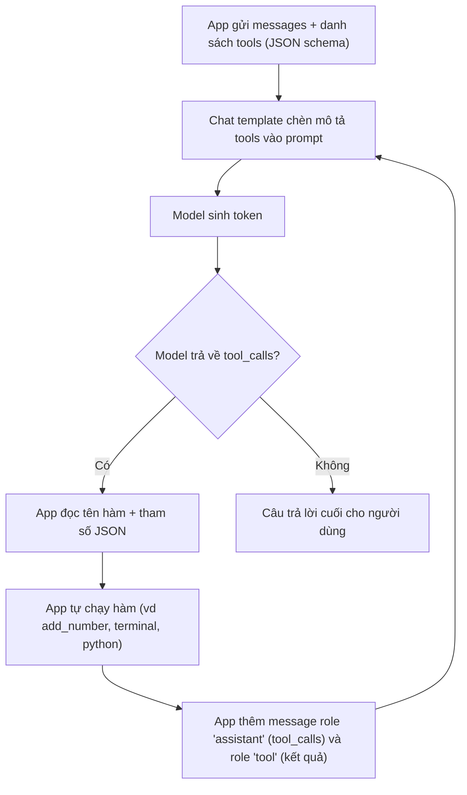

# Suy luận & sampling

Trang này giải thích điều gì xảy ra khi bạn chạy một model (inference, suy luận): model sinh từng token ra sao, các tham số `temperature`, `top_p`, `top_k`, `min_p`... điều khiển việc chọn token thế nào, và vì sao sai chat template làm model trả lời hỏng. Nên đọc trước khi chỉnh tham số trong Unsloth Studio, `llama-server` hay trang [Inference & API](/inference).

## Sinh token: autoregressive, prefill và decode

**Khái niệm.** LLM sinh văn bản kiểu autoregressive (tự hồi quy): mỗi lần chỉ đoán **một** token tiếp theo, nối token đó vào chuỗi, rồi đoán tiếp dựa trên toàn bộ chuỗi mới. Quá trình dừng khi model sinh token kết thúc (EOS, end-of-sequence) hoặc chạm giới hạn số token. Một lần trả lời chia thành hai pha:

- **Prefill** (nạp prompt): model xử lý toàn bộ prompt cùng lúc, song song, để tính trạng thái trung gian (key và value) cho mọi token trong prompt.
- **Decode** (giải mã): model sinh từng token một. Mỗi bước chỉ xử lý một token mới nên GPU không dùng hết sức tính; tốc độ bị giới hạn bởi tốc độ đọc trọng số và KV cache từ bộ nhớ.

**[Nguồn ngoài]** Transformers: LLM được train để sinh token tiếp theo dựa trên prompt cùng các token nó đã sinh, cho tới độ dài định trước hoặc tới token EOS: https://huggingface.co/docs/transformers/llm_tutorial. NVIDIA mô tả prefill là phép nhân ma trận-ma trận song song, "bão hòa" GPU; decode là phép ma trận-vector, bị giới hạn bởi băng thông bộ nhớ: https://developer.nvidia.com/blog/mastering-llm-techniques-inference-optimization/

**Ví dụ.** Hỏi "Thủ đô của Pháp là gì?" (khoảng chục token). Prefill xử lý cả chục token trong một lượt. Sau đó decode chạy từng bước: "Thủ" → "đô" → "của" → ... → "Paris" → "." → EOS. Prompt dài làm tăng thời gian chờ token đầu tiên; câu trả lời dài làm tăng số bước decode.

**Ảnh hưởng khi dùng Unsloth.** Trang Qwen3.8 ghi khoảng 20 tokens/s "generation" trên B200 nếu model vừa bộ nhớ, và nếu RAM + VRAM nhỏ hơn kích thước quant thì vẫn chạy nhưng chậm hơn nhiều do offload xuống ổ đĩa. **[Nhận định]** Con số "generation" đó là tốc độ pha decode; vì decode bị giới hạn bởi băng thông bộ nhớ nên offload làm chậm mạnh. Xem [Tham số & bộ nhớ](/kien-thuc-nen/tham-so-va-bo-nho).

**Gặp ở đâu trong Unsloth.** [Inference & API](/inference), [Model catalog](/model-catalog).

**Nguồn:** https://unsloth.ai/docs/models/qwen3.8; **[Nguồn ngoài]** https://huggingface.co/docs/transformers/llm_tutorial, https://developer.nvidia.com/blog/mastering-llm-techniques-inference-optimization/

## KV cache

**Khái niệm.** Trong lớp attention, mỗi token tạo ra một vector key (K) và value (V). Muốn đoán token thứ 1001, model cần K, V của cả 1000 token trước. Không có cache thì mỗi bước phải tính lại K, V cho toàn bộ chuỗi. KV cache lưu K, V của các token đã xử lý (cho từng layer) để bước sau chỉ cần tính cho token mới rồi nối vào. Đổi lại, cache chiếm bộ nhớ tăng tuyến tính theo độ dài context.

**[Nguồn ngoài]** Transformers: KV cache lưu cặp key-value của token đã xử lý để dùng lại, tránh tính lại; không có cache, chi phí attention mỗi bước tăng theo bình phương độ dài chuỗi; có cache thì tăng tuyến tính và bộ nhớ cũng tăng tuyến tính: https://huggingface.co/docs/transformers/cache_explanation. Công thức NVIDIA:

```text
KV cache (byte) = batch_size × số_token × 2 (K và V) × số_layer × hidden_size × số_byte_mỗi_số
```

Nguồn: https://developer.nvidia.com/blog/mastering-llm-techniques-inference-optimization/

**Ví dụ.** Docs Unsloth tính cho Llama 3.1 8B (32 layer, K và V mỗi cái kích thước 1024, lưu 16-bit): `2 × 2 byte × 32 layer × 20K context × 1024 = 2.5GB` cho mỗi batch; nếu batch của vLLM là 8 thì cần khoảng 20GB. Cùng model, context gấp đôi thì KV cache gấp đôi.

**Ảnh hưởng khi dùng Unsloth.**

- Kích thước file GGUF không tính KV cache. Docs Unsloth nhắc nhiều lần phải chừa thêm bộ nhớ cho context (ví dụ trang DeepSeek-V4: quant `UD-IQ3_XXS` 103GB thì nên có ít nhất 110GB RAM).
- llama.cpp hỗ trợ lượng tử hóa KV cache: `--cache-type-k` / `--cache-type-v` với `f32`, `f16`, `bf16`, `q8_0`, `q4_0`, `q4_1`, `iq4_nl`, `q5_0`, `q5_1`; mặc định `f16`. Theo docs Unsloth, `q4_1` (khoảng 5 bit) cho context dài hơn khoảng 3.2 lần. Với Qwen3.5, docs gợi ý thử `--cache-type-k bf16 --cache-type-v bf16` nếu gặp output vô nghĩa.
- Cache chỉ dùng lại được khi phần đầu prompt giống hệt lần trước. Docs Unsloth ghi Claude Code chèn một header thay đổi mỗi request vào đầu system prompt, làm KV cache mất hiệu lực và inference với model local chậm đi khoảng 90%.

**Gặp ở đâu trong Unsloth.** [Inference & API](/inference), [Reinforcement Learning](/reinforcement-learning) (bảng bộ nhớ GRPO), [Tham số & bộ nhớ](/kien-thuc-nen/tham-so-va-bo-nho), [Token & context](/kien-thuc-nen/token-va-context).

**Nguồn:** https://unsloth.ai/docs/get-started/reinforcement-learning-rl-guide, https://unsloth.ai/docs/models/glm-5.3, https://unsloth.ai/docs/models/qwen3.5, https://unsloth.ai/docs/models/deepseek-v4, https://unsloth.ai/docs/basics/claude-code; **[Nguồn ngoài]** https://huggingface.co/docs/transformers/cache_explanation, https://huggingface.co/docs/transformers/kv_cache, https://developer.nvidia.com/blog/mastering-llm-techniques-inference-optimization/

## Từ logits đến token: softmax và sampling

**Khái niệm.** Ở mỗi bước decode, model trả về một **logit** (điểm thô, có thể âm) cho mỗi token trong vocabulary (bộ từ vựng, thường hàng chục nghìn token). **Softmax** đổi các logit thành xác suất cộng lại bằng 1. Sau đó một **sampler** (bộ chọn) quyết định lấy token nào. Các tham số `temperature`, `top_k`, `top_p`, `min_p`, penalty đều là cách chỉnh hoặc cắt bớt phân phối này trước khi chọn.

```text
xác_suất_i = exp(logit_i / T) / tổng_j exp(logit_j / T)      (T = temperature; T = 1 là softmax thường)
```

**[Nguồn ngoài]** Công thức temperature chia logit cho `t` trước softmax: https://arxiv.org/abs/1904.09751

**Ví dụ.** **[Ước tính]** Giả sử sau "Thủ đô của Pháp là" chỉ có 4 token ứng viên với logit: Paris 5,0; Lyon 3,0; Nice 2,0; "một" 1,0. Softmax (T = 1) cho xác suất khoảng: Paris 0,831; Lyon 0,113; Nice 0,041; "một" 0,015. Các mục dưới dùng lại ví dụ này.

**Gặp ở đâu trong Unsloth.** [Inference & API](/inference) (mục Tham số sampling).

**Nguồn:** **[Nguồn ngoài]** https://arxiv.org/abs/1904.09751, https://huggingface.co/docs/transformers/generation_strategies

### Greedy và sampling

**Khái niệm.** **Greedy** (tham lam) luôn chọn token có xác suất cao nhất: cùng prompt thì luôn ra cùng câu. **Sampling** (lấy mẫu) bốc ngẫu nhiên theo xác suất: token nào có xác suất khác 0 cũng có cơ hội được chọn.

**[Nguồn ngoài]** Transformers: greedy là chiến lược mặc định của `generate()`, hợp với câu trả lời ngắn không cần sáng tạo nhưng "bắt đầu lặp lại" khi sinh chuỗi dài; sampling giảm lặp và đa dạng hơn, bật bằng `do_sample=True`: https://huggingface.co/docs/transformers/generation_strategies. Paper nucleus sampling cho thấy với greedy/beam search, xác suất lặp lại một cụm tăng dần sau mỗi lần lặp, tạo vòng lặp tự củng cố: https://arxiv.org/abs/1904.09751

**Ví dụ.** Với ví dụ trên, greedy luôn ra "Paris". Sampling ra "Paris" khoảng 83% số lần, "Lyon" khoảng 11%.

**Ảnh hưởng khi dùng Unsloth.** Các trang model của Unsloth đã xem đều khuyến nghị sampling với temperature từ 0.6 đến 1.0 (hướng dẫn tool calling dùng 0.15 cho Devstral 2), không trang nào khuyến nghị greedy. **[Nhận định]** Greedy (hoặc temperature rất thấp) với model nhỏ dễ gây lặp vô hạn; nếu thấy lặp, kiểm tra chat template trước (xem mục Chat template), rồi mới tới tham số sampling.

### Temperature

**Khái niệm.** Temperature chia logit trước softmax. T nhỏ hơn 1 làm phân phối "nhọn" hơn (token mạnh càng mạnh); T lớn hơn 1 làm phân phối "phẳng" hơn (token yếu có cơ hội hơn). T tiến về 0 thì gần như greedy.

**Ví dụ.** **[Ước tính]** Cùng 4 logit:

| Temperature | Paris | Lyon | Nice | "một" |
| --- | --- | --- | --- | --- |
| 0.5 | 0,979 | 0,018 | 0,002 | 0,000 |
| 1.0 | 0,831 | 0,113 | 0,041 | 0,015 |
| 2.0 | 0,579 | 0,213 | 0,129 | 0,078 |

**Ảnh hưởng khi dùng Unsloth.** Mặc định `llama-server`: `--temp 0.80`. Docs Unsloth khuyến nghị theo từng model (bảng ở mục dưới), ví dụ Qwen3.5 thinking mode dùng 1.0 cho tác vụ chung và 0.6 cho code chính xác. Trang API của Unsloth ghi: temperature thấp thường cho output ổn định hơn. Với GRPO, tài liệu nâng cao của Unsloth khuyên temperature khá cao (1.0) khi sinh câu trả lời để nhóm đa dạng (xem [RL & preference](/kien-thuc-nen/rl-va-preference)).

**Nguồn:** https://unsloth.ai/docs/basics/api, https://unsloth.ai/docs/models/qwen3.5, https://unsloth.ai/docs/get-started/reinforcement-learning-rl-guide/advanced-rl-documentation; **[Nguồn ngoài]** https://github.com/ggml-org/llama.cpp/blob/master/tools/server/README.md, https://huggingface.co/docs/transformers/llm_tutorial

### Top-k

**Khái niệm.** Chỉ giữ `k` token có xác suất cao nhất, bỏ phần còn lại, chia lại xác suất rồi mới bốc. `k` cố định bất kể phân phối nhọn hay phẳng.

**Ví dụ.** **[Ước tính]** `top_k = 2` giữ Paris và Lyon; sau khi chia lại: Paris ≈ 0,881, Lyon ≈ 0,119. **[Nguồn ngoài]** Paper nucleus sampling chỉ ra nhược điểm: `k` nhỏ dễ cho văn nhạt ở ngữ cảnh "phẳng", `k` lớn lại để lọt token không phù hợp ở ngữ cảnh "nhọn": https://arxiv.org/abs/1904.09751

**Ảnh hưởng khi dùng Unsloth.** Mặc định `llama-server`: `--top-k 40`, `0` là tắt. Docs Unsloth: Qwen dùng 20, Gemma 4 dùng 64, gpt-oss dùng 0 (tắt). Ví dụ tool calling của Unsloth truyền `top_k = -1`.

### Top-p (nucleus sampling)

**Khái niệm.** Sắp token theo xác suất giảm dần, cộng dồn cho tới khi tổng đạt `p`, chỉ giữ nhóm đó (gọi là "nucleus", hạt nhân). Khác top-k, số token giữ lại tự co giãn: phân phối nhọn thì giữ ít, phẳng thì giữ nhiều.

**[Nguồn ngoài]** Paper gốc định nghĩa top-p là tập nhỏ nhất có tổng xác suất ≥ p, sau đó chuẩn hóa lại và lấy mẫu trong tập đó: https://arxiv.org/abs/1904.09751

**Ví dụ.** **[Ước tính]** `top_p = 0.9`: Paris 0,831 chưa đủ, cộng Lyon được 0,944 ≥ 0,9 → giữ 2 token. `top_p = 0.95`: 0,944 vẫn chưa đủ, cộng Nice được 0,985 → giữ 3 token. `top_p = 1.0` là không cắt.

**Ảnh hưởng khi dùng Unsloth.** Mặc định `llama-server`: `--top-p 0.95`, `1.0` là tắt. Docs Unsloth: đa số model dùng 0.95; Qwen non-thinking dùng 0.8; gpt-oss dùng 1.0.

### Min-p

**Khái niệm.** Bỏ mọi token có xác suất nhỏ hơn `min_p × xác_suất_của_token_mạnh_nhất`. Ngưỡng tỉ lệ theo token mạnh nhất: khi model rất chắc chắn thì cắt mạnh, khi phân vân thì giữ nhiều lựa chọn hơn.

**[Nguồn ngoài]** README `llama-server`: min_p là "xác suất tối thiểu để một token được xem xét, tương đối so với xác suất của token có khả năng nhất"; mặc định `0.05`, `0.0` là tắt: https://github.com/ggml-org/llama.cpp/blob/master/tools/server/README.md. Mã nguồn tính ngưỡng đúng theo `p_i >= p × p_max`: https://github.com/ggml-org/llama.cpp/blob/master/src/llama-sampler.cpp

**Ví dụ.** **[Ước tính]** `min_p = 0.1`: ngưỡng = 0,1 × 0,831 ≈ 0,083 → chỉ Paris (0,831) và Lyon (0,113) qua được.

**Ảnh hưởng khi dùng Unsloth.** Docs Unsloth đặt `min_p = 0.0` (tắt) cho Qwen3.5, Qwen3.8 và trong lệnh gpt-oss 120B; trang Gemma 4 không ghi `min_p`. **[Nhận định]** Vì `llama-server` mặc định `0.05`, nếu không truyền `--min-p 0.0` thì bạn đang chạy khác khuyến nghị của Unsloth.

### Repetition penalty và presence penalty

**Khái niệm.** Hai cách phạt token đã xuất hiện để giảm lặp:

- **Repetition penalty** (`repeat_penalty` / `repetition_penalty`): với token đã xuất hiện trong `N` token gần nhất, logit dương bị **chia** cho penalty, logit âm bị **nhân** với penalty. Giá trị 1.0 là tắt, lớn hơn 1 là phạt.
- **Presence penalty**: **trừ** một lượng cố định vào logit của mọi token đã xuất hiện ít nhất một lần, bất kể xuất hiện bao nhiêu lần. Frequency penalty thì trừ theo số lần xuất hiện. Giá trị 0.0 là tắt.

**[Nguồn ngoài]** Cách tính lấy từ mã nguồn llama.cpp (`logit /= penalty_repeat` hoặc `*=` nếu logit âm; `logit -= count × penalty_freq + (count > 0) × penalty_present`): https://github.com/ggml-org/llama.cpp/blob/master/src/llama-sampler.cpp. Transformers: đặt `repetition_penalty` lớn hơn 1.0 nếu model hay lặp: https://huggingface.co/docs/transformers/llm_tutorial

**Ví dụ.** **[Ước tính]** "Lyon" đã xuất hiện trước đó, logit 3,0. `repeat_penalty = 1.1` → 3,0 / 1,1 ≈ 2,73. `presence_penalty = 1.5` → 3,0 - 1,5 = 1,5 (giảm mạnh hơn nhiều).

**Ảnh hưởng khi dùng Unsloth.**

- Mặc định `llama-server` (CLI): `--repeat-penalty 1.00`, `--repeat-last-n 64`, `--presence-penalty 0.00`, `--frequency-penalty 0.00`.
- Docs Unsloth: `repetition_penalty = 1.0` (tắt) cho Qwen3.5 và Qwen3.8; `presence_penalty = 1.5` cho một số chế độ Qwen. Trang Qwen3.5 cảnh báo giá trị `presence_penalty` cao có thể làm giảm nhẹ chất lượng.
- Trang API của Unsloth có ví dụ `--min-p 0.05 --repeat-penalty 1.1` cho Qwen3-1.7B để minh họa cờ, không phải khuyến nghị riêng cho model.

::: warning README llama-server chưa thống nhất
Không phải docs Unsloth nhưng ảnh hưởng trực tiếp khi bạn chạy `llama-server` mà không truyền cờ:

- Bảng tham số dòng lệnh ghi `--repeat-penalty N` mặc định `1.00` (tắt).
- Mục tham số của API `/completion` ghi `repeat_penalty` mặc định `1.1`.

Nguồn: https://github.com/ggml-org/llama.cpp/blob/master/tools/server/README.md. Cách an toàn: luôn truyền rõ giá trị.
:::

### Thứ tự các sampler

**[Nguồn ngoài]** `llama-server` áp dụng các sampler theo thứ tự mặc định `penalties;dry;top_n_sigma;top_k;typ_p;top_p;min_p;xtc;temperature` (đổi bằng `--samplers`): https://github.com/ggml-org/llama.cpp/blob/master/tools/server/README.md. **[Nhận định]** Nghĩa là trong llama.cpp mặc định, penalty được áp trước, các bộ lọc top-k/top-p/min-p cắt trên phân phối chưa qua temperature, còn temperature áp cuối cùng; engine khác (Transformers, vLLM) có thể theo thứ tự khác, nên cùng bộ số chưa chắc cho kết quả y hệt.

### Khuyến nghị của Unsloth theo model

| Model / chế độ | temperature | top_p | top_k | min_p | Penalty | Nguồn |
| --- | --- | --- | --- | --- | --- | --- |
| Qwen3.5, thinking, tác vụ chung | 1.0 | 0.95 | 20 | 0.0 | presence 1.5; repeat tắt hoặc 1.0 | [qwen3.5](https://unsloth.ai/docs/models/qwen3.5) |
| Qwen3.5, thinking, code chính xác | 0.6 | 0.95 | 20 | 0.0 | presence 0.0; repeat tắt hoặc 1.0 | [qwen3.5](https://unsloth.ai/docs/models/qwen3.5) |
| Qwen3.5, non-thinking, tác vụ chung | 0.7 | 0.8 | 20 | 0.0 | presence 1.5; repeat tắt hoặc 1.0 | [qwen3.5](https://unsloth.ai/docs/models/qwen3.5) |
| Qwen3.5, non-thinking, tác vụ suy luận | 1.0 | 0.95 | 20 | 0.0 | presence 1.5; repeat tắt hoặc 1.0 | [qwen3.5](https://unsloth.ai/docs/models/qwen3.5) |
| Qwen3.8-27B, thinking | 1.0 | 0.95 | 20 | 0.0 | presence 0.0; repetition 1.0 | [qwen3.8](https://unsloth.ai/docs/models/qwen3.8) |
| Qwen3.8-27B, non-thinking | 0.7 | 0.80 | 20 | 0.0 | presence 1.5; repetition 1.0 | [qwen3.8](https://unsloth.ai/docs/models/qwen3.8) |
| Qwen3.8-2.4T (chỉ thinking) | 1.0 | 0.95 | 20 | 0.0 | presence 0.0; repetition 1.0 | [qwen3.8](https://unsloth.ai/docs/models/qwen3.8) |
| Gemma 4 | 1.0 | 0.95 | 64 | Docs không ghi | Docs không ghi | [gemma-4](https://unsloth.ai/docs/models/gemma-4) |
| gpt-oss (20B, 120B) | 1.0 | 1.0 | 0 (hoặc thử 100) | Mục khuyến nghị không ghi; lệnh 120B dùng 0.0 | Docs không ghi | [gpt-oss](https://unsloth.ai/docs/models/gpt-oss-how-to-run-and-fine-tune) |

Model khác: docs Unsloth nhắc "khi đổi model, nhớ dùng đúng tham số sampling" và trỏ tới trang hướng dẫn từng model. Unsloth Studio tự đặt sẵn temperature, top-p, top-k cho model mới như Qwen3.5.

::: warning Docs chưa thống nhất
`presence_penalty` của Qwen3.5 trên cùng trang [qwen3.5](https://unsloth.ai/docs/models/qwen3.5):

- Gợi ý chung ghi `presence_penalty = 0.0 to 2.0`, "default this is off", chỉ bật khi muốn giảm lặp và giá trị cao có thể giảm nhẹ chất lượng.
- Bảng "Thinking mode, General tasks" và cả hai bảng non-thinking ghi `presence_penalty = 1.5`.
- Các lệnh `llama-cli` / `llama-server` mẫu cho đúng các chế độ này (ví dụ `--temp 1.0 --top-p 0.95 --top-k 20 --min-p 0.00`) không truyền presence penalty, tức chạy với mặc định 0.0 của llama-server.
:::

**Gặp ở đâu trong Unsloth.** [Inference & API](/inference), [Model catalog](/model-catalog).

**Nguồn:** https://unsloth.ai/docs/models/qwen3.5, https://unsloth.ai/docs/models/qwen3.8, https://unsloth.ai/docs/models/gemma-4, https://unsloth.ai/docs/models/gpt-oss-how-to-run-and-fine-tune, https://unsloth.ai/docs/basics/api, https://unsloth.ai/docs/basics/tool-calling-guide-for-local-llms, https://unsloth.ai/docs/new/studio/chat; **[Nguồn ngoài]** https://github.com/ggml-org/llama.cpp/blob/master/tools/server/README.md, https://github.com/ggml-org/llama.cpp/blob/master/src/llama-sampler.cpp, https://arxiv.org/abs/1904.09751

## Chat template

**Khái niệm.** Chat model về bản chất vẫn chỉ nối tiếp một chuỗi token. Danh sách tin nhắn `{"role": ..., "content": ...}` phải được đổi thành một chuỗi văn bản có token điều khiển đánh dấu ai đang nói, tin nhắn bắt đầu/kết thúc ở đâu. Chat template (mẫu hội thoại, thường viết bằng Jinja) là quy tắc đổi đó. Mỗi họ model được train với một template riêng, và model chỉ "hiểu" đúng template nó đã học.

**Ví dụ.** Cùng một câu "Hi", hai định dạng khác nhau. **[Nhận định]** Hai chuỗi dưới đây là minh họa người viết dựng lại từ các token điều khiển của ChatML và Harmony. Mẫu đầy đủ nằm ở [Chat Templates](https://unsloth.ai/docs/basics/chat-templates) và [trang gpt-oss](https://unsloth.ai/docs/models/gpt-oss-how-to-run-and-fine-tune):

```text
ChatML (Qwen...):   <|im_start|>user\nHi<|im_end|>\n<|im_start|>assistant\n
gpt-oss (Harmony):  <|start|>user<|message|>Hi<|end|><|start|>assistant
```

**[Nguồn ngoài]** Transformers lấy ví dụ Mistral-7B-Instruct dùng `[INST]`/`[/INST]` còn Zephyr dùng `<|user|>`/`<|assistant|>` dù cùng gốc Mistral-7B, và nói dùng sai token điều khiển thì model "kém đi đáng kể". `add_generation_prompt=True` thêm phần mở đầu lượt của assistant ở cuối; thiếu nó model có thể viết tiếp tin nhắn của user thay vì trả lời. Một số tokenizer tự thêm `bos`/`eos`; nếu template đã có mà tokenize lại với special token thì bị lặp, làm model kém đi: https://huggingface.co/docs/transformers/chat_templating

### Vì sao dùng sai template làm model trả lời lỗi

Theo trang Troubleshooting Inference của Unsloth, khi model chạy tốt trong Unsloth nhưng sau khi export sang Ollama, vLLM, llama.cpp lại ra chữ vô nghĩa, sinh **không dừng**, hoặc **lặp lại**:

- Nguyên nhân phổ biến nhất là **sai chat template**. Phải dùng đúng template đã dùng lúc train trong Unsloth khi chạy ở framework khác.
- Phải dùng đúng **EOS token**; sai thì có thể ra chữ vô nghĩa khi sinh dài. **[Nhận định]** Model được dạy kết thúc lượt bằng một token cụ thể (ví dụ `<|im_end|>`); nếu engine chờ một token khác thì không bao giờ thấy tín hiệu dừng, nên sinh mãi.
- Engine có thể thêm thừa (hoặc thiếu) token "start of sequence" (BOS); cần kiểm tra cả hai khả năng.
- Cách sửa docs khuyên: dùng notebook conversational của Unsloth để "ép" chat template, sửa được đa số lỗi.

Các trường hợp khác trong docs Unsloth:

- **Lộ token lạ:** trang Studio Chat đo trên Qwen3.5-4B: tool calling thông thường để lọt XML vào câu trả lời 10/10 lần, bản của Unsloth 0/10. Gemma 4 khi tắt thinking vẫn có thể in ra một khối thought rỗng `<|channel>thought<channel|>` trước câu trả lời.
- **Template của engine sai lệch:** với gpt-oss, Unsloth so template Jinja phổ biến với thư viện Harmony của OpenAI và thấy nhiều khác biệt: tool call bị escape thừa dấu `\`, thừa dòng trống, dùng sai kênh `final` thay vì `analysis`. Unsloth đã sửa template trong các bản upload của mình.

**Ảnh hưởng khi dùng Unsloth.**

- Khi train: dùng `get_chat_template(tokenizer, chat_template = "...")` để gắn template, và `apply_chat_template(..., add_generation_prompt = False)` khi format dữ liệu. `map_eos_token = True` ánh xạ `<|im_end|>` thành EOS mà không cần train thêm. Nếu dùng base model cho GRPO, docs yêu cầu phải có chat template.
- Khi chạy `llama-server`: `--jinja` bật engine Jinja cho chat template (mặc định bật theo README hiện tại); tham số riêng của template truyền qua `--chat-template-kwargs '{"enable_thinking":false}'`.
- **[Nguồn ngoài]** TRL nhắc: với base model đã có template sẵn (ví dụ Qwen), phải căn chỉnh EOS token với chat template để câu trả lời kết thúc đúng: https://huggingface.co/docs/trl/sft_trainer

**Gặp ở đâu trong Unsloth.** [Dữ liệu](/du-lieu), [Fine-tuning](/fine-tuning), [Export & deploy](/export-deploy), [Inference & API](/inference).

**Nguồn:** https://unsloth.ai/docs/basics/chat-templates, https://unsloth.ai/docs/basics/inference-and-deployment/troubleshooting-inference, https://unsloth.ai/docs/new/studio/chat, https://unsloth.ai/docs/models/gemma-4, https://unsloth.ai/docs/models/gpt-oss-how-to-run-and-fine-tune, https://unsloth.ai/docs/get-started/reinforcement-learning-rl-guide; **[Nguồn ngoài]** https://huggingface.co/docs/transformers/chat_templating, https://huggingface.co/docs/transformers/llm_tutorial, https://github.com/ggml-org/llama.cpp/blob/master/tools/server/README.md

## Thinking / reasoning mode

**Khái niệm.** Model "thinking" (hay reasoning) sinh ra một đoạn suy nghĩ nội bộ trước câu trả lời cuối. Đoạn này được bọc trong token riêng của từng họ model để app có thể tách ra hoặc ẩn đi. Model "hybrid" bật/tắt được thinking; thường bật/tắt qua chat template, nên đây cũng là chuyện template.

**Ví dụ.** Theo docs Unsloth:

- **Qwen3.5:** hybrid; tắt bằng `--chat-template-kwargs '{"enable_thinking":false}'`. Các bản nhỏ 0.8B, 2B, 4B, 9B tắt thinking mặc định; bật bằng `{"enable_thinking":true}`. Docs khuyên độ dài output khoảng `32,768` token cho đa số câu hỏi.
- **Qwen3.8-27B:** có `reasoning_effort` với các mức `xhigh` (mặc định), `medium`, `low`, none; đổi bằng `--chat-template-kwargs '{"reasoning_effort":"medium"}'`. Có "Preserve Thinking" giữ lại đoạn suy nghĩ của lượt trước: tốn thêm token nhưng có thể chính xác hơn trong hội thoại dài.
- **Gemma 4:** bật thinking bằng cách đặt token `<|think|>` ở đầu system prompt. Với hội thoại nhiều lượt, **chỉ giữ câu trả lời cuối** trong lịch sử, không đưa khối thought cũ vào lượt sau.
- **gpt-oss:** `reasoning_effort` low / medium / high; mức cao chính xác hơn nhưng chậm hơn vì tốn nhiều token suy nghĩ.

**Ảnh hưởng khi dùng Unsloth.** Thinking và non-thinking thường có bộ tham số sampling khác nhau (bảng ở trên). Đoạn thinking cũng chiếm context và KV cache như token thường. **[Nhận định]** Qwen3.8 khuyến khích giữ thinking cũ còn Gemma 4 yêu cầu bỏ; hãy làm theo trang của đúng model. **[Nguồn ngoài]** `llama-server` có `--reasoning-format` để tách phần suy nghĩ vào trường riêng (ví dụ `reasoning_content`) và `--reasoning-budget` để giới hạn số token suy nghĩ: https://github.com/ggml-org/llama.cpp/blob/master/tools/server/README.md

**Gặp ở đâu trong Unsloth.** [Inference & API](/inference), [Model catalog](/model-catalog).

**Nguồn:** https://unsloth.ai/docs/models/qwen3.5, https://unsloth.ai/docs/models/qwen3.8, https://unsloth.ai/docs/models/gemma-4, https://unsloth.ai/docs/models/gpt-oss-how-to-run-and-fine-tune; **[Nguồn ngoài]** https://github.com/ggml-org/llama.cpp/blob/master/tools/server/README.md

## Tool calling

**Khái niệm.** Tool calling (gọi công cụ) là khi LLM được phép kích hoạt một hàm cụ thể bằng cách sinh ra một yêu cầu có cấu trúc (tên hàm + tham số JSON) thay vì tự đoán câu trả lời. Model **không tự chạy** hàm: app của bạn đọc yêu cầu, chạy hàm, rồi đưa kết quả trở lại hội thoại dưới vai `tool`; model đọc kết quả và viết câu trả lời cuối (hoặc gọi thêm tool). Danh sách tool được mô tả bằng JSON schema và được chat template chèn vào prompt.



**[Nguồn ngoài]** Transformers: model "không thể tự gọi tool", nó chỉ yêu cầu gọi; việc của bạn là xử lý lời gọi rồi thêm lời gọi và kết quả vào lịch sử chat, kết quả nằm trong message role `tool` và luôn là chuỗi: https://huggingface.co/docs/transformers/chat_extras

**Ví dụ.** Trong hướng dẫn tool calling của Unsloth, app định nghĩa các hàm `add_number`, `multiply_number`, `terminal`, `python`... kèm JSON schema, gửi tới `llama-server` qua OpenAI SDK với `tools = tools` và `tool_choice = "auto"`. Khi response có `tool_calls`, app lấy `tool_call.function.name` và `json.loads(tool_call.function.arguments)`, gọi hàm tương ứng trong `MAP_FN`, rồi thêm `{"role": "tool", "tool_call_id": ..., "name": ..., "content": str(out)}` vào `messages`. Hàm `terminal` trong ví dụ tự chặn các lệnh chứa `rm`, `sudo`, `dd`, `chmod`.

**Ảnh hưởng khi dùng Unsloth.**

- Tool calling phụ thuộc chat template: template phải biết cách hiển thị tools và `tool_calls`. **[Nguồn ngoài]** README `llama-server`: function calling kiểu OpenAI được hỗ trợ với cờ `--jinja`, có thể cần `--chat-template-file` để có template hỗ trợ tool: https://github.com/ggml-org/llama.cpp/blob/master/tools/server/README.md. Lệnh mẫu trong docs Unsloth đều có `--jinja`.
- Sampling vẫn quan trọng: docs Unsloth nhắc đổi model thì đổi tham số sampling theo trang của model đó (ví dụ Devstral 2 dùng temperature 0.15, GLM-4.7 dùng 0.7 và top_p 1.0).
- Studio Chat bật tool calling sẵn, có "self-healing" (tự sửa tool call hỏng), dừng vòng gọi tool ổn định hơn và chặn XML lọt ra output.
- **[Nhận định]** Không cho model gọi hàm nguy hiểm mà không kiểm soát: ví dụ `terminal` và `python` trong docs chạy code thật trên máy bạn.

**Gặp ở đâu trong Unsloth.** [Inference & API](/inference) (mục Tool calling), [Ứng dụng & RAG](/ung-dung-rag).

**Nguồn:** https://unsloth.ai/docs/basics/tool-calling-guide-for-local-llms, https://unsloth.ai/docs/new/studio/chat; **[Nguồn ngoài]** https://huggingface.co/docs/transformers/chat_extras, https://github.com/ggml-org/llama.cpp/blob/master/tools/server/README.md

## Gặp ở đâu trong Unsloth

| Khái niệm | Trang Unsloth trên website | Docs gốc |
| --- | --- | --- |
| Autoregressive, prefill, decode | [Inference & API](/inference) | [Qwen3.8](https://unsloth.ai/docs/models/qwen3.8) |
| KV cache, `--cache-type-k/v` | [Inference & API](/inference), [Reinforcement Learning](/reinforcement-learning) | [RL Guide](https://unsloth.ai/docs/get-started/reinforcement-learning-rl-guide), [GLM-5.3](https://unsloth.ai/docs/models/glm-5.3), [Claude Code](https://unsloth.ai/docs/basics/claude-code) |
| Greedy vs sampling, logits, softmax | [Inference & API](/inference) | [API](https://unsloth.ai/docs/basics/api) |
| temperature, top_p, top_k, min_p | [Inference & API](/inference), [Model catalog](/model-catalog) | [Qwen3.5](https://unsloth.ai/docs/models/qwen3.5), [Qwen3.8](https://unsloth.ai/docs/models/qwen3.8), [Gemma 4](https://unsloth.ai/docs/models/gemma-4), [gpt-oss](https://unsloth.ai/docs/models/gpt-oss-how-to-run-and-fine-tune) |
| repetition / presence penalty | [Inference & API](/inference) | [Qwen3.5](https://unsloth.ai/docs/models/qwen3.5), [API](https://unsloth.ai/docs/basics/api) |
| Chat template, EOS, BOS | [Dữ liệu](/du-lieu), [Export & deploy](/export-deploy) | [Chat Templates](https://unsloth.ai/docs/basics/chat-templates), [Troubleshooting Inference](https://unsloth.ai/docs/basics/inference-and-deployment/troubleshooting-inference) |
| Thinking / reasoning mode | [Inference & API](/inference), [Model catalog](/model-catalog) | [Qwen3.5](https://unsloth.ai/docs/models/qwen3.5), [Gemma 4](https://unsloth.ai/docs/models/gemma-4), [gpt-oss](https://unsloth.ai/docs/models/gpt-oss-how-to-run-and-fine-tune) |
| Tool calling | [Inference & API](/inference) | [Tool Calling Guide](https://unsloth.ai/docs/basics/tool-calling-guide-for-local-llms), [Studio Chat](https://unsloth.ai/docs/new/studio/chat) |
