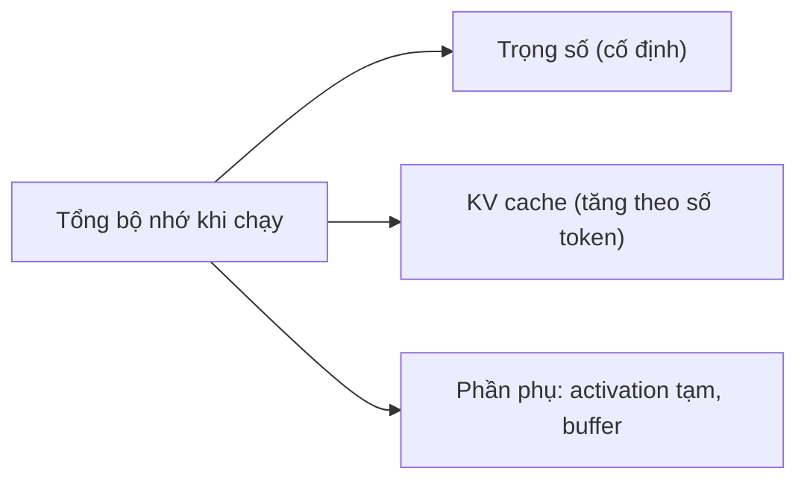

# Tham số & bộ nhớ

Trang này giúp bạn tự ước lượng một model cần bao nhiêu bộ nhớ, đọc hiểu bảng yêu cầu RAM/VRAM trong docs Unsloth và giải mã tên file model. Nên đọc trước khi chọn model và mức quant ở [Model catalog](/model-catalog), [Inference](/inference) hoặc trước khi fine-tune ở [Fine-tuning](/fine-tuning).

## Tham số là gì

**Khái niệm.** Tham số (parameter, còn gọi là trọng số/weight) là các con số model học được trong lúc huấn luyện. Chữ `B` trong tên model là "billion" (tỷ): model 7B có khoảng 7 tỷ con số như vậy. Toàn bộ các con số này phải được nạp vào bộ nhớ thì model mới chạy được, nên số tham số là yếu tố đầu tiên quyết định dung lượng.

**Ví dụ.** Docs Unsloth viết: "Llama 70B has 70 billion numbers". Model card chính thức của Qwen3-8B ghi số tham số thực là 8.2B (tên làm tròn thành 8B).

**Ảnh hưởng khi dùng Unsloth.** Bảng yêu cầu VRAM của Unsloth được sắp xếp theo đúng cột "Model parameters" (3B, 7B, 8B, … 405B). Biết số tham số là bạn tra được ngay hàng cần xem.

**Gặp ở đâu trong Unsloth.** [Cài đặt – Yêu cầu VRAM](/cai-dat), [Fine-tuning](/fine-tuning).

**Nguồn:** https://unsloth.ai/docs/get-started/fine-tuning-llms-guide, https://unsloth.ai/docs/get-started/fine-tuning-for-beginners/unsloth-requirements ; **[Nguồn ngoài]** https://huggingface.co/Qwen/Qwen3-8B

### Số byte mỗi tham số theo dtype

**Khái niệm.** Mỗi tham số được lưu theo một kiểu số (dtype, data type). Kiểu càng ít bit thì càng tốn ít bộ nhớ nhưng càng kém chính xác. Chi tiết các kiểu số ở trang [Độ chính xác & lượng tử hóa](/kien-thuc-nen/do-chinh-xac-va-luong-tu-hoa).

| dtype | Số bit | Byte mỗi tham số | Ghi chú |
|---|---|---|---|
| FP32 (`torch.float32`) | 32 | 4 | "Full precision" |
| BF16 / FP16 | 16 | 2 | Dạng phổ biến của model gốc phát hành |
| FP8 / INT8 | 8 | 1 | Cộng thêm một ít cho hệ số scale |
| 4-bit (INT4, NF4, NVFP4, MXFP4, Q4 GGUF) | 4 | 0.5 | Thực tế hơn 0.5 vì có scale theo khối |

**[Nguồn ngoài]** Số bit của từng dtype theo bảng dtype của PyTorch (https://docs.pytorch.org/docs/stable/tensor_attributes.html) và trang tổng quan quantization của Hugging Face (https://huggingface.co/docs/transformers/quantization/overview). Byte = bit ÷ 8.

Công thức cơ bản:

```text
bộ nhớ trọng số ≈ số tham số × số byte mỗi tham số
```

**Ví dụ.** **[Ước tính]** 8B ở BF16: `8 tỷ × 2 byte = 16 GB`. Ở 4-bit: `8 tỷ × 0.5 byte = 4 GB`. Đối chiếu: README công cụ quantize của llama.cpp ghi Llama 3.1 8B bản gốc 32.1 GB (**[Nhận định]** khớp với 4 byte/tham số) và bản `Q4_K_M` 4.9 GB **[Nguồn ngoài]** https://github.com/ggml-org/llama.cpp/blob/master/tools/quantize/README.md . Bản 4-bit lớn hơn 4 GB vì `Q4_K_M` thực tế dùng 4.89 bit/trọng số (cùng README).

**Ảnh hưởng khi dùng Unsloth.** Khi nạp model bằng `FastLanguageModel.from_pretrained`, các cờ `load_in_4bit`, `load_in_8bit`, `load_in_16bit`, `load_in_fp8` quyết định số byte mỗi tham số của model gốc trong VRAM. Docs Unsloth ghi `load_in_4bit = True` "reducing memory use 4×".

**Gặp ở đâu trong Unsloth.** [Fine-tuning](/fine-tuning), [Reinforcement Learning](/reinforcement-learning) (FP8).

**Nguồn:** https://unsloth.ai/docs/get-started/fine-tuning-llms-guide ; **[Nguồn ngoài]** các URL PyTorch, Hugging Face, llama.cpp ghi trong mục.

## Bộ nhớ khi chạy model (inference)

**Khái niệm.** Khi chạy (inference, suy luận: dùng model để sinh chữ, không học thêm), bộ nhớ gồm ba phần:

1. **Trọng số**: cố định, tính theo công thức ở trên.
2. **KV cache**: tăng dần theo số token trong ngữ cảnh.
3. **Phần phụ**: activation tạm (kết quả trung gian của từng phép tính, giải phóng ngay sau đó), buffer của runtime, các module đi kèm.



**Ví dụ.** Paper PagedAttention mô tả một model 13B chạy trên GPU A100 40GB: khoảng 65% bộ nhớ dành cho trọng số, gần 30% cho trạng thái động của các request (KV cache), phần còn lại cho activation tạm **[Nguồn ngoài]** https://arxiv.org/abs/2309.06180 .

**Nguồn:** **[Nguồn ngoài]** https://arxiv.org/abs/2309.06180 , https://huggingface.co/docs/transformers/model_memory_anatomy

### KV cache

**Khái niệm.** Model sinh từng token một, mỗi token mới phải "nhìn lại" toàn bộ token trước đó qua cơ chế attention (xem [Kiến trúc Transformer](/kien-thuc-nen/kien-truc-transformer)). Để khỏi tính lại, model lưu vector key (K) và value (V) của các token cũ vào KV cache. Hugging Face mô tả cache là một danh sách theo layer; mỗi layer có một tensor key và một tensor value, hình dạng `[batch_size, num_heads, seq_len, head_dim]`, và chiều `seq_len` tăng thêm 1 sau mỗi token mới. Vì vậy bộ nhớ KV cache tăng tuyến tính theo độ dài ngữ cảnh **[Nguồn ngoài]** https://huggingface.co/docs/transformers/cache_explanation .

Nhân các chiều của tensor đó lại, ta được:

```text
KV cache (byte) ≈ 2 × số layer × số KV head × head_dim × số token × số byte mỗi phần tử   (× batch nếu chạy nhiều chuỗi)
```

Diễn giải bằng lời:
- `2`: một bản cho K, một bản cho V.
- `số layer`: mỗi layer attention có cache riêng.
- `số KV head × head_dim`: kích thước vector K (hoặc V) của một token trong một layer. Model dùng GQA (grouped-query attention) có ít KV head hơn query head, nên cache nhỏ hơn. Ví dụ model card Qwen3-8B ghi "32 for Q and 8 for KV", tức chỉ 8 head được lưu vào cache.
- `số token`: prompt cộng phần đã sinh.
- `số byte mỗi phần tử`: 2 nếu cache ở BF16/FP16, 1 nếu cache ở FP8.

Paper PagedAttention dùng đúng cách tính này cho OPT-13B: `2 (K và V) × 5120 (hidden size) × 40 (layer) × 2 (byte FP16)` = 800 KB cho mỗi token, tức khoảng 1.6 GB cho một chuỗi 2048 token **[Nguồn ngoài]** https://arxiv.org/abs/2309.06180 . OPT-13B không dùng GQA nên `số KV head × head_dim` bằng hidden size.

**Ví dụ.**
- **[Ước tính]** Qwen3-8B (36 layer, 8 KV head, `head_dim` 128 theo model card và `config.json` chính thức), cache BF16: `2 × 36 × 8 × 128 × 2 = 147,456 byte ≈ 144 KiB mỗi token`. Ngữ cảnh 32,768 token: `147,456 × 32,768 ≈ 4.83 GB`. Trọng số BF16 của model này là `8.2 tỷ × 2 ≈ 16.4 GB`, nên ở ngữ cảnh dài KV cache đã bằng gần 1/3 trọng số.
- **[Ước tính]** Qwen3.8-27B là kiến trúc lai: model card ghi 64 layer theo bố cục `16 × (3 × Gated DeltaNet → 1 × Gated Attention)`, phần Gated Attention có "24 for Q and 4 for KV", head dimension 256. Chỉ 16 layer attention đầy đủ lưu K/V theo từng token: `2 × 16 × 4 × 256 × 2 = 65,536 byte = 64 KiB mỗi token`. Ở ngữ cảnh tối đa 262,144 token: `65,536 × 262,144 ≈ 17.2 GB`. Hugging Face ghi các layer linear-attention (loại của Gated DeltaNet) bỏ trạng thái cũ khi chạy tiếp, nên **[Nhận định]** phần này không tăng theo số token; dung lượng trạng thái cố định của chúng cần kiểm tra lại.

**Ảnh hưởng khi dùng Unsloth.**
- Độ dài ngữ cảnh (context length, `--ctx-size` trong llama.cpp/`unsloth run`, ô context length trong Unsloth Studio) quyết định KV cache. **[Ước tính]** Với Qwen3.8-27B, ngữ cảnh 262,144 token cần khoảng 17.2 GB KV cache, còn 8,192 token chỉ cần `65,536 × 8,192 ≈ 0.54 GB`. Docs Unsloth về Claude Code khuyên giảm `--ctx-size` nếu thấy hiệu năng kém.
- Unsloth Dynamic NVFP4 có "FP8 KV cache calibration" cho ngữ cảnh dài gấp 2 lần. **[Nhận định]** Điều này khớp với công thức: cache 1 byte thay vì 2 byte mỗi phần tử thì cùng dung lượng chứa được gấp đôi số token.
- Hugging Face Transformers có cache lượng tử hóa (`cache_implementation="quantized"`) và cache offload sang CPU (`cache_implementation="offloaded"`), đổi lại tốc độ chậm hơn **[Nguồn ngoài]** https://huggingface.co/docs/transformers/kv_cache .
- Khái niệm token và context length: xem [Token & context](/kien-thuc-nen/token-va-context).

**Gặp ở đâu trong Unsloth.** [Inference](/inference), [Model catalog](/model-catalog).

**Nguồn:** https://unsloth.ai/docs/basics/nvfp4, https://unsloth.ai/docs/models/qwen3.8, https://unsloth.ai/docs/basics/claude-code ; **[Nguồn ngoài]** https://huggingface.co/docs/transformers/cache_explanation , https://huggingface.co/docs/transformers/kv_cache , https://arxiv.org/abs/2309.06180 , https://huggingface.co/Qwen/Qwen3-8B , https://huggingface.co/Qwen/Qwen3.8-27B

### Phần phụ khi chạy

**Khái niệm.** Ngoài trọng số và KV cache còn có tensor tạm do các phép như softmax, nhân ma trận tạo ra rồi giải phóng. Nếu một phép tạo đỉnh bộ nhớ lớn, nó có thể gây tràn bộ nhớ (OOM, out of memory) dù model "vừa" **[Nguồn ngoài]** https://huggingface.co/docs/transformers/model_memory_anatomy . Các module đi kèm như MTP (multi-token prediction, đầu dự đoán nhiều token để tăng tốc) hay `mmproj` (bộ mã hóa ảnh cho model vision) cũng chiếm chỗ.

**Ví dụ.** Docs Qwen3.8 dặn: nếu dùng MTP, chuẩn bị dư thêm 1-2GB.

**Ảnh hưởng khi dùng Unsloth.** Để chừa khoảng trống, đừng chọn file quant có dung lượng sát bằng bộ nhớ bạn có.

**Gặp ở đâu trong Unsloth.** [Inference](/inference).

**Nguồn:** https://unsloth.ai/docs/models/qwen3.8 ; **[Nguồn ngoài]** https://huggingface.co/docs/transformers/model_memory_anatomy

## Bộ nhớ khi fine-tune

**Khái niệm.** Huấn luyện cần nhiều bộ nhớ hơn chạy vì phải giữ thêm (xem thêm [Quá trình huấn luyện](/kien-thuc-nen/qua-trinh-huan-luyen)):

- **Gradient**: đạo hàm của loss theo từng tham số, cho biết mỗi tham số nên chỉnh theo hướng nào.
- **Optimizer state**: trạng thái riêng của thuật toán cập nhật. AdamW giữ hai tensor cho mỗi tham số (momentum và variance).
- **Activation**: kết quả trung gian của lượt forward được giữ lại để tính gradient ở lượt backward.

Theo tài liệu "GPU memory usage" của Hugging Face **[Nguồn ngoài]** https://huggingface.co/docs/transformers/model_memory_anatomy :

| Thành phần | Byte mỗi tham số được train | Ghi chú |
|---|---|---|
| Trọng số (mixed precision) | 6 | Bản fp16 (2) cho forward/backward + bản fp32 (4) để cập nhật ổn định |
| Optimizer state (Adam) | 8 | momentum fp32 (4) + variance fp32 (4); Adam lượng tử hóa của bitsandbytes còn 2 |
| Gradient | 4 | fp32 |
| Activation | thay đổi | Tăng theo batch size, độ dài chuỗi, số layer, hidden size |

**Ví dụ.**
- **[Ước tính]** Full fine-tune 8B với AdamW thường: `8 tỷ × (6 + 8 + 4) = 144 GB`, chưa kể activation. Đổi sang Adam 8-bit: `8 tỷ × (6 + 2 + 4) = 96 GB`.
- Đối chiếu: paper QLoRA ghi fine-tune 16-bit thông thường LLaMA 65B cần "more than 780 GB" bộ nhớ GPU **[Nguồn ngoài]** https://arxiv.org/abs/2305.14314 .

**Ảnh hưởng khi dùng Unsloth.**
- Batch size là "Primary Driver of VRAM Usage". Khi OOM, docs Unsloth khuyên đặt `per_device_train_batch_size` về 1, 2 hoặc 3 và tăng `gradient_accumulation_steps` để giữ effective batch size.
- Notebook Unsloth dùng `optim = "adamw_8bit"` (AdamW 8-bit), tức optimizer state khoảng 2 byte thay vì 8 byte mỗi tham số được train.
- Gradient checkpointing chỉ giữ một phần activation, phần còn lại tính lại ở lượt backward: tiết kiệm bộ nhớ, đổi lại chậm hơn **[Nguồn ngoài]** https://huggingface.co/docs/transformers/grad_checkpointing . Unsloth khuyên `use_gradient_checkpointing = "unsloth"`, "reduces memory usage by an extra 30%". Docs RL mô tả phiên bản này offload activation sang RAM hệ thống một cách bất đồng bộ, "only 1% slower".
- `full_finetuning = True` là trường hợp tốn bộ nhớ nhất vì mọi tham số đều có gradient và optimizer state.

**Gặp ở đâu trong Unsloth.** [Fine-tuning](/fine-tuning), [Reinforcement Learning](/reinforcement-learning).

**Nguồn:** https://unsloth.ai/docs/get-started/fine-tuning-llms-guide/lora-hyperparameters-guide, https://unsloth.ai/docs/get-started/fine-tuning-for-beginners/unsloth-requirements, https://unsloth.ai/docs/get-started/install/google-colab, https://unsloth.ai/docs/get-started/reinforcement-learning-rl-guide ; **[Nguồn ngoài]** https://huggingface.co/docs/transformers/model_memory_anatomy , https://huggingface.co/docs/transformers/grad_checkpointing , https://arxiv.org/abs/2305.14314

### LoRA và QLoRA: chỉ adapter có gradient

**Khái niệm.** LoRA đóng băng (freeze) toàn bộ trọng số gốc và chỉ train thêm các ma trận nhỏ A, B gắn vào từng lớp (adapter). Docs Unsloth: "we only optimize 1% of weights". Vì trọng số gốc không đổi nên chúng không cần gradient hay optimizer state; hai khoản này chỉ tính cho adapter. QLoRA giữ nguyên ý tưởng đó nhưng lưu trọng số gốc ở 4-bit. Chi tiết ở [LoRA & QLoRA](/kien-thuc-nen/lora-va-qlora).

**Ví dụ.** **[Ước tính]** Model 8B, adapter giả định bằng 1% tham số (0.08 tỷ). Mỗi tham số của adapter tốn 12 byte: 6 byte trọng số mixed precision, 4 byte gradient, 2 byte optimizer state của `adamw_8bit` (optimizer notebook Unsloth dùng), theo bảng Hugging Face ở trên:

| Cách train | Trọng số gốc | Adapter (`0.08 tỷ × 12`) | Tổng chưa kể activation | Bảng Unsloth (tối thiểu) |
|---|---|---|---|---|
| LoRA 16-bit | `8 tỷ × 2 = 16 GB` | ≈ 0.96 GB | ≈ 17.0 GB | 22 GB |
| QLoRA 4-bit | `8 tỷ × 0.5 = 4 GB` | ≈ 0.96 GB | ≈ 5.0 GB | 6 GB |

**[Nhận định]** Phần chênh so với bảng Unsloth có thể đến từ activation, buffer và phần scale của 4-bit; docs không nêu cách đo. Tỷ lệ adapter thực tế phụ thuộc vào rank `r` và `target_modules`. Công cụ bên dưới tính số tham số LoRA chính xác từ kiến trúc. Ví dụ với Llama 3.1 8B, r = 16, đủ 7 module, adapter có khoảng 42 triệu tham số (≈ 0,5%).

**Ảnh hưởng khi dùng Unsloth.** Docs Unsloth: LoRA dùng khoảng 4× VRAM so với QLoRA; QLoRA "reducing VRAM usage by over 75%". Với GRPO dùng QLoRA 4-bit, quy tắc của Unsloth là số tham số (tỷ) ≈ số GB VRAM cần, ngữ cảnh càng dài càng tốn thêm. Với FP8 RL, Unsloth ghi mức tiết kiệm xấp xỉ bằng bộ nhớ trọng số (khoảng 8 GB cho Qwen3-8B).

**Gặp ở đâu trong Unsloth.** [Fine-tuning](/fine-tuning), [Reinforcement Learning](/reinforcement-learning).

**Nguồn:** https://unsloth.ai/docs/get-started/fine-tuning-llms-guide, https://unsloth.ai/docs/get-started/fine-tuning-llms-guide/lora-hyperparameters-guide, https://unsloth.ai/docs/get-started/reinforcement-learning-rl-guide, https://unsloth.ai/docs/get-started/reinforcement-learning-rl-guide/fp8-reinforcement-learning ; **[Nguồn ngoài]** https://huggingface.co/docs/transformers/model_memory_anatomy

### Bảng VRAM fine-tune của Unsloth

Unsloth công bố bảng VRAM tối thiểu theo số tham số, với QLoRA = 4-bit và LoRA = 16-bit. Docs ghi đây là "absolute minimum", một số model cần nhiều hơn. Trích một số dòng:

| Model parameters | QLoRA (4-bit) VRAM | LoRA (16-bit) VRAM |
|---|---|---|
| 3B | 3.5 GB | 8 GB |
| 8B | 6 GB | 22 GB |
| 14B | 8.5 GB | 33 GB |
| 27B | 22GB | 64GB |
| 70B | 41 GB | 164 GB |
| 405B | 237 GB | 950 GB |

Bảng đầy đủ và cách kiểm tra GPU: [Cài đặt & phần cứng](/cai-dat).

**Nguồn:** https://unsloth.ai/docs/get-started/fine-tuning-for-beginners/unsloth-requirements

## Ví dụ bộ nhớ trọng số theo kích thước model

Ba cột đầu **[Ước tính]** chỉ tính trọng số: `số tham số × byte mỗi tham số` (BF16 = 2, FP8/INT8 = 1, 4-bit = 0.5), 1 GB = 10^9 byte. Cột cuối là số có trong tài liệu, kèm điều kiện, để thấy chênh lệch.

| Kích thước | BF16 | FP8/INT8 | 4-bit | Số liệu trong tài liệu (điều kiện) |
|---|---|---|---|---|
| 1B | 2 GB | 1 GB | 0.5 GB | Gemma 3 1B, GGUF `Q4_0` QAT: 0.93 GB trên đĩa (Unsloth, Dynamic 3.0 GGUFs) |
| 8B | 16 GB | 8 GB | 4 GB | Llama 3.1 8B: bản gốc 32.1 GB, `Q4_K_M` 4.9 GB (README llama.cpp **[Nguồn ngoài]**). Fine-tune: QLoRA 6 GB, LoRA 22 GB (Unsloth) |
| 27B | 54 GB | 27 GB | 13.5 GB | Qwen3.8-27B, tổng RAM + VRAM: BF16 56 GB, 8-bit 31 GB, 4-bit 16-19 GB. Qwen3.5-27B: BF16 54 GB, 8-bit 30 GB, 4-bit 17 GB. Gemma 3 27B trên đĩa: `Q8_0` 26.74 GB, `Q4_K_M` 15.41 GB (Unsloth) |
| 70B | 140 GB | 70 GB | 35 GB | Llama 3.1 70B: bản gốc 280.9 GB, `Q4_K_M` 43.1 GB (README llama.cpp **[Nguồn ngoài]**). Fine-tune QLoRA 41 GB (Unsloth) |

Vì sao số trong docs lớn hơn ước tính:
- "4-bit" trong GGUF không đúng 4 bit: `Q4_K_M` là 4.89 bit/trọng số (README llama.cpp **[Nguồn ngoài]**). Unsloth Dynamic giữ một số lớp quan trọng ở 8 hoặc 16-bit ("4-bit has important layers upcasted to 8 or 16-bit").
- Bảng RAM + VRAM của Unsloth là tổng bộ nhớ để chạy, không chỉ file trọng số. **[Nhận định]** Chênh lệch gồm cả KV cache, buffer runtime và phần vision của model đa phương thức.
- **[Nhận định]** "Bản gốc" của Llama 3.1 trong README llama.cpp khớp với 4 byte/tham số (8B × 4 ≈ 32 GB), tức cỡ FP32, không phải BF16; README không ghi rõ dtype.

**Nguồn:** https://unsloth.ai/docs/basics/dynamic-3.0-ggufs, https://unsloth.ai/docs/models/qwen3.8, https://unsloth.ai/docs/models/qwen3.5, https://unsloth.ai/docs/get-started/fine-tuning-for-beginners/unsloth-requirements ; **[Nguồn ngoài]** https://github.com/ggml-org/llama.cpp/blob/master/tools/quantize/README.md

## Cách đọc tên model

**Khái niệm.** Tên repo và tên file model thường mã hóa kích thước, biến thể, định dạng và mức quant. ggml đề xuất quy ước tên file GGUF gồm các phần nối bằng dấu `-`: `BaseName`, `SizeLabel`, `FineTune`, `Version`, `Encoding`, `Type`, `Shard`; ngoài ra có tiền tố `mmproj` hoặc `mtp` cho module phụ **[Nguồn ngoài]** https://github.com/ggml-org/ggml/blob/master/docs/gguf.md . Unsloth không đặt tên theo đúng từng phần của quy ước này (ví dụ thường bỏ `Version`), nên chỉ dùng quy ước để đoán ý nghĩa từng phần.

**Ví dụ.** Giải mã các phần hay gặp:

| Phần trong tên | Ví dụ | Nghĩa | Nguồn |
|---|---|---|---|
| Kích thước | `27B`, `8B` | Số tham số (B = tỷ) | ggml gguf.md **[Nguồn ngoài]** |
| `A3B`, `A10B`, `A95B` | `Qwen3.5-35B-A3B` | Model MoE: tổng 35B tham số, mỗi token chỉ kích hoạt khoảng 3B. Docs Unsloth: Qwen3.8-2.4T-A95B "is a 2.4T parameter (95B active) model". Xem [Dense & MoE](/kien-thuc-nen/dense-va-moe) | Unsloth |
| `8x7B` | `Mixtral-8x7B` | 8 expert, mỗi expert 7B | ggml gguf.md **[Nguồn ngoài]** |
| `Instruct` / `it` | `Ministral-3-8B-Instruct-2512-GGUF`, `gemma-4-31B-it` | Biến thể đã tinh chỉnh để làm theo chỉ dẫn. Xem [Phân loại mô hình](/kien-thuc-nen/phan-loai-mo-hinh) | ggml gguf.md (`FineTune`) **[Nguồn ngoài]** |
| `-GGUF` | `unsloth/Qwen3.8-27B-GGUF` | Repo chứa file GGUF cho llama.cpp, Unsloth Studio, Ollama | Unsloth |
| `UD-` | `Qwen3.8-27B-UD-Q4_K_XL.gguf` | Quant Unsloth Dynamic. Docs gọi `UD-Q2_K_XL` là "2-bit dynamic quant" và gọi các thế hệ là "UD-2", "UD-3". **[Nhận định]** UD = Unsloth Dynamic; docs không viết rõ chữ viết tắt | Unsloth |
| `Q4_K_XL`, `Q4_K_M`, `IQ2_XXS` | | Mức quant GGUF. `Q4_K` là k-quant 4-bit của llama.cpp; hậu tố `_S`/`_M`/`_L` là các cách phối kiểu quant giữa các tensor. Hậu tố `_XL` là tên riêng của Unsloth, docs không định nghĩa, cần kiểm tra lại. Xem [Độ chính xác & lượng tử hóa](/kien-thuc-nen/do-chinh-xac-va-luong-tu-hoa) | Unsloth, llama.cpp **[Nguồn ngoài]** |
| `-00001-of-00003` | `Qwen3.5-122B-A10B-UD-Q4_K_XL-00001-of-00003.gguf` | File thứ 1 trong 3 file (shard); tải đủ cả bộ, trỏ lệnh vào file đầu | ggml gguf.md **[Nguồn ngoài]** |
| `mmproj-` | `mmproj-F16.gguf` | Module chiếu đa phương thức (bộ mã hóa ảnh/âm thanh) đi kèm model chính | ggml gguf.md **[Nguồn ngoài]** |
| `-unsloth-bnb-4bit` | `unsloth/llama-3.1-8b-unsloth-bnb-4bit` | Unsloth dynamic 4-bit: tốn VRAM hơn một chút so với bnb 4-bit thường nhưng chính xác hơn đáng kể | Unsloth |
| `-bnb-4bit` (không có `unsloth`) | | BitsAndBytes 4-bit tiêu chuẩn | Unsloth |
| Không có hậu tố | | Định dạng gốc 16-bit hoặc 8-bit; Unsloth đôi khi đã sửa chat template/tokenizer | Unsloth |
| `-NVFP4` | `unsloth/Qwen3.8-27B-NVFP4` | Quant Unsloth Dynamic NVFP4, chỉ chạy trên GPU Blackwell | Unsloth |

**Ảnh hưởng khi dùng Unsloth.** Lệnh `unsloth run --model unsloth/qwen3.8-27B-GGUF:UD-Q4_K_XL` chọn repo và mức quant bằng phần sau dấu `:`. Khi tải bằng `hf download … --include "*UD-Q4_K_XL*"`, sai một ký tự là tải nhầm quant hoặc không tải được gì. Với model MoE `A3B`, bộ nhớ cần tính theo **tổng** tham số chứ không theo số tham số kích hoạt: bảng Qwen3.5 ghi 35B-A3B ở 4-bit cần 22 GB, lớn hơn 27B dense (17 GB), nhưng docs nói 35B-A3B cho inference nhanh hơn nhiều.

**Gặp ở đâu trong Unsloth.** [Model catalog](/model-catalog), [Inference](/inference), [Fine-tuning](/fine-tuning).

**Nguồn:** https://unsloth.ai/docs/get-started/fine-tuning-llms-guide, https://unsloth.ai/docs/models/qwen3.8, https://unsloth.ai/docs/models/qwen3.5, https://unsloth.ai/docs/basics/dynamic-3.0-ggufs, https://unsloth.ai/docs/basics/nvfp4, https://unsloth.ai/docs/get-started/unsloth-model-catalog ; **[Nguồn ngoài]** https://github.com/ggml-org/ggml/blob/master/docs/gguf.md

## RAM, VRAM, unified memory và offload

**Khái niệm.**
- **VRAM**: bộ nhớ riêng trên card đồ họa (GPU). Tính toán trên GPU nhanh nhất khi toàn bộ dữ liệu nằm trong VRAM.
- **RAM**: bộ nhớ hệ thống của CPU. Thường lớn hơn VRAM nhưng xử lý model chậm hơn.
- **Unified memory**: CPU và GPU dùng chung một vùng bộ nhớ, như trên máy Mac. Docs Unsloth viết các bảng yêu cầu theo đơn vị "total memory: RAM + VRAM, or unified memory".
- **Offload**: đặt một phần model (hoặc KV cache, activation) ở RAM, thậm chí ổ đĩa, khi VRAM không đủ. Chạy được nhưng chậm hơn.

**Ví dụ.**
- Quy tắc của Unsloth trong trang Qwen3.8: "RAM+VRAM ≈ the quant size"; nếu không đủ thì vẫn chạy, "just much slower due to disk offloading". Trang Qwen3.5 viết tương tự: tổng VRAM + RAM nên lớn hơn file quant, nếu không llama.cpp dùng SSD/HDD offloading và chậm hơn.
- Qwen3.5-397B-A17B chạy được trên "single 24GB GPU + 256GB system RAM" nhờ MoE offloading, đạt 25+ tokens/s.
- Qwen3.8-27B 4-bit chạy trên GPU 16-19GB VRAM như RTX 5080, 4090, hoặc "a Mac with 24GB RAM".

**Ảnh hưởng khi dùng Unsloth.**
- llama.cpp: `--n-gpu-layers` chọn số layer đặt lên GPU; giảm nếu GPU hết bộ nhớ. Với MoE, `-ot ".ffn_.*_exps.=CPU"` đẩy các lớp expert sang CPU để phần còn lại vừa một GPU.
- Unsloth Desktop "automatically offloads to RAM and detects multiGPU setups".
- Khi fine-tune, `use_gradient_checkpointing = "unsloth"` offload activation sang RAM hệ thống. Hugging Face có cơ chế tương tự cho KV cache khi inference **[Nguồn ngoài]** https://huggingface.co/docs/transformers/kv_cache .
- **[Nhận định]** "Unified memory" trong paper QLoRA (paged optimizer) là tính năng phần mềm của NVIDIA tự chuyển trang giữa CPU và GPU, khác với unified memory phần cứng của Mac trong các bảng Unsloth.

**Gặp ở đâu trong Unsloth.** [Inference](/inference), [Cài đặt & phần cứng](/cai-dat), [Model catalog](/model-catalog).

**Nguồn:** https://unsloth.ai/docs/models/qwen3.8, https://unsloth.ai/docs/models/qwen3.5, https://unsloth.ai/docs/basics/dynamic-3.0-ggufs, https://unsloth.ai/docs/models/gpt-oss-how-to-run-and-fine-tune, https://unsloth.ai/docs/get-started/reinforcement-learning-rl-guide ; **[Nguồn ngoài]** https://huggingface.co/docs/transformers/kv_cache , https://arxiv.org/abs/2305.14314

## Công cụ ước tính bộ nhớ

Chọn chế độ, kiến trúc mẫu và độ dài context. Mở mục "Thông số kiến trúc" để nhập cấu hình model khác (lấy từ `config.json` của model).

<VramEstimator />

### Công thức component dùng

**[Ước tính]** Mọi con số component đưa ra đều là ước tính, không phải số đo. Bộ nhớ thực tế phụ thuộc vào model (có tie embedding không, lớp nào được giữ 16-bit khi lượng tử hóa), công cụ (Unsloth, llama.cpp, vLLM có kernel và cách cấp phát bộ nhớ khác nhau), độ dài chuỗi thực tế trong batch và phiên bản thư viện.

| Thành phần | Công thức | Nguồn |
| --- | --- | --- |
| Trọng số | `số tham số × byte mỗi tham số`. BF16/FP16 = 2 byte, FP8/INT8 = 1 byte, 4-bit = 0,5 byte | Số byte theo độ rộng bit của dtype: [PyTorch tensor attributes](https://docs.pytorch.org/docs/stable/tensor_attributes.html); 2 byte cho fp16: [HF GPU memory usage](https://huggingface.co/docs/transformers/model_memory_anatomy) |
| KV cache (chế độ chạy) | `2 (K và V) × số layer × số KV head × head_dim × số token × batch × 2 byte` | Paper PagedAttention tính KV cache của một token trên OPT-13B là `2 × 5120 × 40 × 2 byte = 800 KB` ([arXiv 2309.06180](https://arxiv.org/abs/2309.06180)). Với GQA, số chiều K/V giảm từ `số head × head_dim` xuống `số KV head × head_dim` ([arXiv 2305.13245](https://arxiv.org/abs/2305.13245)) |
| Model gốc khi fine-tune | LoRA: `số tham số × 2 byte`; QLoRA: `số tham số × 0,5 byte`. Model gốc đóng băng, không có gradient | Docs Unsloth: "QLoRA uses 4-bit, LoRA uses 16-bit" ([unsloth-requirements](https://unsloth.ai/docs/get-started/fine-tuning-for-beginners/unsloth-requirements)) |
| Số tham số LoRA | `r × (d_in + d_out)` cho mỗi ma trận, cộng cho 7 module `q_proj, k_proj, v_proj, o_proj, gate_proj, up_proj, down_proj` ở mọi layer | Ma trận hạng thấp B (d×r) và A (r×k): [arXiv 2106.09685](https://arxiv.org/abs/2106.09685). 7 target module mặc định: [LoRA hyperparameters guide](https://unsloth.ai/docs/get-started/fine-tuning-llms-guide/lora-hyperparameters-guide) |
| Tham số được train | `số tham số LoRA × (6 + 4 + 2) byte`: 6 byte trọng số mixed precision, 4 byte gradient fp32, 2 byte optimizer AdamW 8-bit | [HF GPU memory usage](https://huggingface.co/docs/transformers/model_memory_anatomy): 6 byte/tham số cho trọng số mixed precision, gradient fp32 4 byte, Adam 8 byte, bản Adam 8-bit của bitsandbytes 2 byte |
| Activation (fine-tune) | `số layer × s × b × h × 2 byte` (đầu vào mỗi layer được giữ lại khi bật gradient checkpointing) `+ 34 × s × b × h` (activation đầy đủ của 1 layer khi tính lại). s = context, b = batch, h = hidden size | Công thức activation mỗi layer `sbh(34 + 5as/h)`; khi chỉ tính lại phần attention thì còn `34sbh` ([arXiv 2205.05198](https://arxiv.org/abs/2205.05198)). Ý tưởng giữ checkpoint rồi tính lại: [arXiv 1604.06174](https://arxiv.org/abs/1604.06174) |
| Phần phụ | `% × tổng các phần trên`, mặc định 10% | **[Nhận định]** Không có nguồn nào cho con số này. HF chỉ nói có tensor tạm và bộ nhớ riêng của từng tính năng, không nêu tỷ lệ. Hãy chỉnh theo máy của bạn |

Component **không tính**: kiến trúc lai như Qwen3.5/Qwen3.8-27B (64 layer nhưng chỉ 16 layer full attention, còn lại là Gated DeltaNet — theo `config.json` của [Qwen/Qwen3.8-27B](https://huggingface.co/Qwen/Qwen3.8-27B)); với loại này hãy nhập số layer full attention vào ô "Số layer" khi ước tính KV cache. Ngoài ra không tính: logits của lớp đầu ra, bộ nhớ CUDA context, phân mảnh bộ nhớ, và việc một số lớp (embedding, `lm_head`) có thể được giữ ở 16-bit khi lượng tử hóa. Thông số kiến trúc mẫu lấy từ `config.json` chính thức trên Hugging Face của từng model.

### So sánh với bảng VRAM của Unsloth

Component được chạy thử với cấu hình mặc định: context 2048, batch 2, r = 16, phần phụ 10%, dùng kiến trúc mẫu gần nhất với từng dòng trong bảng VRAM của Unsloth.

| Dòng bảng Unsloth | Kiến trúc dùng để thử | QLoRA: docs | QLoRA: ước tính | Lệch | LoRA: docs | LoRA: ước tính | Lệch |
| --- | --- | --- | --- | --- | --- | --- | --- |
| 3B | Llama 3.2 3B (3,21 tỷ) | 3,5 GB | 3,33 GB | −5% | 8 GB | 8,63 GB | +8% |
| 8B | Llama 3.1 8B (8,03 tỷ) | 6 GB | 6,78 GB | +13% | 22 GB | 20,0 GB | −9% |
| 14B | Qwen3 14B (14,77 tỷ) | 8,5 GB | 11,6 GB | **+36%** | 33 GB | 36,0 GB | +9% |
| 32B | Qwen3 32B (32,76 tỷ) | 26 GB | 23,5 GB | −10% | 76 GB | 77,6 GB | +2% |
| 70B | Llama 3.3 70B (70,55 tỷ) | 41 GB | 48,7 GB | **+19%** | 164 GB | 165 GB | +1% |

Số docs lấy từ [bảng VRAM fine-tuning của Unsloth](https://unsloth.ai/docs/get-started/fine-tuning-for-beginners/unsloth-requirements). Docs ghi đây là mức "absolute minimum" nhưng không nêu model cụ thể, context hay batch size dùng để đo.

::: warning Chênh lệch lớn ở QLoRA 14B và 70B
Ở dòng QLoRA 14B, ước tính cao hơn số docs 36%. Riêng phần trọng số 4-bit của Qwen3 14B đã là 7,4 GB [Ước tính], gần bằng toàn bộ con số 8,5 GB trong docs. Ở dòng QLoRA 70B, ước tính cao hơn 19%. Công thức **không được chỉnh cho khớp**.

**[Nhận định]** Các lý do có thể:
- Bảng docs không ghi model, context hay batch dùng để đo, nên có thể đo trên model khác hoặc context ngắn hơn.
- Unsloth có tối ưu riêng mà component không mô phỏng.
- Bảng docs có bước nhảy lạ từ 14B (8,5 GB) lên 27B (22 GB), gợi ý các dòng có thể được đo trong điều kiện khác nhau.

Cần kiểm tra lại bằng số đo thực tế trên máy của bạn.
:::

## Gặp ở đâu trong Unsloth

| Khái niệm | Trang Unsloth trên website | Docs gốc |
|---|---|---|
| Số tham số, bảng VRAM fine-tune | [/cai-dat](/cai-dat), [/fine-tuning](/fine-tuning) | https://unsloth.ai/docs/get-started/fine-tuning-for-beginners/unsloth-requirements |
| Byte mỗi tham số, `load_in_4bit`/`load_in_8bit`/`load_in_16bit` | [/fine-tuning](/fine-tuning) | https://unsloth.ai/docs/get-started/fine-tuning-llms-guide |
| KV cache, context length, FP8 KV cache | [/inference](/inference) | https://unsloth.ai/docs/basics/nvfp4 |
| Gradient, optimizer state, activation, gradient checkpointing | [/fine-tuning](/fine-tuning) | https://unsloth.ai/docs/get-started/fine-tuning-llms-guide/lora-hyperparameters-guide |
| LoRA/QLoRA và VRAM | [/fine-tuning](/fine-tuning), [/reinforcement-learning](/reinforcement-learning) | https://unsloth.ai/docs/get-started/fine-tuning-llms-guide |
| Tên model: `UD-`, `bnb-4bit`, `A3B`, shard | [/model-catalog](/model-catalog), [/inference](/inference) | https://unsloth.ai/docs/models/qwen3.8 |
| RAM + VRAM, unified memory, offload | [/inference](/inference), [/cai-dat](/cai-dat) | https://unsloth.ai/docs/models/qwen3.5 |
