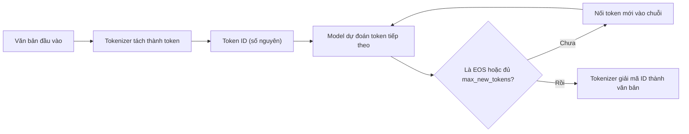

# Token & context

Trang này giải thích đơn vị mà LLM thực sự "đọc" và "viết" (token), và giới hạn độ dài mà model xử lý được (context). Nên đọc trước khi chỉnh `max_seq_length`, chọn chat template hoặc gỡ lỗi model sinh chữ vô nghĩa sau khi export.



## Token

**Khái niệm.** Token là mảnh văn bản nhỏ nhất mà model xử lý: có thể là một từ, một phần của từ (subword) hoặc một dấu câu. Từ phổ biến thường là một token; từ hiếm bị tách thành nhiều mảnh. Model không nhìn thấy chữ cái mà chỉ nhìn thấy dãy token đã đổi thành số. **[Nguồn ngoài]** https://huggingface.co/docs/transformers/glossary

**Ví dụ.** Tokenizer của BERT tách câu `A Titan RTX has 24GB of VRAM` thành `['A', 'Titan', 'R', '##T', '##X', 'has', '24', '##GB', 'of', 'V', '##RA', '##M']`: "VRAM" không có trong từ vựng nên bị cắt thành `V`, `##RA`, `##M` (dấu `##` báo đây là phần nối của cùng một từ). **[Nguồn ngoài]** https://huggingface.co/docs/transformers/glossary

Docs Unsloth dùng một quy ước thô để hình dung quy mô: "cứ coi một token như một từ tiếng Anh" khi nói Llama-3 được huấn luyện trên 15 nghìn tỷ token. Đây là quy ước minh họa, không phải tỷ lệ chính xác.

**Ảnh hưởng khi dùng Unsloth.** Mọi giới hạn độ dài trong Unsloth (`max_seq_length`, `max_new_tokens`, `max_prompt_length`, "Context Length" trong Studio) đều đếm bằng **token**, không phải ký tự hay từ. Dataset phải ở dạng tokenizer đọc được thì mới train được (docs Datasets Guide nói rõ điều này).

**Tiếng Việt tốn bao nhiêu token?** Các nguồn đã duyệt không đưa con số cho tiếng Việt. Nguồn HF chỉ nói tokenizer huấn luyện trên tiếng Anh sẽ làm việc kém trên ngôn ngữ có cách dùng khoảng trắng và dấu câu khác (ví dụ tiếng Nhật) **[Nguồn ngoài]** https://huggingface.co/learn/llm-course/chapter6/1. **[Nhận định]** Tiếng Việt có dấu thanh và nhiều âm tiết nên có thể tốn nhiều token hơn tiếng Anh cho cùng nội dung, tùy tokenizer; đừng giả định mà hãy tự đo bằng tokenizer của chính model bạn dùng. Đối tượng `tokenizer` trả về từ `FastLanguageModel.from_pretrained(...)` có phương thức `tokenize()`, trả về danh sách token của một chuỗi, như mô tả trong Transformers glossary và LLM Course chương 2 **[Nguồn ngoài]** https://huggingface.co/docs/transformers/glossary , https://huggingface.co/learn/llm-course/chapter2/4 . Đếm độ dài danh sách đó với cùng một đoạn văn tiếng Việt và tiếng Anh để so sánh.

**Gặp ở đâu trong Unsloth.** [Dữ liệu](/du-lieu), [Fine-tuning](/fine-tuning), [Inference](/inference).

**Nguồn:** https://unsloth.ai/docs/get-started/fine-tuning-llms-guide/tutorial-how-to-finetune-llama-3-and-use-in-ollama, https://unsloth.ai/docs/get-started/fine-tuning-llms-guide/datasets-guide, https://huggingface.co/docs/transformers/glossary, https://huggingface.co/learn/llm-course/chapter6/1

## Tokenizer và các thuật toán tách token

**Khái niệm.** Tokenizer (bộ tách token) là thành phần đổi văn bản thành số và ngược lại, gồm hai bước: tách văn bản thành token, rồi tra từ vựng để đổi mỗi token thành một **input ID** (mã số nguyên). Chiều ngược lại gọi là decode (giải mã). **[Nguồn ngoài]** https://huggingface.co/learn/llm-course/chapter2/4

Có ba cách tách chính **[Nguồn ngoài]** https://huggingface.co/docs/transformers/tokenizer_summary:

| Cách tách | Ưu điểm | Nhược điểm |
|---|---|---|
| Theo từ (word-level) | Mỗi token mang nhiều nghĩa | Từ vựng khổng lồ; từ lạ thành `<unk>` (token "không biết") |
| Theo ký tự (character-level) | Từ vựng nhỏ, không có `<unk>` | Chuỗi rất dài, mỗi token ít nghĩa |
| Subword (mảnh từ) | Từ phổ biến giữ nguyên, từ hiếm tách mảnh; từ vựng gọn, gần như không có `<unk>` | Số token phụ thuộc dữ liệu tokenizer đã học |

Các LLM hiện nay dùng subword. Ba thuật toán chính (mức khái niệm) **[Nguồn ngoài]** https://huggingface.co/docs/transformers/tokenizer_summary:

- **BPE** (Byte Pair Encoding): bắt đầu từ các ký tự, lặp lại việc gộp cặp token đứng cạnh nhau xuất hiện nhiều nhất cho tới khi đủ kích thước từ vựng. Docs Transformers ghi Llama, Gemma, Qwen2 dùng BPE. **Byte-level BPE** lấy 256 giá trị byte làm từ vựng gốc nên mọi chuỗi đều tách được mà không cần `<unk>`.
- **WordPiece**: giống BPE nhưng chọn cặp gộp theo mức "đi cùng nhau nhiều hơn ngẫu nhiên"; dùng trong họ BERT.
- **Unigram**: đi ngược lại, bắt đầu từ tập ứng viên lớn rồi loại dần token ít đóng góp; dùng trong T5.
- **SentencePiece** là thư viện chạy BPE hoặc Unigram trực tiếp trên văn bản thô, coi khoảng trắng là ký hiệu `▁`, hợp với ngôn ngữ không tách từ bằng khoảng trắng.

**Ví dụ.** Cùng một hàm Python ngắn, tokenizer GPT-2 gốc tách thành 36 token; tokenizer được huấn luyện lại trên code Python chỉ cần 27 token vì nó học được token riêng cho thụt lề và cho `"""`. **[Nguồn ngoài]** https://huggingface.co/learn/llm-course/chapter6/2. Số token của cùng một văn bản phụ thuộc tokenizer.

Một chi tiết khác từ docs Unsloth: tokenizer của Llama coi `"A"` và `" A"` (có khoảng trắng phía trước) là **hai token ID khác nhau**. Khi Unsloth tự chấm MMLU, tính cả hai dạng làm điểm Llama 3.1 (8B) Instruct tăng từ 67,8% lên 68,2%.

**Ảnh hưởng khi dùng Unsloth.** Model và tokenizer luôn đi thành cặp: `FastLanguageModel.from_pretrained(...)` trả về cả `model, tokenizer`, và các hàm lưu (`save_pretrained_merged`, `save_pretrained_gguf`) đều nhận `tokenizer`. Docs Unsloth ghi các bản upload của họ đôi khi có sửa lỗi chat template hoặc tokenizer so với bản gốc, nên khuyên dùng bản của Unsloth khi có.

**Gặp ở đâu trong Unsloth.** [Model catalog](/model-catalog), [Export & deploy](/export-deploy).

**Nguồn:** https://huggingface.co/learn/llm-course/chapter2/4, https://huggingface.co/docs/transformers/tokenizer_summary, https://huggingface.co/learn/llm-course/chapter6/2, https://unsloth.ai/docs/basics/dynamic-3.0-ggufs, https://unsloth.ai/docs/get-started/fine-tuning-llms-guide

## Vocabulary

**Khái niệm.** Vocabulary (từ vựng) là danh sách cố định mọi token mà tokenizer biết; mỗi token có một ID. Kích thước từ vựng được chọn khi huấn luyện tokenizer. Model có một ma trận embedding (lớp `embed_tokens`) với một hàng cho mỗi token và một lớp đầu ra (`lm_head`) chấm điểm cho mọi token trong từ vựng. **[Nguồn ngoài]** https://huggingface.co/docs/transformers/tokenizer_summary

**Ví dụ.**
- GPT-2: từ vựng 50.257 = 256 token byte + 50.000 lần gộp + 1 token đặc biệt kết thúc văn bản. **[Nguồn ngoài]** https://huggingface.co/docs/transformers/tokenizer_summary
- Docs GRPO của Unsloth dùng từ vựng 128.256 token (của Llama) khi tính bộ nhớ logits: `2 × 2 byte × 8 (số lần sinh) × 20K (context) × 128256 (từ vựng) = 78,3 GB`. Từ vựng lớn làm tăng bộ nhớ ở bước tính xác suất cho từng token.

**Ảnh hưởng khi dùng Unsloth.**
- Thêm token mới: `add_new_tokens(model, tokenizer, new_tokens = [...])`, và docs yêu cầu **phải gọi trước** `FastLanguageModel.get_peft_model`.
- Khi dạy model ngôn ngữ mới bằng continued pretraining, docs khuyên thêm `"lm_head", "embed_tokens"` vào `target_modules` và dùng `embedding_learning_rate` nhỏ hơn `learning_rate` 2–10 lần. Nếu Colab hết bộ nhớ với Llama-3 8B thì chỉ thêm `lm_head`.

```python
model = FastLanguageModel.get_peft_model(
    model,
    r = 16,
    target_modules = ["q_proj", "k_proj", "v_proj", "o_proj",
                      "gate_proj", "up_proj", "down_proj",
                      "lm_head", "embed_tokens",],
    lora_alpha = 16,
)
```

**Gặp ở đâu trong Unsloth.** [Dữ liệu — Thêm token mới](/du-lieu), [Fine-tuning — Continued pretraining](/fine-tuning), [Reinforcement learning](/reinforcement-learning). Chi tiết về embedding: [Kiến trúc Transformer](/kien-thuc-nen/kien-truc-transformer).

**Nguồn:** https://huggingface.co/docs/transformers/tokenizer_summary, https://unsloth.ai/docs/get-started/reinforcement-learning-rl-guide, https://unsloth.ai/docs/basics/chat-templates, https://unsloth.ai/docs/basics/continued-pretraining

## Special token: BOS, EOS và token điều khiển hội thoại

**Khái niệm.** Special token (token đặc biệt) là token không đại diện cho chữ bình thường mà mang tín hiệu điều khiển. Hai loại quan trọng nhất:
- **BOS** (beginning of sequence, đầu chuỗi), ví dụ `<s>`, `<bos>`.
- **EOS** (end of sequence, cuối chuỗi), ví dụ `</s>`. Khi model sinh ra EOS, quá trình sinh dừng lại.

Ngoài ra, model chat còn có token đánh dấu vai trò như `<|im_start|>`, `<|im_end|>` (ChatML), `[INST]`/`[/INST]` (Mistral), `<start_of_turn>` (Gemma). Tokenizer tự chèn special token nếu model cần. **[Nguồn ngoài]** https://huggingface.co/docs/transformers/glossary

**Liên hệ chat template.** Chat template là quy tắc biến danh sách tin nhắn `role`/`content` thành một chuỗi token, có chèn đúng các token điều khiển của model đó. Mọi model chat thực chất vẫn chỉ "viết tiếp một chuỗi token"; token điều khiển cho nó biết đâu là lượt của người dùng, đâu là lượt của trợ lý. Hai model fine-tune từ cùng một base vẫn có thể dùng template khác nhau, và dùng sai token điều khiển làm chất lượng giảm mạnh. **[Nguồn ngoài]** https://huggingface.co/docs/transformers/chat_templating

**Ví dụ.** Cùng một hội thoại, Mistral-7B-Instruct cho ra `<s>[INST] Hello, how are you? [/INST]...</s>`, còn Zephyr-7B cho ra `<|user|>\nHello, how are you?</s>\n<|assistant|>...`. Với `add_generation_prompt=True`, template ChatML thêm `<|im_start|>assistant` vào cuối để model biết tới lượt nó trả lời; thiếu phần này model có thể viết tiếp câu của người dùng. **[Nguồn ngoài]** https://huggingface.co/docs/transformers/chat_templating

**Ảnh hưởng khi dùng Unsloth.**
- `get_chat_template(tokenizer, chat_template = "...")` gắn template vào tokenizer; `map_eos_token = True` ánh xạ `<|im_end|>` thành EOS `</s>` mà không cần train. Template tự viết phải truyền cặp `(template, eos_token)` và EOS phải xuất hiện trong template.
- Khi chạy model đã export sang Ollama, llama.cpp hoặc vLLM mà ra chữ vô nghĩa, sinh mãi không dừng hoặc lặp lại, docs Unsloth nêu các nguyên nhân: **sai chat template** (nguyên nhân phổ biến nhất), **sai EOS token**, hoặc engine thêm thừa hay thiếu token "start of sequence" (BOS). Phải dùng cùng một template lúc train và lúc chạy.
- **[Nguồn ngoài]** Nếu đã format bằng `apply_chat_template(tokenize=False)` rồi mới tokenize, cần `add_special_tokens=False` để không chèn BOS/EOS hai lần. https://huggingface.co/docs/transformers/chat_templating

**Gặp ở đâu trong Unsloth.** [Dữ liệu — Chat template](/du-lieu), [Export & deploy — Troubleshooting](/export-deploy), [Inference](/inference).

**Nguồn:** https://unsloth.ai/docs/basics/chat-templates, https://unsloth.ai/docs/basics/inference-and-deployment/troubleshooting-inference, https://huggingface.co/docs/transformers/chat_templating, https://huggingface.co/docs/transformers/glossary

## Context window và `max_seq_length`

**Khái niệm.** Context window (cửa sổ ngữ cảnh) là số token tối đa model xử lý trong một lần: gồm prompt, lịch sử hội thoại, tài liệu đính kèm **và** phần model đang sinh ra. Cần tách hai con số:

1. **Context của model**: giới hạn do hãng công bố trong model card, ví dụ Qwen3-8B hỗ trợ gốc 32.768 token, mở rộng tới 131.072 token bằng YaRN (một kỹ thuật kéo giãn vị trí). **[Nguồn ngoài]** https://huggingface.co/Qwen/Qwen3-8B
2. **Context bạn đặt**: con số bạn chọn khi train hoặc chạy (`max_seq_length` trong code Unsloth, "Context Length" trong Studio, `--ctx-size` trong llama.cpp). Con số này thường nhỏ hơn context của model để tiết kiệm bộ nhớ.

**Ví dụ (context model công bố trong docs Unsloth).**

| Model | Context theo docs Unsloth |
|---|---|
| Llama-3 | 8.192 |
| gpt-oss | 131.072 |
| IBM Granite 4.1 | 131.072 |
| Qwen3.5, Qwen3.8 | 262.144 (mở rộng tới 1M bằng YaRN) |
| Gemma 4 E2B / E4B | 128K |
| Gemma 4 12B / 26B-A4B / 31B | 256K |
| DeepSeek-V4, GLM-5.3, Kimi K3 | 1.048.576 |

Với model đa phương thức, ảnh cũng chiếm chỗ trong context: model card Gemma 3 ghi mỗi ảnh được chuẩn hóa về 896 × 896 và mã hóa thành 256 token, context đầu vào 128K cho bản 4B, đầu ra tối đa 8.192 token. **[Nguồn ngoài]** https://huggingface.co/google/gemma-3-4b-it

**Ảnh hưởng khi dùng Unsloth.**
- **Khi train:** `max_seq_length` quyết định độ dài chuỗi tối đa mỗi mẫu. Docs khuyên đặt `2048` để thử nghiệm (Llama-3 hỗ trợ 8192); Studio mặc định Context Length `2048`, cho chọn 512 → 32768. Notebook ghi Unsloth hỗ trợ RoPE Scaling bên trong nên "chọn số nào cũng được". **[Nhận định]** Đặt vượt context gốc của model thì chạy được, nhưng không có nghĩa model dùng tốt đoạn dài đó nếu dữ liệu train không có mẫu dài như vậy.
- **Đặt quá cao** làm tốn VRAM và dễ OOM (hết bộ nhớ GPU). Trang Granite 4.1 khuyên giảm `max_seq_length` nếu hết bộ nhớ. Benchmark Unsloth cho thấy độ dài context tối đa phụ thuộc VRAM: Llama 3.1 (8B) QLoRA 4-bit, rank 32, batch 1 đạt khoảng 40.724 token trên GPU 16 GB và 78.475 token trên 24 GB. Liên hệ bộ nhớ: [Tham số & bộ nhớ](/kien-thuc-nen/tham-so-va-bo-nho).
- **Đặt quá thấp** thì mẫu dài bị cắt; khi chạy, docs Qwen3.5 ghi: model ra chữ vô nghĩa có thể do context đặt quá thấp.
- **Khi chạy:** `max_new_tokens` giới hạn số token sinh ra (docs gợi ý tăng từ 128 lên 256 hoặc 1024 nếu muốn trả lời dài hơn, đổi lại chờ lâu hơn). Với GRPO, `max_completion_length = max_seq_length - max_prompt_length`, tức prompt và câu trả lời chia nhau cùng một ngân sách token. Trong Studio Chat, docs ghi không cần chỉnh context vì llama.cpp tự dùng lượng context cần thiết.

::: tip Một phép tính nhanh
**[Ước tính]** Cài `max_seq_length = 2048` và prompt RAG đã chiếm 1.800 token thì model chỉ còn tối đa `2048 − 1800 = 248` token để trả lời, theo quy tắc prompt + phần sinh không vượt quá context (https://unsloth.ai/docs/get-started/install/intel dùng đúng phép trừ này cho GRPO).
:::

**Gặp ở đâu trong Unsloth.** [Fine-tuning](/fine-tuning), [Inference](/inference), [Model catalog](/model-catalog), [Reinforcement learning](/reinforcement-learning).

**Nguồn:** https://unsloth.ai/docs/get-started/fine-tuning-llms-guide, https://unsloth.ai/docs/get-started/fine-tuning-llms-guide/tutorial-how-to-finetune-llama-3-and-use-in-ollama, https://unsloth.ai/docs/get-started/install/google-colab, https://unsloth.ai/docs/new/studio/start, https://unsloth.ai/docs/new/studio/chat, https://unsloth.ai/docs/basics/unsloth-benchmarks, https://unsloth.ai/docs/models/qwen3.5, https://unsloth.ai/docs/models/qwen3.8, https://unsloth.ai/docs/models/gemma-4, https://unsloth.ai/docs/models/gpt-oss-how-to-run-and-fine-tune, https://unsloth.ai/docs/models/ibm-granite-4.1, https://unsloth.ai/docs/models/deepseek-v4, https://unsloth.ai/docs/models/glm-5.3, https://unsloth.ai/docs/models/kimi-k3, https://unsloth.ai/docs/get-started/install/intel, https://huggingface.co/Qwen/Qwen3-8B, https://huggingface.co/google/gemma-3-4b-it

## Dự đoán token tiếp theo (next-token prediction)

**Khái niệm.** LLM sinh văn bản (decoder model) được pre-train bằng causal language modeling: đọc văn bản theo thứ tự và đoán token kế tiếp, với cơ chế che (mask) để không nhìn thấy các token phía sau. Khi chạy, model lặp lại: đoán một token, nối vào chuỗi, đoán token kế tiếp (gọi là autoregressive, tự hồi quy), cho tới khi sinh ra EOS hoặc chạm giới hạn độ dài. **[Nguồn ngoài]** https://huggingface.co/docs/transformers/glossary, https://huggingface.co/learn/llm-course/chapter1/4

**Ví dụ.** Prompt ChatML kết thúc bằng `<|im_start|>assistant`. Model đoán token đầu tiên của câu trả lời, rồi token thứ hai dựa trên toàn bộ chuỗi trước đó, và cứ thế tiếp tục. Khi token được đoán là `<|im_end|>` (đã được ánh xạ làm EOS), việc sinh dừng lại. Nếu engine không nhận ra EOS này, model viết tiếp mãi: đây chính là lỗi "sinh vô hạn" mà docs troubleshooting của Unsloth nhắc tới.

**Ảnh hưởng khi dùng Unsloth.**
- Fine-tuning (SFT) vẫn dùng mục tiêu đoán token tiếp theo, chỉ đổi dữ liệu. Training loss trong log là mức model đoán sai token trên dataset của bạn; docs coi loss khoảng 0,5–1,0 là dấu hiệu tốt tùy tác vụ, và loss về 0 có thể là overfitting (học thuộc).
- `train_on_responses_only` (Studio: "Train on Completions") chỉ tính loss trên token của câu trả lời, bỏ qua phần câu hỏi. Bạn phải khai báo đúng chuỗi token điều khiển của template, ví dụ với Llama 3:

```python
from unsloth.chat_templates import train_on_responses_only
trainer = train_on_responses_only(
    trainer,
    instruction_part = "<|start_header_id|>user<|end_header_id|>\n\n",
    response_part = "<|start_header_id|>assistant<|end_header_id|>\n\n",
)
```

- Cách chọn token ở mỗi bước (temperature, top-p, top-k) xem ở [Suy luận & sampling](/kien-thuc-nen/suy-luan-va-sampling); quá trình train xem ở [Quá trình huấn luyện](/kien-thuc-nen/qua-trinh-huan-luyen).

**Gặp ở đâu trong Unsloth.** [Fine-tuning](/fine-tuning), [Dữ liệu — Chỉ train trên câu trả lời](/du-lieu), [Inference](/inference).

**Nguồn:** https://huggingface.co/docs/transformers/glossary, https://huggingface.co/learn/llm-course/chapter1/4, https://unsloth.ai/docs/get-started/fine-tuning-llms-guide, https://unsloth.ai/docs/get-started/fine-tuning-llms-guide/lora-hyperparameters-guide, https://unsloth.ai/docs/basics/inference-and-deployment/troubleshooting-inference, https://unsloth.ai/docs/new/studio/start

## Gặp ở đâu trong Unsloth

| Khái niệm | Trang Unsloth trên website | Docs gốc |
|---|---|---|
| Token | [Dữ liệu](/du-lieu), [Fine-tuning](/fine-tuning) | https://unsloth.ai/docs/get-started/fine-tuning-llms-guide/datasets-guide |
| Tokenizer | [Model catalog](/model-catalog), [Export & deploy](/export-deploy) | https://unsloth.ai/docs/get-started/fine-tuning-llms-guide |
| Vocabulary, `add_new_tokens`, `embed_tokens`/`lm_head` | [Dữ liệu](/du-lieu), [Fine-tuning](/fine-tuning) | https://unsloth.ai/docs/basics/chat-templates, https://unsloth.ai/docs/basics/continued-pretraining |
| Special token BOS/EOS, chat template | [Dữ liệu](/du-lieu), [Export & deploy](/export-deploy) | https://unsloth.ai/docs/basics/chat-templates, https://unsloth.ai/docs/basics/inference-and-deployment/troubleshooting-inference |
| Context window, `max_seq_length`, `max_new_tokens` | [Fine-tuning](/fine-tuning), [Inference](/inference), [Model catalog](/model-catalog) | https://unsloth.ai/docs/get-started/fine-tuning-llms-guide, https://unsloth.ai/docs/basics/unsloth-benchmarks |
| Next-token prediction, `train_on_responses_only` | [Fine-tuning](/fine-tuning), [Dữ liệu](/du-lieu) | https://unsloth.ai/docs/get-started/fine-tuning-llms-guide/lora-hyperparameters-guide |
