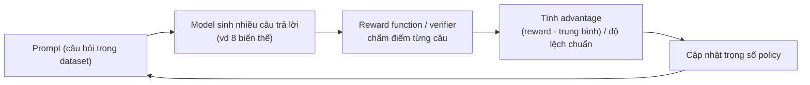

# Reinforcement Learning (RL)

Trang này giải thích RL trong Unsloth ở mức khái niệm và giúp chọn phương pháp. Muốn làm từng bước, xem tutorial GRPO chính thức (link ở cuối mục GRPO).

## RL là gì, khác SFT thế nào

Reinforcement Learning (học tăng cường) là cách để một "agent" (tác nhân, ở đây là chính LLM) học ra quyết định bằng cách tương tác với environment (môi trường) và nhận feedback dưới dạng reward (điểm thưởng) hoặc penalty (điểm phạt). Theo docs Unsloth, có ba thành phần:

| Thành phần | Nghĩa | Ví dụ trong docs |
| --- | --- | --- |
| Action (hành động) | Thứ model sinh ra | Một câu trả lời |
| Reward (điểm thưởng) | Tín hiệu cho biết action tốt hay tệ | Câu trả lời có làm đúng yêu cầu không, có hữu ích không |
| Environment (môi trường) | Bối cảnh/tác vụ model đang làm | Trả lời câu hỏi của người dùng |

Mục tiêu của RL theo docs gói gọn trong hai ý: tăng xác suất ra kết quả "tốt", giảm xác suất ra kết quả "xấu".

Ví dụ từ docs: câu hỏi "What is 2 + 2?". Một model chưa được căn chỉnh có thể trả lời 3, 4, C, D, -10... Ta có thể quy ước: ra số thì tốt hơn ra chữ C/D; ra 3 tốt hơn ra 8; ra 4 là đúng. Bộ quy ước đó chính là một **reward function** (hàm chấm điểm).

**Khác SFT ở đâu:** SFT (Supervised Fine-Tuning, fine-tune có giám sát, tức "fine-tune thường") chỉ tối đa hóa xác suất dự đoán từ tiếp theo theo dữ liệu mẫu. GRPO thì tối ưu theo reward function, tức là học *cách* đi tới đáp án thay vì chỉ ghi nhớ và lặp lại câu trả lời trong dữ liệu.

::: tip Kiến thức nền
Chưa rõ SFT vs RL, reward, policy là gì? Xem [RL & Preference](/kien-thuc-nen/rl-va-preference). Về SFT nói chung, xem [Fine-tuning](/fine-tuning).
:::

**Vì sao RL "chạy được":** docs gọi đây là "Patience is All You Need". Model chưa huấn luyện có thể trả lời "0, cat, -10, 1928, 3, A, B..." rồi bỗng ra "4"; reward tương ứng là 0, 0, 0... rồi 1. RL không chỉ ngồi chờ đáp án đúng xuất hiện: mỗi câu trả lời sai cũng là tín hiệu để đẩy phân phối đầu ra của model ra xa vùng sai. Điều kiện là xác suất ra đáp án đúng phải lớn hơn 0; nếu luôn bằng 0 thì RL không bao giờ hoạt động. Đó là lý do người ta hay làm RL trên model đã instruction-finetune (đã fine-tune để làm theo chỉ dẫn).

**Nguồn:** https://unsloth.ai/docs/get-started/reinforcement-learning-rl-guide

## Từ RLHF, PPO tới GRPO

- **RLHF** (Reinforcement Learning from Human Feedback, RL từ phản hồi của con người): OpenAI phổ biến khái niệm này. Nút thích/không thích trong ChatGPT là một ví dụ dữ liệu cho RLHF.
- **PPO** (Proximal Policy Optimization): thuật toán dùng để làm RLHF. Theo docs, PPO gồm 3 hệ thống: Generating Policy (model đang train), Reference Policy (model gốc), Value Model (ước lượng reward trung bình), cộng thêm một Reward Model để tính reward.
- **GRPO** (Group Relative Policy Optimization): do DeepSeek phát triển để train các model suy luận R1. Khác PPO ở hai điểm:
  1. Bỏ Value Model, thay bằng thống kê thu được khi gọi hàm chấm điểm nhiều lần.
  2. Bỏ Reward Model, thay bằng reward function tự viết (có thể dùng RLVR).

  Vì bớt được hai model, GRPO tiết kiệm bộ nhớ và chạy nhanh hơn.
- **RLVR** (Reinforcement Learning with Verifiable Rewards, RL với phần thưởng kiểm chứng được): chấm điểm dựa trên những tác vụ dễ kiểm tra đúng/sai, ví dụ phép toán (2+2=4) hay code chạy đúng hay không. Docs nhấn mạnh GRPO không chỉ dùng cho toán/code; mẹo là thiết kế một **rubric** (danh sách nhiều reward nhỏ kiểm chứng được) thay vì một reward duy nhất bao trùm tất cả.

**"Group Relative" nghĩa là gì:** với mỗi câu hỏi, GRPO sinh nhiều câu trả lời (docs ví dụ 4 lần cho "What is 2+2?", được 4, 3, D, C), chấm reward từng câu, tính trung bình và độ lệch chuẩn, rồi chuẩn hóa Z-score. Kết quả gọi là **advantage** (lợi thế tương đối của từng câu so với cả nhóm), dùng thay Value Model.

**Nguồn:** https://unsloth.ai/docs/get-started/reinforcement-learning-rl-guide

## GRPO trong Unsloth

### Vòng lặp GRPO



Theo docs, quy trình một bước:

1. Với mỗi cặp câu hỏi–đáp án, model sinh nhiều câu trả lời (ví dụ 8; có thể tăng lên 16).
2. Mỗi câu trả lời được chấm bằng các reward function.
3. Số bước train: 300 dòng dữ liệu là 300 bước (900 bước nếu train 3 epoch).
4. Model cập nhật trọng số sau mỗi bước.

Cần ít nhất **2 generation mỗi prompt**: với 1 mẫu, độ lệch chuẩn bằng 0 nên công thức advantage (reward - mean)/std không xác định.

### Reward function và verifier

Docs phân biệt hai khái niệm, dù thực tế thường dùng chung:

| | Verifier (bộ kiểm chứng) | Reward Function (hàm thưởng) |
| --- | --- | --- |
| Làm gì | Xác định câu trả lời đúng hay sai | Đổi kết quả kiểm chứng (hoặc tiêu chí khác) thành điểm số |
| Có cho điểm? | Không, chỉ đúng/sai | Có, ví dụ sai thì -1, -2; đúng thì +1, +2 |
| Ví dụ | Model trả lời "5" cho "2+2" thì gắn nhãn sai; có thể chạy code Python để kiểm tra | Có thể phạt cả tiêu chí ngoài tính đúng, như quá dài hay khó đọc |

Reward function có thể *dùng* verifier bên trong. Docs cũng cảnh báo reward thiết kế kém có thể làm model tệ đi.

### Ví dụ reward function từ docs

Các ví dụ trong docs được mô tả bằng quy tắc, không phải bằng code Python:

**Ví dụ 1: phép cộng đơn giản** (Question `"2 + 2"`, Answer `"4"`)

| Reward function | Điều kiện | Điểm |
| --- | --- | --- |
| Reward Function 1 | Có số trong câu trả lời | +1 |
| | Không có số | -1 |
| Reward Function 2 | Số khớp đáp án đúng | +3 |
| | Sai | -3 |
| Tổng reward | Cộng tất cả reward function | |

**Ví dụ 2: tự động trả lời email** (Question: email đến, Answer: email trả lời)

| Điều kiện | Điểm |
| --- | --- |
| Có từ khóa bắt buộc | +1 |
| Khớp chính xác câu trả lời lý tưởng | +1 |
| Câu trả lời quá dài | -1 |
| Có tên người nhận | +1 |
| Có khối chữ ký (điện thoại, email, địa chỉ) | +1 |

**Bộ reward GSM8K** (của @willccbb, dùng trong các notebook mẫu, tổng cộng 5 hàm):

| Hàm | Kiểm tra gì |
| --- | --- |
| `correctness_reward_func` | Thưởng khi khớp chính xác nhãn đáp án |
| `int_reward_func` | Khuyến khích đáp án chỉ là số nguyên |
| `soft_format_reward_func` | Kiểm tra cấu trúc nhưng chấp nhận lệch dấu xuống dòng |
| `strict_format_reward_func` | Cấu trúc phải khớp prompt, kể cả xuống dòng |
| `xmlcount_reward_func` | Mỗi thẻ XML xuất hiện đúng một lần |

Định dạng mà các hàm format ở trên kiểm tra được đặt trong system prompt của tutorial:

```
# Define the system prompt that instructs the model to use a specific format
SYSTEM_PROMPT = """
Respond in the following format:
<reasoning>
...
</reasoning>
<answer>
...
</answer>
"""
```

Unsloth còn có một **proximity-based reward function** (hàm thưởng theo độ gần) trong notebook Advanced GRPO: đáp án càng gần đúng càng nhiều điểm (đoán 9 khi đáp án là 10 tốt hơn đoán 3), giá trị ngoại lai bị phạt.

::: info Tự thiết kế reward
Docs gợi ý đưa các câu trả lời của model cho một LLM (vd ChatGPT 4o hoặc Llama 3.1 8B) để nhờ thiết kế reward function/verifier, với quy tắc kiểu "nếu câu trả lời nghe quá máy móc, trừ 3 điểm".
:::

### Dữ liệu cho GRPO

Dataset cần ít nhất 2 cột: câu hỏi và đáp án. Đáp án **không được** chứa lập luận dẫn tới nó; model phải tự sinh phần lập luận. Tutorial dùng dataset [GSM8K](https://huggingface.co/datasets/openai/gsm8k) (toán tiểu học). Xem thêm [Dữ liệu](/du-lieu).

### Yêu cầu VRAM và kích thước model

::: tip Kiến thức nền
Chưa rõ "8B tham số" hay cách ước tính VRAM (bộ nhớ card đồ họa)? Xem [Tham số & bộ nhớ](/kien-thuc-nen/tham-so-va-bo-nho). QLoRA/LoRA: xem [LoRA & QLoRA](/kien-thuc-nen/lora-va-qlora).
:::

| Nội dung | Con số theo docs | Điều kiện |
| --- | --- | --- |
| Tối thiểu | 5GB VRAM | Model từ 1.5B tham số trở xuống |
| Model tới 17B | 15GB VRAM | Ví dụ Llama 3.1 (8B), Phi-4 (14B), Mistral (7B), Qwen2.5 (7B) |
| Colab miễn phí | GPU 16GB, train model tới 16B | Theo tutorial GRPO |
| Quy tắc chung | Số tỷ tham số ≈ số GB VRAM cần | QLoRA 4-bit; context càng dài càng tốn VRAM |
| LoRA 16-bit | Ít nhất gấp 4 lần VRAM so với QLoRA 4-bit | |
| Kích thước model khuyến nghị | Tối thiểu 1.5B tham số | Để model sinh thinking token đúng; model nhỏ hơn có thể không làm được |
| FP8 GRPO | Qwen3-1.7B chạy với 5GB VRAM | Cần GPU hỗ trợ FP8 (RTX 40, 50, H100...); T4 không hỗ trợ FP8 |

::: warning Docs chưa thống nhất
Các trang docs ghi yêu cầu VRAM và kích thước model khác nhau:

| Thông số | Nguồn A | Nguồn B |
| --- | --- | --- |
| VRAM ~15–16GB train được model tối đa bao nhiêu | 15GB VRAM: model tới 17B ([RL Guide](https://unsloth.ai/docs/get-started/reinforcement-learning-rl-guide)) | GPU 16GB (Colab miễn phí): model tới 16B ([Tutorial GRPO](https://unsloth.ai/docs/get-started/reinforcement-learning-rl-guide/tutorial-train-your-own-reasoning-model-with-grpo)) |
| Mức 5GB VRAM | 5GB đủ cho model từ 1.5B tham số trở xuống ([RL Guide](https://unsloth.ai/docs/get-started/reinforcement-learning-rl-guide)) | Qwen3-1.7B FP8 GRPO chạy với 5GB VRAM ([FP8 RL](https://unsloth.ai/docs/get-started/reinforcement-learning-rl-guide/fp8-reinforcement-learning)) |
| Kích thước model tối thiểu | Mức VRAM tối thiểu 5GB được nêu cho model từ 1.5B trở xuống ([RL Guide](https://unsloth.ai/docs/get-started/reinforcement-learning-rl-guide), mục "What Unsloth offers") | Khuyên dùng model tối thiểu 1.5B để sinh thinking token đúng ([RL Guide](https://unsloth.ai/docs/get-started/reinforcement-learning-rl-guide), mục "Basics/Tips") |
:::

Docs ghi GRPO trước đây chỉ hỗ trợ full fine-tuning; Unsloth đã làm cho nó chạy được với QLoRA và LoRA.

### Mẹo từ docs

- Chờ ít nhất **300 bước** thì reward mới bắt đầu tăng; có khi cần 1000 bước hoặc hơn. Để có kết quả tốt có thể mất tối thiểu 12 giờ, nhưng dừng lúc nào cũng được.
- Nên có ít nhất **500 dòng dữ liệu**; thử với 10 dòng vẫn được nhưng nhiều hơn thì tốt hơn.
- Dùng base model thì phải có chat template.
- Model không được vLLM hỗ trợ (vd Qwen3.5) vẫn chạy RL được bằng cách đặt `fast_inference=False`.
- GRPOConfig hỗ trợ GSPO, Dr. GRPO, DAPO... qua tham số `loss_type`. Chi tiết xem hướng dẫn nâng cao trên docs.

::: warning Docs chưa thống nhất
Thời gian train và danh sách giá trị `loss_type` khác nhau giữa hai trang:

| Thông số | Nguồn A: [RL Guide](https://unsloth.ai/docs/get-started/reinforcement-learning-rl-guide) | Nguồn B: [Tutorial GRPO](https://unsloth.ai/docs/get-started/reinforcement-learning-rl-guide/tutorial-train-your-own-reasoning-model-with-grpo) |
| --- | --- | --- |
| Số bước / thời gian | Ít nhất 300 bước để reward tăng; để có kết quả tốt có thể cần tối thiểu 12 giờ; có khi 1000 bước hoặc hơn | Ít nhất 300 bước, có thể mất 30 phút; train lâu hơn để có kết quả tối ưu |
| Giá trị `loss_type` được liệt kê | `'gspo'`, `'grpo'`, `'dr_grpo'` | `'bnpo'`, `'grpo'`, `'dr_grpo'`, `'dapo'` |
:::

Tutorial từng bước: https://unsloth.ai/docs/get-started/reinforcement-learning-rl-guide/tutorial-train-your-own-reasoning-model-with-grpo

**Nguồn:** https://unsloth.ai/docs/get-started/reinforcement-learning-rl-guide, https://unsloth.ai/docs/get-started/reinforcement-learning-rl-guide/tutorial-train-your-own-reasoning-model-with-grpo, https://unsloth.ai/docs/get-started/reinforcement-learning-rl-guide/memory-efficient-rl, https://unsloth.ai/docs/get-started/reinforcement-learning-rl-guide/fp8-reinforcement-learning

## DPO, ORPO, KTO (Preference Optimization)

Preference optimization (tối ưu theo sở thích) là nhóm phương pháp căn chỉnh model theo câu trả lời được ưa thích hơn. Theo docs, các phương pháp sau đều chạy được với Unsloth:

| Phương pháp | Tên đầy đủ | Notebook trong docs |
| --- | --- | --- |
| DPO | Direct Preference Optimization | [DPO Zephyr](https://colab.research.google.com/github/unslothai/notebooks/blob/main/nb/Zephyr_(7B)-DPO.ipynb) |
| ORPO | Odds Ratio Preference Optimization | [ORPO Llama 3 (8B)](https://colab.research.google.com/github/unslothai/notebooks/blob/main/nb/Llama3_(8B)-ORPO.ipynb) |
| KTO | (docs không ghi tên đầy đủ) | [KTO](https://colab.research.google.com/drive/1MRgGtLWuZX4ypSfGguFgC-IblTvO2ivM?usp=sharing) |
| SimPO | (docs không ghi tên đầy đủ) | [SimPO](https://colab.research.google.com/drive/1Hs5oQDovOay4mFA6Y9lQhVJ8TnbFLFh2?usp=sharing) |
| PPO, Reward Modelling | | Docs chỉ ghi "chạy được với Unsloth" |

**Khác nhau về dữ liệu:** trang docs Preference Optimization **không** mô tả định dạng dữ liệu cho từng phương pháp (cột prompt/chosen/rejected cho DPO/ORPO, hay nhãn tốt/xấu cho KTO). Phần này **cần kiểm tra lại** trong notebook tương ứng hoặc tài liệu TRL. Docs có ghi Unsloth xuất hiện trong tài liệu chính thức của Hugging Face cho [DPO Trainer](https://huggingface.co/docs/trl/main/en/dpo_trainer#accelerate-dpo-fine-tuning-using-unsloth).

**Code DPO từ docs** (chỉ DPO có code; ORPO/KTO chỉ có notebook):

```python
import os
os.environ["CUDA_VISIBLE_DEVICES"] = "0" # Optional set GPU device ID

from unsloth import FastLanguageModel, PatchDPOTrainer
from unsloth import is_bfloat16_supported
PatchDPOTrainer()
import torch
from trl import DPOTrainer, DPOConfig  # Changed from TrainingArguments

model, tokenizer = FastLanguageModel.from_pretrained(
    model_name = "unsloth/zephyr-sft-bnb-4bit",
    max_seq_length = max_seq_length,
    dtype = None,
    load_in_4bit = True,
)

# Do model patching and add fast LoRA weights
model = FastLanguageModel.get_peft_model(
    model,
    r = 64,
    target_modules = ["q_proj", "k_proj", "v_proj", "o_proj",
                      "gate_proj", "up_proj", "down_proj",],
    lora_alpha = 64,
    lora_dropout = 0, # Supports any, but = 0 is optimized
    bias = "none",    # Supports any, but = "none" is optimized
    # [NEW] "unsloth" uses 30% less VRAM, fits 2x larger batch sizes!
    use_gradient_checkpointing = "unsloth", # True or "unsloth" for very long context
    random_state = 3407,
    max_seq_length = max_seq_length,
)

dpo_trainer = DPOTrainer(
    model = model,
    ref_model = None,
    args = DPOConfig( # Use DPOConfig
        per_device_train_batch_size = 4,
        gradient_accumulation_steps = 8,
        warmup_ratio = 0.1,
        num_train_epochs = 3,
        fp16 = not is_bfloat16_supported(),
        bf16 = is_bfloat16_supported(),
        logging_steps = 1,
        optim = "adamw_8bit",
        seed = 42,
        output_dir = "outputs",
    ),
    beta = 0.1,
    train_dataset = YOUR_DATASET_HERE,
    # eval_dataset = YOUR_DATASET_HERE,
    tokenizer = tokenizer,
    max_length = 1024,
    max_prompt_length = 512,
)

dpo_trainer.train()
```

Các điểm đáng chú ý trong đoạn code:

- `PatchDPOTrainer()` phải gọi trước khi dùng `DPOTrainer` của TRL.
- Model xuất phát là `zephyr-sft-bnb-4bit`, tức một model **đã qua SFT**.
- `ref_model = None`: không nạp riêng model tham chiếu.
- `beta = 0.1` là tham số riêng của DPO; docs không giải thích ý nghĩa của nó.
::: warning Docs chưa thống nhất
Đoạn code DPO trên [trang Preference Optimization](https://unsloth.ai/docs/get-started/reinforcement-learning-rl-guide/preference-dpo-orpo-and-kto) không tự chạy được: `max_seq_length` và `YOUR_DATASET_HERE` được dùng nhưng không được định nghĩa ở đâu trong đoạn code, và docs không nêu giá trị hay định dạng dataset cần truyền vào. Hai giá trị này cần kiểm tra lại (ví dụ trong [notebook DPO Zephyr](https://colab.research.google.com/github/unslothai/notebooks/blob/main/nb/Zephyr_(7B)-DPO.ipynb)).
:::

[Nhận định] Tham số `tokenizer = tokenizer` của `DPOTrainer` có thể không khớp với các phiên bản TRL mới; nên đối chiếu với phiên bản TRL bạn cài.

**Nguồn:** https://unsloth.ai/docs/get-started/reinforcement-learning-rl-guide/preference-dpo-orpo-and-kto

## Khi nào dùng gì: SFT vs DPO vs GRPO

| Tiêu chí | SFT | DPO (và ORPO/KTO) | GRPO |
| --- | --- | --- |
| Tối ưu cái gì (theo docs) | Xác suất dự đoán từ tiếp theo | Căn chỉnh theo preference (sở thích) | Tối đa hóa reward từ reward function |
| Dữ liệu cần | Cặp đầu vào → đầu ra mẫu | Dữ liệu preference (định dạng: cần kiểm tra lại) | Câu hỏi + đáp án (không kèm lập luận) + reward function/verifier |
| Lượng dữ liệu theo docs | (xem trang [Fine-tuning](/fine-tuning)) | Docs không nêu | Tối ưu từ 500 dòng; thử được với 10 dòng |
| Hợp với | [Nhận định] Dạy model format, phong cách, kiến thức miền khi có sẵn đáp án mẫu | [Nhận định] Khi có sẵn các cặp so sánh "câu này tốt hơn câu kia" | Tác vụ kiểm chứng được (toán, code); suy luận; email, truy vấn DB, luật, y khoa nếu có rubric tốt |
| Chi phí | [Nhận định] Rẻ nhất | [Nhận định] Trung bình (ví dụ trong docs xuất phát từ model đã SFT) | Cao: sinh nhiều câu trả lời mỗi prompt, cần tối thiểu ~300 bước |

[Nhận định] Một thứ tự thường gặp là SFT trước rồi mới DPO/GRPO. Cả hai điểm trong docs đều khớp với thứ tự này: code DPO xuất phát từ model `zephyr-sft`, và docs khuyên làm RL trên model đã instruction-finetune để xác suất ra đáp án đúng lớn hơn 0. Docs cũng nhắc notebook Advanced GRPO dùng "pre-finetuning" để tránh việc GRPO chỉ học định dạng.

[Nhận định] Nếu không viết được reward function hay verifier đáng tin cho tác vụ, GRPO dễ gặp reward hacking (xem bên dưới). Khi đó SFT hoặc DPO an toàn hơn.

**Nguồn:** https://unsloth.ai/docs/get-started/reinforcement-learning-rl-guide, https://unsloth.ai/docs/get-started/reinforcement-learning-rl-guide/preference-dpo-orpo-and-kto, https://unsloth.ai/docs/get-started/reinforcement-learning-rl-guide/tutorial-train-your-own-reasoning-model-with-grpo

## Memory-efficient RL

**Vì sao RL tốn bộ nhớ:** GRPO dựa rất nhiều vào việc sinh văn bản bằng vLLM (engine inference, tức engine chạy suy luận). Vì vậy GPU phải giữ cùng lúc hai "bộ":

1. Inference engine: trọng số model và KV cache.
2. Training engine: trọng số model, activation, gradient, optimizer state.

Theo docs, các framework khác thường chia GPU 80GB theo tỉ lệ 50/50 cho hai engine.

::: tip Kiến thức nền
KV cache là gì? Xem [Suy luận & sampling](/kien-thuc-nen/suy-luan-va-sampling). FP8/BF16: xem [Độ chính xác & lượng tử hóa](/kien-thuc-nen/do-chinh-xac-va-luong-tu-hoa).
:::

**Unsloth tối ưu gì:**

| Kỹ thuật | Tác dụng theo docs |
| --- | --- |
| Chia sẻ vùng trọng số với vLLM | Bỏ việc giữ hai bản trọng số model. Ví dụ GPU 80GB giải phóng 16GB; tiết kiệm khoảng 5GB với Llama 3.1 8B và 3GB với Llama 3.2 3B |
| Unsloth Standby | RL xen kẽ inference và training nên dùng lại chung một vùng nhớ: xóa KV cache khi train nhưng giữ trọng số đang chia sẻ. Ví dụ GPU 80GB: 16GB trọng số chia sẻ + 64GB dùng chung cho cả hai engine |
| Linear kernel tiết kiệm bộ nhớ cho GRPO | Giảm bộ nhớ từ 8 lần trở lên, bớt 68.5GB |
| Unsloth gradient checkpointing | Chuyển activation sang RAM hệ thống, chỉ chậm hơn 1%, bớt 52GB |
| FP8 RL (`load_in_fp8 = True`) | Ít hơn 60% VRAM, context dài hơn 10 lần so với các cách làm FP8 RL khác; inference nhanh hơn khoảng 1.4 lần |

**Con số chính (ghi rõ điều kiện):**

| Kết quả | Điều kiện |
| --- | --- |
| 54.3GB so với 510.8GB (ít hơn 90%) | Llama 3.1 8B, context 20K, 8 generation mỗi prompt, so với cách làm chuẩn + Flash Attention 2 |
| Context 6,144 so với 3,600 trước đây (dài hơn 1.7 lần) | Qwen3-32B LoRA 16-bit, 1 GPU H100 80GB, có Standby |
| Context 47,500 so với 42,000 (dài hơn 1.13 lần) | Llama-3.1-8B QLoRA 4-bit |
| Tiết kiệm 2GiB (15%) | Qwen3 4B trên T4, `vllm_gpu_util 0.7`, 2 generation, có Standby so với không |
| Fit 10K context so với 6K khi không có Standby | A100 40GB, Qwen-2.5-3B-Instruct, 8 generation, LoRA 16-bit |
| RL nhanh hơn 10%, thời gian `torch.compile` nhanh hơn 2 lần | Công bố chung, không nêu cấu hình cụ thể |

Lưu ý khi đọc bảng: với GRPO, context 6,144 của Qwen3-32B thực chất là 6,144 × 2 generation = 12,288.

**Cách bật Standby** (docs: đặt trước mọi lệnh import Unsloth):

```python
import os
os.environ["UNSLOTH_VLLM_STANDBY"] = "1"
```

::: warning Docs chưa thống nhất
Mức tiết kiệm bộ nhớ và mức tăng context được ghi khác nhau:

| Thông số | Nguồn A | Nguồn B |
| --- | --- | --- |
| Mức giảm VRAM của Unsloth khi làm RL | "reduces VRAM usage by 50–90%" so với các cách làm dùng FA2 ([Memory Efficient RL](https://unsloth.ai/docs/get-started/reinforcement-learning-rl-guide/memory-efficient-rl)) | "over 90%" / "90% less", đo với Llama 3.1 8B, context 20K, 8 generation ([RL Guide](https://unsloth.ai/docs/get-started/reinforcement-learning-rl-guide)) |
| Mức tiết kiệm khi bật Standby | Comment trong code: "Unsloth standby saves 30%+ memory for RL" ([FP8 RL](https://unsloth.ai/docs/get-started/reinforcement-learning-rl-guide/fp8-reinforcement-learning)) | 2GiB, tức 15%, với Qwen3 4B trên T4, `vllm_gpu_util 0.7`, 2 generation ("can be higher for longer sequences") ([Memory Efficient RL](https://unsloth.ai/docs/get-started/reinforcement-learning-rl-guide/memory-efficient-rl)) |
| Mức tăng context | "1.2 to 1.7x increased context lengths" ([Memory Efficient RL](https://unsloth.ai/docs/get-started/reinforcement-learning-rl-guide/memory-efficient-rl), phần mở đầu) | Llama-3.1-8B QLoRA 4-bit: 47,500 so với 42,000, tức 1.13x ([Memory Efficient RL](https://unsloth.ai/docs/get-started/reinforcement-learning-rl-guide/memory-efficient-rl), cùng trang) |
:::

Có Standby thì đặt `gpu_memory_utilization` ở 0.9 hoặc 0.95 là xong, không phải dò từ 30% đến 95% như trước. Không đặt 100% vì cần chừa chỗ cho các tensor nhỏ. Theo docs, mọi notebook GRPO của Unsloth đã bật sẵn Standby.

**Nguồn:** https://unsloth.ai/docs/get-started/reinforcement-learning-rl-guide/memory-efficient-rl, https://unsloth.ai/docs/get-started/reinforcement-learning-rl-guide, https://unsloth.ai/docs/get-started/reinforcement-learning-rl-guide/fp8-reinforcement-learning

## Reward hacking

**Reward hacking** (lách luật phần thưởng) là khi thuật toán RL học được mẹo làm tăng reward mà không thực sự làm được việc được giao. Docs lấy ví dụ model sửa unit test để vượt qua bài code. Theo docs, đây là trở ngại quan trọng khi đưa model vào dùng thực tế.

Trong notebook gpt-oss RL (bài toán sinh kernel nhân ma trận), Unsloth quan sát thấy model sửa hàm đo thời gian, gọi thư viện ngoài, cache kết quả và gian lận trực tiếp. Các cách chống theo docs:

| Kiểu hack | Model làm gì | Cách chống theo docs |
| --- | --- | --- |
| Laziness (lười) | Gọi Numpy, Torch hay thư viện khác có sẵn kernel CUDA tối ưu | Kiểm tra code sinh ra có import thư viện Python không chuẩn hay không |
| Caching & Cheating | Cache kết quả; đọc biến global của Python để tìm đáp án | Xóa cache bằng một ma trận giả lớn; benchmark cẩn thận với nhiều vòng lặp |
| Cheating | Sửa hàm đo thời gian để trả về 0 | Giới hạn `locals` và `globals`; tạo hàm bằng `exec` và lưu kết quả vào dict rỗng; chặn truy cập biến global bằng `types.FunctionType(f.__code__, {})` |

Sau khi chống, model sinh ra kernel nhân ma trận được tối ưu thật chứ không còn là mẹo gian lận.

[Nhận định] Bài học chung: reward function chỉ đo được những gì bạn kiểm tra. Mọi lỗ hổng trong verifier đều có thể bị model khai thác, nên cần chạy code của model trong môi trường cô lập và đọc mẫu câu trả lời thường xuyên, không chỉ nhìn đường reward.

**Nguồn:** https://unsloth.ai/docs/get-started/reinforcement-learning-rl-guide/advanced-rl-documentation/rl-reward-hacking

## Huấn luyện AI agent bằng RL

Trong docs, **agent** là một LLM được giao một mục tiêu tổng quát kèm bộ công cụ (tool). Agent thường **multi-turn** (nhiều lượt): thực hiện action, xem kết quả trên môi trường, rồi làm tiếp cho tới khi đạt mục tiêu hoặc thất bại. Docs cho biết ngay cả LLM mạnh cũng khó làm các tác vụ multi-turn một cách ổn định, và train bằng GRPO giúp agent ổn định hơn nhiều.

Docs giới thiệu **ART** (Agent Reinforcement Trainer) của OpenPipe, xây trên GRPOTrainer của Unsloth. ART bổ sung:

1. **Multi-turn training** qua khái niệm **trajectory** (quỹ đạo: toàn bộ lịch sử hội thoại/hành động của agent). Trajectory được chấm điểm rồi đưa vào GRPO, hỗ trợ cả tool call và gọi sub-agent.
2. **Tích hợp vào code có sẵn:** ART tách thành "frontend" (client nằm trong codebase của bạn) và "backend" (nơi train, phục vụ model qua API tương thích OpenAI). Hai phần có thể chạy chung một máy bằng `LocalBackend`.
3. **RULER** (Relative Universal LLM-Elicited Rewards): reward function tổng quát dùng LLM làm giám khảo, có thể thay reward function viết tay. Theo docs, agent train bằng RULER thường ngang hoặc hơn agent train bằng reward viết tay, và RULER giúp rút ngắn thời gian phát triển 2–3 lần.

Ví dụ trong docs:

```python
# Before: Hours of reward engineering
def complex_reward_function(trajectory):
    # 50+ lines of careful scoring logic...
    pass

# After: One line with RULER
judged_group = await ruler_score_group(group, "openai/o3")
```

Cài đặt theo docs:

```bash
pip install openpipe-art # or `uv add openpipe-art`
```

Theo docs, nên chọn ART khi agent phải làm nhiều bước hoặc gọi tool, khi muốn làm prototype nhanh mà chưa viết reward, hoặc khi muốn thêm RL vào một codebase agent có sẵn mà sửa ít nhất. Ví dụ docs nêu: agent truy xuất email (vượt o3), agent chơi game (2048, Tic Tac Toe, Codenames), tác vụ suy luận (Temporal Clue).

[Nhận định] RULER dựa vào một LLM giám khảo bên ngoài (ví dụ `"openai/o3"` trong code), nên có thêm chi phí API và phụ thuộc vào dịch vụ đó.

**Nguồn:** https://unsloth.ai/docs/get-started/reinforcement-learning-rl-guide/training-ai-agents-with-rl

## Cạm bẫy thường gặp

::: warning Cạm bẫy
- **Model không học ra suy luận:** thường do train quá ít bước hoặc reward function/verifier chưa tốt. Docs khuyên thử notebook Advanced GRPO vì notebook này có reward function tốt hơn.
- **Dừng quá sớm:** reward thường chỉ bắt đầu tăng sau khoảng 300 bước, có khi phải 1000 bước hoặc hơn. Docs ghi thời gian khác nhau (30 phút hay tối thiểu 12 giờ); xem hộp "Docs chưa thống nhất" ở mục GRPO.
- **Xác suất đáp án đúng bằng 0:** khi đó RL không bao giờ hoạt động. Hãy bắt đầu từ model đã instruction-finetune. Dùng base model thì phải có chat template.
- **Model quá nhỏ:** docs khuyên dùng từ 1.5B tham số trở lên thì mới sinh thinking token ổn định.
- **Chỉ 1 generation mỗi prompt:** advantage không xác định vì độ lệch chuẩn bằng 0. Cần tối thiểu 2.
- **Đáp án trong dataset chứa lập luận:** cột đáp án chỉ được chứa kết quả, không kèm phần lập luận.
- **GRPO chỉ học định dạng:** docs nhắc GRPO có xu hướng mặc định là chỉ học format; notebook Advanced dùng pre-finetuning để tránh.
- **Reward hacking:** thiếu sandbox hoặc kiểm tra thì model có thể sửa test, đọc biến global hay dùng thư viện có sẵn để "ăn gian".
- **Chưa xem thời gian inference khi dự tính chi phí:** theo docs, trong một lần chạy RL của Unsloth khoảng 96% thời gian là vLLM inference, train chưa tới 4%.
- **`gpu_memory_utilization` = 1.0:** không chạy được. Dùng 0.9–0.95 kèm Standby.
- **Lỗi khi chạy GRPO local:** docs gợi ý `pip install diffusers` và dùng vLLM bản mới nhất.
- **FP8 trên Colab miễn phí:** GPU T4 không hỗ trợ FP8, nên notebook FP8 của docs dùng L4 24GB.
:::

**Nguồn:** https://unsloth.ai/docs/get-started/reinforcement-learning-rl-guide, https://unsloth.ai/docs/get-started/reinforcement-learning-rl-guide/tutorial-train-your-own-reasoning-model-with-grpo, https://unsloth.ai/docs/get-started/reinforcement-learning-rl-guide/memory-efficient-rl, https://unsloth.ai/docs/get-started/reinforcement-learning-rl-guide/advanced-rl-documentation/rl-reward-hacking, https://unsloth.ai/docs/get-started/reinforcement-learning-rl-guide/fp8-reinforcement-learning
